## The Confusion

If you work with OpenShift (OCP), you've likely heard both "Service Mesh" and "Helm Charts" mentioned in deployment conversations. They sound like they do similar things — but they don't. They solve completely different problems.

Here's the simplest way to think about it:

> **Helm** = How you **deploy** your application  
> **Service Mesh** = How your applications **talk to each other** after deployment

They're not competitors. They're complementary. Let me explain.

---

## The Analogy

Imagine you're setting up a restaurant chain:

- **Helm** is like the **franchise kit** — it contains everything needed to open a new location: the floor plan, the equipment list, the staff roles, and the menu. One kit, deploy anywhere.

- **Service Mesh** is like the **road system and traffic rules** between your restaurants — it controls which trucks can deliver to which locations, encrypts the delivery manifests, monitors delivery times, and reroutes traffic if a road is blocked.

You need the franchise kit to open the restaurant. You need the road system to keep everything connected and secure. Different jobs.

---

## What is Helm?

Helm is a **package manager** for Kubernetes/OpenShift. It bundles all the YAML files your application needs into a single, versioned, reusable package called a **chart**.

### What a Helm Chart Contains

```
my-app/
├── Chart.yaml          # Chart metadata (name, version)
├── values.yaml         # Default configuration values
├── templates/
│   ├── deployment.yaml # Pod specification
│   ├── service.yaml    # Network service
│   ├── route.yaml      # OpenShift route (external URL)
│   ├── configmap.yaml  # Configuration
│   └── secret.yaml     # Credentials
└── charts/             # Dependencies (other charts)
```

### What Helm Does

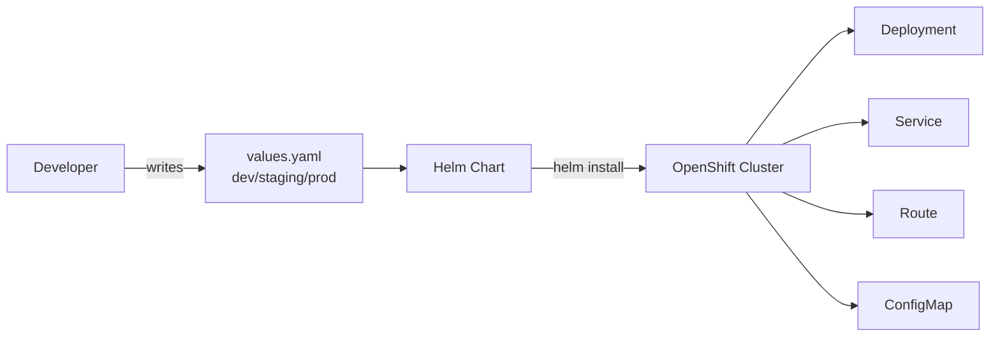

Helm takes your templates + values and produces the exact Kubernetes resources needed. Different values files produce different configurations — same chart, multiple environments.

| Capability | Description |
|-----------|-------------|
| Package | Bundle all Kubernetes resources into one unit |
| Template | Use variables (`{{ .Values.replicas }}`) instead of hardcoded values |
| Version | Track releases, rollback to previous versions |
| Install | Deploy everything with one command |
| Upgrade | Update running apps with new config or images |
| Share | Push charts to a registry for others to reuse |

### Deploying with Helm on OpenShift

```bash
# Add a chart repository
helm repo add bitnami https://charts.bitnami.com/bitnami

# Install an application
helm install my-app bitnami/nginx --namespace my-project

# Customize with your values
helm install my-app ./my-chart -f production-values.yaml

# Upgrade a running release
helm upgrade my-app ./my-chart -f new-values.yaml

# Rollback if something breaks
helm rollback my-app 1
```

### Example: A Simple Helm values.yaml

```yaml
# values.yaml
replicaCount: 3

image:
  repository: registry.example.com/my-app
  tag: "1.2.0"

service:
  type: ClusterIP
  port: 8080

resources:
  requests:
    memory: "256Mi"
    cpu: "250m"
  limits:
    memory: "512Mi"
    cpu: "500m"

route:
  enabled: true
  host: my-app.apps.ocp-cluster.example.com
```

> With Helm, you change `values.yaml` for each environment (dev, staging, prod) and the same chart works everywhere.
{: .prompt-tip }

### Helm Release Lifecycle

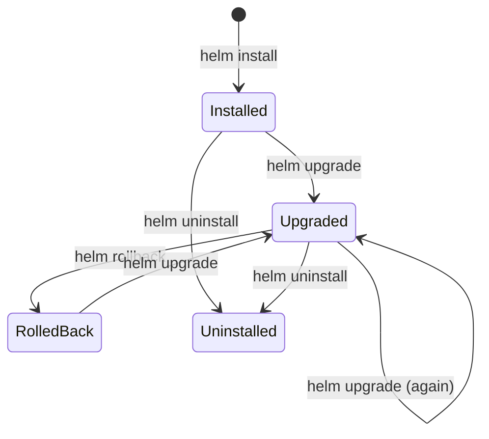

Every Helm operation is tracked as a **release**. You can roll back to any previous revision if something goes wrong — Helm keeps the history of every upgrade.

---

## What is Service Mesh?

A Service Mesh is an **infrastructure layer** that manages communication between microservices. In OpenShift, this is **Red Hat OpenShift Service Mesh**, based on [Istio](https://istio.io/).

It works by injecting a **sidecar proxy** (Envoy) next to each pod. This proxy intercepts all network traffic to and from your application — without changing your application code.

### What Service Mesh Does

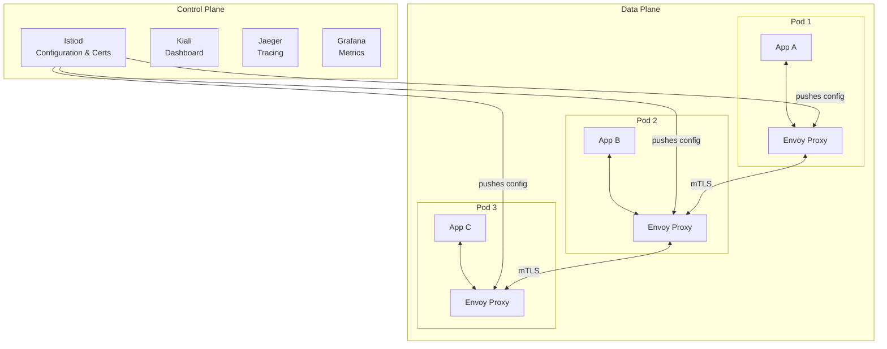

The Service Mesh has two parts:
- **Control Plane** (Istiod) — the brain. Distributes certificates, routing rules, and policies to all proxies.
- **Data Plane** (Envoy sidecars) — the muscle. Intercepts all traffic and enforces the rules.

Your application code stays unchanged. The proxies handle security, routing, and observability at the network level.

| Capability | Description |
|-----------|-------------|
| mTLS (Mutual TLS) | Automatically encrypts all service-to-service traffic |
| Traffic Management | Route traffic by percentage, headers, or versions (canary, A/B) |
| Circuit Breaking | Stop sending requests to failing services |
| Retries & Timeouts | Automatically retry failed calls with configurable limits |
| Observability | Distributed tracing, metrics, and service dependency graphs |
| Access Control | Define which services can talk to which |
| Rate Limiting | Throttle traffic to prevent overload |

### How the Sidecar Proxy Works

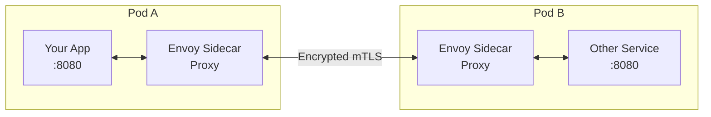

Your app just calls `http://other-service:8080`. The sidecar handles encryption, retries, load balancing, and observability — all transparently.

### Enabling Service Mesh on OpenShift

**Step 1: Install the operator** (done by cluster admin)

```bash
# Install via OperatorHub in OpenShift Console
# or via CLI:
oc apply -f servicemesh-subscription.yaml
```

**Step 2: Create a ServiceMeshControlPlane**

```yaml
apiVersion: maistra.io/v2
kind: ServiceMeshControlPlane
metadata:
  name: basic
  namespace: istio-system
spec:
  version: v2.4
  tracing:
    type: Jaeger
  addons:
    kiali:
      enabled: true
    grafana:
      enabled: true
```

**Step 3: Add your namespace to the mesh**

```yaml
apiVersion: maistra.io/v1
kind: ServiceMeshMemberRoll
metadata:
  name: default
  namespace: istio-system
spec:
  members:
    - my-project
    - my-other-project
```

**Step 4: Enable sidecar injection in your deployment**

```yaml
apiVersion: apps/v1
kind: Deployment
metadata:
  name: my-app
  labels:
    app: my-app
spec:
  template:
    metadata:
      annotations:
        sidecar.istio.io/inject: "true"
    spec:
      containers:
        - name: my-app
          image: registry.example.com/my-app:1.2.0
```

Or label the namespace for automatic injection:

```bash
oc label namespace my-project istio-injection=enabled
```

### Example: Canary Deployment with Service Mesh

Route 90% of traffic to v1, 10% to v2:

```yaml
apiVersion: networking.istio.io/v1beta1
kind: VirtualService
metadata:
  name: my-app
spec:
  hosts:
    - my-app
  http:
    - route:
        - destination:
            host: my-app
            subset: v1
          weight: 90
        - destination:
            host: my-app
            subset: v2
          weight: 10
---
apiVersion: networking.istio.io/v1beta1
kind: DestinationRule
metadata:
  name: my-app
spec:
  host: my-app
  subsets:
    - name: v1
      labels:
        version: v1
    - name: v2
      labels:
        version: v2
```

> With Service Mesh, canary deployments require zero code changes. You control traffic purely through configuration.
{: .prompt-tip }

Here's what that traffic split looks like visually:

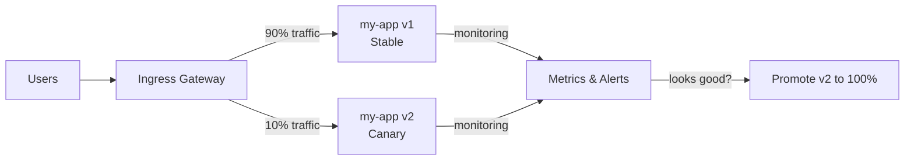

If the canary version has errors or high latency, you update the weights back to 100/0 — instant rollback without redeploying anything.

### Circuit Breaking — Protecting Against Failures

When a service starts failing, the mesh stops sending it traffic to prevent cascading failures across your system:

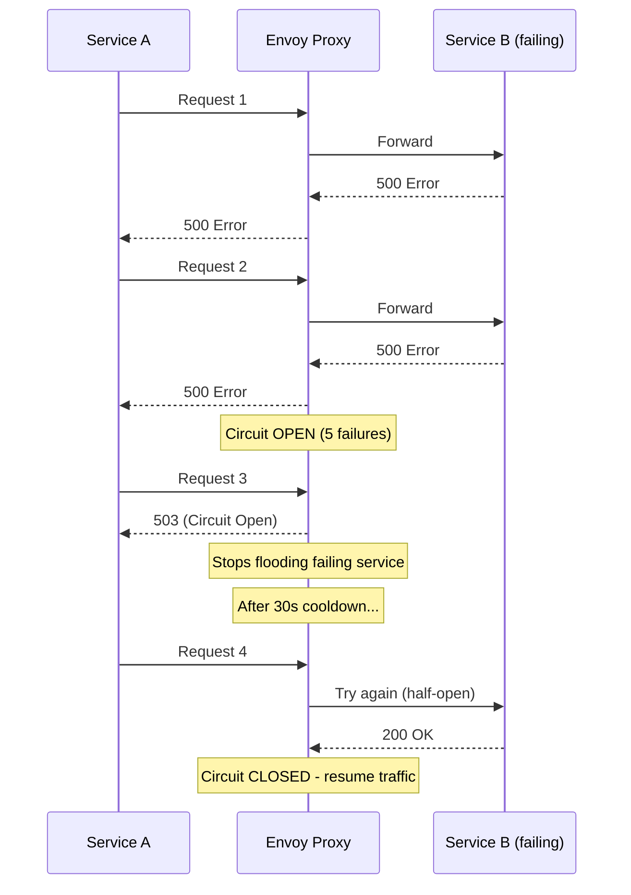

The circuit breaker pattern prevents a single failing service from bringing down your entire system. The mesh handles this automatically — no retry logic in your code.

---

## Without vs With Service Mesh

### Without Service Mesh — Each app handles its own concerns:

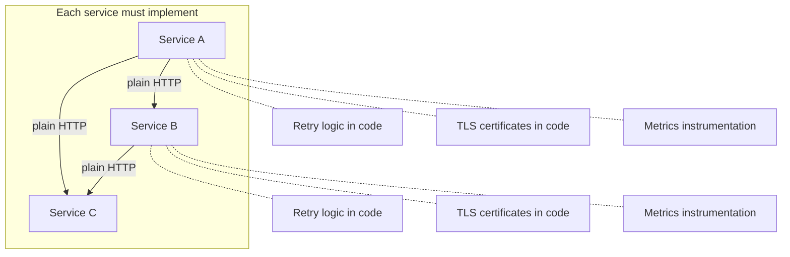

Every service team duplicates the same networking concerns: retries, TLS, timeouts, tracing. Inconsistent implementations. Bugs everywhere.

### With Service Mesh — Infrastructure handles it:

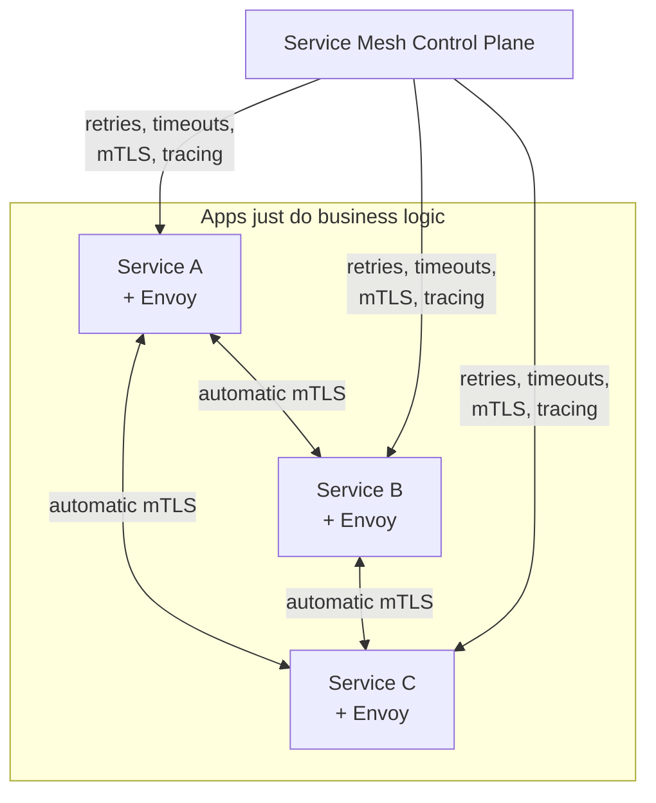

The mesh handles retries, encryption, circuit breaking, and observability uniformly across all services. Application code stays clean and focused on business logic.

---

## Head-to-Head Comparison

| Aspect | Helm | Service Mesh |
|--------|------|-------------|
| **Purpose** | Deploy and package applications | Manage traffic between applications |
| **When it acts** | At deployment time | At runtime (continuously) |
| **What it manages** | Kubernetes resources (Deployments, Services, Routes) | Network traffic between pods |
| **Analogous to** | `apt install` / `npm install` | A smart network switch + firewall |
| **Install command** | `helm install my-app ./chart` | Operator + ControlPlane + sidecar injection |
| **Scope** | Single application lifecycle | All services in the mesh |
| **Complexity** | Low to medium | Medium to high |
| **Resource overhead** | None (templates only at deploy time) | Sidecar proxy per pod (~50MB RAM each) |
| **Required for** | Deploying apps consistently | Secure service-to-service communication |
| **Can do canary?** | Basic (via replica sets) | Advanced (percentage-based, header-based) |
| **Encryption** | No (not its job) | Yes (automatic mTLS) |
| **Observability** | No | Yes (Kiali, Jaeger, Grafana) |

---

## When to Use Each

### Use Helm When:

- You want to package your app for repeatable deployment across environments
- You need versioned releases with rollback capability
- You're deploying to dev, staging, and prod with different configs
- You want to share deployment templates across teams
- You need a single command to deploy a multi-component application

### Use Service Mesh When:

- You have multiple microservices that communicate with each other
- You need encrypted service-to-service traffic (mTLS) without code changes
- You want canary or A/B deployments with fine-grained traffic control
- You need observability — tracing requests across services
- You need circuit breaking and automatic retries
- You must enforce access policies (Service A can call Service B but not Service C)

### Use Both Together (Common in Production):

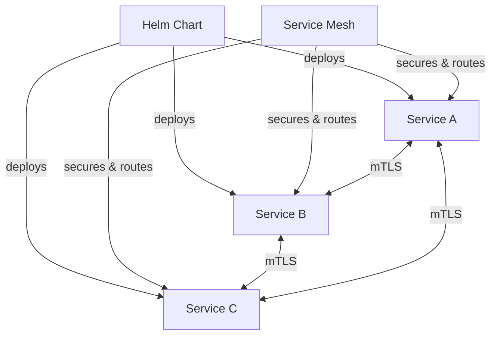

This is the typical enterprise pattern:
1. **Helm** handles the "what gets deployed" — images, configs, replicas, routes
2. **Service Mesh** handles the "how things communicate" — security, routing, resilience

---

## Real-World Example: E-Commerce on OpenShift

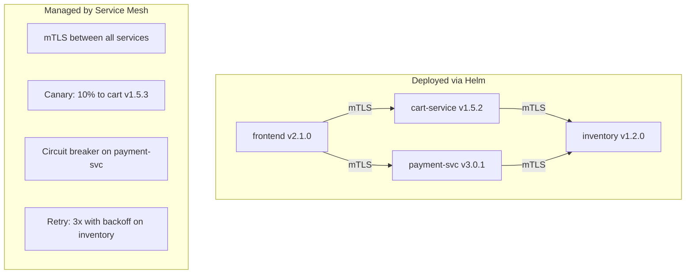

---

## Common Misconceptions

### "Service Mesh replaces Helm"

No. Service Mesh doesn't deploy anything. You still need Helm (or `oc apply`, or ArgoCD) to get your apps onto the cluster. Service Mesh manages what happens **after** deployment.

### "Helm can do traffic splitting"

Only in a basic way (adjusting replica counts). Helm cannot route 10% of traffic to a new version — that requires Service Mesh's VirtualService/DestinationRule.

### "I need Service Mesh for every OpenShift project"

No. If you have a monolith or a few services with simple communication patterns, Service Mesh adds unnecessary complexity and resource overhead. It shines when you have 5+ microservices with complex interactions.

### "Service Mesh is hard to set up"

On OpenShift, it's significantly easier than upstream Istio. The OpenShift Service Mesh Operator handles installation, and Kiali provides a visual dashboard to see your mesh topology.

---

## Decision Flowchart

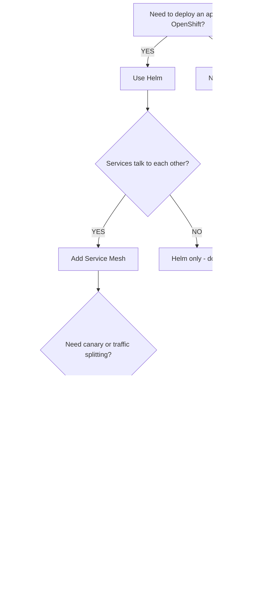

---

## Quick Start Commands on OpenShift

### Deploy with Helm

```bash
# Login to OpenShift
oc login --server=https://api.ocp-cluster.example.com:6443

# Create a project
oc new-project my-app

# Install via Helm
helm install my-app ./my-chart \
  --namespace my-app \
  --values production-values.yaml

# Check status
helm list -n my-app
oc get pods -n my-app
```

### Add to Service Mesh

```bash
# Label namespace for sidecar injection
oc label namespace my-app istio-injection=enabled

# Restart pods to pick up sidecars
oc rollout restart deployment/my-app -n my-app

# Verify sidecars are injected (2/2 containers = app + sidecar)
oc get pods -n my-app
# NAME                      READY   STATUS    RESTARTS   AGE
# my-app-6d4b5c7f9-x2k4m   2/2     Running   0          30s
```

---

## Summary

| Question | Answer |
|----------|--------|
| What deploys my app? | **Helm** |
| What secures traffic between services? | **Service Mesh** |
| What handles canary/A-B routing? | **Service Mesh** |
| What versions my releases? | **Helm** |
| What gives me distributed tracing? | **Service Mesh** |
| What packages my YAML templates? | **Helm** |
| Can I use both? | **Yes — and you should in production** |

They solve different problems at different layers. Use Helm to get your apps deployed. Use Service Mesh to keep them talking securely and reliably.

---

## Further Reading

| Resource | Link |
|----------|------|
| Red Hat OpenShift Service Mesh Docs | [docs.redhat.com](https://docs.redhat.com/en/documentation/red_hat_openshift_service_mesh/) |
| Helm on OpenShift | [redhat.com/openshift/helm](https://www.redhat.com/en/technologies/cloud-computing/openshift/helm) |
| Istio Documentation | [istio.io/docs](https://istio.io/latest/docs/) |
| Helm Official Docs | [helm.sh/docs](https://helm.sh/docs/) |
| Canary Deployments with Service Mesh | [Red Hat Developer](https://developers.redhat.com/articles/2024/03/26/canary-deployment-strategy-openshift-service-mesh) |
| Kiali — Service Mesh Observability | [kiali.io](https://kiali.io/) |

---

## Glossary — Jargon Explained

| Term | Plain English Meaning |
|------|----------------------|
| **OCP (OpenShift Container Platform)** | Red Hat's enterprise Kubernetes platform. Think of it as a managed cloud environment where you run your apps in containers. |
| **Kubernetes (K8s)** | An open-source system that automates deploying, scaling, and managing containerized applications. OpenShift is built on top of it. |
| **Pod** | The smallest unit in Kubernetes. It's a wrapper around one or more containers running together. Think of it as a single running instance of your app. |
| **Container** | A lightweight, isolated package that holds your application code and all its dependencies. Like a shipping container — runs the same anywhere. |
| **Namespace / Project** | A virtual partition inside a cluster. Keeps different teams or environments (dev, prod) separated. In OpenShift, it's called a "project." |
| **Deployment** | A Kubernetes object that defines how many copies of your app should run and how to update them. |
| **Service** | A stable network address that routes traffic to your pods. Pods come and go, but the service address stays the same. |
| **Route** | OpenShift-specific. Exposes your service to the outside world with a URL (like `my-app.example.com`). |
| **ConfigMap** | A key-value store for non-sensitive configuration (database URLs, feature flags). Keeps config outside your code. |
| **Secret** | Like a ConfigMap but for sensitive data (passwords, API keys). Stored encrypted. |
| **Helm Chart** | A package containing all the templates needed to deploy an application. Like a recipe that can be reused. |
| **Helm Release** | A specific deployed instance of a chart. You can have multiple releases of the same chart (dev, staging, prod). |
| **values.yaml** | The configuration file where you customize a Helm chart without editing templates. Different values per environment. |
| **Sidecar Proxy** | A helper container that runs alongside your app in the same pod. It intercepts all network traffic transparently. |
| **Envoy** | The specific proxy software used by Istio/Service Mesh. It handles encryption, retries, and traffic routing. |
| **mTLS (Mutual TLS)** | Both sides of a connection verify each other's identity using certificates. Like both people showing ID before exchanging information. |
| **Istio** | The open-source project behind Service Mesh. Red Hat packages it as "OpenShift Service Mesh." |
| **Istiod** | The brain of the mesh — distributes configuration and certificates to all sidecar proxies. |
| **Control Plane** | The management layer that makes decisions. In a mesh, it's Istiod. It doesn't carry traffic — it tells proxies what to do. |
| **Data Plane** | The layer that actually moves traffic. In a mesh, it's all the Envoy sidecar proxies working together. |
| **VirtualService** | A mesh configuration that defines traffic routing rules — like "send 90% to v1, 10% to v2." |
| **DestinationRule** | A mesh configuration that defines policies for traffic — like circuit breaker settings or connection pool sizes. |
| **Canary Deployment** | Releasing a new version to a small percentage of users first. If it works, gradually increase. If it fails, roll back instantly. |
| **Circuit Breaking** | Automatically stopping requests to a failing service to prevent cascading failures. Like a fuse blowing to protect the whole house. |
| **Distributed Tracing** | Following a single request as it passes through multiple services. Helps you find where things slow down or fail. |
| **Kiali** | A visual dashboard for Service Mesh. Shows you which services talk to which, and how traffic flows. |
| **Jaeger** | A tool for distributed tracing. Lets you see the full journey of a request across services. |
| **Grafana** | A dashboarding tool for metrics. Shows graphs of response times, error rates, and traffic volume. |
| **Operator** | A Kubernetes-native way to install and manage complex software. The Service Mesh Operator handles installation and upgrades for you. |
| **OperatorHub** | OpenShift's marketplace for Operators. One-click install for Service Mesh, databases, monitoring tools, etc. |

> If you encounter other terms not listed here, drop a comment below and I'll add them.
{: .prompt-info }

---

## Related Posts

- [Java 18 to Java 21 Migration Guide — Features, Code Examples, Checklist](/posts/java-18-to-java-21-migration/) — Upgrade to the latest LTS with virtual threads, pattern matching, and sequenced collections.
- [Setting Up a Developer Blog with Jekyll Chirpy — SEO, Analytics, Comments, and Pageviews](/posts/jekyll-chirpy-blog-setup-seo-analytics-comments/) — How this blog was built, step by step.
