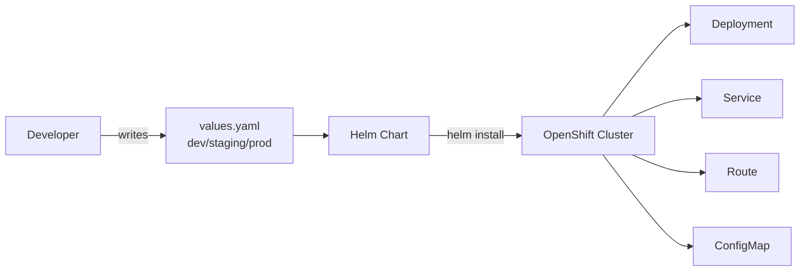

## The Confusion

If you work with OpenShift (OCP), you've likely heard both "Service Mesh" and "Helm Charts" mentioned in deployment conversations. They sound like they do similar things — but they don't. They solve completely different problems.

Here's the simplest way to think about it:

> **Helm** = How you **deploy** your application  
> **Service Mesh** = How your applications **talk to each other** after deployment

They're not competitors. They're complementary. Let me explain.

---

## The Analogy

Imagine you're setting up a restaurant chain:

- **Helm** is like the **franchise kit** — it contains everything needed to open a new location: the floor plan, the equipment list, the staff roles, and the menu. One kit, deploy anywhere.

- **Service Mesh** is like the **road system and traffic rules** between your restaurants — it controls which trucks can deliver to which locations, encrypts the delivery manifests, monitors delivery times, and reroutes traffic if a road is blocked.

You need the franchise kit to open the restaurant. You need the road system to keep everything connected and secure. Different jobs.

---

## What is Helm?

Helm is a **package manager** for Kubernetes/OpenShift. It bundles all the YAML files your application needs into a single, versioned, reusable package called a **chart**.

### What a Helm Chart Contains

```
my-app/
├── Chart.yaml          # Chart metadata (name, version)
├── values.yaml         # Default configuration values
├── templates/
│   ├── deployment.yaml # Pod specification
│   ├── service.yaml    # Network service
│   ├── route.yaml      # OpenShift route (external URL)
│   ├── configmap.yaml  # Configuration
│   └── secret.yaml     # Credentials
└── charts/             # Dependencies (other charts)
```

### What Helm Does



Helm takes your templates + values and produces the exact Kubernetes resources needed. Different values files produce different configurations — same chart, multiple environments.

| Capability | Description |
|-----------|-------------|
| Package | Bundle all Kubernetes resources into one unit |
| Template | Use variables (`{{ .Values.replicas }}`) instead of hardcoded values |
| Version | Track releases, rollback to previous versions |
| Install | Deploy everything with one command |
| Upgrade | Update running apps with new config or images |
| Share | Push charts to a registry for others to reuse |

### Deploying with Helm on OpenShift

```bash
# Add a chart repository
helm repo add bitnami https://charts.bitnami.com/bitnami

# Install an application
helm install my-app bitnami/nginx --namespace my-project

# Customize with your values
helm install my-app ./my-chart -f production-values.yaml

# Upgrade a running release
helm upgrade my-app ./my-chart -f new-values.yaml

# Rollback if something breaks
helm rollback my-app 1
```

### Example: A Simple Helm values.yaml

```yaml
# values.yaml
replicaCount: 3

