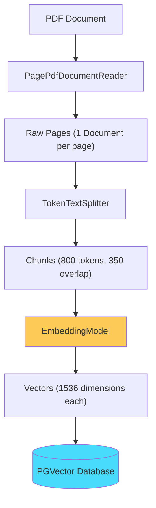
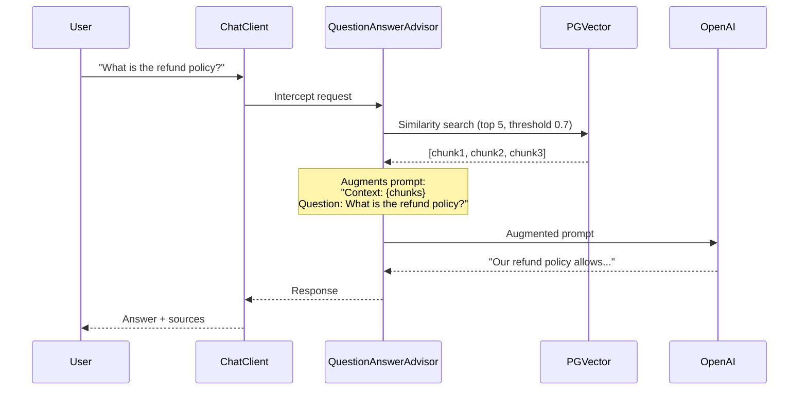

## The Problem

You have internal documents — product specs, policies, engineering runbooks, research papers — and you want your team to ask questions about them in natural language and get accurate, grounded answers.

Off-the-shelf ChatGPT doesn't know about your documents. Fine-tuning is expensive and overkill for most cases. You need a way to give the LLM access to your data **at query time** without retraining it.

That's exactly what RAG (Retrieval Augmented Generation) does.

---

## What We Are Building

A Spring Boot application that:

1. **Ingests PDF documents** — reads, chunks, embeds, and stores them in a vector database
2. **Answers questions** — retrieves relevant document chunks and uses them as context for the LLM
3. **Shows sources** — returns which documents were used to generate the answer

```mermaid
flowchart LR
    A[User Question] --> B[Spring AI ChatClient]
    B --> C[QuestionAnswerAdvisor]
    C --> D[PGVector: Similarity Search]
    D --> E[Top-K Relevant Chunks]
    E --> F[Augmented Prompt]
    F --> G[OpenAI GPT-4o-mini]
    G --> H[Grounded Answer]

    style C fill:#feca57,color:#333
    style D fill:#48dbfb,color:#333
    style G fill:#2ed573,color:#fff
```



The key insight: the LLM never sees your entire document corpus. It only sees the 3-5 most relevant chunks for each specific question. This keeps token costs low and answers focused.

---

## Why Spring AI?

If you're a Java/Spring developer, you could use LangChain4j or call the OpenAI SDK directly. Here's why Spring AI is a better fit for Spring shops:

- **Familiar patterns** — `ChatClient` works like `RestClient`/`WebClient`. Constructor injection, auto-configuration, profiles — everything you already know.
- **Portable** — swap OpenAI for Ollama or Anthropic by changing a dependency and a config property. Your application code doesn't change.
- **Advisor API** — RAG, memory, logging, guardrails are composable interceptors. You don't embed them into your business logic.
- **Auto-configuration** — add a starter dependency, set an API key, and the vector store + embedding model + chat model are wired automatically.

---

## Prerequisites

| Component | Version |
|-----------|---------|
| Java | 21+ |
| Spring Boot | 3.4.1 |
| Spring AI | 1.0.0 |
| Docker | Latest (for PostgreSQL + PGVector) |
| OpenAI API key | [platform.openai.com](https://platform.openai.com) |
| Maven | 3.9+ |

---

## Project Setup

### Dependencies (pom.xml)

```xml
<properties>
    <java.version>21</java.version>
    <spring-ai.version>1.0.0</spring-ai.version>
</properties>

<dependencyManagement>
    <dependencies>
        <dependency>
            <groupId>org.springframework.ai</groupId>
            <artifactId>spring-ai-bom</artifactId>
            <version>${spring-ai.version}</version>
            <type>pom</type>
            <scope>import</scope>
        </dependency>
    </dependencies>
</dependencyManagement>

<dependencies>
    <!-- Spring Boot -->
    <dependency>
        <groupId>org.springframework.boot</groupId>
        <artifactId>spring-boot-starter-web</artifactId>
    </dependency>

    <!-- Spring AI - OpenAI model -->
    <dependency>
        <groupId>org.springframework.ai</groupId>
        <artifactId>spring-ai-starter-model-openai</artifactId>
    </dependency>

    <!-- Spring AI - PGVector store -->
    <dependency>
        <groupId>org.springframework.ai</groupId>
        <artifactId>spring-ai-starter-vector-store-pgvector</artifactId>
    </dependency>

    <!-- Spring AI - RAG advisor -->
    <dependency>
        <groupId>org.springframework.ai</groupId>
        <artifactId>spring-ai-advisors-vector-store</artifactId>
    </dependency>

    <!-- Spring AI - PDF reader -->
    <dependency>
        <groupId>org.springframework.ai</groupId>
        <artifactId>spring-ai-pdf-document-reader</artifactId>
    </dependency>

    <!-- PostgreSQL -->
    <dependency>
        <groupId>org.postgresql</groupId>
        <artifactId>postgresql</artifactId>
        <scope>runtime</scope>
    </dependency>
</dependencies>
```

Each dependency has a specific role:

| Dependency | Purpose |
|-----------|---------|
| `spring-ai-starter-model-openai` | Auto-configures `ChatModel` + `EmbeddingModel` for OpenAI |
| `spring-ai-starter-vector-store-pgvector` | Auto-configures `VectorStore` backed by PostgreSQL + PGVector |
| `spring-ai-advisors-vector-store` | Provides `QuestionAnswerAdvisor` for RAG |
| `spring-ai-pdf-document-reader` | Reads PDF files into Spring AI `Document` objects |

---

## Configuration

### docker-compose.yml — PostgreSQL with PGVector

```yaml
services:
  postgres:
    image: pgvector/pgvector:pg16
    container_name: spring-ai-pgvector
    environment:
      POSTGRES_DB: springai
      POSTGRES_USER: postgres
      POSTGRES_PASSWORD: postgres
    ports:
      - "5432:5432"
```

```bash
docker compose up -d
```

### application.yml

```yaml
spring:
  ai:
    openai:
      api-key: ${OPENAI_API_KEY}
      chat:
        options:
          model: gpt-4o-mini
          temperature: 0.7
      embedding:
        options:
          model: text-embedding-3-small
    vectorstore:
      pgvector:
        initialize-schema: true
        index-type: HNSW
        distance-type: COSINE_DISTANCE
        dimensions: 1536

  datasource:
    url: jdbc:postgresql://localhost:5432/springai
    username: postgres
    password: postgres
```

Key settings:
- **`initialize-schema: true`** — Spring AI creates the vector table and index on startup
- **`index-type: HNSW`** — Hierarchical Navigable Small World index for fast approximate nearest neighbor search
- **`dimensions: 1536`** — matches the output dimension of `text-embedding-3-small`
- **`COSINE_DISTANCE`** — standard similarity metric for text embeddings

---

## Implementation

### Step 1: Configure the ChatClient

```java
@Configuration
public class AiConfig {

    @Bean
    public ChatClient chatClient(ChatModel chatModel) {
        return ChatClient.builder(chatModel)
                .defaultSystem("""
                        You are a helpful assistant that answers questions based on
                        the provided context. If you don't know the answer or the
                        context doesn't contain relevant information, say so honestly.
                        Do not make up information.
                        """)
                .build();
    }
}
```

`ChatClient` is the main entry point for interacting with AI models in Spring AI. The builder pattern lets you set defaults (system prompt, model options, advisors) that apply to every request.

### Step 2: Document Ingestion Service

Before you can ask questions, documents need to be:
1. **Read** — extract text from PDFs
2. **Split** — chunk into smaller pieces (LLMs have token limits, and smaller chunks mean more precise retrieval)
3. **Embedded** — convert text chunks into vector representations
4. **Stored** — persist vectors in PGVector for similarity search

```java
@Service
public class DocumentIngestionService {

    private final VectorStore vectorStore;

    public DocumentIngestionService(VectorStore vectorStore) {
        this.vectorStore = vectorStore;
    }

    public IngestionResponse ingestDocuments() throws IOException {
        PathMatchingResourcePatternResolver resolver = new PathMatchingResourcePatternResolver();
        Resource[] resources = resolver.getResources("classpath:documents/*.pdf");

        List<Document> allDocuments = new ArrayList<>();

        for (Resource resource : resources) {
            List<Document> documents = readAndSplitDocument(resource);
            allDocuments.addAll(documents);
        }

        vectorStore.add(allDocuments);  // Embeds + stores in one call

        return new IngestionResponse(
                "Successfully ingested " + resources.length + " document(s)",
                allDocuments.size()
        );
    }

    private List<Document> readAndSplitDocument(Resource resource) {
        // Read PDF page by page
        PagePdfDocumentReader reader = new PagePdfDocumentReader(resource);
        List<Document> rawDocuments = reader.read();

        // Split into chunks of ~800 tokens with 350 token overlap
        TokenTextSplitter splitter = new TokenTextSplitter(800, 350, 5, 10000, true);
        return splitter.apply(rawDocuments);
    }
}
```

The ingestion pipeline visualized:



**Why chunking matters:** If you embed an entire 50-page document as one vector, the embedding becomes a vague average of all topics in the document. By splitting into small, focused chunks, each vector represents a specific piece of information — making retrieval precise.

**Why overlap:** A 350-token overlap ensures that context isn't lost at chunk boundaries. If an important sentence spans two chunks, both chunks capture it.

### Step 3: The RAG Service

This is where the core RAG logic lives:

```java
@Service
public class RagService {

    private final ChatClient chatClient;
    private final VectorStore vectorStore;

    public RagService(ChatClient chatClient, VectorStore vectorStore) {
        this.chatClient = chatClient;
        this.vectorStore = vectorStore;
    }

    public ChatResponse ask(String question) {
        // Build the QuestionAnswerAdvisor
        QuestionAnswerAdvisor qaAdvisor = QuestionAnswerAdvisor.builder(vectorStore)
                .searchRequest(SearchRequest.builder()
                        .similarityThreshold(0.7)
                        .topK(5)
                        .build())
                .build();

        // Call the model with RAG
        org.springframework.ai.chat.model.ChatResponse aiResponse = chatClient.prompt()
                .advisors(qaAdvisor)
                .user(question)
                .call()
                .chatResponse();

        String answer = aiResponse.getResult().getOutput().getText();
        List<DocumentReference> sources = retrieveSourceReferences(question);

        return ChatResponse.of(answer, sources);
    }
}
```

The `QuestionAnswerAdvisor` does the heavy lifting:



Key parameters:
- **`similarityThreshold(0.7)`** — only include chunks with cosine similarity >= 0.7 (filters out irrelevant matches)
- **`topK(5)`** — return at most 5 chunks (keeps the context window manageable)

### Step 4: REST Controller

```java
@RestController
@RequestMapping("/api/v1")
public class RagController {

    private final RagService ragService;
    private final DocumentIngestionService ingestionService;

    public RagController(RagService ragService, DocumentIngestionService ingestionService) {
        this.ragService = ragService;
        this.ingestionService = ingestionService;
    }

    @PostMapping("/chat")
    public ResponseEntity<ChatResponse> chat(@Valid @RequestBody ChatRequest request) {
        ChatResponse response = ragService.ask(request.question());
        return ResponseEntity.ok(response);
    }

    @GetMapping("/search")
    public ResponseEntity<List<DocumentReference>> search(
            @RequestParam String query,
            @RequestParam(defaultValue = "5") int topK) {
        List<DocumentReference> results = ragService.searchSimilar(query, topK);
        return ResponseEntity.ok(results);
    }

    @PostMapping("/ingest")
    public ResponseEntity<IngestionResponse> ingestDocuments() throws IOException {
        IngestionResponse response = ingestionService.ingestDocuments();
        return ResponseEntity.status(HttpStatus.CREATED).body(response);
    }
}
```

---

## How It Works — End to End

```mermaid
flowchart TD
    subgraph "Phase 1: Ingestion (one-time)"
        A[PDF Files] --> B[Read Pages]
        B --> C[Split into Chunks]
        C --> D[Generate Embeddings via OpenAI]
        D --> E[(Store in PGVector)]
    end

    subgraph "Phase 2: Query (every request)"
        F[User Question] --> G[Embed Question]
        G --> H[Similarity Search in PGVector]
        H --> I[Top-K Relevant Chunks]
        I --> J[Augment Prompt with Context]
        J --> K[Send to OpenAI]
        K --> L[Grounded Answer]
    end

    style E fill:#48dbfb,color:#333
    style K fill:#2ed573,color:#fff
```



**Phase 1** happens once per document. **Phase 2** happens on every user question. The embedding model (text-embedding-3-small) is used in both phases — this is critical. The same model must embed documents and queries for similarity search to work.

---

## Testing the Application

### 1. Start the infrastructure

```bash
docker compose up -d
```

### 2. Run the application

```bash
export OPENAI_API_KEY=sk-your-key-here
./mvnw spring-boot:run
```

### 3. Ingest documents

Place any PDF in `src/main/resources/documents/` and trigger ingestion:

```bash
curl -X POST http://localhost:8080/api/v1/ingest
```

Response:
```json
{
  "message": "Successfully ingested 1 document(s)",
  "documentsIngested": 23
}
```

### 4. Ask a question

```bash
curl -X POST http://localhost:8080/api/v1/chat \
  -H "Content-Type: application/json" \
  -d '{"question": "What are the main components described in the document?"}'
```

Response:
```json
{
  "answer": "The document describes three main components: the ingestion pipeline, the vector store, and the query engine...",
  "sources": [
    {
      "source": "architecture-guide.pdf",
      "snippet": "The system consists of three core components..."
    }
  ],
  "timestamp": "2026-08-12T14:30:00"
}
```

### 5. Search without generating (useful for debugging retrieval)

```bash
curl "http://localhost:8080/api/v1/search?query=authentication&topK=3"
```

---

## Understanding the Spring AI Components

### ChatClient

The primary interface for talking to AI models. It follows a builder/fluent pattern similar to `WebClient`:

```java
chatClient.prompt()           // Start building a request
    .system("...")            // Set system instructions
    .user("...")              // Set user message
    .advisors(advisor)        // Add interceptors (RAG, memory, etc.)
    .call()                   // Execute (blocking)
    .chatResponse();          // Get the full response object
```

### QuestionAnswerAdvisor

An **Advisor** in Spring AI is an interceptor that modifies the request or response in the AI call chain. `QuestionAnswerAdvisor` specifically:

1. Takes the user's question
2. Searches the vector store for relevant documents
3. Appends those documents to the prompt as context
4. Passes the augmented prompt to the model

You don't write RAG plumbing yourself — the advisor handles it.

### VectorStore

Spring AI's `VectorStore` interface abstracts over vector databases. The auto-configured `PgVectorStore` handles:

- Table creation (`vector_store` table with a vector column)
- HNSW index creation for fast search
- Embedding generation (calls the `EmbeddingModel` automatically when you `add()` documents)
- Cosine similarity search

### EmbeddingModel

Converts text into a fixed-dimensional vector (1536 floats for `text-embedding-3-small`). This happens transparently — when you call `vectorStore.add(documents)`, Spring AI embeds each document's text before storing. When you search, the query is embedded with the same model.

---

## Common Problems

| Symptom | Cause | Fix |
|---------|-------|-----|
| `Could not find bean ChatModel` | Missing OpenAI starter | Add `spring-ai-starter-model-openai` dependency |
| `relation "vector_store" does not exist` | PGVector extension not installed | Use `pgvector/pgvector:pg16` Docker image |
| Answers say "I don't know" for everything | Documents not ingested, or similarity threshold too high | Call `/api/v1/ingest` first, lower threshold to 0.6 |
| `InvalidApiKeyException` | Wrong or missing API key | Verify `OPENAI_API_KEY` env var is set |
| Slow responses (10+ seconds) | Large chunks or too many topK results | Reduce chunk size or topK |
| Irrelevant context retrieved | Chunks too large, poor splitting | Reduce chunk size, increase overlap |

---

## Production Considerations

This example is a teaching implementation. For production, consider:

**Security**
- Never expose the `/ingest` endpoint publicly — gate it behind authentication
- Validate uploaded documents (size, format, content)
- Rate-limit the `/chat` endpoint to control costs

**Observability**
- Add Micrometer metrics for response times, token usage, and cache hit rates
- Log trace IDs for correlating requests across services
- Monitor embedding costs (each query = 1 embedding API call)

**Cost Management**
- Cache embeddings for repeated questions
- Use `gpt-4o-mini` for most queries, escalate to `gpt-4o` only when the mini model indicates low confidence
- Set `maxTokens` limits on responses

**Retrieval Quality**
- Experiment with chunk sizes (500-1000 tokens is typical)
- Add metadata filtering (by document type, date, department)
- Implement re-ranking: retrieve top 20, re-rank to top 5 using a cross-encoder

**Scaling**
- PGVector handles millions of vectors with HNSW indexing
- For larger scale, consider dedicated vector databases (Pinecone, Weaviate, Milvus)
- Spring AI supports all of them through the same `VectorStore` interface

---

## Conclusion

We built a complete RAG application using Spring AI that:

- Ingests PDF documents into a PGVector store
- Answers questions using OpenAI with retrieved context
- Returns source references for transparency
- Handles errors gracefully

The code is available at [github.com/AnupamSinha/spring-boot-examples/tree/main/05-ai-function-calling](https://github.com/AnupamSinha/spring-boot-examples/tree/main/05-ai-function-calling).

**Next steps to explore:**
- Add **conversation memory** using `VectorStoreChatMemoryAdvisor`
- Implement **tool calling** to let the LLM query live databases or APIs
- Add **structured output** to return typed Java objects from the model
- Build a **multi-document RAG** with metadata filtering per document source

---

## References

- [Spring AI Documentation — RAG](https://docs.spring.io/spring-ai/reference/api/retrieval-augmented-generation.html)
- [Spring AI — ChatClient API](https://docs.spring.io/spring-ai/reference/api/chatclient.html)
- [Spring AI — Vector Stores](https://docs.spring.io/spring-ai/reference/api/vectordbs.html)
- [Spring AI — PGVector](https://docs.spring.io/spring-ai/reference/api/vectordbs/pgvector.html)
- [Spring AI — Advisors](https://docs.spring.io/spring-ai/reference/api/advisors.html)
- [Spring AI Project Home](https://spring.io/projects/spring-ai)
