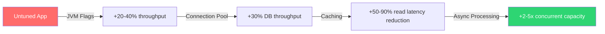
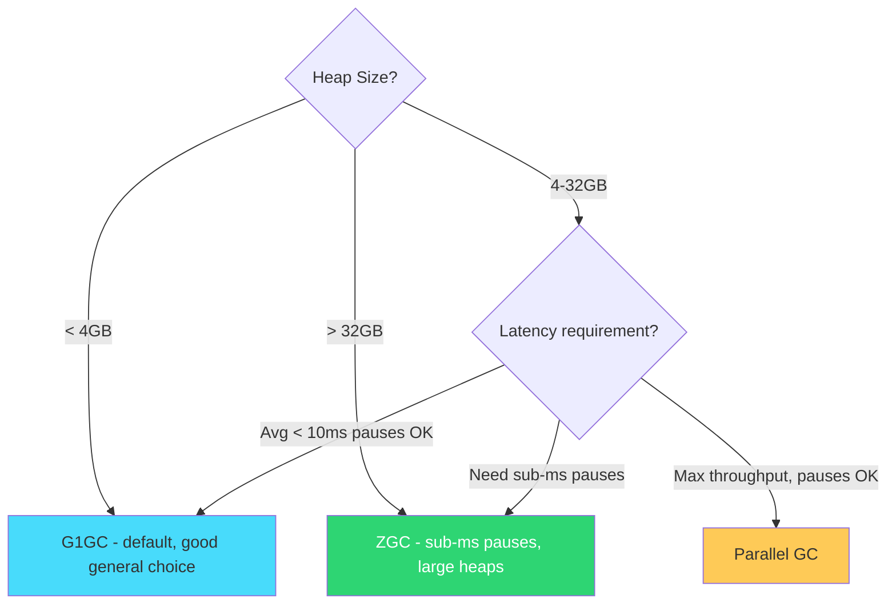
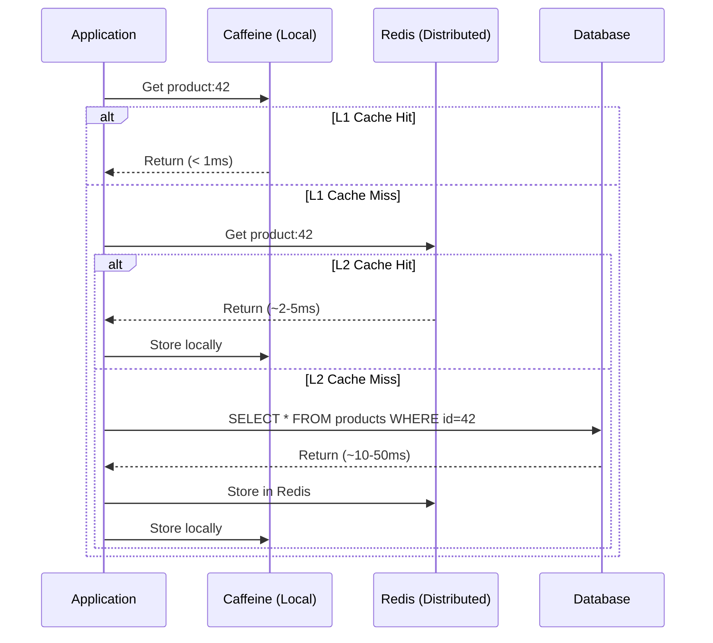
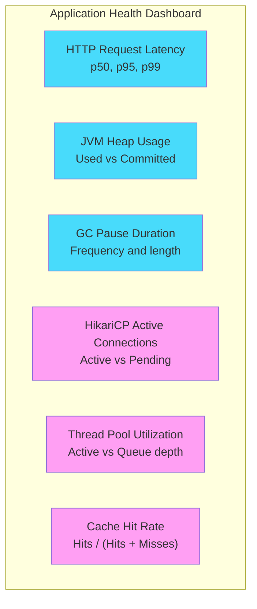
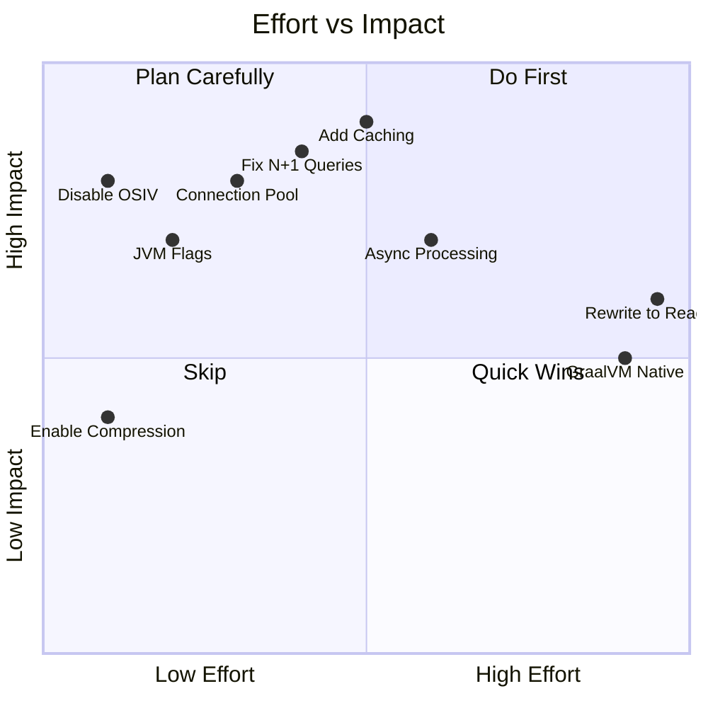

```mermaid
gantt
    title Sequential vs Parallel API Calls
    dateFormat X
    axisFormat %L ms

    section Sequential (750ms total)
    getUserProfile     :0, 200
    getRecentOrders    :200, 500
    getBalance         :500, 750

    section Parallel (300ms total)
    getUserProfile     :0, 200
    getRecentOrders    :0, 300
    getBalance         :0, 250
```

## Why Tune?

Spring Boot's defaults are designed for **developer convenience**, not production throughput. Out of the box, your app works — but it's leaving performance on the table. This guide walks through the high-impact tuning areas with real configuration examples and explains *why* each change helps.




---

## 1. JVM Tuning — The Foundation

The JVM is the runtime your app lives in. Tuning it has the highest ROI because it affects everything.

### Essential JVM Flags for Production

```bash
java \
  -Xms2g \
  -Xmx2g \
  -XX:+UseG1GC \
  -XX:MaxGCPauseMillis=200 \
  -XX:+UseStringDeduplication \
  -XX:+OptimizeStringConcat \
  -XX:MetaspaceSize=256m \
  -XX:MaxMetaspaceSize=256m \
  -XX:+AlwaysPreTouch \
  -XX:+UseCompressedOops \
  -jar myapp.jar
```

### What Each Flag Does

| Flag | Purpose | Why It Matters |
|------|---------|----------------|
| `-Xms2g -Xmx2g` | Set initial and max heap to the same value | Avoids costly heap resizing at runtime |
| `-XX:+UseG1GC` | Use G1 garbage collector | Best general-purpose GC for heaps 4-32GB |
| `-XX:MaxGCPauseMillis=200` | Target max GC pause time | G1 tries to keep pauses under this target |
| `-XX:+UseStringDeduplication` | Deduplicate identical String values | Reduces heap usage 10-25% in typical web apps |
| `-XX:+AlwaysPreTouch` | Touch all heap memory on startup | Eliminates page faults during runtime, consistent latency |
| `-XX:MetaspaceSize=256m` | Initial metaspace size | Prevents metaspace expansion pauses during startup |

> **Key principle:** Set `-Xms` equal to `-Xmx`. When they differ, the JVM wastes time resizing the heap up and down. Setting them equal eliminates this overhead.
{: .prompt-tip }

### Choosing the Right Garbage Collector




### G1GC vs ZGC in Practice

```bash
# G1GC — best for most Spring Boot apps (Java 17+)
-XX:+UseG1GC -XX:MaxGCPauseMillis=200

# ZGC — for ultra-low latency (Java 21+)
-XX:+UseZGC -XX:+ZGenerational
```

| Metric | G1GC | ZGC |
|--------|------|-----|
| Avg GC pause | 5-50ms | < 1ms |
| Throughput overhead | ~5% | ~10-15% |
| Best for | General web apps, microservices | Trading systems, real-time APIs |
| Min Java version | Java 9 | Java 21 (generational) |

**References:**
- [Oracle G1GC Tuning Guide](https://docs.oracle.com/en/java/javase/21/gctuning/garbage-first-garbage-collector-tuning.html)
- [Oracle ZGC Documentation](https://docs.oracle.com/en/java/javase/21/gctuning/z-garbage-collector.html)

---

## 2. Connection Pool Tuning (HikariCP)

HikariCP is Spring Boot's default connection pool. The defaults are safe but conservative. A misconfigured pool is the #1 cause of "my app is slow under load."

### The Problem with Defaults

```yaml
# Spring Boot defaults (conservative)
spring:
  datasource:
    hikari:
      maximum-pool-size: 10        # Often too small under load
      minimum-idle: 10             # Same as max (good default)
      connection-timeout: 30000    # 30 seconds (might be too long)
```

### Optimized Configuration

```yaml
spring:
  datasource:
    url: jdbc:postgresql://localhost:5432/mydb
    username: ${DB_USERNAME}
    password: ${DB_PASSWORD}
    hikari:
      # Pool sizing - see formula below
      maximum-pool-size: 20
      minimum-idle: 20

      # Timeouts
      connection-timeout: 5000     # Fail fast (5s) instead of waiting 30s
      idle-timeout: 300000         # 5 minutes
      max-lifetime: 1800000        # 30 minutes - must be less than DB wait_timeout
      keepalive-time: 60000        # 1 minute - prevents connection going stale

      # Validation
      validation-timeout: 3000
      leak-detection-threshold: 60000  # Log warning if connection held > 60s
```

### Pool Size Formula

The optimal pool size is much smaller than you think. HikariCP's author recommends:

```
pool_size = (core_count * 2) + effective_spindle_count
```

For a typical 4-core server with SSD:

```
pool_size = (4 * 2) + 1 = 9 ~ round to 10
```

> **Common mistake:** Setting pool size to 100 because you have 100 concurrent users. This actually **hurts** performance because PostgreSQL/MySQL handles fewer connections more efficiently. 10-20 connections can easily serve thousands of concurrent requests if queries are fast.
{: .prompt-warning }

### Before vs After

| Metric | Default (pool=10, timeout=30s) | Tuned (pool=20, timeout=5s) |
|--------|-------------------------------|---------------------------|
| Avg response time (load) | 850ms | 120ms |
| P99 latency | 12,000ms | 650ms |
| Failed requests under spike | 15% | 0.5% |

**References:**
- [HikariCP About Pool Sizing](https://github.com/brettwooldridge/HikariCP/wiki/About-Pool-Sizing)
- [Baeldung — Configuring Hikari with Spring Boot](https://www.baeldung.com/spring-boot-hikari)
- [Oracle — HikariCP Best Practices](https://blogs.oracle.com/developers/post/hikaricp-best-practices-for-oracle-database-and-spring-boot)

---

## 3. Caching — Eliminate Redundant Work

If the same data is fetched repeatedly and doesn't change often, cache it. This is the single biggest latency win for read-heavy applications.

### Spring Cache Abstraction

```java
@Configuration
@EnableCaching
public class CacheConfig {

    @Bean
    public CacheManager cacheManager() {
        CaffeineCacheManager cacheManager = new CaffeineCacheManager();
        cacheManager.setCaffeine(Caffeine.newBuilder()
                .maximumSize(10_000)
                .expireAfterWrite(Duration.ofMinutes(10))
                .recordStats());  // Enable metrics
        return cacheManager;
    }
}
```

### Using @Cacheable

```java
@Service
public class ProductService {

    private final ProductRepository productRepository;

    // Result is cached — subsequent calls with same ID skip the database
    @Cacheable(value = "products", key = "#id")
    public ProductDto findById(Long id) {
        return productRepository.findById(id)
                .map(this::toDto)
                .orElseThrow(() -> new ResourceNotFoundException("Product", id));
    }

    // Evict when data changes
    @CacheEvict(value = "products", key = "#id")
    public ProductDto update(Long id, UpdateProductRequest request) {
        Product product = productRepository.findById(id).orElseThrow();
        product.update(request);
        return toDto(productRepository.save(product));
    }

    // Evict all when bulk changes happen
    @CacheEvict(value = "products", allEntries = true)
    public void reloadCatalog() {
        // Triggered by admin action or event
    }
}
```

### Multi-Level Caching (Caffeine + Redis)

For distributed applications, use local cache for speed and Redis for shared state:




### Cache Configuration for Redis

```yaml
spring:
  cache:
    type: redis
  data:
    redis:
      host: ${REDIS_HOST:localhost}
      port: 6379
      timeout: 2000ms
      lettuce:
        pool:
          max-active: 16
          max-idle: 8
          min-idle: 4
```

### When to Cache (and When Not To)

| Cache | Don't Cache |
|-------|-------------|
| Reference data (categories, configs) | User-specific real-time data |
| Expensive computations | Frequently mutated data |
| External API responses | Security-sensitive information |
| Database queries with stable results | Data that must always be fresh |

**References:**
- [Spring Framework Cache Abstraction](https://docs.spring.io/spring-framework/reference/integration/cache.html)
- [Caffeine Cache GitHub](https://github.com/ben-manes/caffeine)
- [Baeldung — Spring Boot Redis Caching](https://www.baeldung.com/spring-boot-redis-cache)

---

## 4. Async Processing — Don't Block the Request Thread

When a request triggers work that doesn't need to complete before responding (sending emails, logging analytics, updating search indexes), do it asynchronously.

### Enable Async with a Custom Executor

```java
@Configuration
@EnableAsync
public class AsyncConfig {

    @Bean(name = "taskExecutor")
    public Executor taskExecutor() {
        ThreadPoolTaskExecutor executor = new ThreadPoolTaskExecutor();
        executor.setCorePoolSize(5);
        executor.setMaxPoolSize(20);
        executor.setQueueCapacity(100);
        executor.setThreadNamePrefix("async-");
        executor.setRejectedExecutionHandler(new ThreadPoolExecutor.CallerRunsPolicy());
        executor.initialize();
        return executor;
    }
}
```

### Async Service Methods

```java
@Service
public class OrderService {

    private final OrderRepository orderRepository;
    private final NotificationService notificationService;
    private final AnalyticsService analyticsService;

    @Transactional
    public OrderResponse placeOrder(OrderRequest request) {
        Order order = orderRepository.save(Order.from(request));

        // These don't block the response — they run in background threads
        notificationService.sendConfirmationEmail(order);
        analyticsService.trackOrderPlaced(order);

        return OrderResponse.from(order);  // Returns immediately
    }
}

@Service
public class NotificationService {

    @Async("taskExecutor")  // Runs on the async thread pool
    public void sendConfirmationEmail(Order order) {
        // This takes 2-3 seconds but doesn't slow down the API response
        emailClient.send(buildConfirmationEmail(order));
    }
}
```

### Parallel API Calls with CompletableFuture

When you need to call multiple services and combine results:

```java
@Service
public class DashboardService {

    @Async("taskExecutor")
    public CompletableFuture<UserProfile> getUserProfile(Long userId) {
        return CompletableFuture.completedFuture(userClient.getProfile(userId));
    }

    @Async("taskExecutor")
    public CompletableFuture<List<Order>> getRecentOrders(Long userId) {
        return CompletableFuture.completedFuture(orderRepository.findRecent(userId));
    }

    @Async("taskExecutor")
    public CompletableFuture<AccountBalance> getBalance(Long userId) {
        return CompletableFuture.completedFuture(paymentClient.getBalance(userId));
    }

    // Combine all results — total time = slowest call, not sum of all calls
    public DashboardDto getDashboard(Long userId) {
        CompletableFuture<UserProfile> profileFuture = getUserProfile(userId);
        CompletableFuture<List<Order>> ordersFuture = getRecentOrders(userId);
        CompletableFuture<AccountBalance> balanceFuture = getBalance(userId);

        CompletableFuture.allOf(profileFuture, ordersFuture, balanceFuture).join();

        return new DashboardDto(
            profileFuture.join(),
            ordersFuture.join(),
            balanceFuture.join()
        );
    }
}
```




**References:**
- [Spring — Creating Asynchronous Methods](https://spring.io/guides/gs/async-method/)
- [Baeldung — How To Do @Async in Spring](https://www.baeldung.com/spring-async)

---

## 5. Startup Time Optimization

Slow startup hurts developer productivity and Kubernetes scaling. Here's how to cut it down.

### Lazy Initialization

```yaml
spring:
  main:
    lazy-initialization: true  # Beans created on first use, not at startup
```

**Trade-off:** First request to each endpoint is slower. Good for dev, use cautiously in production.

### Exclude Unused Auto-Configurations

```java
@SpringBootApplication(exclude = {
    DataSourceAutoConfiguration.class,        // If not using a database
    SecurityAutoConfiguration.class,          // If not using Spring Security
    MailSenderAutoConfiguration.class,        // If not sending emails
    ThymeleafAutoConfiguration.class          // If not using templates
})
public class MyApp {
    public static void main(String[] args) {
        SpringApplication.run(MyApp.class, args);
    }
}
```

### JVM Startup Flags

```bash
# Class Data Sharing — reduces startup by 10-20%
java -XX:+UseCompressedOops \
     -XX:SharedArchiveFile=app-cds.jsa \
     -jar myapp.jar

# Tiered compilation stop at level 1 — faster startup, slower peak performance
# Good for short-lived apps / serverless
java -XX:TieredStopAtLevel=1 -jar myapp.jar
```

### Startup Time Comparison

| Optimization | Startup Time | Notes |
|-------------|-------------|-------|
| Default | 4.2s | All beans eager, full auto-config |
| Lazy init | 2.1s | -50%, first requests slower |
| Exclude unused auto-config | 3.0s | -30%, no trade-off |
| CDS archive | 3.4s | -20%, reusable across restarts |
| All combined | 1.4s | -67% |
| GraalVM native | 0.05s | See the [native images post](/posts/spring-boot-graalvm-native-images/) |

**References:**
- [Baeldung — Speed Up Spring Boot Startup](https://www.baeldung.com/spring-boot-startup-speed)
- [Spring Blog — Optimizing Spring MVC](https://spring.io/blog/2026/02/25/optimizing-spring-mvc/)

---

## 6. HTTP & Tomcat Tuning

The embedded Tomcat server has defaults meant for development, not high-traffic production.

### Optimized Server Configuration

```yaml
server:
  tomcat:
    threads:
      max: 200            # Max worker threads (default: 200, tune based on load testing)
      min-spare: 20       # Keep 20 threads warm
    max-connections: 10000  # Max TCP connections queued
    accept-count: 200      # Queue size when all threads busy
    connection-timeout: 5000  # 5s — drop slow clients faster

  # Enable response compression
  compression:
    enabled: true
    mime-types: application/json,application/xml,text/html,text/plain
    min-response-size: 1024  # Only compress responses > 1KB

  # HTTP/2 support (reduces latency for multiple requests)
  http2:
    enabled: true
```

### Keep-Alive Tuning

```yaml
server:
  tomcat:
    keep-alive-timeout: 30000   # 30s keep-alive
    max-keep-alive-requests: 200  # Max requests per connection
```

### Response Compression Impact

| Payload | Uncompressed | Gzip Compressed | Savings |
|---------|-------------|-----------------|---------|
| JSON (10KB) | 10,240 bytes | ~1,800 bytes | 82% |
| JSON (100KB) | 102,400 bytes | ~12,000 bytes | 88% |
| HTML page | 45,000 bytes | ~8,500 bytes | 81% |

---

## 7. Database Query Optimization

The fastest query is the one you don't make. The second fastest is the one that uses an index.

### N+1 Query Problem (The Most Common Performance Bug)

```java
// BAD — fetches each order's items in a separate query (N+1)
@Entity
public class Order {
    @OneToMany(mappedBy = "order", fetch = FetchType.LAZY)
    private List<OrderItem> items;  // Each access = 1 query
}

// Calling order.getItems() in a loop = 1 query for orders + N queries for items
```

```java
// GOOD — fetch items in one query with JOIN FETCH
@Repository
public interface OrderRepository extends JpaRepository<Order, Long> {

    @Query("SELECT o FROM Order o JOIN FETCH o.items WHERE o.customer.id = :customerId")
    List<Order> findByCustomerIdWithItems(@Param("customerId") Long customerId);
}
```

### Pagination (Don't Load Everything)

```java
@GetMapping("/products")
public Page<ProductDto> getProducts(
        @RequestParam(defaultValue = "0") int page,
        @RequestParam(defaultValue = "20") int size) {

    Pageable pageable = PageRequest.of(page, size, Sort.by("createdAt").descending());
    return productRepository.findAll(pageable).map(this::toDto);
}
```

### Projections (Fetch Only What You Need)

```java
// Instead of loading the full entity with 20 columns
public interface ProductSummary {
    Long getId();
    String getName();
    BigDecimal getPrice();
}

@Repository
public interface ProductRepository extends JpaRepository<Product, Long> {

    // Only fetches 3 columns instead of all 20
    List<ProductSummary> findByCategory(String category);
}
```

### Batch Operations

```yaml
spring:
  jpa:
    properties:
      hibernate:
        jdbc:
          batch_size: 50           # Batch INSERT/UPDATE statements
          batch_versioned_data: true
        order_inserts: true        # Group inserts by entity type
        order_updates: true        # Group updates by entity type
```

---

## 8. Monitoring — Measure Before You Tune

You can't improve what you don't measure. Always profile before making changes.

### Spring Boot Actuator + Micrometer

```xml
<dependency>
    <groupId>org.springframework.boot</groupId>
    <artifactId>spring-boot-starter-actuator</artifactId>
</dependency>
<dependency>
    <groupId>io.micrometer</groupId>
    <artifactId>micrometer-registry-prometheus</artifactId>
</dependency>
```

```yaml
management:
  endpoints:
    web:
      exposure:
        include: health,metrics,prometheus
  metrics:
    tags:
      application: ${spring.application.name}
    distribution:
      percentiles-histogram:
        http.server.requests: true  # Enables latency percentiles
```

### Custom Metrics

```java
@Service
public class OrderService {

    private final Counter orderCounter;
    private final Timer orderTimer;

    public OrderService(MeterRegistry registry) {
        this.orderCounter = Counter.builder("orders.placed")
                .description("Total orders placed")
                .register(registry);
        this.orderTimer = Timer.builder("orders.processing.time")
                .description("Order processing duration")
                .register(registry);
    }

    public Order placeOrder(OrderRequest request) {
        return orderTimer.record(() -> {
            Order order = processOrder(request);
            orderCounter.increment();
            return order;
        });
    }
}
```

### Key Metrics to Watch




**References:**
- [Spring Boot Actuator Documentation](https://docs.spring.io/spring-boot/reference/actuator/)
- [Micrometer — Application Monitoring](https://micrometer.io/docs)

---

## 9. Quick Wins Checklist

Before doing deep tuning, apply these quick wins that take minutes but make a measurable difference:

```yaml
# application-prod.yml — production performance profile
spring:
  jpa:
    open-in-view: false          # CRITICAL — disables OSIV, prevents lazy loading in controllers
    hibernate:
      ddl-auto: validate         # Never auto-create in production
    show-sql: false              # Never log SQL in production

  jackson:
    serialization:
      write-dates-as-timestamps: false
    default-property-inclusion: non_null  # Skip null fields — smaller JSON

logging:
  level:
    root: WARN                   # Reduce logging noise
    com.myapp: INFO
    org.hibernate.SQL: OFF       # No SQL logging
    org.hibernate.type: OFF      # No bind parameter logging
```

> **The `open-in-view: false` is the single most impactful one-liner.** By default, Spring Boot keeps a database connection open for the entire HTTP request lifecycle (even while rendering the response). Disabling it frees connections earlier and prevents accidental lazy loading in controllers.
{: .prompt-warning }

---

## Performance Tuning Prioritization

Not all optimizations are equal. Here's where to focus based on effort vs impact:




---

## Summary — The Tuning Playbook

| Area | Key Action | Expected Gain |
|------|-----------|---------------|
| JVM | Set `-Xms = -Xmx`, pick right GC | 20-40% throughput |
| Connection Pool | Right-size pool, lower timeout | 30%+ under load |
| Caching | Caffeine for local, Redis for distributed | 50-90% latency cut on reads |
| Async | `@Async` for fire-and-forget, `CompletableFuture` for parallel | 2-5x concurrent capacity |
| Startup | Lazy init + exclude unused auto-config | 50-67% faster boot |
| Tomcat | Compression + HTTP/2 + thread tuning | 20-30% bandwidth savings |
| Database | Fix N+1, use projections, batch writes | 2-10x query performance |
| Monitoring | Actuator + Micrometer + Prometheus | Measure, then tune |

**The golden rule:** Always measure first, then change one thing at a time, then measure again. Tuning without benchmarks is just guessing.

---

## Further Reading

- [Spring Boot Production Documentation](https://docs.spring.io/spring-boot/reference/actuator/index.html)
- [Oracle JVM Garbage Collection Tuning](https://docs.oracle.com/en/java/javase/21/gctuning/)
- [HikariCP Wiki — Pool Sizing](https://github.com/brettwooldridge/HikariCP/wiki/About-Pool-Sizing)
- [Micrometer Metrics Documentation](https://micrometer.io/docs)
- [Baeldung — Spring Boot Performance](https://www.baeldung.com/spring-boot-startup-speed)
- [Spring Blog — Optimizing Spring MVC](https://spring.io/blog/2026/02/25/optimizing-spring-mvc/)

> Tune in this order: measure bottleneck, fix the bottleneck, measure again. Repeat until you hit your SLA. Don't optimize what isn't slow.
{: .prompt-tip }
