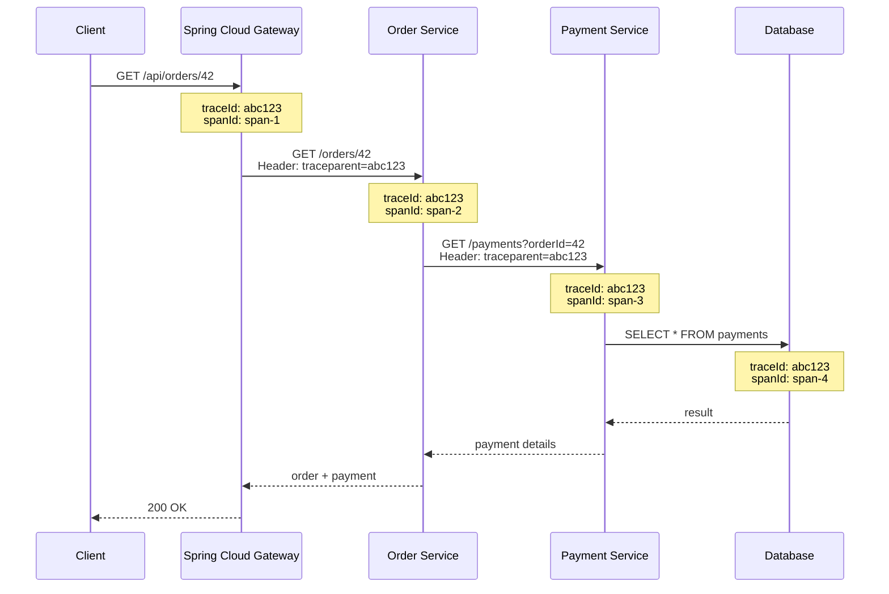
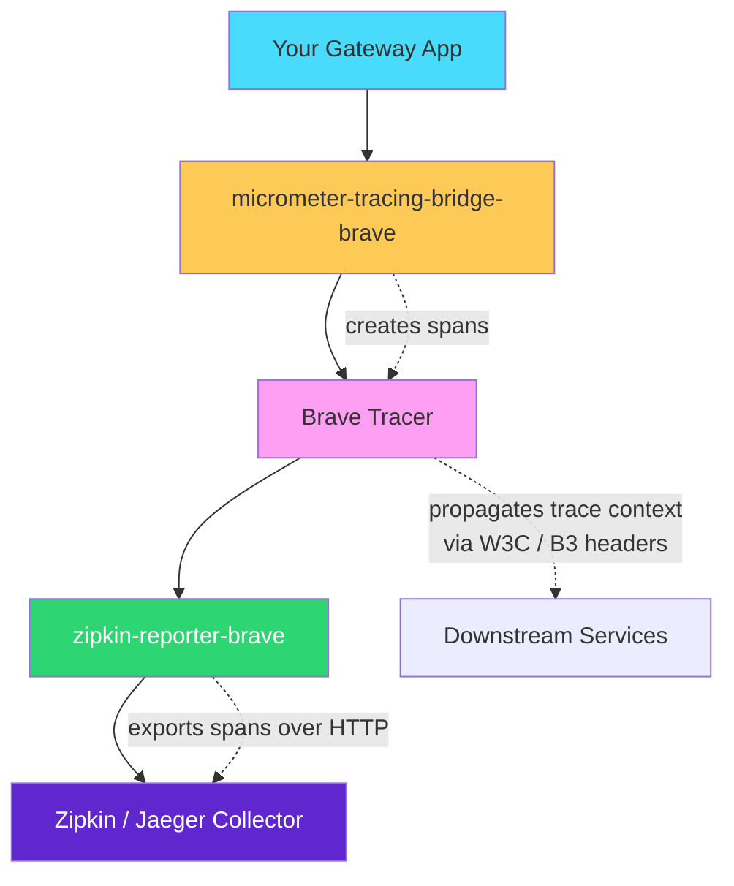
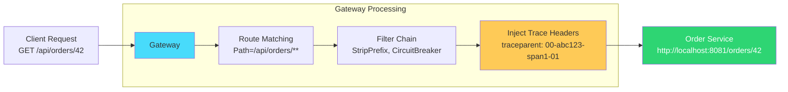

## Introduction — Why Trace at the Gateway?

In a microservices architecture, a single user request can pass through 5, 10, or 20 services before a response comes back. When something is slow or broken, you need to answer: **which service caused the problem?**

That's what distributed tracing solves. It assigns a unique **trace ID** to each incoming request and propagates it across every service in the chain. Each service creates a **span** (a timed operation within the trace), and together they form a complete picture of the request's journey.




The **gateway** is the natural place to start a trace because it's the entry point for all traffic. If tracing isn't set up here, you miss the first hop and lose visibility into gateway-level latency (routing time, filter execution, downstream connection establishment).

---

## Prerequisites

| Component | Version | Notes |
|-----------|---------|-------|
| Java | 17+ | Required for Spring Boot 3.x |
| Spring Boot | 3.2+ | Auto-configuration for Micrometer Tracing |
| Spring Cloud | 2023.0+ (Leyton) or 2024.0+ | Spring Cloud Gateway 4.x |
| Zipkin or Jaeger | Latest | For viewing traces |

> Spring Cloud Gateway is a **reactive** application built on Spring WebFlux + Project Reactor. Micrometer Tracing handles the reactive context propagation automatically — you don't need to manually pass trace IDs through `Mono`/`Flux` chains.
{: .prompt-info }

---

## Step 1: Add Dependencies

### Maven

```xml
<properties>
    <spring-boot.version>3.3.0</spring-boot.version>
    <spring-cloud.version>2024.0.0</spring-cloud.version>
</properties>

<dependencyManagement>
    <dependencies>
        <dependency>
            <groupId>org.springframework.cloud</groupId>
            <artifactId>spring-cloud-dependencies</artifactId>
            <version>${spring-cloud.version}</version>
            <type>pom</type>
            <scope>import</scope>
        </dependency>
    </dependencies>
</dependencyManagement>

<dependencies>
    <!-- Spring Cloud Gateway (reactive) -->
    <dependency>
        <groupId>org.springframework.cloud</groupId>
        <artifactId>spring-cloud-starter-gateway</artifactId>
    </dependency>

    <!-- Micrometer Tracing facade + Brave bridge -->
    <dependency>
        <groupId>io.micrometer</groupId>
        <artifactId>micrometer-tracing-bridge-brave</artifactId>
    </dependency>

    <!-- Zipkin reporter for exporting spans -->
    <dependency>
        <groupId>io.zipkin.reporter2</groupId>
        <artifactId>zipkin-reporter-brave</artifactId>
    </dependency>

    <!-- Actuator for metrics and trace endpoints -->
    <dependency>
        <groupId>org.springframework.boot</groupId>
        <artifactId>spring-boot-starter-actuator</artifactId>
    </dependency>
</dependencies>
```

### Gradle

```groovy
ext {
    set('springCloudVersion', '2024.0.0')
}

dependencyManagement {
    imports {
        mavenBom "org.springframework.cloud:spring-cloud-dependencies:${springCloudVersion}"
    }
}

dependencies {
    implementation 'org.springframework.cloud:spring-cloud-starter-gateway'
    implementation 'io.micrometer:micrometer-tracing-bridge-brave'
    implementation 'io.zipkin.reporter2:zipkin-reporter-brave'
    implementation 'org.springframework.boot:spring-boot-starter-actuator'
}
```

### What Each Dependency Does




| Dependency | Role |
|-----------|------|
| `spring-cloud-starter-gateway` | The reactive API gateway itself |
| `micrometer-tracing-bridge-brave` | Bridges Micrometer's tracing API to [Brave](https://github.com/openzipkin/brave) (Zipkin's tracing library) |
| `zipkin-reporter-brave` | Exports collected spans to a Zipkin-compatible backend (Zipkin, Jaeger, Tempo) |
| `spring-boot-starter-actuator` | Exposes health, metrics, and allows trace endpoint management |

---

## Step 2: Configure Application Properties

```yaml
# application.yml
spring:
  application:
    name: api-gateway

  cloud:
    gateway:
      # Enable automatic trace ID propagation to downstream services
      # (enabled by default when tracing dependencies are on classpath)
      metrics:
        enabled: true

# Tracing configuration
management:
  tracing:
    sampling:
      probability: 1.0  # Sample 100% of requests (lower in production, e.g., 0.1 for 10%)
    propagation:
      type: W3C         # Use W3C Trace Context headers (traceparent/tracestate)
                        # Use B3 for legacy Zipkin compatibility

  # Zipkin exporter
  zipkin:
    tracing:
      endpoint: http://localhost:9411/api/v2/spans  # Zipkin collector URL

  # Expose actuator endpoints
  endpoints:
    web:
      exposure:
        include: health,metrics,prometheus

# Logging pattern with trace and span IDs
logging:
  pattern:
    level: "%5p [${spring.application.name},%X{traceId:-},%X{spanId:-}]"
```

### Key Configuration Explained

| Property | Purpose |
|----------|---------|
| `management.tracing.sampling.probability` | Controls what percentage of requests are traced. `1.0` = all, `0.1` = 10% |
| `management.tracing.propagation.type` | Header format for propagating trace context. `W3C` (modern) or `B3` (Zipkin legacy) |
| `management.zipkin.tracing.endpoint` | Where to send spans. Works with Zipkin, Jaeger (with Zipkin collector enabled), or Grafana Tempo |
| `logging.pattern.level` | Adds `traceId` and `spanId` to every log line for correlation |

### For Jaeger Instead of Zipkin

Jaeger supports Zipkin's span format via its collector. Just point the endpoint to Jaeger's Zipkin-compatible port:

```yaml
management:
  zipkin:
    tracing:
      endpoint: http://localhost:14268/api/traces  # Jaeger Zipkin collector
```

Or if running Jaeger with OTLP, consider switching to the [OpenTelemetry bridge](https://docs.micrometer.io/tracing/reference/reporters.html) instead.

---

## Step 3: Sample Route Definition

Define your gateway routes in YAML. Each route proxies requests to a downstream service, and tracing headers are automatically injected into the forwarded request.

```yaml
# application.yml (continued)
spring:
  cloud:
    gateway:
      routes:
        - id: order-service
          uri: http://localhost:8081
          predicates:
            - Path=/api/orders/**
          filters:
            - StripPrefix=1
            - name: CircuitBreaker
              args:
                name: orderServiceCB
                fallbackUri: forward:/fallback/orders

        - id: payment-service
          uri: http://localhost:8082
          predicates:
            - Path=/api/payments/**
          filters:
            - StripPrefix=1

        - id: inventory-service
          uri: http://localhost:8083
          predicates:
            - Path=/api/inventory/**
          filters:
            - StripPrefix=1
            - name: Retry
              args:
                retries: 3
                statuses: BAD_GATEWAY,SERVICE_UNAVAILABLE

      default-filters:
        - DedupeResponseHeader=Access-Control-Allow-Origin
```

### What Happens at Runtime




The gateway automatically:
1. **Creates a span** for the incoming request
2. **Injects trace headers** (`traceparent` for W3C, or `X-B3-TraceId` for B3) into the outbound request
3. **Records timing** — how long routing + downstream call took
4. **Exports the span** to Zipkin/Jaeger

---

## Step 4: Java Configuration (Optional Customization)

The auto-configuration handles most cases, but you can customize propagation and span naming:

### Custom Propagation Configuration

```java
import brave.propagation.B3Propagation;
import brave.propagation.Propagation;
import io.micrometer.tracing.brave.bridge.BraveBaggageManager;
import org.springframework.context.annotation.Bean;
import org.springframework.context.annotation.Configuration;

@Configuration
public class TracingConfig {

    /**
     * Use B3 multi-header propagation for backward compatibility
     * with older services that don't support W3C Trace Context.
     */
    @Bean
    public Propagation.Factory propagationFactory() {
        return B3Propagation.newFactoryBuilder()
                .injectFormat(B3Propagation.Format.MULTI) // X-B3-TraceId, X-B3-SpanId, X-B3-Sampled
                .build();
    }
}
```

### Custom Gateway Filter for Span Tags

```java
import org.springframework.cloud.gateway.filter.GatewayFilterChain;
import org.springframework.cloud.gateway.filter.GlobalFilter;
import org.springframework.core.Ordered;
import org.springframework.stereotype.Component;
import org.springframework.web.server.ServerWebExchange;
import io.micrometer.observation.Observation;
import io.micrometer.observation.contextpropagation.ObservationThreadLocalAccessor;
import reactor.core.publisher.Mono;

@Component
public class TraceEnrichmentFilter implements GlobalFilter, Ordered {

    @Override
    public Mono<Void> filter(ServerWebExchange exchange, GatewayFilterChain chain) {
        // Add custom tags to the current span for better searchability in Zipkin/Jaeger
        Observation currentObservation = exchange.getAttribute(ObservationThreadLocalAccessor.KEY);

        if (currentObservation != null) {
            String routeId = exchange.getAttribute("org.springframework.cloud.gateway.support.ServerWebExchangeUtils.gatewayRouteAttr") != null
                    ? exchange.getAttribute("org.springframework.cloud.gateway.support.ServerWebExchangeUtils.gatewayRouteAttr").toString()
                    : "unknown";

            currentObservation.lowCardinalityKeyValue("gateway.route.id", routeId);
            currentObservation.highCardinalityKeyValue("gateway.request.path", exchange.getRequest().getPath().value());
        }

        return chain.filter(exchange);
    }

    @Override
    public int getOrder() {
        return Ordered.HIGHEST_PRECEDENCE + 10; // Run early in the filter chain
    }
}
```

### Baggage Propagation (Pass Custom Values Across Services)

```java
import io.micrometer.tracing.BaggageInScope;
import io.micrometer.tracing.Tracer;
import org.springframework.cloud.gateway.filter.GatewayFilterChain;
import org.springframework.cloud.gateway.filter.GlobalFilter;
import org.springframework.stereotype.Component;
import org.springframework.web.server.ServerWebExchange;
import reactor.core.publisher.Mono;

@Component
public class BaggagePropagationFilter implements GlobalFilter {

    private final Tracer tracer;

    public BaggagePropagationFilter(Tracer tracer) {
        this.tracer = tracer;
    }

    @Override
    public Mono<Void> filter(ServerWebExchange exchange, GatewayFilterChain chain) {
        // Extract tenant ID from header and propagate it as baggage across all services
        String tenantId = exchange.getRequest().getHeaders().getFirst("X-Tenant-ID");

        if (tenantId != null) {
            try (BaggageInScope baggage = tracer.createBaggageInScope("tenant.id", tenantId)) {
                return chain.filter(exchange);
            }
        }

        return chain.filter(exchange);
    }
}
```

Enable baggage propagation in configuration:

```yaml
management:
  tracing:
    baggage:
      remote-fields:
        - X-Tenant-ID
      correlation:
        fields:
          - tenant.id
```

---

## Step 5: Verification

### Start Zipkin Locally

```bash
# Docker (easiest)
docker run -d -p 9411:9411 openzipkin/zipkin

# Or download and run the JAR
curl -sSL https://zipkin.io/quickstart.sh | bash -s
java -jar zipkin.jar
```

### Start Jaeger (Alternative)

```bash
docker run -d \
  -p 16686:16686 \    # Jaeger UI
  -p 14268:14268 \    # Zipkin-compatible collector
  jaegertracing/all-in-one:latest
```

### Send a Test Request

```bash
# Send a request through the gateway
curl -v http://localhost:8080/api/orders/42
```

### What You Should See

**1. In your gateway logs:**

```
INFO [api-gateway,abc123def456,span1a2b3c4d] --- Routing to order-service
```

The trace ID (`abc123def456`) and span ID (`span1a2b3c4d`) appear in every log line.

**2. In the downstream service logs:**

```
INFO [order-service,abc123def456,span5e6f7g8h] --- Handling GET /orders/42
```

Same trace ID, different span ID — proving context propagated correctly.

**3. In response headers (optional — add a filter to expose them):**

```java
@Component
public class TraceResponseHeaderFilter implements GlobalFilter, Ordered {

    private final Tracer tracer;

    public TraceResponseHeaderFilter(Tracer tracer) {
        this.tracer = tracer;
    }

    @Override
    public Mono<Void> filter(ServerWebExchange exchange, GatewayFilterChain chain) {
        return chain.filter(exchange).then(Mono.fromRunnable(() -> {
            var span = tracer.currentSpan();
            if (span != null) {
                exchange.getResponse().getHeaders()
                    .add("X-Trace-Id", span.context().traceId());
            }
        }));
    }

    @Override
    public int getOrder() {
        return Ordered.LOWEST_PRECEDENCE;
    }
}
```

Now every response includes the trace ID:

```bash
< X-Trace-Id: abc123def456789
```

Clients can use this to search for their specific request in Zipkin/Jaeger.

**4. In Zipkin UI:**

Open `http://localhost:9411` and search by service name `api-gateway`. You'll see:

```mermaid
gantt
    title Trace View in Zipkin (traceId: abc123)
    dateFormat X
    axisFormat %L ms

    section api-gateway
    gateway-request           :0, 280

    section order-service
    handle-order              :15, 250

    section payment-service
    verify-payment            :30, 120
```




Each span shows its duration, service name, and relationship to parent spans.

---

## Production Considerations

### Sampling Strategy

Don't trace 100% of traffic in production — it's expensive (network, storage, processing):

```yaml
management:
  tracing:
    sampling:
      probability: 0.1  # 10% of requests — enough for troubleshooting
```

For important operations, use programmatic sampling:

```java
@Component
public class PrioritySamplingFilter implements GlobalFilter {

    private final Tracer tracer;

    @Override
    public Mono<Void> filter(ServerWebExchange exchange, GatewayFilterChain chain) {
        // Always trace admin and health-check paths
        String path = exchange.getRequest().getPath().value();
        if (path.startsWith("/api/admin") || path.contains("/health")) {
            // Force sampling for critical paths
            // (implementation depends on your sampler configuration)
        }
        return chain.filter(exchange);
    }
}
```

### Performance Overhead

| Sampling Rate | Throughput Impact | Storage (per 1M requests) |
|--------------|-------------------|---------------------------|
| 100% | ~3-5% | ~5GB |
| 10% | < 1% | ~500MB |
| 1% | Negligible | ~50MB |

### Trace ID in Error Responses

Include trace IDs in error responses so users can reference them in support tickets:

```java
@RestController
public class FallbackController {

    private final Tracer tracer;

    public FallbackController(Tracer tracer) {
        this.tracer = tracer;
    }

    @GetMapping("/fallback/orders")
    public ResponseEntity<Map<String, Object>> orderFallback() {
        String traceId = tracer.currentSpan() != null
                ? tracer.currentSpan().context().traceId()
                : "unknown";

        return ResponseEntity.status(HttpStatus.SERVICE_UNAVAILABLE)
                .body(Map.of(
                    "error", "Order service is temporarily unavailable",
                    "traceId", traceId,
                    "timestamp", Instant.now()
                ));
    }
}
```

---

## Full Application Structure

```
api-gateway/
├── src/main/java/com/myapp/gateway/
│   ├── GatewayApplication.java
│   ├── config/
│   │   └── TracingConfig.java
│   ├── filter/
│   │   ├── TraceEnrichmentFilter.java
│   │   ├── TraceResponseHeaderFilter.java
│   │   └── BaggagePropagationFilter.java
│   └── fallback/
│       └── FallbackController.java
├── src/main/resources/
│   └── application.yml
└── pom.xml
```

---

## Troubleshooting

| Symptom | Cause | Fix |
|---------|-------|-----|
| No traces in Zipkin | Zipkin endpoint wrong or service not running | Verify `management.zipkin.tracing.endpoint` and check Docker logs |
| Trace ID not in logs | Logging pattern missing MDC keys | Add `%X{traceId:-},%X{spanId:-}` to logging pattern |
| Trace breaks between services | Downstream service not reading propagation headers | Ensure downstream also has `micrometer-tracing-bridge-brave` dependency |
| All spans show 0ms duration | Reactive context not propagating | Upgrade to Spring Boot 3.2+ (fixes Reactor context propagation) |
| High memory usage | 100% sampling in production | Lower `sampling.probability` to 0.05-0.1 |

---

## References

- [Spring Boot Tracing Documentation](https://docs.spring.io/spring-boot/reference/actuator/tracing.html)
- [Micrometer Tracing — Supported Reporters](https://docs.micrometer.io/tracing/reference/reporters.html)
- [Spring Cloud Gateway Documentation](https://spring.io/projects/spring-cloud-gateway/)
- [Brave GitHub — Propagation Formats](https://github.com/openzipkin/brave)
- [Zipkin Quickstart](https://zipkin.io/pages/quickstart.html)
- [Spring Guides — Building a Gateway](https://spring.io/guides/gs/gateway/)

> Tracing is observability's third pillar alongside metrics and logs. When all three share the same trace ID, you can jump from a latency spike in Grafana → to the slow span in Zipkin → to the exact error log line. That's the power of correlated observability.
{: .prompt-tip }
