## The Problem with Monoliths (and Microservices)

If you're starting your career, you'll hear two things constantly: "monoliths are bad" and "microservices are the answer." Neither is fully true. Let me show you what actually happens in real projects.

### The Big Ball of Mud Monolith

Everything calls everything. Want to change how orders work? Surprise — it breaks notifications, breaks reporting, and breaks the admin dashboard.

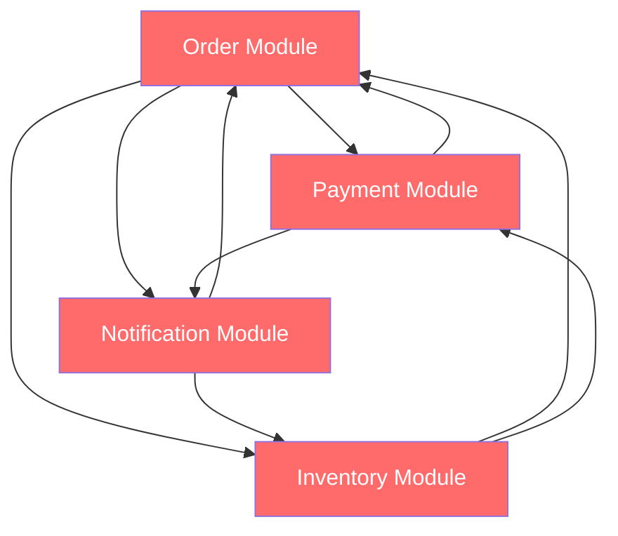

Every module depends on every other module. Change one thing, break five things. This is what "spaghetti code" looks like at the architecture level.

### Premature Microservices

You split into 15 services before understanding your domain boundaries. Now you have the same tangled dependencies — just across a network with added latency, failure modes, and deployment complexity.

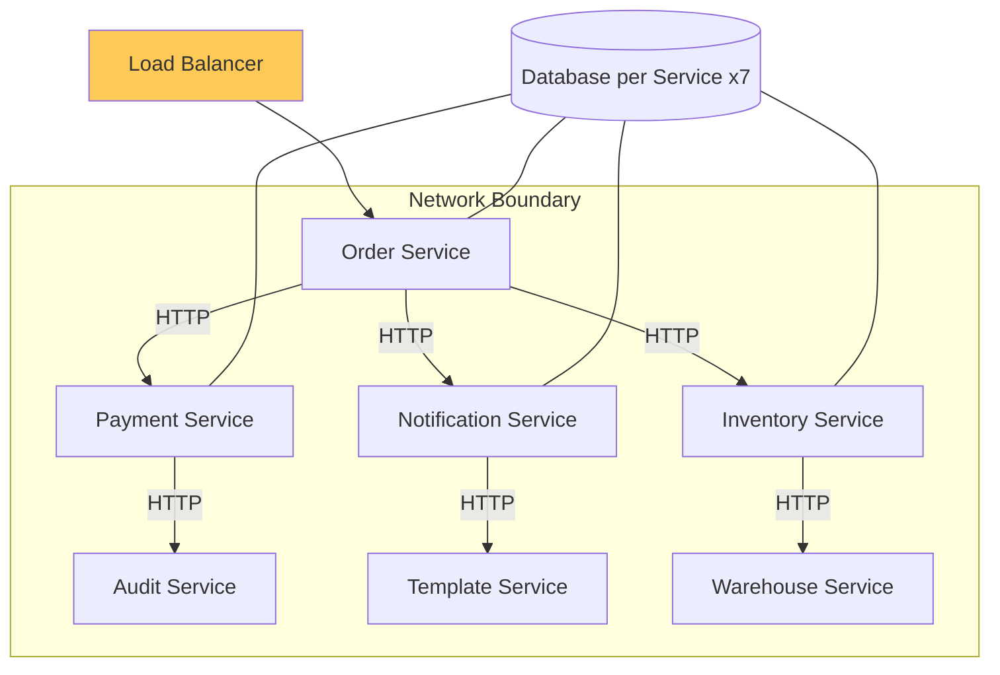

Same mess, now with network calls, 7 databases, and a DevOps team crying in the corner.

### The Middle Path: Modular Monolith

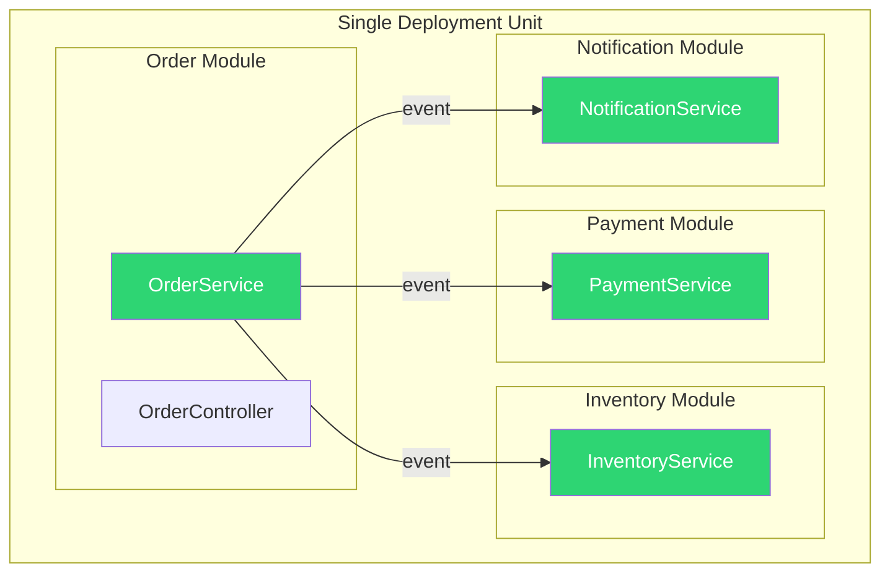

One deployment. Clear boundaries. Modules talk through events, not tangled direct calls.

> Think of it like an apartment building: everyone lives in one building (monolith), but each apartment has its own walls, lock, and front door (modules). You don't walk through someone's kitchen to get to your bathroom.
{: .prompt-info }

---

## What Spring Modulith Provides

Spring Modulith is an opinionated framework built on Spring Boot that:

1. **Defines module boundaries** based on package structure
2. **Enforces encapsulation** — modules can't access each other's internals
3. **Provides event-based communication** between modules
4. **Verifies architecture** with automated tests
5. **Generates documentation** of module dependencies

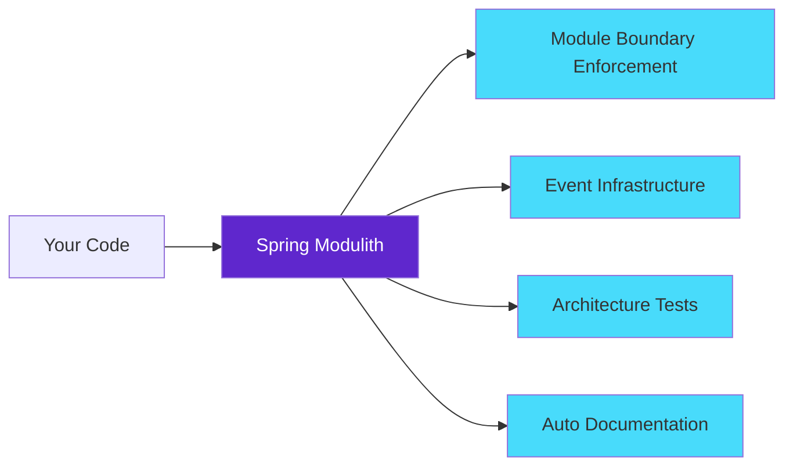

---

## Project Structure

Spring Modulith uses a **convention-over-configuration** approach. Think of your package structure as a floor plan — top-level packages under your main application package are modules:

```
com.myapp/
├── MyApplication.java              ← Main class
├── order/                          ← Order module
│   ├── Order.java                  ← Public API (exposed)
│   ├── OrderService.java           ← Public API (exposed)
│   ├── OrderController.java        ← Public API (exposed)
│   └── internal/                   ← Internal (hidden from other modules)
│       ├── OrderRepository.java
│       ├── OrderValidator.java
│       └── OrderMapper.java
├── inventory/                      ← Inventory module
│   ├── InventoryService.java
│   ├── StockLevel.java
│   └── internal/
│       ├── InventoryRepository.java
│       └── WarehouseClient.java
├── payment/                        ← Payment module
│   ├── PaymentService.java
│   ├── PaymentResult.java
│   └── internal/
│       ├── StripeClient.java
│       └── PaymentRepository.java
└── notification/                   ← Notification module
    ├── NotificationService.java
    └── internal/
        ├── EmailSender.java
        └── TemplateEngine.java
```

Here's the visibility rule visualized:

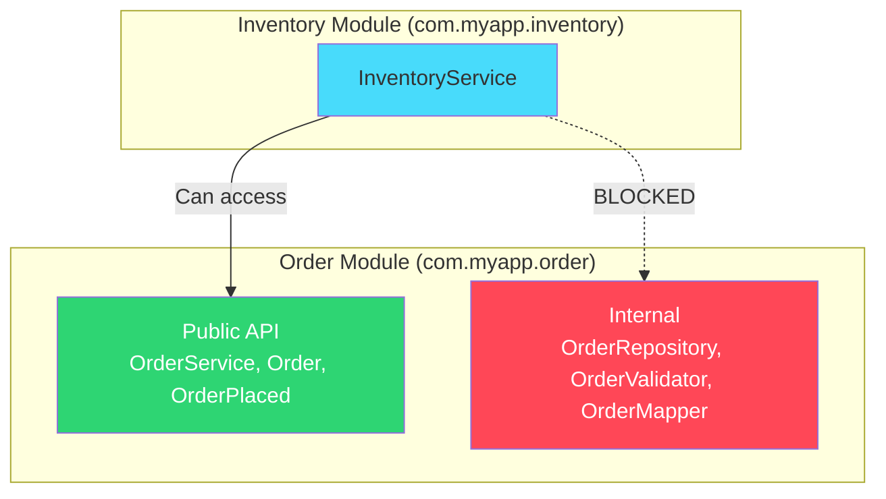

**Simple rule to remember:** Classes at the top level of a module package = public. Classes inside an `internal` sub-package = private to that module.

---

## Setting Up Spring Modulith

### Dependencies

```xml
<dependencyManagement>
    <dependencies>
        <dependency>
            <groupId>org.springframework.modulith</groupId>
            <artifactId>spring-modulith-bom</artifactId>
            <version>1.2.0</version>
            <type>pom</type>
            <scope>import</scope>
        </dependency>
    </dependencies>
</dependencyManagement>

<dependencies>
    <!-- Core module support -->
    <dependency>
        <groupId>org.springframework.modulith</groupId>
        <artifactId>spring-modulith-starter-core</artifactId>
    </dependency>

    <!-- Event publication registry (for reliable events) -->
    <dependency>
        <groupId>org.springframework.modulith</groupId>
        <artifactId>spring-modulith-starter-jpa</artifactId>
    </dependency>

    <!-- Testing support -->
    <dependency>
        <groupId>org.springframework.modulith</groupId>
        <artifactId>spring-modulith-starter-test</artifactId>
        <scope>test</scope>
    </dependency>

    <!-- Documentation generation -->
    <dependency>
        <groupId>org.springframework.modulith</groupId>
        <artifactId>spring-modulith-docs</artifactId>
        <scope>test</scope>
    </dependency>
</dependencies>
```

---

## Module Public API Design

### The Order Module's Public Contract

Think of the public API as a **menu** at a restaurant. Other modules can see the menu (public classes), but they can't walk into the kitchen (internal package).

```java
package com.myapp.order;

// This is the public API — other modules can use this
public record OrderPlaced(
    Long orderId,
    Long customerId,
    List<OrderItem> items,
    BigDecimal total,
    LocalDateTime placedAt
) {}
```

```java
package com.myapp.order;

@Service
public class OrderService {

    private final OrderRepository orderRepository;
    private final ApplicationEventPublisher events;

    OrderService(OrderRepository orderRepository, ApplicationEventPublisher events) {
        this.orderRepository = orderRepository;
        this.events = events;
    }

    @Transactional
    public Order placeOrder(CreateOrderCommand command) {
        Order order = Order.create(command);
        orderRepository.save(order);

        // Publish event — other modules react without direct coupling
        events.publishEvent(new OrderPlaced(
            order.getId(),
            order.getCustomerId(),
            order.getItems(),
            order.getTotal(),
            LocalDateTime.now()
        ));

        return order;
    }

    public Optional<Order> findById(Long id) {
        return orderRepository.findById(id);
    }
}
```

### Internal Implementation (Hidden from Other Modules)

```java
package com.myapp.order.internal;

// This class is ONLY accessible within the order module
// Other modules cannot import it — Spring Modulith enforces this
@Repository
interface OrderRepository extends JpaRepository<Order, Long> {
    List<Order> findByCustomerIdOrderByCreatedAtDesc(Long customerId);
}
```

```java
package com.myapp.order.internal;

@Component
class OrderValidator {

    boolean isValid(CreateOrderCommand command) {
        return command.items() != null
            && !command.items().isEmpty()
            && command.items().stream().allMatch(i -> i.quantity() > 0);
    }
}
```

---

## Event-Driven Communication Between Modules

This is probably the most important concept to understand. Instead of module A directly calling module B (tight coupling), modules communicate by broadcasting events — like a radio station.

### The Difference Visualized

**Without events (tight coupling):**

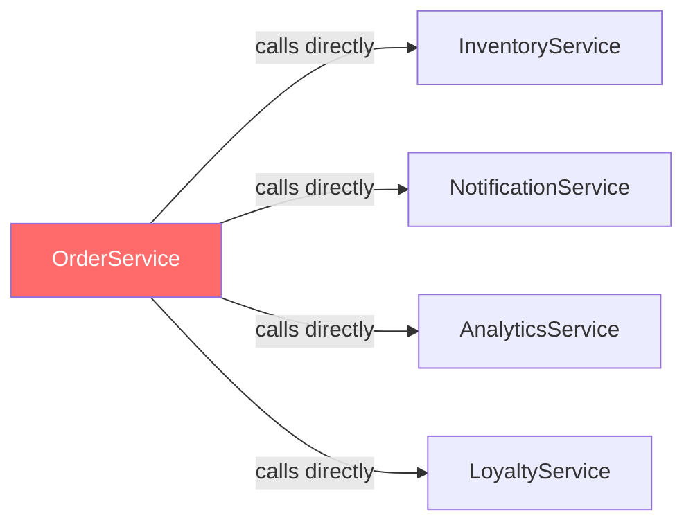

The OrderService needs to know about EVERY service that cares about orders. Adding a new one means editing OrderService.

**With events (loose coupling):**

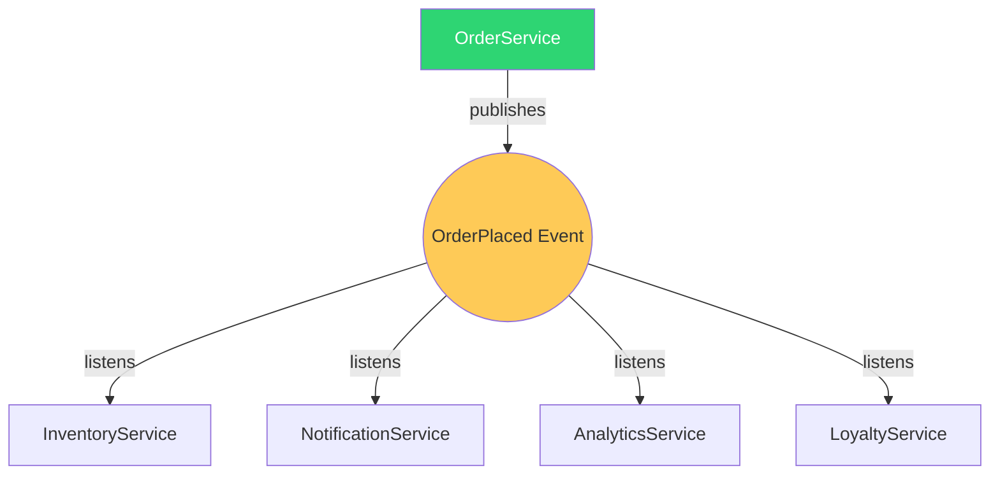

OrderService just says "hey, an order was placed" and doesn't care who's listening. Want to add analytics? Just add a listener. Zero changes to the order module.

### Publisher (Order Module)

```java
package com.myapp.order;

// Event records — part of the order module's public API
public record OrderPlaced(Long orderId, Long customerId, BigDecimal total, LocalDateTime placedAt) {}
public record OrderCancelled(Long orderId, String reason, LocalDateTime cancelledAt) {}
```

### Listener (Inventory Module)

```java
package com.myapp.inventory;

@Service
public class InventoryService {

    private final InventoryRepository inventoryRepository;

    @ApplicationModuleListener  // Spring Modulith annotation for module event handling
    void on(OrderPlaced event) {
        // Reserve stock for the order
        event.items().forEach(item ->
            inventoryRepository.decrementStock(item.productId(), item.quantity())
        );
    }

    @ApplicationModuleListener
    void on(OrderCancelled event) {
        // Release reserved stock
        inventoryRepository.releaseReservation(event.orderId());
    }
}
```

### Listener (Notification Module)

```java
package com.myapp.notification;

@Service
public class NotificationService {

    @ApplicationModuleListener
    void on(OrderPlaced event) {
        // Send order confirmation email
        sendEmail(event.customerId(), "order-confirmation", Map.of(
            "orderId", event.orderId(),
            "total", event.total()
        ));
    }
}
```

### Why Events Over Direct Calls?

| Direct Call | Event-Driven |
|------------|-------------|
| Order module must know about Inventory, Notification, Analytics... | Order module just publishes "OrderPlaced" |
| Adding a new listener means modifying the order module | New module listens without touching existing code |
| Tight coupling — hard to test in isolation | Loose coupling — each module testable independently |
| Failure in notification breaks order placement | Failure in notification doesn't affect orders |

---

## Reliable Event Publication

Here's a real concern: what if the app crashes after saving the order but before the event reaches the notification module? The customer paid but never got a confirmation email.

Spring Modulith solves this with an **Event Publication Registry** — it stores events in the same database transaction as your business data.

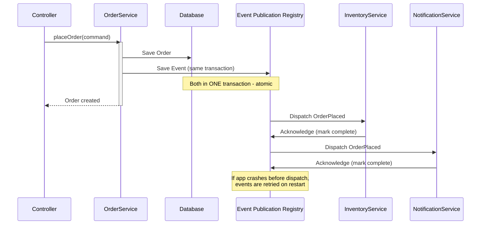

### Configuration

```yaml
# application.yml
spring:
  modulith:
    republish-outstanding-events-on-restart: true
    events:
      publication-registry:
        completion:
          max-age: 7d
```

**Why this matters:** Without this, you'd have the classic "I saved the data but the side-effect didn't happen" bug. The registry guarantees that events will eventually be delivered, even if the app crashes right after the transaction commits.

---

## Enforcing Module Boundaries

This is where Spring Modulith really shines for teams. It's not just guidelines in a wiki that nobody reads — it's a test that **fails your build** if someone breaks the rules.

### Architecture Verification Test

```java
class ModularityTests {

    @Test
    void verifyModuleStructure() {
        ApplicationModules modules = ApplicationModules.of(MyApplication.class);
        modules.verify();
    }
}
```

If a developer in the payment module tries to use `OrderRepository` (which is internal to the order module):

```
Module 'payment' depends on non-exposed type
com.myapp.order.internal.OrderRepository in module 'order'
```

Build fails. The developer learns they need to use the public API (`OrderService`) instead.

### What Gets Caught

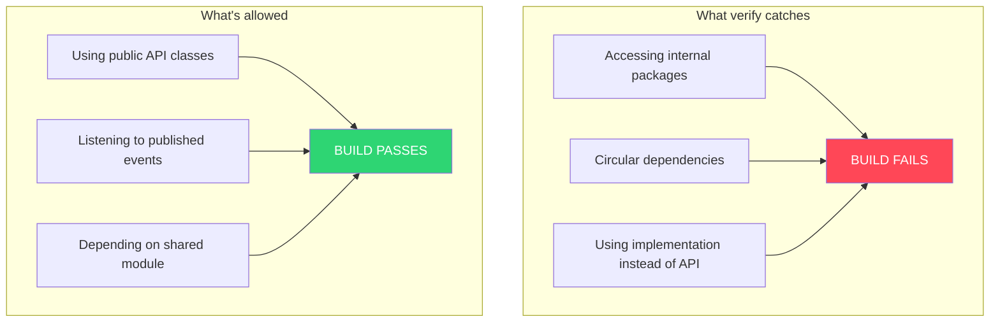

---

## Testing Modules in Isolation

As a junior developer, you might have experienced tests that take 2 minutes to start because they load the entire application. With `@ApplicationModuleTest`, you only load the module you're testing:

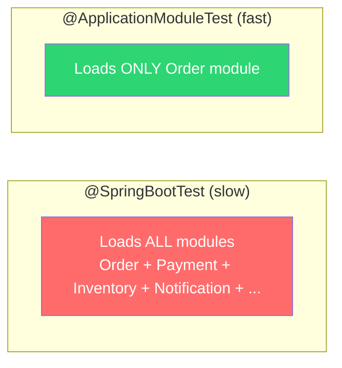

### Bootstrap Only One Module

```java
@ApplicationModuleTest
class OrderModuleTest {

    @Autowired
    private OrderService orderService;

    @Test
    void placeOrder_shouldPublishEvent(Scenario scenario) {
        var command = new CreateOrderCommand(
            1L,
            List.of(new OrderItem(100L, 2, BigDecimal.valueOf(29.99))),
            "CREDIT_CARD"
        );

        scenario.stimulate(() -> orderService.placeOrder(command))
                .andWaitForEventOfType(OrderPlaced.class)
                .toArriveAndVerify(event -> {
                    assertThat(event.orderId()).isNotNull();
                    assertThat(event.total()).isEqualByComparingTo("59.98");
                });
    }
}
```

This gives you:

- **Fast tests** — no loading the whole Spring context
- **True isolation** — proves the module works independently
- **Event verification** — confirms the right events get published

---

## Generating Module Documentation

Spring Modulith can auto-generate architecture diagrams from your actual code (not stale wiki pages that nobody updates):

```java
@Test
void generateDocumentation() {
    ApplicationModules modules = ApplicationModules.of(MyApplication.class);

    new Documenter(modules)
        .writeModulesAsPlantUml()
        .writeIndividualModulesAsPlantUml()
        .writeModuleCanvases();
}
```

This produces diagrams that always reflect reality. The documentation is generated from the code, so it can never go stale.

---

## Explicit Module Configuration (Advanced)

For cases where the package convention isn't enough:

```java
package com.myapp.order;

@ApplicationModule(
    allowedDependencies = {"inventory", "shared"},
    displayName = "Order Management"
)
class package-info {}
```

### Named Interfaces (Exposing Specific Sub-packages)

Sometimes a module wants to expose only its events, not its full service API:

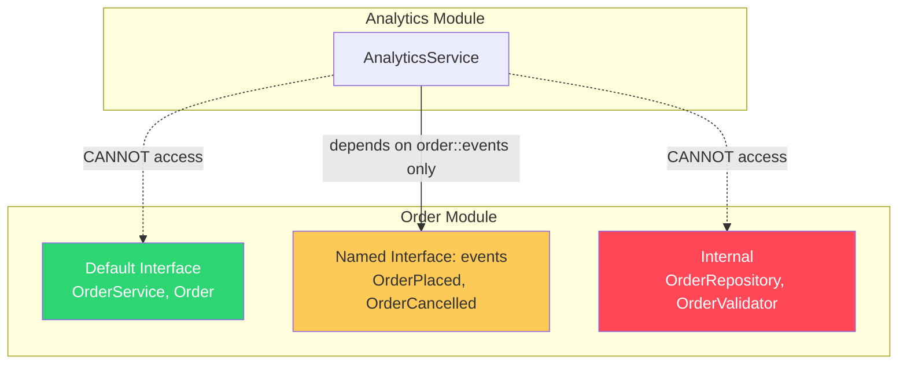

```java
@ApplicationModule(allowedDependencies = "order::events")  // Only use the events API
```

---

## From Modular Monolith to Microservice

This is the endgame benefit. When (if!) you actually need to extract a module into its own service, the path is clean because boundaries were enforced from day one:

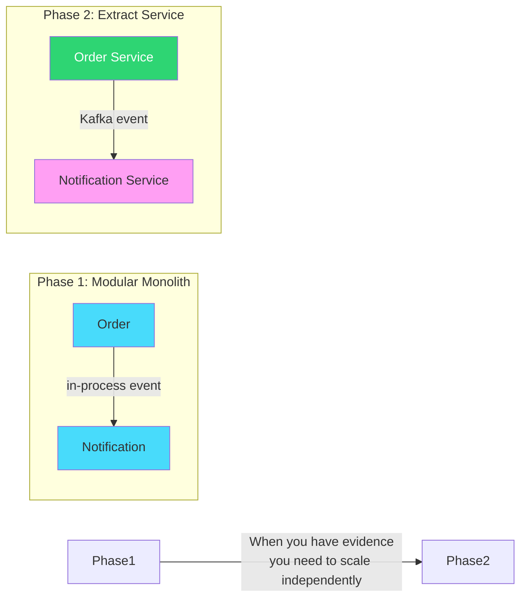

### Step 1: Module Already Has Clean Boundaries

```
com.myapp.notification/
├── NotificationService.java       ← Public API
├── OrderPlaced handler            ← Reacts to events
└── internal/
    ├── EmailSender.java
    └── TemplateEngine.java
```

### Step 2: Replace In-Process Events with External Events

```java
// Before: Spring ApplicationEvent (in-process)
@ApplicationModuleListener
void on(OrderPlaced event) { ... }

// After: Kafka/RabbitMQ listener (cross-service)
@KafkaListener(topics = "order-events")
void on(OrderPlaced event) { ... }
```

### Step 3: Deploy Independently

The module becomes its own Spring Boot application. Because the boundaries were enforced all along, the extraction is mechanical — no untangling of dependencies needed.

---

## The Full Lifecycle — How It All Fits Together

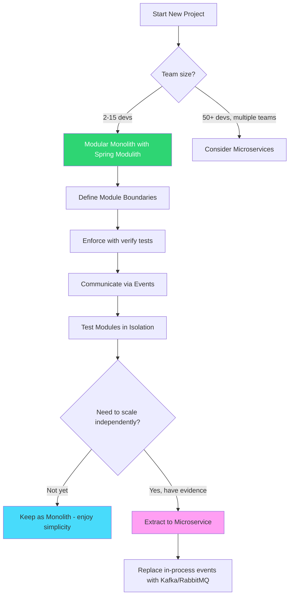

---

## When to Choose a Modular Monolith

### Choose modular monolith when:

- You're in the **early stages** of a product and boundaries aren't clear yet
- Your team is **small to medium** (2-15 developers)
- You value **simplicity** — one deploy, one database, no network failures between modules
- You want the **option** to extract services later without upfront distributed systems tax
- Your modules share **transactional boundaries** (orders + inventory in one ACID transaction)

### Choose microservices when:

- Multiple **independent teams** need to deploy at different cadences
- Modules have genuinely **different scaling requirements** (100x traffic on search vs. 1x on billing)
- You need **polyglot** — some modules require different languages/runtimes
- Your organization is large enough to afford the **operational overhead**

---

## Quick Reference

| Feature | What It Does |
|---------|-------------|
| Package convention | Top-level packages = modules, `internal` = encapsulated |
| `ApplicationModules.verify()` | Fails if modules violate boundaries |
| `@ApplicationModuleListener` | Handles events from other modules |
| Event Publication Registry | Persists events for reliable delivery |
| `@ApplicationModuleTest` | Tests a single module in isolation |
| Named interfaces | Fine-grained control over what's exposed |
| `Documenter` | Auto-generates architecture diagrams |

---

> Start with a modular monolith. Extract to microservices when you have evidence you need to — not when you think you might. As a junior developer, this is the most important architecture lesson: **complexity must be earned, not assumed.**
{: .prompt-tip }
