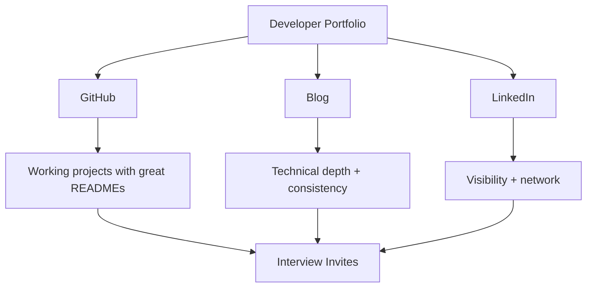
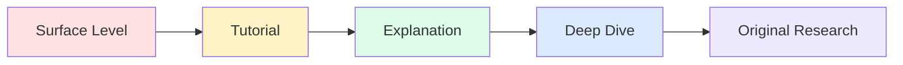
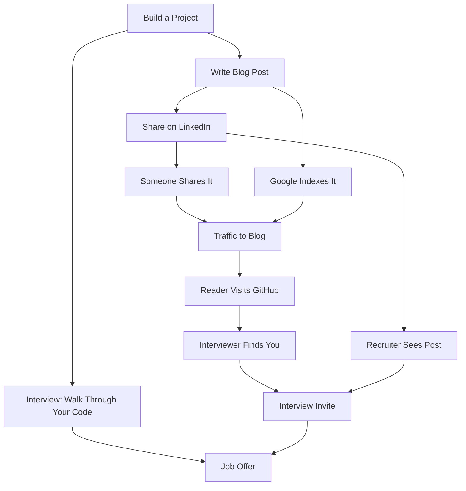

## Why Portfolios Beat Resumes

A resume tells a hiring manager what you *claim* you can do. A portfolio *shows* them. In a market where hundreds of developers apply to the same role, the difference between getting an interview and getting ghosted often comes down to evidence.

Consider what happens when a recruiter reviews your application:

| Candidate A | Candidate B |
|-------------|-------------|
| Resume says "Built microservices" | GitHub shows 5 repos with working microservices |
| Claims "Strong in Java" | Blog explains Java 21 features with production examples |
| Lists "System design" as a skill | Published post walks through a URL shortener design |
| No online presence | LinkedIn posts about recent learnings every week |

Candidate B gets the interview every time. Not because they're necessarily better — but because the evidence reduces the interviewer's risk.

---

## The Three Pillars

A strong developer portfolio stands on three legs:



Each pillar serves a different purpose:

| Pillar | Purpose | Signal to Hiring Manager |
|--------|---------|--------------------------|
| GitHub | Proof of execution | "This person ships working code" |
| Blog | Proof of depth | "This person understands fundamentals" |
| LinkedIn | Proof of consistency | "This person is actively growing" |

You don't need to be world-class at all three. But you need presence in all three. A GitHub full of repos with no README is as bad as no GitHub at all.

---

## GitHub: Quality Over Quantity

### What Makes a Good Repository

Most GitHub profiles are graveyards of half-finished projects with no documentation. To stand out, every repo you pin should have:

| Element | Why It Matters |
|---------|----------------|
| Clear README with setup instructions | Shows you think about other developers |
| Working code that actually runs | Proves it's not copy-pasted from a tutorial |
| Consistent code style | Shows professional habits |
| Meaningful commit history | Demonstrates your process |
| Tests (even minimal) | Shows quality awareness |
| Proper .gitignore | Shows attention to detail |

### Repository Red Flags

| Red Flag | What It Signals |
|----------|-----------------|
| No README | "I don't communicate" |
| Single "initial commit" | "I dumped code, didn't iterate" |
| node_modules or target/ committed | "I don't understand tooling" |
| Hardcoded secrets | "I'm a security risk" |
| Only tutorial clones | "I follow along but can't build independently" |
| 200 repos, all empty | "Quantity over quality" |

### How Many Repos to Pin

Pin 6 repositories on your GitHub profile. These should represent:

1. **One system design project** — URL shortener, rate limiter, notification service
2. **One full-stack application** — Even a simple CRUD app, done well
3. **One tool/library** — Something others could use
4. **One learning repo** — Exploring a new technology (well-documented)
5. **One contribution** — Open source PR or fork with improvements
6. **One creative/fun project** — Shows personality beyond work

---

## Project Selection Strategy

Not all projects signal the same things to hiring managers. Choose projects that demonstrate specific competencies:

| Project Type | What It Demonstrates | Interview Value |
|--------------|---------------------|-----------------|
| URL Shortener | System design, encoding, databases | High — classic interview question |
| Notification Service | Event-driven architecture, patterns | High — production relevance |
| REST API with auth | Security, CRUD, validation | Medium — expected baseline |
| CLI tool | Problem-solving, UX thinking | Medium — shows versatility |
| Rate Limiter | Algorithms, concurrency | High — demonstrates depth |
| Chat Application | WebSockets, real-time | Medium — shows modern skills |
| E-commerce API | Domain modeling, transactions | High — enterprise relevance |
| Infrastructure as Code | DevOps awareness, cloud skills | Medium-High — full-stack signal |

### The Key Insight

Build projects that solve **interview questions**. System design interviews ask about URL shorteners, rate limiters, notification services, and caches. If you've already built them, you can walk through your actual implementation during the interview.

---

## README as Your Sales Page

Your README is the first thing anyone sees. Treat it like a landing page.

### Template

```markdown
# Project Name

One-line description of what this project does.

## Features

- Feature 1 — brief explanation
- Feature 2 — brief explanation
- Feature 3 — brief explanation

## Tech Stack

| Layer | Technology |
|-------|-----------|
| Backend | Spring Boot 3.5 |
| Database | PostgreSQL 16 |
| Messaging | Apache Kafka |

## Architecture

[Mermaid diagram or architecture image]

## Running Locally

\```bash
docker compose up -d
./mvnw spring-boot:run
\```

## API Usage

\```bash
curl -X POST http://localhost:8080/api/resource \
  -H "Content-Type: application/json" \
  -d '{"key": "value"}'
\```

## Blog Post

Detailed walkthrough: [Link to your blog post]
```

Key principles:
1. **Start with value** — what does this do and why should I care?
2. **Show, don't tell** — include a working curl command, not just API docs
3. **Make it runnable** — `docker compose up` + one command should work
4. **Link to depth** — point to the blog post for the full explanation

---

## Blogging for Engineers

### Why Blog?

Blogging does three things simultaneously:

1. **Forces understanding** — You can't explain what you don't truly understand
2. **Creates searchable artifacts** — Google indexes your expertise
3. **Compounds over time** — 50 posts create more value than 5 × 10 posts ever could

### Consistency Over Perfection

| Approach | Posts/Month | Outcome After 6 Months |
|----------|-------------|------------------------|
| Perfectionist | 0-1 | 3 amazing posts nobody finds |
| Consistent | 4-8 | 30 solid posts with compound traffic |
| Burnout sprint | 20 (month 1) then 0 | Abandoned blog |

The sweet spot: **2 posts per week**. Not every post needs to be a 3,000-word deep dive. Alternate between:
- Long-form system design posts (like this one)
- Short comparison posts ("Kafka vs RabbitMQ")
- TIL (Today I Learned) posts
- "How I solved X" debugging stories

### SEO Basics for Technical Blogs

| Element | Practice |
|---------|----------|
| Title | Include the technology name + what it does |
| Description | 150-160 chars, includes primary keyword |
| Headers | H2 for sections, H3 for subsections |
| Code blocks | Language-tagged for syntax highlighting |
| Internal links | Link between your own related posts |
| Tags | 5-7 specific tags per post |

### Technical Depth Spectrum



Aim for the "Explanation" to "Deep Dive" range. Tutorials are commoditized — everyone writes "How to set up Spring Boot." Fewer people write "How Base62 encoding works in URL shorteners and why we chose it over random hashes."

---

## LinkedIn Presence

### Posting About What You Build

Every project you build and every post you write should generate a LinkedIn post. The formula:

```
1. Hook (1 line): What did you build/learn?
2. Context (2-3 lines): Why does this matter?
3. Key insight (2-3 lines): What's the interesting technical detail?
4. Call to action: Link to repo/blog
```

Example:
> Built a notification service with Spring Boot + Kafka this weekend.
>
> The interesting part: using the Strategy pattern to route notifications
> to Email, SMS, or Push channels without a single if-else chain.
> Adding a new channel = implementing one interface.
>
> Full writeup + code: [link]

### Posting Cadence

| Frequency | Effect |
|-----------|--------|
| 1/week | Minimum for visibility |
| 3/week | Strong presence, algorithm rewards you |
| Daily | Maximum growth, time-intensive |

---

## The Compound Effect

Here's what happens when you consistently build, write, and share:



This flywheel takes 3-6 months to build momentum. The first month feels like shouting into the void. By month 6, you're getting inbound messages from recruiters who found your blog.

---

## Common Mistakes

| Mistake | Why It Hurts | Fix |
|---------|-------------|-----|
| Only tutorial follow-alongs | Shows you can copy, not create | Build original projects that solve problems |
| No README on repos | Repos are invisible to humans | Every pinned repo needs a quality README |
| Inconsistent posting | Algorithm forgets you, momentum dies | Schedule posts — treat it like a standup |
| Too broad (React + DevOps + ML + Blockchain) | Confuses your brand | Pick 2-3 focus areas and go deep |
| Never sharing your work | Nobody discovers it organically | Post on LinkedIn, Twitter, Reddit, HN |
| Waiting until it's perfect | Nothing ships, nothing compounds | Ship at 80%. Iterate publicly. |
| Ignoring SEO | Great content nobody finds | Use descriptive titles with technology names |
| Copying others' content | Destroys credibility if caught | Always create original work, cite sources |

---

## What Hiring Managers Actually Look At

I've asked engineering managers and tech leads what they look for. The consensus:

1. **Can this person ship?** — Do their repos actually work? Is there a README with instructions?
2. **Do they think about quality?** — Tests, error handling, proper architecture.
3. **Can they communicate?** — Blog posts, README quality, commit messages.
4. **Are they curious?** — Do they explore new things? Is there growth visible over time?
5. **Would I want to work with them?** — Tone of writing, collaboration evidence (PRs, reviews).

What they *don't* care about:
- Star count on repos
- Number of followers
- Contribution graph being all green
- Using the trendiest framework

---

## Action Plan

### Week 1: Foundation

- [ ] Optimize GitHub profile (bio, pinned repos, profile README)
- [ ] Choose your blog platform (GitHub Pages, Hashnode, or Dev.to)
- [ ] Pick 3 focus technologies (e.g., Java + Spring Boot + System Design)
- [ ] Draft your first blog post outline

### Week 2: First Project + Post

- [ ] Build your first system design project (URL shortener recommended)
- [ ] Write a README that follows the template above
- [ ] Write the companion blog post
- [ ] Share on LinkedIn with the formula above

### Week 3: Second Project + Post

- [ ] Build your second project (different category)
- [ ] Write README + blog post
- [ ] Start writing a "lessons learned" or comparison post

### Week 4: Consistency Engine

- [ ] Set up a posting schedule (2 blog posts + 3 LinkedIn posts per week)
- [ ] Build a content backlog (list of 20 future post ideas)
- [ ] Join 2-3 tech communities where you can share (Reddit, Discord, Twitter)
- [ ] Review and iterate on your first posts based on what got engagement

### Month 2-3: Compound

- [ ] Continue shipping: 2 posts/week, 1 new repo/month
- [ ] Start cross-linking between posts
- [ ] Engage with others' content (genuine comments, not spam)
- [ ] Track which topics get the most traffic and double down

---

## The Math

Let's be concrete about what consistent effort produces:

| Timeframe | Posts Written | Repos Built | Likely Outcome |
|-----------|-------------|-------------|----------------|
| 1 month | 8 | 2 | Foundation exists |
| 3 months | 24 | 5 | Starting to rank in Google |
| 6 months | 50 | 8 | Inbound recruiter messages |
| 12 months | 100 | 12 | Industry recognition in niche |

This isn't overnight. But neither was learning to code. The difference: most developers never do this, so even modest effort puts you in the top 10% of visible candidates.

---

## References

- [GitHub Profile README Guide](https://docs.github.com/en/account-and-profile/setting-up-and-managing-your-github-profile/customizing-your-profile/managing-your-profile-readme)
- [Show Your Work — Austin Kleon](https://austinkleon.com/show-your-work/)
- [The DORA Metrics](https://dora.dev/research/)
- [Technical Blogging — Antonio Cangiano](https://pragprog.com/titles/actechnical/technical-blogging-second-edition/)
