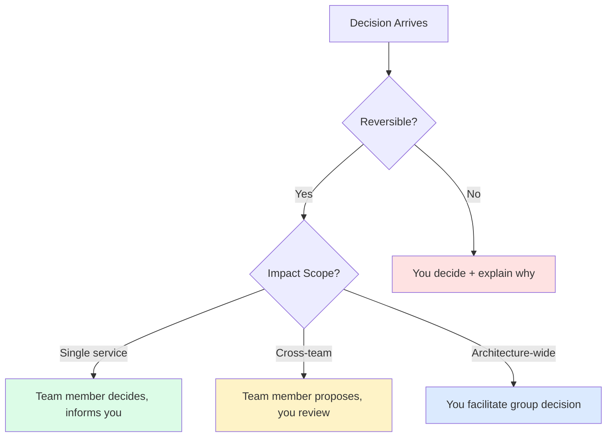
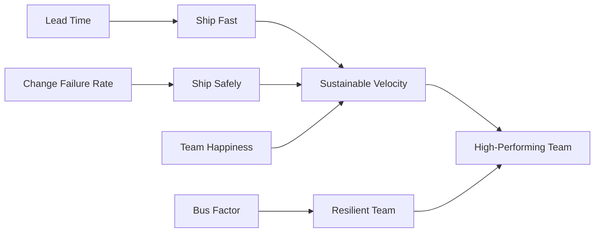

## The Shift

The day you become a tech lead, your job description changes in a way nobody prepares you for. You go from being an individual contributor — measured by the code you write — to a multiplier, measured by the output of your entire team.

This isn't a promotion in the traditional sense. It's a role change. The skills that made you a great developer (deep focus, solving hard problems alone, shipping features end-to-end) become liabilities if you don't adapt them.

The single biggest mental shift: **your job is no longer to write the best code. It's to create the conditions where your team writes the best code.**

---

## What Changed

| Dimension | Before (Senior Dev) | After (Tech Lead) |
|-----------|--------------------|--------------------|
| Success metric | Features shipped | Team velocity + quality |
| Calendar | 80% coding, 20% meetings | 40% coding, 40% meetings, 20% planning |
| Decision scope | "How do I implement this?" | "Should we build this at all?" |
| Feedback loop | PR reviews from others | Giving PR reviews, 1:1s, design reviews |
| Visibility | Your commits | Team's delivery + your communication |
| Stress source | Technical problems | People problems + technical problems |
| Growth path | Deeper expertise | Broader influence |
| Worst day | A bug you can't find | A conflict you can't resolve |

The table doesn't capture the emotional weight. You'll feel guilty for not coding. You'll feel like an impostor in meetings. Both feelings fade with time.

---

## The First 90 Days

Your first three months set the tone. Here's what to focus on (and what to avoid):

### Weeks 1-4: Listen and Map

- Have 1:1s with every team member. Ask: "What's working? What's broken? What would you change?"
- Map the system architecture. Understand what's in production, what's tech debt, what's next.
- Identify the bottlenecks — both technical and human.
- **Don't** make big changes yet. You don't have enough context.

### Weeks 5-8: Small Wins

- Fix one process that everyone complains about (deploy pipeline, PR review speed, meeting load).
- Introduce one new practice — keep it small. ADRs, a team retro, pair programming rotation.
- Start building trust through consistency, not grand gestures.

### Weeks 9-12: Set Direction

- Draft a 3-month technical roadmap with the team.
- Establish recurring rituals: design reviews, tech debt budget, learning time.
- Start delegating intentionally (see framework below).

---

## Common Traps

### Trap 1: The Hero Coder

You were the best developer on the team. The temptation to keep being the best developer is enormous. You jump into every hard problem. You rewrite the junior's PR instead of coaching them.

**The cost:** Your team doesn't grow. You become the bottleneck. When you're in a meeting, nothing moves forward.

**The fix:** If someone on your team could solve it in 3x the time, let them. Your 3x time investment now pays dividends for months.

### Trap 2: The Meeting Monster

You accept every meeting invite. You're in planning sessions, stakeholder syncs, cross-team alignments, incident reviews, and three different Slack channels simultaneously.

**The cost:** You have zero deep work time. Your technical decisions become shallow because you never think deeply.

**The fix:** Block 2-3 hours of "no meeting" time daily. Decline meetings where you're not needed or where async communication would work.

### Trap 3: The Bottleneck

Every technical decision goes through you. Every PR needs your approval. Every architecture question waits for your response.

**The cost:** The team is blocked on your bandwidth. You feel stressed and overwhelmed. Team members feel disempowered.

**The fix:** Explicitly delegate decision authority. Not all decisions need the same level of review.

---

## Delegation Framework

Not everything needs the same level of your involvement. Use this framework:




### What to Keep

- Architecture decisions that affect multiple teams
- Hiring and performance discussions
- Escalations to management
- Setting technical standards and principles

### What to Delegate

- Implementation details within agreed patterns
- Code review (rotate the "reviewer of the day")
- Sprint-level task breakdown
- Operational runbooks and on-call responses
- Proof-of-concept spikes

The key insight: **delegation is not abdication**. You're still accountable. But you're giving others the space to grow.

---

## Technical Decision Making

### Architecture Decision Records (ADRs)

The best tool I adopted as a tech lead. An ADR documents:

```markdown
# ADR-007: Use Kafka for Event Streaming

## Status: Accepted

## Context
We need async communication between Order and Notification services.
Current sync HTTP calls cause cascading failures during traffic spikes.

## Decision
Use Apache Kafka as the event bus for inter-service communication.

## Alternatives Considered
- RabbitMQ: Simpler but less durable at scale
- AWS SQS: Managed but vendor lock-in
- Direct HTTP with retry: Already failing us

## Consequences
- (+) Decoupled services, better fault tolerance
- (+) Event replay capability for debugging
- (-) Operational complexity of running Kafka
- (-) Team needs to learn Kafka patterns
```

ADRs create a decision log that survives team turnover. New team members can read through them and understand *why* the system looks the way it does.

### When to Build vs Buy

| Build When | Buy When |
|------------|----------|
| It's your core competency | It's commoditized infrastructure |
| You need deep customization | Standard solution fits 80%+ of needs |
| The team has domain expertise | The team would need months to learn |
| Long-term ownership makes sense | Maintenance cost exceeds license cost |
| Data sensitivity requires it | The vendor handles compliance better |

---

## Code Review as Mentoring

As a tech lead, code review shifts from "catching bugs" to "teaching through feedback." Here's how I think about it:

| Review Style | When to Use |
|--------------|-------------|
| Approve with comment | Minor style issues, optional improvements |
| Request changes (gentle) | Missing error handling, test gaps |
| Request changes (firm) | Security issues, performance problems |
| Pair programming | Complex domain logic, new patterns |
| Architecture discussion | When the PR reveals a design problem |

Rules I follow:

1. **Ask questions instead of giving commands.** "Have you considered what happens if this returns null?" instead of "Add a null check here."
2. **Praise publicly, correct privately.** Call out great code in the PR. Take design concerns offline.
3. **Don't block on style.** Use a linter. Humans shouldn't argue about formatting.
4. **Review within 4 hours.** Nothing kills velocity like waiting 2 days for a review.

---

## Managing Up and Sideways

No one tells you that managing your manager and peer leads is half the job.

### Managing Up

Your engineering manager needs to know:
- What your team is working on and why
- Risks before they become fires
- Wins (they can't advocate for your team if they don't know the wins)
- What you need from them (hiring, budget, air cover)

Format it as a weekly 5-line update. Don't make your manager ask.

### Managing Sideways

Other tech leads are your allies, not competitors. Build relationships:
- Share context about cross-team dependencies
- Align on standards (logging format, API conventions, error codes)
- Help each other's teams when there's slack
- Present a unified front to product and leadership

---

## The Skills Nobody Tells You About

### Conflict Resolution

Two senior engineers disagree on an architecture choice. Both have valid points. Both are emotionally invested. This lands on your desk.

Framework:
1. Let both sides articulate their position uninterrupted
2. Identify the underlying constraints (performance, timeline, team expertise)
3. Propose a time-boxed experiment if possible
4. Make the call if consensus isn't reachable — and explain your reasoning

### Saying No

You'll get more requests than your team can handle. Saying yes to everything means doing everything poorly.

Practice: "We can do X, but not this sprint. Here's what we'd need to drop to fit it in. Your call."

### Context Switching

You'll switch between a production incident, a design review, a 1:1, and a planning session in the same morning. This is exhausting.

Coping strategies:
- Keep a running document of "where I left off" for each thread
- Use the first 2 minutes of every meeting to re-load context
- Batch similar work (all 1:1s on the same day, all reviews in one block)

---

## Metrics That Matter

What should you actually track as a tech lead?

| Metric | What It Tells You | Red Flag |
|--------|-------------------|----------|
| Lead time (commit → production) | How fast you deliver | > 1 week |
| Deployment frequency | How often you ship | < 1/week |
| Change failure rate | How stable your releases are | > 15% |
| Team happiness (survey/retro) | Are people burning out? | Declining trend |
| Bus factor | How distributed is knowledge? | < 2 for any service |
| PR review time | How blocked is the team? | > 24 hours average |
| On-call pages | System reliability | Increasing trend |




The DORA metrics (lead time, deployment frequency, change failure rate, MTTR) are a solid baseline. Add team-specific metrics that reflect your context.

---

## Advice I'd Give My Past Self

1. **You don't need to know everything.** It's okay to say "I don't know, let me find out." Your credibility comes from honesty, not omniscience.

2. **Invest in relationships early.** The first month is the easiest time to build trust. After that, everyone gets busy.

3. **Write things down.** Decisions, context, rationale. Your future self (and your team) will thank you.

4. **Protect your team's time.** Shield them from unnecessary meetings, shifting priorities, and organizational noise. That's your job now.

5. **Get comfortable with discomfort.** Conflict, ambiguity, and incomplete information are your new normal.

6. **Find a mentor.** Ideally someone who's been a tech lead for 2+ years. The learning curve is steep and you don't have to climb it alone.

7. **Your first instinct will be to do it yourself.** Resist. Every time you solve a problem for someone, you rob them of growth.

8. **Celebrate the team's wins loudly.** Nobody sees the invisible work of a good tech lead. Make sure leadership sees the team's output.

9. **Technical credibility still matters.** Stay hands-on enough to make informed decisions. But "hands-on" might mean 30% of your time, not 80%.

10. **It gets easier.** The first 6 months are the hardest. The patterns repeat. You build muscle memory for the ambiguity.

---

## References and Books

| Book | Why It's Useful |
|------|-----------------|
| *The Manager's Path* — Camille Fournier | The definitive guide for the IC→management transition |
| *An Elegant Puzzle* — Will Larson | Systems thinking applied to engineering management |
| *Staff Engineer* — Will Larson | For understanding the IC alternative path |
| *Radical Candor* — Kim Scott | Framework for giving feedback that's kind and direct |
| *Team Topologies* — Skelton & Pais | How to structure teams for fast flow |
| *Thinking in Systems* — Donella Meadows | Mental models for complex organizational dynamics |

---

The transition from developer to tech lead isn't about becoming a manager. It's about expanding your definition of impact. You stop measuring yourself by lines of code and start measuring yourself by the growth, velocity, and happiness of your team. It's harder, messier, and more rewarding than any refactoring you've ever done.
