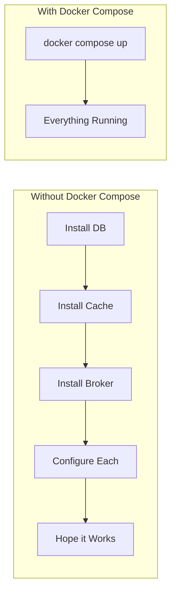
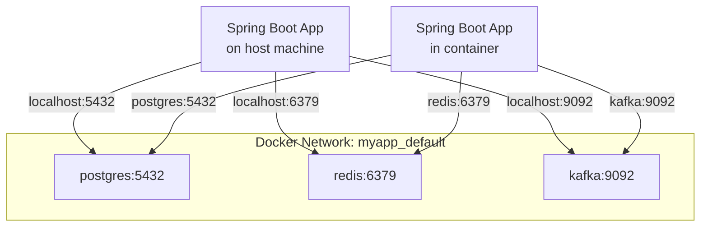
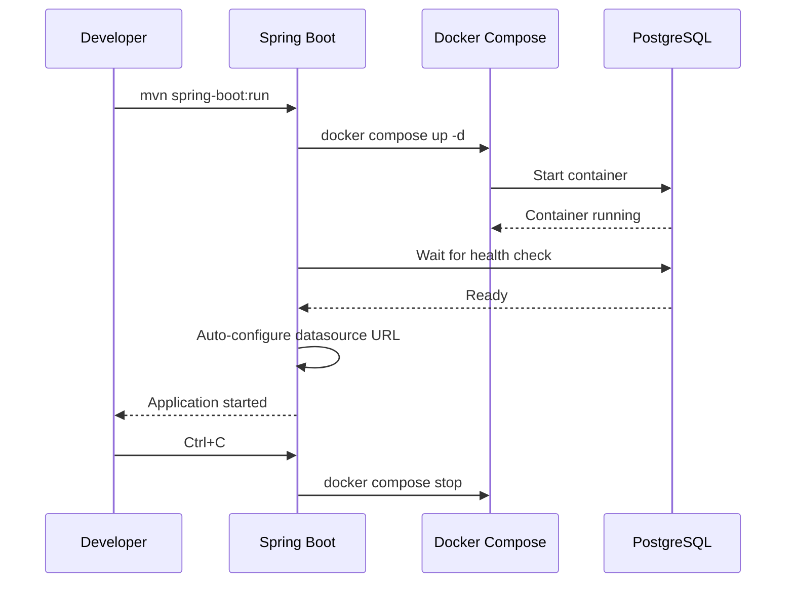

## Why Docker Compose

Every Spring Boot application depends on external services — databases, caches, message brokers, search engines. Without Docker Compose, onboarding a new developer looks like:

1. Install PostgreSQL (hope the version matches)
2. Install Redis (configure the port)
3. Install Kafka + ZooKeeper (good luck)
4. Create databases, run migrations
5. Set environment variables
6. Pray it all works together

With Docker Compose: `docker compose up -d`. Done.



---

## Anatomy of docker-compose.yml

```yaml
# docker-compose.yml
services:
  postgres:          # Service name (becomes hostname on the network)
    image: postgres:16-alpine
    container_name: myapp-postgres
    environment:
      POSTGRES_DB: myapp
      POSTGRES_USER: postgres
      POSTGRES_PASSWORD: postgres
    ports:
      - "5432:5432"  # host:container
    volumes:
      - postgres_data:/var/lib/postgresql/data
    healthcheck:
      test: ["CMD-SHELL", "pg_isready -U postgres"]
      interval: 5s
      timeout: 3s
      retries: 5

volumes:
  postgres_data:     # Named volume — persists across restarts
```

Key concepts:
- **services** — each service is a container
- **image** — the Docker image to use
- **ports** — map container ports to host ports
- **volumes** — persist data beyond container lifecycle
- **healthcheck** — verify the service is actually ready
- **environment** — configure the container

---

## Service Patterns for Spring Devs

### PostgreSQL

```yaml
services:
  postgres:
    image: postgres:16-alpine
    container_name: app-postgres
    environment:
      POSTGRES_DB: ${DB_NAME:-myapp}
      POSTGRES_USER: ${DB_USER:-postgres}
      POSTGRES_PASSWORD: ${DB_PASS:-postgres}
    ports:
      - "5432:5432"
    volumes:
      - postgres_data:/var/lib/postgresql/data
      - ./init-scripts:/docker-entrypoint-initdb.d  # Auto-run SQL on first start
    healthcheck:
      test: ["CMD-SHELL", "pg_isready -U postgres -d myapp"]
      interval: 5s
      timeout: 3s
      retries: 5
```

Spring Boot config:
```yaml
spring:
  datasource:
    url: jdbc:postgresql://localhost:5432/myapp
    username: postgres
    password: postgres
```

### Redis

```yaml
  redis:
    image: redis:7-alpine
    container_name: app-redis
    ports:
      - "6379:6379"
    volumes:
      - redis_data:/data
    command: redis-server --appendonly yes --maxmemory 128mb --maxmemory-policy allkeys-lru
    healthcheck:
      test: ["CMD", "redis-cli", "ping"]
      interval: 5s
      timeout: 3s
      retries: 5
```

Spring Boot config:
```yaml
spring:
  data:
    redis:
      host: localhost
      port: 6379
```

### Kafka (with KRaft — no ZooKeeper)

```yaml
  kafka:
    image: confluentinc/cp-kafka:7.7.0
    container_name: app-kafka
    ports:
      - "9092:9092"
    environment:
      KAFKA_NODE_ID: 1
      KAFKA_PROCESS_ROLES: broker,controller
      KAFKA_LISTENERS: PLAINTEXT://0.0.0.0:9092,CONTROLLER://0.0.0.0:9093
      KAFKA_ADVERTISED_LISTENERS: PLAINTEXT://localhost:9092
      KAFKA_CONTROLLER_LISTENER_NAMES: CONTROLLER
      KAFKA_CONTROLLER_QUORUM_VOTERS: 1@kafka:9093
      KAFKA_LISTENER_SECURITY_PROTOCOL_MAP: PLAINTEXT:PLAINTEXT,CONTROLLER:PLAINTEXT
      KAFKA_OFFSETS_TOPIC_REPLICATION_FACTOR: 1
      CLUSTER_ID: "MkU3OEVBNTcwNTJENDM2Qk"
    healthcheck:
      test: ["CMD", "kafka-broker-api-versions", "--bootstrap-server", "localhost:9092"]
      interval: 10s
      timeout: 5s
      retries: 10
      start_period: 30s
```

### MongoDB

```yaml
  mongodb:
    image: mongo:7
    container_name: app-mongodb
    ports:
      - "27017:27017"
    environment:
      MONGO_INITDB_ROOT_USERNAME: admin
      MONGO_INITDB_ROOT_PASSWORD: admin
      MONGO_INITDB_DATABASE: myapp
    volumes:
      - mongo_data:/data/db
    healthcheck:
      test: ["CMD", "mongosh", "--eval", "db.adminCommand('ping')"]
      interval: 5s
      timeout: 3s
      retries: 5
```

---

## Networking

Docker Compose creates a default network. Services communicate using their **service name** as a hostname.



**Key insight:** When your Spring Boot app runs on the **host** (normal development), use `localhost`. When it runs **in a container**, use the service name.

```yaml
# application.yml for local development (app on host)
spring:
  datasource:
    url: jdbc:postgresql://localhost:5432/myapp

# application-docker.yml (app in container)
spring:
  datasource:
    url: jdbc:postgresql://postgres:5432/myapp
```

---

## Volumes — Persisting Data vs Ephemeral

| Volume Type | Use Case | Survives `docker compose down`? |
|-------------|----------|--------------------------------|
| Named volume | Database data | Yes (unless `-v` flag) |
| Bind mount | Config files, init scripts | Always (it's your filesystem) |
| No volume | Temporary data, test environments | No |

```yaml
volumes:
  # Named volume — Docker manages location
  postgres_data:
  redis_data:

services:
  postgres:
    volumes:
      - postgres_data:/var/lib/postgresql/data          # Named volume
      - ./init-scripts:/docker-entrypoint-initdb.d:ro  # Bind mount (read-only)
```

**Tip:** Use `docker compose down -v` to destroy volumes when you want a fresh start.

---

## Environment Variables and .env Files

### .env File (git-ignored for secrets)

```bash
# .env
DB_NAME=myapp
DB_USER=postgres
DB_PASS=localdev123
REDIS_PASSWORD=localdev123
```

### Using in docker-compose.yml

```yaml
services:
  postgres:
    environment:
      POSTGRES_DB: ${DB_NAME}
      POSTGRES_USER: ${DB_USER}
      POSTGRES_PASSWORD: ${DB_PASS}
```

### .env.example (committed to git)

```bash
# .env.example — copy to .env and fill in values
DB_NAME=myapp
DB_USER=postgres
DB_PASS=changeme
REDIS_PASSWORD=changeme
```

---

## Health Checks — Why They Matter for depends_on

Without health checks, `depends_on` only waits for the container to **start**, not for the service inside to be **ready**.

```yaml
services:
  postgres:
    image: postgres:16-alpine
    healthcheck:
      test: ["CMD-SHELL", "pg_isready -U postgres"]
      interval: 5s
      timeout: 3s
      retries: 5

  app:
    build: .
    depends_on:
      postgres:
        condition: service_healthy   # Wait for health check to pass
      redis:
        condition: service_healthy
```

Without `condition: service_healthy`, your app container might start before PostgreSQL is accepting connections — causing connection refused errors on startup.

---

## Spring Boot 3.1+ Docker Compose Integration

Spring Boot 3.1 introduced automatic Docker Compose management. Add the dependency:

```xml
<dependency>
    <groupId>org.springframework.boot</groupId>
    <artifactId>spring-boot-docker-compose</artifactId>
    <scope>runtime</scope>
</dependency>
```

Now when you run `mvn spring-boot:run`, Spring Boot will:
1. Detect `docker-compose.yml` in your project
2. Run `docker compose up` automatically
3. Wait for services to be healthy
4. Configure connection properties automatically (port mapping)
5. Run `docker compose stop` when you stop your app

```yaml
# application.yml — minimal config needed
spring:
  docker:
    compose:
      enabled: true
      lifecycle-management: start-and-stop  # or start-only
      file: docker-compose.yml
```



**Limitations:**
- Only works with `spring-boot:run` (not when running the JAR directly)
- Disabled when `spring.profiles.active=prod` (safety)
- The compose file must be in the project root or configured explicitly

---

## Profiles — Dev vs Test

```yaml
services:
  postgres:
    image: postgres:16-alpine
    profiles: ["dev", "test"]    # Available in both
    # ...

  redis:
    image: redis:7-alpine
    profiles: ["dev", "test"]
    # ...

  kafka:
    image: confluentinc/cp-kafka:7.7.0
    profiles: ["dev"]            # Only in dev, not test
    # ...

  mailhog:
    image: mailhog/mailhog
    profiles: ["dev"]            # Only in dev
    ports:
      - "1025:1025"   # SMTP
      - "8025:8025"   # Web UI
    # ...
```

```bash
# Start dev services
docker compose --profile dev up -d

# Start test services (lighter — no Kafka, no MailHog)
docker compose --profile test up -d
```

---

## Common Patterns

| Pattern | What | Why | YAML Snippet |
|---------|------|-----|--------------|
| Init scripts | SQL files in `/docker-entrypoint-initdb.d` | Create schemas on first start | `volumes: [./init.sql:/docker-entrypoint-initdb.d/init.sql]` |
| Wait for healthy | `depends_on: { db: { condition: service_healthy } }` | App starts after DB is ready | See Health Checks section |
| Resource limits | `deploy: { resources: { limits: { memory: 512M } } }` | Prevent runaway containers | `deploy.resources.limits.memory: 512M` |
| Restart policy | `restart: unless-stopped` | Auto-recover from crashes | `restart: unless-stopped` |
| Read-only mounts | `volumes: [./config:/app/config:ro]` | Prevent container from modifying host files | `:ro` suffix |
| Tmpfs for speed | `tmpfs: /tmp` | Fast ephemeral storage (test DBs) | `tmpfs: ["/var/lib/postgresql/data"]` |
| Custom network | `networks: { backend: {} }` | Isolate service groups | Named networks |

---

## Common Problems

| Problem | Cause | Solution |
|---------|-------|----------|
| Port already in use | Host port conflict | Change host port: `"5433:5432"` |
| Data not persisting | No named volume | Add named volume in `volumes:` section |
| Container can't reach another | Different networks or typo in service name | Check `docker network ls`, use service name exactly |
| Init script not running | DB already initialized (volume exists) | `docker compose down -v` then `up` |
| Permission denied on volume | UID mismatch (Linux) | Set `user: "1000:1000"` or fix permissions |
| OOM killed | Container exceeds memory | Add memory limits or increase Docker memory |
| Slow startup | No health check, app retries | Add health checks + `depends_on` with condition |
| `host.docker.internal` not resolving | Older Docker on Linux | Add `extra_hosts: ["host.docker.internal:host-gateway"]` |
| Kafka not connecting | Advertised listener misconfigured | Set `KAFKA_ADVERTISED_LISTENERS` to `localhost` |

---

## References

- [Docker Compose Documentation](https://docs.docker.com/compose/)
- [Spring Boot Docker Compose Support](https://docs.spring.io/spring-boot/reference/features/docker-compose.html)
- [Docker Hub — Official Images](https://hub.docker.com/search?q=&type=image&image_filter=official)
- [Testcontainers — Integration Testing](https://testcontainers.com/)
- [Docker Compose Networking](https://docs.docker.com/compose/networking/)
