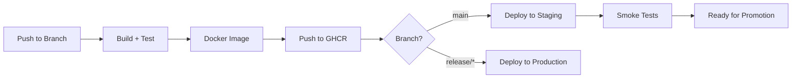
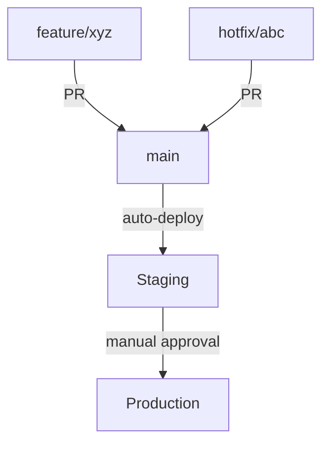

## The Problem — Manual Builds

Manual deployment processes create friction and risk:

- "It works on my machine" becomes a recurring problem
- No automated tests catch regressions before merge
- Docker builds are inconsistent across team members
- Deployments require tribal knowledge and manual steps
- No audit trail of who deployed what and when

A proper CI/CD pipeline automates the path from commit to production, catching issues early and deploying reliably every time.

---

## What We're Building



The complete pipeline:
1. **Build & Test** — Compile, run unit + integration tests
2. **Docker Build** — Create optimized container image
3. **Publish** — Push to GitHub Container Registry (GHCR)
4. **Deploy** — Apply to Kubernetes cluster
5. **Verify** — Run smoke tests against deployed service

---

## Basic Workflow — Build and Test

Start with the foundation: compile code and run tests on every push and pull request.

```yaml
# .github/workflows/ci.yml
name: CI — Build & Test

on:
  push:
    branches: [main, develop]
  pull_request:
    branches: [main]

permissions:
  contents: read
  checks: write

jobs:
  build:
    runs-on: ubuntu-latest

    steps:
      - name: Checkout code
        uses: actions/checkout@v4

      - name: Set up Java 21
        uses: actions/setup-java@v4
        with:
          java-version: '21'
          distribution: 'temurin'
          cache: 'maven'

      - name: Build and test
        run: ./mvnw verify --batch-mode --no-transfer-progress

      - name: Upload test results
        if: always()
        uses: actions/upload-artifact@v4
        with:
          name: test-results
          path: target/surefire-reports/

      - name: Upload coverage report
        uses: actions/upload-artifact@v4
        with:
          name: coverage-report
          path: target/site/jacoco/
```

Key points:
- `actions/setup-java@v4` with `cache: 'maven'` automatically caches `~/.m2/repository`
- `--batch-mode` disables interactive prompts
- `--no-transfer-progress` reduces log noise
- Test results upload even on failure (`if: always()`)

---

## Adding Docker Build

### Using a Multi-stage Dockerfile

```dockerfile
# Dockerfile
FROM eclipse-temurin:21-jdk-alpine AS builder
WORKDIR /app
COPY pom.xml mvnw ./
COPY .mvn .mvn
RUN ./mvnw dependency:go-offline --batch-mode
COPY src src
RUN ./mvnw package -DskipTests --batch-mode

FROM eclipse-temurin:21-jre-alpine
WORKDIR /app
RUN addgroup -S spring && adduser -S spring -G spring
USER spring
COPY --from=builder /app/target/*.jar app.jar
EXPOSE 8080
HEALTHCHECK --interval=30s --timeout=3s \
  CMD wget -qO- http://localhost:8080/actuator/health || exit 1
ENTRYPOINT ["java", "-jar", "app.jar"]
```

### Using Jib (No Dockerfile Needed)

```xml
<!-- pom.xml -->
<plugin>
    <groupId>com.google.cloud.tools</groupId>
    <artifactId>jib-maven-plugin</artifactId>
    <version>3.4.4</version>
    <configuration>
        <from>
            <image>eclipse-temurin:21-jre-alpine</image>
        </from>
        <to>
            <image>ghcr.io/${env.GITHUB_REPOSITORY}</image>
            <tags>
                <tag>${project.version}</tag>
                <tag>latest</tag>
            </tags>
        </to>
    </configuration>
</plugin>
```

---

## Publishing to GHCR

```yaml
# .github/workflows/publish.yml
name: Build & Publish Docker Image

on:
  push:
    branches: [main]
    tags: ['v*']

permissions:
  contents: read
  packages: write

env:
  REGISTRY: ghcr.io
  IMAGE_NAME: ${{ github.repository }}

jobs:
  build-and-push:
    runs-on: ubuntu-latest

    steps:
      - name: Checkout
        uses: actions/checkout@v4

      - name: Set up Java 21
        uses: actions/setup-java@v4
        with:
          java-version: '21'
          distribution: 'temurin'
          cache: 'maven'

      - name: Run tests
        run: ./mvnw verify --batch-mode

      - name: Log in to GHCR
        uses: docker/login-action@v3
        with:
          registry: ${{ env.REGISTRY }}
          username: ${{ github.actor }}
          password: ${{ secrets.GITHUB_TOKEN }}

      - name: Extract metadata
        id: meta
        uses: docker/metadata-action@v5
        with:
          images: ${{ env.REGISTRY }}/${{ env.IMAGE_NAME }}
          tags: |
            type=ref,event=branch
            type=semver,pattern={{version}}
            type=sha,prefix=

      - name: Build and push Docker image
        uses: docker/build-push-action@v5
        with:
          context: .
          push: true
          tags: ${{ steps.meta.outputs.tags }}
          labels: ${{ steps.meta.outputs.labels }}
          cache-from: type=gha
          cache-to: type=gha,mode=max
```

Tags generated:
- Push to `main` → `ghcr.io/user/repo:main`
- Tag `v1.2.3` → `ghcr.io/user/repo:1.2.3`
- Every push → `ghcr.io/user/repo:<sha>`

---

## Deploying to Kubernetes

### Kubernetes Manifests

```yaml
# k8s/deployment.yml
apiVersion: apps/v1
kind: Deployment
metadata:
  name: spring-app
  namespace: production
spec:
  replicas: 3
  selector:
    matchLabels:
      app: spring-app
  template:
    metadata:
      labels:
        app: spring-app
    spec:
      containers:
        - name: spring-app
          image: ghcr.io/anupamsinha/spring-app:IMAGE_TAG
          ports:
            - containerPort: 8080
          env:
            - name: SPRING_PROFILES_ACTIVE
              value: "production"
            - name: DB_PASSWORD
              valueFrom:
                secretKeyRef:
                  name: app-secrets
                  key: db-password
          livenessProbe:
            httpGet:
              path: /actuator/health/liveness
              port: 8080
            initialDelaySeconds: 30
          readinessProbe:
            httpGet:
              path: /actuator/health/readiness
              port: 8080
            initialDelaySeconds: 10
          resources:
            requests:
              memory: "512Mi"
              cpu: "250m"
            limits:
              memory: "1Gi"
              cpu: "1000m"
```

### Deploy Job in Workflow

```yaml
  deploy:
    needs: build-and-push
    runs-on: ubuntu-latest
    if: github.ref == 'refs/heads/main'
    environment: staging

    steps:
      - name: Checkout
        uses: actions/checkout@v4

      - name: Configure kubectl
        uses: azure/k8s-set-context@v4
        with:
          kubeconfig: ${{ secrets.KUBE_CONFIG }}

      - name: Update image tag
        run: |
          sed -i "s|IMAGE_TAG|${{ github.sha }}|g" k8s/deployment.yml

      - name: Deploy to cluster
        run: |
          kubectl apply -f k8s/deployment.yml
          kubectl rollout status deployment/spring-app -n production --timeout=300s

      - name: Smoke test
        run: |
          ENDPOINT=$(kubectl get svc spring-app -n production -o jsonpath='{.status.loadBalancer.ingress[0].hostname}')
          curl --fail --retry 5 --retry-delay 10 "http://${ENDPOINT}:8080/actuator/health"
```

---

## Environment Secrets

Configure secrets in GitHub repository settings (Settings → Secrets → Actions):

| Secret | Purpose | Example |
|--------|---------|---------|
| `KUBE_CONFIG` | Kubernetes cluster auth | Base64-encoded kubeconfig |
| `DB_PASSWORD` | Database credentials | Production DB password |
| `SONAR_TOKEN` | Code quality analysis | SonarCloud token |
| `SLACK_WEBHOOK_URL` | Deployment notifications | Slack incoming webhook |

Use environments for deployment approvals:

```yaml
jobs:
  deploy-production:
    environment:
      name: production
      url: https://app.example.com
    # Requires manual approval from designated reviewers
```

---

## Matrix Testing — Java 17 and 21

Test against multiple Java versions to ensure compatibility:

```yaml
jobs:
  test:
    runs-on: ubuntu-latest
    strategy:
      matrix:
        java-version: ['17', '21']
      fail-fast: false

    steps:
      - uses: actions/checkout@v4

      - name: Set up Java ${{ matrix.java-version }}
        uses: actions/setup-java@v4
        with:
          java-version: ${{ matrix.java-version }}
          distribution: 'temurin'
          cache: 'maven'

      - name: Test with Java ${{ matrix.java-version }}
        run: ./mvnw verify --batch-mode
```

`fail-fast: false` ensures all matrix combinations run even if one fails — useful for knowing the full scope of compatibility issues.

---

## Dependency Caching

Maven dependencies download once and are cached for subsequent runs:

```yaml
      - name: Set up Java 21
        uses: actions/setup-java@v4
        with:
          java-version: '21'
          distribution: 'temurin'
          cache: 'maven'  # Automatically caches ~/.m2/repository
```

For finer control or additional caches:

```yaml
      - name: Cache Maven dependencies
        uses: actions/cache@v4
        with:
          path: |
            ~/.m2/repository
            !~/.m2/repository/com/anupam
          key: maven-${{ hashFiles('**/pom.xml') }}
          restore-keys: |
            maven-

      - name: Cache Docker layers
        uses: actions/cache@v4
        with:
          path: /tmp/.buildx-cache
          key: docker-${{ github.sha }}
          restore-keys: |
            docker-
```

Impact on build times:

| Scenario | Without Cache | With Cache | Savings |
|----------|--------------|------------|---------|
| Fresh Maven dependencies | 2-4 min | 10-20 sec | ~90% |
| Docker layer rebuild | 3-5 min | 30-60 sec | ~80% |
| Full pipeline | 8-12 min | 3-5 min | ~60% |

---

## Branch Strategy



| Branch | Trigger | Action |
|--------|---------|--------|
| `feature/*` | Push, PR | Build + Test only |
| `main` | Merge | Build + Test + Deploy to Staging |
| `release/*` | Tag | Build + Test + Deploy to Production |
| `hotfix/*` | PR to main | Build + Test (fast-tracked review) |

Branch protection rules (Settings → Branches → Add rule):
- Require status checks to pass (CI must be green)
- Require pull request reviews (at least 1 approval)
- Require branches to be up to date before merging
- Restrict force pushes

---

## Reusable Workflows

Extract common steps into reusable workflows to avoid duplication:

```yaml
# .github/workflows/reusable-build.yml
name: Reusable Build

on:
  workflow_call:
    inputs:
      java-version:
        required: false
        type: string
        default: '21'
    outputs:
      image-tag:
        description: "Docker image tag"
        value: ${{ jobs.build.outputs.tag }}

jobs:
  build:
    runs-on: ubuntu-latest
    outputs:
      tag: ${{ steps.meta.outputs.version }}
    steps:
      - uses: actions/checkout@v4
      - uses: actions/setup-java@v4
        with:
          java-version: ${{ inputs.java-version }}
          distribution: 'temurin'
          cache: 'maven'
      - run: ./mvnw verify --batch-mode
```

Call from another workflow:

```yaml
# .github/workflows/deploy.yml
jobs:
  build:
    uses: ./.github/workflows/reusable-build.yml
    with:
      java-version: '21'

  deploy:
    needs: build
    runs-on: ubuntu-latest
    steps:
      - run: echo "Deploying image tag ${{ needs.build.outputs.image-tag }}"
```

---

## Complete Production Workflow

Putting it all together:

```yaml
# .github/workflows/pipeline.yml
name: Production Pipeline

on:
  push:
    branches: [main]
  pull_request:
    branches: [main]

permissions:
  contents: read
  packages: write
  checks: write

env:
  REGISTRY: ghcr.io
  IMAGE_NAME: ${{ github.repository }}

jobs:
  test:
    runs-on: ubuntu-latest
    steps:
      - uses: actions/checkout@v4
      - uses: actions/setup-java@v4
        with:
          java-version: '21'
          distribution: 'temurin'
          cache: 'maven'
      - name: Build and test
        run: ./mvnw verify --batch-mode --no-transfer-progress
      - name: Publish test results
        if: always()
        uses: dorny/test-reporter@v1
        with:
          name: JUnit Tests
          path: target/surefire-reports/*.xml
          reporter: java-junit

  publish:
    needs: test
    if: github.event_name == 'push' && github.ref == 'refs/heads/main'
    runs-on: ubuntu-latest
    outputs:
      image-tag: ${{ steps.meta.outputs.version }}
    steps:
      - uses: actions/checkout@v4
      - uses: docker/login-action@v3
        with:
          registry: ${{ env.REGISTRY }}
          username: ${{ github.actor }}
          password: ${{ secrets.GITHUB_TOKEN }}
      - id: meta
        uses: docker/metadata-action@v5
        with:
          images: ${{ env.REGISTRY }}/${{ env.IMAGE_NAME }}
          tags: |
            type=sha,prefix=
            type=raw,value=latest
      - uses: docker/build-push-action@v5
        with:
          context: .
          push: true
          tags: ${{ steps.meta.outputs.tags }}
          cache-from: type=gha
          cache-to: type=gha,mode=max

  deploy-staging:
    needs: publish
    runs-on: ubuntu-latest
    environment: staging
    steps:
      - uses: actions/checkout@v4
      - uses: azure/k8s-set-context@v4
        with:
          kubeconfig: ${{ secrets.KUBE_CONFIG_STAGING }}
      - run: |
          sed -i "s|IMAGE_TAG|${{ github.sha }}|g" k8s/deployment.yml
          kubectl apply -f k8s/deployment.yml
          kubectl rollout status deployment/spring-app --timeout=300s

  deploy-production:
    needs: deploy-staging
    runs-on: ubuntu-latest
    environment:
      name: production
      url: https://app.example.com
    steps:
      - uses: actions/checkout@v4
      - uses: azure/k8s-set-context@v4
        with:
          kubeconfig: ${{ secrets.KUBE_CONFIG_PRODUCTION }}
      - run: |
          sed -i "s|IMAGE_TAG|${{ github.sha }}|g" k8s/deployment.yml
          kubectl apply -f k8s/deployment.yml
          kubectl rollout status deployment/spring-app --timeout=300s
```

---

## Common Problems

| Problem | Cause | Solution |
|---------|-------|----------|
| Tests pass locally, fail in CI | Environment differences | Pin Java version; use testcontainers for DB |
| Slow builds (10+ min) | No caching; sequential steps | Enable Maven cache; parallelize test/lint jobs |
| Docker push fails | Missing GHCR permissions | Add `packages: write` to permissions |
| Deploy timeout | App takes too long to start | Increase `initialDelaySeconds`; optimize startup |
| Secrets not available in PRs | Fork PRs can't access secrets | Use `pull_request_target` cautiously; or skip deploy for PRs |
| Cache keeps missing | Key changes every run | Use `hashFiles('**/pom.xml')` as stable cache key |
| Flaky tests | Timing issues, shared state | Isolate tests; add retries for integration tests |

---

## References

- [GitHub Actions Documentation](https://docs.github.com/en/actions)
- [actions/setup-java](https://github.com/actions/setup-java)
- [docker/build-push-action](https://github.com/docker/build-push-action)
- [Spring Boot Docker — Official Guide](https://spring.io/guides/topicals/spring-boot-docker)
- [GitHub Container Registry](https://docs.github.com/en/packages/working-with-a-github-packages-registry/working-with-the-container-registry)
- [Kubernetes Deployment Strategies](https://kubernetes.io/docs/concepts/workloads/controllers/deployment/)
