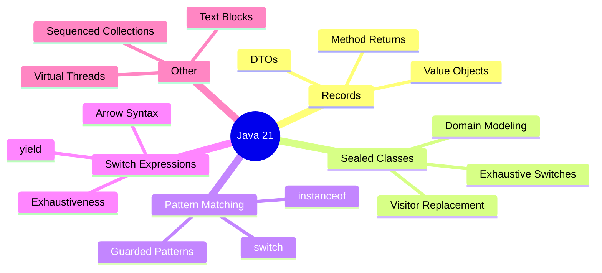
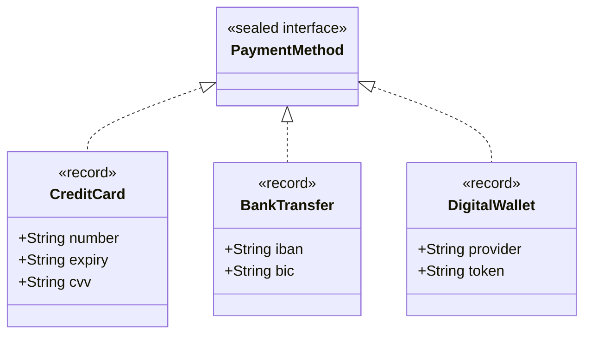
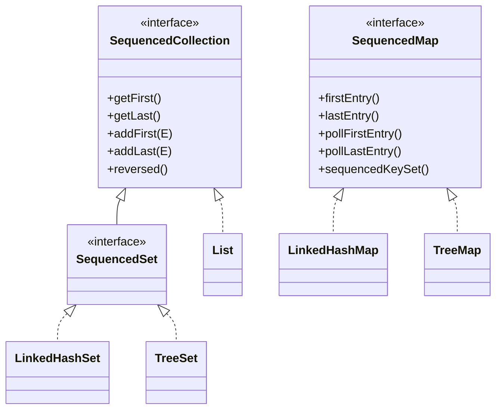

## Beyond the Changelog

Java 21 is an LTS release that delivers features previewed across Java 14–20. Unlike reading JEP summaries, this post focuses on **how to actually use these features** in production code — with patterns, anti-patterns, and migration tips.




---

## Records

Records are transparent carriers for immutable data. Think of them as `@Value` from Lombok — but built into the language.

### Basic Usage

```java
public record BookDto(
    Long id,
    String title,
    String author,
    LocalDate publishedDate
) {}
```

This gives you: constructor, getters (`id()`, `title()`...), `equals()`, `hashCode()`, `toString()` — all derived from the components.

### When to Use Records

| Use Case | Record? | Why |
|----------|---------|-----|
| REST API DTOs | Yes | Immutable, concise, serializable |
| Value objects | Yes | Equality by value, not reference |
| Method return types (tuples) | Yes | Named fields > `Pair<A,B>` |
| Configuration carriers | Yes | Read-only after construction |
| JPA entities | No | JPA needs mutable state, no-arg constructor |
| Inheritance hierarchies | No | Records are implicitly final |
| Mutable builders | No | Records are immutable |

### When NOT to Use Records

```java
// DON'T: Records with many optional fields
// This forces callers to pass nulls
public record SearchCriteria(
    String title, String author, Integer year,
    String publisher, String isbn, Boolean available
) {} // 6 params — use a builder instead

// DO: Use a builder pattern for complex construction
public record SearchCriteria(String title, String author, Integer year,
                             String publisher, String isbn, Boolean available) {

    public static Builder builder() { return new Builder(); }

    public static class Builder {
        private String title, author, publisher, isbn;
        private Integer year;
        private Boolean available;

        public Builder title(String title) { this.title = title; return this; }
        public Builder author(String author) { this.author = author; return this; }
        // ... other setters
        public SearchCriteria build() {
            return new SearchCriteria(title, author, year, publisher, isbn, available);
        }
    }
}
```

### Records with JPA (the workaround)

Records can't be JPA entities directly, but they work great as projections:

```java
// Entity (mutable, JPA-managed)
@Entity
public class Book { /* ... mutable fields, setters ... */ }

// Record for read operations (immutable, clean)
public record BookSummary(Long id, String title, String author) {}

// Spring Data projection
public interface BookRepository extends JpaRepository<Book, Long> {
    @Query("SELECT new com.example.BookSummary(b.id, b.title, b.author) FROM Book b")
    List<BookSummary> findAllSummaries();
}
```

### Records with Spring Boot

```java
// Configuration properties — works since Spring Boot 3.0
@ConfigurationProperties(prefix = "app.mail")
public record MailProperties(
    String host,
    int port,
    String username,
    @DefaultValue("true") boolean ssl
) {}

// Record as request body — works perfectly with Jackson
@PostMapping("/books")
public ResponseEntity<BookDto> create(@Valid @RequestBody CreateBookRequest request) {
    // ...
}

public record CreateBookRequest(
    @NotBlank String title,
    @NotBlank String author,
    @NotNull LocalDate publishedDate
) {}
```

### Compact Constructors (validation)

```java
public record Email(String value) {
    public Email {
        if (value == null || !value.contains("@")) {
            throw new IllegalArgumentException("Invalid email: " + value);
        }
        value = value.toLowerCase().trim(); // reassignment allowed in compact constructor
    }
}
```

---

## Sealed Classes

Sealed classes restrict which classes can extend them. This gives you **exhaustive type hierarchies** — the compiler knows all possible subtypes.

### Domain Modeling

```java
public sealed interface PaymentMethod
    permits CreditCard, BankTransfer, DigitalWallet {
}

public record CreditCard(String number, String expiry, String cvv)
    implements PaymentMethod {}

public record BankTransfer(String iban, String bic)
    implements PaymentMethod {}

public record DigitalWallet(String provider, String token)
    implements PaymentMethod {}
```




### Exhaustive Switches

Because the compiler knows all subtypes, switches can be exhaustive — no `default` needed:

```java
public BigDecimal calculateFee(PaymentMethod method) {
    return switch (method) {
        case CreditCard cc    -> cc.number().startsWith("4")
                                 ? new BigDecimal("0.029")
                                 : new BigDecimal("0.035");
        case BankTransfer bt  -> new BigDecimal("0.005");
        case DigitalWallet dw -> new BigDecimal("0.015");
        // No default needed — compiler enforces exhaustiveness
    };
}
```

If you add a new `PaymentMethod` subtype later, the compiler will **force** you to handle it everywhere. This is the killer feature.

### Visitor Pattern Replacement

Before (Java 8–16, verbose visitor):

```java
interface PaymentVisitor<T> {
    T visit(CreditCard cc);
    T visit(BankTransfer bt);
    T visit(DigitalWallet dw);
}
// Plus accept() method on every implementation
```

After (Java 21, pattern matching):

```java
// No visitor interface, no accept methods — just switch
String describe(PaymentMethod method) {
    return switch (method) {
        case CreditCard cc    -> "Card ending in " + cc.number().substring(12);
        case BankTransfer bt  -> "Bank transfer to " + bt.iban();
        case DigitalWallet dw -> dw.provider() + " wallet";
    };
}
```

---

## Pattern Matching for instanceof + switch

### Pattern Matching for instanceof

**Before:**

```java
if (obj instanceof String) {
    String s = (String) obj;
    System.out.println(s.length());
}
```

**After:**

```java
if (obj instanceof String s) {
    System.out.println(s.length());
}
```

### Pattern Matching in switch

```java
Object obj = getResponse();

String formatted = switch (obj) {
    case Integer i    -> "Integer: %d".formatted(i);
    case Long l       -> "Long: %d".formatted(l);
    case Double d     -> "Double: %.2f".formatted(d);
    case String s     -> "String: %s".formatted(s);
    case null         -> "null";
    default           -> "Unknown: " + obj.getClass().getSimpleName();
};
```

### Guarded Patterns

```java
String classify(Shape shape) {
    return switch (shape) {
        case Circle c when c.radius() > 100    -> "large circle";
        case Circle c when c.radius() > 10     -> "medium circle";
        case Circle c                           -> "small circle";
        case Rectangle r when r.isSquare()     -> "square";
        case Rectangle r                       -> "rectangle";
        case Triangle t when t.isEquilateral() -> "equilateral triangle";
        case Triangle t                        -> "triangle";
    };
}
```

### Null Handling

```java
// Before Java 21: NullPointerException if obj is null
// After: null can be an explicit case
String handle(Object obj) {
    return switch (obj) {
        case null         -> "was null";
        case String s     -> "string: " + s;
        case Integer i    -> "int: " + i;
        default           -> "other";
    };
}
```

---

## Switch Expressions

### Arrow Syntax

```java
// Old style
String dayType;
switch (day) {
    case MONDAY: case TUESDAY: case WEDNESDAY:
    case THURSDAY: case FRIDAY:
        dayType = "Weekday";
        break;
    case SATURDAY: case SUNDAY:
        dayType = "Weekend";
        break;
    default:
        dayType = "Unknown";
}

// New style — expression, not statement
String dayType = switch (day) {
    case MONDAY, TUESDAY, WEDNESDAY, THURSDAY, FRIDAY -> "Weekday";
    case SATURDAY, SUNDAY -> "Weekend";
};
```

### yield for Multi-Line Cases

```java
int discount = switch (customerTier) {
    case BRONZE -> 5;
    case SILVER -> 10;
    case GOLD -> {
        log.info("Gold customer discount applied");
        yield 20;
    }
    case PLATINUM -> {
        log.info("Platinum customer discount applied");
        notifyLoyaltyTeam();
        yield 30;
    }
};
```

### Exhaustiveness

```java
// Enum switches must be exhaustive (no default needed)
enum Status { PENDING, ACTIVE, SUSPENDED, DELETED }

String message(Status status) {
    return switch (status) {
        case PENDING   -> "Awaiting activation";
        case ACTIVE    -> "Account active";
        case SUSPENDED -> "Temporarily suspended";
        case DELETED   -> "Account removed";
        // Add a new enum value? Compiler error here!
    };
}
```

---

## Text Blocks

### SQL Templates

```java
String query = """
    SELECT u.id, u.name, u.email
    FROM users u
    JOIN orders o ON o.user_id = u.id
    WHERE o.created_at > :since
      AND o.status = 'COMPLETED'
    ORDER BY o.created_at DESC
    LIMIT :limit
    """;
```

### JSON Templates

```java
String json = """
    {
        "name": "%s",
        "email": "%s",
        "roles": ["%s"]
    }
    """.formatted(name, email, String.join("\", \"", roles));
```

---

## Sequenced Collections

Java 21 introduces `SequencedCollection`, `SequencedSet`, and `SequencedMap` — interfaces that formalize access to first/last elements.

```java
SequencedCollection<String> list = new ArrayList<>(List.of("a", "b", "c"));

list.getFirst();           // "a"
list.getLast();            // "c"
list.addFirst("z");       // ["z", "a", "b", "c"]
list.reversed();          // reversed view: ["c", "b", "a", "z"]

SequencedMap<String, Integer> map = new LinkedHashMap<>();
map.put("one", 1);
map.put("two", 2);
map.firstEntry();         // one=1
map.lastEntry();          // two=2
map.pollLastEntry();      // removes and returns two=2
```




---

## Combining Features — Sealed + Pattern Matching + Records

Here's where Java 21 really shines — combining features for expressive domain logic:

```java
// Domain model
public sealed interface Result<T>
    permits Success, Failure, Loading {
}

public record Success<T>(T data) implements Result<T> {}
public record Failure<T>(String error, int code) implements Result<T> {}
public record Loading<T>() implements Result<T> {}

// Usage — clean, exhaustive, type-safe
public String render(Result<User> result) {
    return switch (result) {
        case Success<User>(var user) -> "Welcome, " + user.name();
        case Failure<User>(var msg, var code) when code == 404 -> "User not found";
        case Failure<User>(var msg, var code) when code >= 500 -> "Server error: " + msg;
        case Failure<User>(var msg, var code) -> "Error " + code + ": " + msg;
        case Loading<User>() -> "Loading...";
    };
}
```

This replaces:
- Exception-based flow control
- Null-returning methods
- Wrapper classes with `isSuccess()` checks
- The visitor pattern

---

## Migration Checklist

| Step | Action | Risk |
|------|--------|------|
| 1 | Update to Java 21 SDK and build tools | Low |
| 2 | Replace Lombok `@Value` with records (DTOs first) | Low |
| 3 | Convert type-check if-else chains to pattern matching switch | Low |
| 4 | Identify closed hierarchies → seal them | Medium |
| 5 | Replace visitor patterns with sealed + switch | Medium |
| 6 | Adopt `SequencedCollection` for first/last access | Low |
| 7 | Replace multi-line strings with text blocks | Low |
| 8 | Explore virtual threads for I/O-bound workloads | Medium |
| 9 | Update static analysis rules (SonarQube, Error Prone) | Low |

---

## References

- [JEP 395: Records](https://openjdk.org/jeps/395)
- [JEP 409: Sealed Classes](https://openjdk.org/jeps/409)
- [JEP 441: Pattern Matching for switch](https://openjdk.org/jeps/441)
- [JEP 440: Record Patterns](https://openjdk.org/jeps/440)
- [JEP 431: Sequenced Collections](https://openjdk.org/jeps/431)
- [JEP 444: Virtual Threads](https://openjdk.org/jeps/444)
- [Inside Java — Pattern Matching](https://inside.java/tag/pattern-matching)
