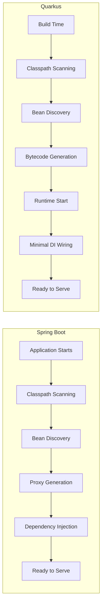
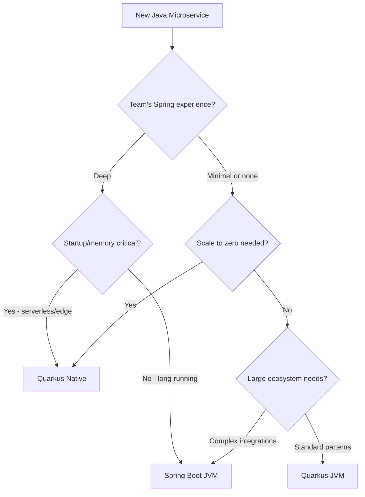
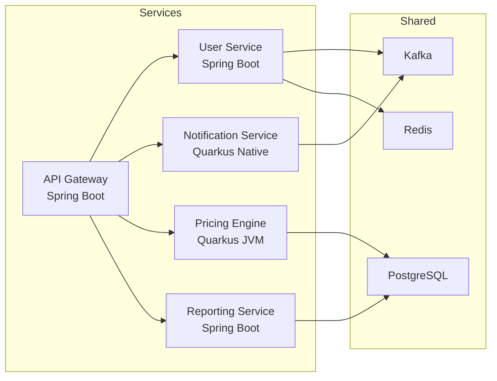

## The Question — Which Framework?

If you're starting a new Java microservice in 2026, you've got a genuine choice to make. Spring Boot has been the default for a decade. Quarkus arrived as the "Kubernetes-native" alternative and has matured rapidly. Both target Java 21, both support GraalVM native images, and both have strong communities.

This isn't a "which is better" post — it's a "when to choose which" post, backed by code you can compare side by side.

---

## Architecture Differences

The fundamental philosophical difference: **when work happens**.



Spring Boot does most of its heavy lifting at **runtime** — scanning, proxy generation, condition evaluation. Quarkus moves as much as possible to **build time** using its extension framework. The result: dramatically faster startup and lower memory at the cost of longer builds.

| Aspect | Spring Boot | Quarkus |
|--------|-------------|---------|
| DI resolution | Runtime | Build time |
| Configuration | Runtime conditions | Build-time augmentation |
| Proxy generation | Runtime (CGLIB/JDK) | Build time (bytecode) |
| Reflection | Heavy use | Minimized (records metadata at build) |
| Hot reload | Spring DevTools (restart) | Quarkus Dev Mode (instant) |

---

## Side-by-Side Code

Let's build the same simple REST API in both frameworks: a `BookController` with CRUD operations.

### REST Endpoint

**Spring Boot:**

```java
@RestController
@RequestMapping("/api/books")
public class BookController {

    private final BookService bookService;

    public BookController(BookService bookService) {
        this.bookService = bookService;
    }

    @GetMapping
    public List<Book> findAll() {
        return bookService.findAll();
    }

    @GetMapping("/{id}")
    public ResponseEntity<Book> findById(@PathVariable Long id) {
        return bookService.findById(id)
                .map(ResponseEntity::ok)
                .orElse(ResponseEntity.notFound().build());
    }

    @PostMapping
    @ResponseStatus(HttpStatus.CREATED)
    public Book create(@Valid @RequestBody Book book) {
        return bookService.save(book);
    }
}
```

**Quarkus:**

```java
@Path("/api/books")
@Produces(MediaType.APPLICATION_JSON)
@Consumes(MediaType.APPLICATION_JSON)
public class BookResource {

    private final BookService bookService;

    @Inject
    public BookResource(BookService bookService) {
        this.bookService = bookService;
    }

    @GET
    public List<Book> findAll() {
        return bookService.findAll();
    }

    @GET
    @Path("/{id}")
    public Response findById(@PathParam("id") Long id) {
        return bookService.findById(id)
                .map(book -> Response.ok(book).build())
                .orElse(Response.status(Status.NOT_FOUND).build());
    }

    @POST
    public Response create(@Valid Book book) {
        Book created = bookService.save(book);
        return Response.status(Status.CREATED).entity(created).build();
    }
}
```

### Dependency Injection

**Spring Boot:**

```java
@Service
public class BookService {

    private final BookRepository bookRepository;

    public BookService(BookRepository bookRepository) {
        this.bookRepository = bookRepository;
    }

    // constructor injection — no annotation needed (single constructor)
}
```

**Quarkus:**

```java
@ApplicationScoped
public class BookService {

    private final BookRepository bookRepository;

    @Inject
    public BookService(BookRepository bookRepository) {
        this.bookRepository = bookRepository;
    }

    // CDI-based — @Inject required on constructor
}
```

### Configuration

**Spring Boot** (`application.yml`):

```yaml
spring:
  datasource:
    url: jdbc:postgresql://localhost:5432/books
    username: ${DB_USER:postgres}
    password: ${DB_PASS:secret}
  jpa:
    hibernate:
      ddl-auto: validate
```

**Quarkus** (`application.properties`):

```properties
quarkus.datasource.db-kind=postgresql
quarkus.datasource.jdbc.url=jdbc:postgresql://localhost:5432/books
quarkus.datasource.username=${DB_USER:postgres}
quarkus.datasource.password=${DB_PASS:secret}
quarkus.hibernate-orm.database.generation=validate
```

### Data Access

**Spring Boot** (Spring Data JPA):

```java
public interface BookRepository extends JpaRepository<Book, Long> {
    List<Book> findByAuthor(String author);
}
```

**Quarkus** (Panache):

```java
@ApplicationScoped
public class BookRepository implements PanacheRepository<Book> {
    public List<Book> findByAuthor(String author) {
        return find("author", author).list();
    }
}
```

---

## Performance Benchmarks

Tested on: **Apple M3 Pro, 18GB RAM, Java 21.0.3, Spring Boot 3.5.0, Quarkus 3.16.0**

| Metric | Spring Boot (JVM) | Spring Boot (Native) | Quarkus (JVM) | Quarkus (Native) |
|--------|-------------------|---------------------|---------------|-----------------|
| Startup time | 2.1s | 0.08s | 0.9s | 0.02s |
| RSS memory (idle) | 280 MB | 72 MB | 145 MB | 32 MB |
| RSS memory (load) | 420 MB | 148 MB | 230 MB | 78 MB |
| Throughput (req/s) | 48,200 | 42,800 | 47,500 | 41,200 |
| Build time | 8s | 3m 20s | 12s | 2m 45s |
| JAR size | 42 MB | N/A | 38 MB | N/A |
| Native binary size | N/A | 98 MB | N/A | 72 MB |

Key takeaways:
- **JVM throughput is comparable** — the performance difference is mostly startup + memory.
- **Native images trade throughput for startup/memory** — JIT optimizes better over time.
- **Quarkus native compiles faster** — less reflection to configure.

---

## Developer Experience

| Feature | Spring Boot | Quarkus |
|---------|-------------|---------|
| Hot reload | DevTools (restarts JVM, ~2s) | Dev Mode (instant, no restart) |
| IDE support | Excellent (IntelliJ, Eclipse) | Good (IntelliJ plugin improving) |
| Documentation | Extensive, mature | Good, well-organized |
| Stack Overflow answers | Very high | Growing |
| Testing | `@SpringBootTest`, Testcontainers | `@QuarkusTest`, Dev Services |
| Dev Services (auto-DB) | Spring Boot 3.1+ Docker Compose | Built-in since Quarkus 2.0 |
| CLI tool | Spring Initializr (web) | `quarkus` CLI (powerful) |
| Continuous testing | Separate (IDE/CI) | Built into Dev Mode |
| OpenAPI generation | SpringDoc (add-on) | Built-in extension |

The **developer experience gap has narrowed significantly**. Quarkus Dev Mode still leads for inner-loop speed. Spring Boot's ecosystem maturity still wins for "I need a library for X."

---

## Ecosystem & Libraries

| Need | Spring Boot | Quarkus |
|------|-------------|---------|
| REST clients | RestClient, WebClient, Feign | REST Client (MicroProfile), Vert.x |
| Messaging | Spring Kafka, Spring AMQP | SmallRye Reactive Messaging |
| Security | Spring Security | Quarkus Security, Keycloak |
| GraphQL | Spring for GraphQL | SmallRye GraphQL |
| gRPC | grpc-spring-boot-starter | quarkus-grpc |
| Scheduling | `@Scheduled` | `@Scheduled` (quarkus-scheduler) |
| Caching | Spring Cache + any provider | quarkus-cache (Caffeine) |
| Health checks | Actuator | SmallRye Health |
| Metrics | Micrometer | Micrometer (via Quarkus extension) |
| Observability | Micrometer Tracing | OpenTelemetry (first-class) |

Spring Boot wins on **breadth** — if a Java library exists, there's probably a Spring integration. Quarkus wins on **coherent defaults** — extensions are designed to work together with minimal configuration.

---

## Native Compilation

### Spring Boot with Spring AOT

```bash
# Build native image
./mvnw -Pnative native:compile

# Or with Buildpacks (no local GraalVM needed)
./mvnw spring-boot:build-image -Dspring-boot.build-image.imageName=myapp:native
```

Spring AOT processes `@Conditional` annotations at build time and generates reflection configuration. You may still need `reflect-config.json` for libraries that use reflection heavily.

### Quarkus Native

```bash
# Build native image
./mvnw package -Dnative

# With container build (no local GraalVM needed)
./mvnw package -Dnative -Dquarkus.native.container-build=true
```

Quarkus was **designed for native from day one**. Extensions register reflection automatically. You rarely need manual configuration.

### Comparison

| Aspect | Spring Native | Quarkus Native |
|--------|--------------|----------------|
| Configuration effort | Medium (improving) | Low |
| Library compatibility | ~90% of Spring ecosystem | Extensions are native-ready |
| Build time | Longer (more reflection to process) | Shorter |
| Runtime performance | Good | Good |
| Debugging native issues | Harder | Easier (better error messages) |

---

## When to Choose Which



### Decision Matrix

| Scenario | Recommendation | Why |
|----------|---------------|-----|
| Enterprise with Spring teams | Spring Boot | Leverage existing expertise |
| Serverless / AWS Lambda | Quarkus Native | Fastest cold start |
| Kubernetes scale-to-zero | Quarkus Native | Memory + startup |
| Long-running monolith | Spring Boot | Ecosystem, JIT optimization |
| New team, greenfield | Either (evaluate both) | Both are excellent |
| Event-driven reactive | Quarkus | Vert.x integration, SmallRye |
| Complex security requirements | Spring Boot | Spring Security maturity |
| CLI / short-lived processes | Quarkus Native | Sub-second startup |

---

## Can They Coexist?

Yes. In a microservices architecture, there's no rule that says every service must use the same framework. A practical pattern:



**Guidelines for coexistence:**
- Use language-agnostic communication (REST, gRPC, Kafka) — not framework-specific.
- Shared libraries should be plain Java (no Spring/CDI annotations).
- Standardize on OpenTelemetry for observability across both.
- Use the same build pipeline (Maven/Gradle) — both frameworks support both.

---

## References

- [Quarkus — Guides](https://quarkus.io/guides/)
- [Spring Boot — Reference Documentation](https://docs.spring.io/spring-boot/docs/current/reference/html/)
- [GraalVM Native Image](https://www.graalvm.org/latest/reference-manual/native-image/)
- [Quarkus vs Spring Boot — Red Hat Developer](https://developers.redhat.com/articles/quarkus-vs-spring)
- [Spring AOT Documentation](https://docs.spring.io/spring-framework/reference/core/aot.html)
- [MicroProfile Specification](https://microprofile.io/)
