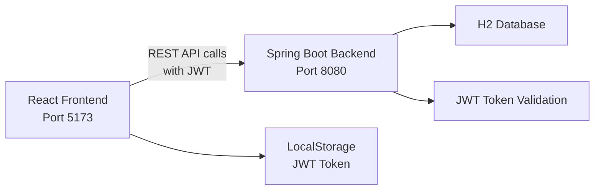
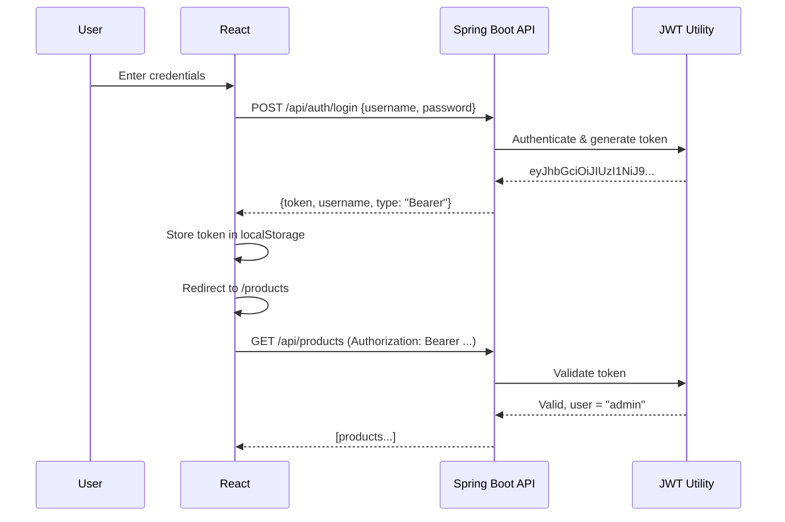

## The Problem — Backend Devs Need to Ship UIs

You've built a REST API with Spring Boot. Now someone needs a UI for it. The options:

1. Hire a frontend developer (budget says no)
2. Build it yourself with React (but you're a Java developer)
3. Ship a full-stack app from one project

Option 3 is what we're doing today. A Spring Boot backend with JWT authentication and a React frontend that talks to it. Both run from the same repository, deploy together, and work seamlessly.

---

## Architecture




The React app calls the Spring Boot API over HTTP. Authentication happens via JWT tokens stored in `localStorage`. In production, you'd serve the React build as static files from Spring Boot itself.

---

## Backend Setup

### Dependencies

```xml
<dependency>
    <groupId>org.springframework.boot</groupId>
    <artifactId>spring-boot-starter-web</artifactId>
</dependency>
<dependency>
    <groupId>org.springframework.boot</groupId>
    <artifactId>spring-boot-starter-security</artifactId>
</dependency>
<dependency>
    <groupId>io.jsonwebtoken</groupId>
    <artifactId>jjwt-api</artifactId>
    <version>0.12.6</version>
</dependency>
```

### JWT Utility

The `JwtUtil` class handles token generation and validation:

```java
@Component
public class JwtUtil {

    private final SecretKey key;
    private final long expirationHours;

    public JwtUtil(@Value("${app.jwt.secret}") String secret,
                   @Value("${app.jwt.expiration-hours:24}") long expirationHours) {
        this.key = Keys.hmacShaKeyFor(secret.getBytes(StandardCharsets.UTF_8));
        this.expirationHours = expirationHours;
    }

    public String generateToken(String username) {
        Instant now = Instant.now();
        return Jwts.builder()
                .subject(username)
                .issuedAt(Date.from(now))
                .expiration(Date.from(now.plus(expirationHours, ChronoUnit.HOURS)))
                .signWith(key)
                .compact();
    }

    public boolean isTokenValid(String token) {
        try {
            Claims claims = extractClaims(token);
            return claims.getExpiration().after(Date.from(Instant.now()));
        } catch (Exception e) {
            return false;
        }
    }
}
```

### Security Configuration — Stateless

The key: no sessions. Every request must carry its JWT:

```java
@Bean
public SecurityFilterChain securityFilterChain(HttpSecurity http) throws Exception {
    return http
            .cors(cors -> cors.configurationSource(corsConfigurationSource()))
            .csrf(csrf -> csrf.disable())
            .sessionManagement(session ->
                session.sessionCreationPolicy(SessionCreationPolicy.STATELESS))
            .authorizeHttpRequests(auth -> auth
                    .requestMatchers("/api/auth/**").permitAll()
                    .anyRequest().authenticated()
            )
            .addFilterBefore(jwtAuthenticationFilter(),
                UsernamePasswordAuthenticationFilter.class)
            .build();
}
```

The JWT filter extracts the token from the `Authorization` header and sets the Spring Security context:

```java
String authHeader = request.getHeader("Authorization");
if (authHeader != null && authHeader.startsWith("Bearer ")) {
    String token = authHeader.substring(7);
    if (jwtUtil.isTokenValid(token)) {
        String username = jwtUtil.extractUsername(token);
        UsernamePasswordAuthenticationToken auth =
            new UsernamePasswordAuthenticationToken(username, null, Collections.emptyList());
        SecurityContextHolder.getContext().setAuthentication(auth);
    }
}
```

---

## Frontend Setup

We use React 18 with Vite (faster than Create React App):

```json
{
  "dependencies": {
    "axios": "^1.7.2",
    "react": "^18.3.1",
    "react-dom": "^18.3.1",
    "react-router-dom": "^6.23.1"
  }
}
```

### Axios Instance with Interceptors

The core pattern: a configured Axios instance that automatically attaches the JWT to every request:

```javascript
import axios from 'axios';

const api = axios.create({
  baseURL: 'http://localhost:8080',
  headers: { 'Content-Type': 'application/json' },
});

// Attach token to every request
api.interceptors.request.use((config) => {
  const token = localStorage.getItem('token');
  if (token) {
    config.headers.Authorization = `Bearer ${token}`;
  }
  return config;
});

// Redirect to login on 401
api.interceptors.response.use(
  (response) => response,
  (error) => {
    if (error.response?.status === 401) {
      localStorage.removeItem('token');
      window.location.href = '/login';
    }
    return Promise.reject(error);
  }
);

export default api;
```

---

## Login Flow




The login component:

```jsx
const handleSubmit = async (e) => {
  e.preventDefault();
  try {
    const response = await api.post('/api/auth/login', { username, password });
    localStorage.setItem('token', response.data.token);
    localStorage.setItem('username', response.data.username);
    navigate('/products');
  } catch (err) {
    setError(err.response?.data?.error || 'Login failed');
  }
};
```

---

## Protected Routes

React Router handles client-side route protection:

```jsx
function PrivateRoute({ children }) {
  const token = localStorage.getItem('token');
  return token ? children : <Navigate to="/login" />;
}

function App() {
  return (
    <BrowserRouter>
      <Routes>
        <Route path="/login" element={<Login />} />
        <Route
          path="/products"
          element={
            <PrivateRoute>
              <ProductList />
            </PrivateRoute>
          }
        />
      </Routes>
    </BrowserRouter>
  );
}
```

This is client-side only. The real security is on the backend — a missing or invalid JWT returns 401.

---

## CORS Configuration

The most common pain point. React runs on port 5173, Spring Boot on 8080. Without CORS configuration, the browser blocks cross-origin requests.

```java
@Bean
public CorsConfigurationSource corsConfigurationSource() {
    CorsConfiguration config = new CorsConfiguration();
    config.setAllowedOrigins(List.of(
        "http://localhost:3000",
        "http://localhost:5173"
    ));
    config.setAllowedMethods(List.of("GET", "POST", "PUT", "DELETE", "OPTIONS"));
    config.setAllowedHeaders(List.of("*"));
    config.setAllowCredentials(true);
    config.setMaxAge(3600L);

    UrlBasedCorsConfigurationSource source = new UrlBasedCorsConfigurationSource();
    source.registerCorsConfiguration("/**", config);
    return source;
}
```

Key points:
- `allowedOrigins` must include your React dev server URL
- `allowedHeaders: *` permits the `Authorization` header
- `allowCredentials: true` allows cookies (if you use them later)
- `maxAge` caches the preflight OPTIONS response for 1 hour

---

## Development Workflow

### During Development (Two Servers)

```bash
# Terminal 1 — Backend
cd backend && mvn spring-boot:run   # Port 8080

# Terminal 2 — Frontend
cd frontend && npm run dev          # Port 5173 with proxy to 8080
```

Vite proxies `/api` calls to `http://localhost:8080`, so during development you avoid CORS issues entirely:

```javascript
// vite.config.js
server: {
  proxy: {
    '/api': { target: 'http://localhost:8080', changeOrigin: true }
  }
}
```

### In Production (One Server)

Build React, copy to Spring Boot's `static` directory:

```bash
cd frontend && npm run build
cp -r dist/* ../backend/src/main/resources/static/
```

Spring Boot serves the React SPA and the API from the same origin — no CORS needed.

---

## Common Problems

| Problem | Cause | Solution |
|---------|-------|----------|
| CORS "No Access-Control-Allow-Origin" | Missing CORS config | Add `CorsConfigurationSource` bean |
| 403 on POST/PUT/DELETE | CSRF enabled (default) | Disable CSRF for stateless API: `.csrf(csrf -> csrf.disable())` |
| 401 on login endpoint | Login path not permitted | Add `.requestMatchers("/api/auth/**").permitAll()` |
| Token not sent after login | Axios instance not used | Import the configured `api` instance, not raw `axios` |
| React routes return 404 on refresh | Server doesn't know about client routes | Serve `index.html` for unknown paths (SPA fallback) |
| JWT expired | Token TTL too short | Increase `expiration-hours` or implement refresh tokens |
| H2 console 403 | Frame options blocked | Add `.headers(h -> h.frameOptions(f -> f.disable()))` |

---

## Full Working Example

The complete project with both backend and frontend:

[https://github.com/AnupamSinha/spring-boot-examples/tree/main/30-react-fullstack](https://github.com/AnupamSinha/spring-boot-examples/tree/main/30-react-fullstack)

```bash
# Run backend
cd 30-react-fullstack/backend
mvn spring-boot:run

# Run frontend (separate terminal)
cd 30-react-fullstack/frontend
npm install
npm run dev
```

Login with `admin` / `admin123` and you'll see the products page with data from the Spring Boot API.

---

## References

- [Spring Security Documentation](https://docs.spring.io/spring-security/reference/)
- [JJWT Library](https://github.com/jwtk/jjwt)
- [React Router v6](https://reactrouter.com/en/main)
- [Axios Interceptors](https://axios-http.com/docs/interceptors)
- [Vite Proxy Configuration](https://vitejs.dev/config/server-options.html#server-proxy)
- [Source Code — 30-react-fullstack](https://github.com/AnupamSinha/spring-boot-examples/tree/main/30-react-fullstack)
