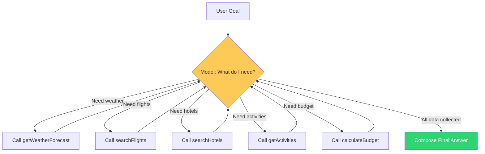
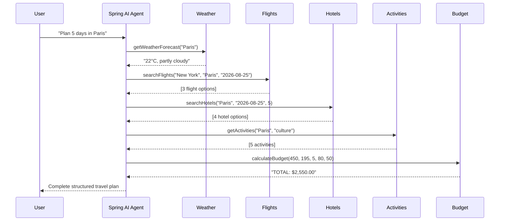
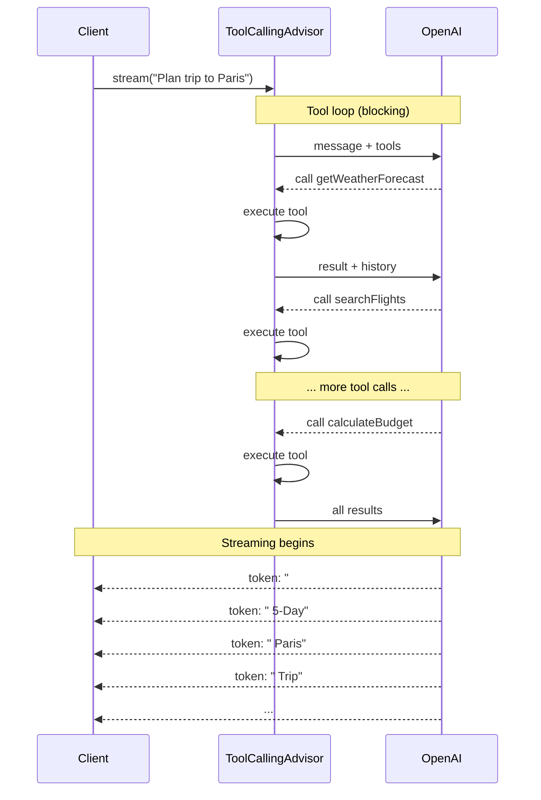

## The Problem

In the [function calling post](/posts/spring-ai-function-calling-tool-use/), the model calls a single tool to answer a question. But some tasks require **multiple tools in sequence** — where the output of one tool informs the next.

"Plan a 5-day trip to Paris" requires:
1. Check the weather (to suggest what to pack)
2. Search flights (to get pricing and times)
3. Search hotels (to find accommodation)
4. Get activities (to build an itinerary)
5. Calculate budget (to summarize costs)

You *could* hardcode this as a pipeline. But then you need a new pipeline for every workflow. The agentic approach: **give the model tools and a goal, let it figure out the steps.**

---

## What Is an Agent?



An agent is a model that:
1. **Reasons** about what information it needs
2. **Acts** by calling tools to gather that information
3. **Loops** until it has enough to answer the user's question
4. **Composes** a final response from all collected data

Spring AI's `ToolCallingAdvisor` implements this loop natively. You don't write orchestration code.

---

## What We Are Building

A travel planning agent with:
- **5 tools** the model chains autonomously
- **Blocking mode** — full plan returned when complete
- **Streaming mode** — tokens sent as SSE events while generating



One prompt. Five tool calls. Zero orchestration code.

---

## Prerequisites

| Component | Version |
|-----------|---------|
| Java | 21+ |
| Spring Boot | 3.5+ |
| Spring AI | 2.0.0 |
| OpenAI API key | [platform.openai.com](https://platform.openai.com) |

---

## Implementation

### Step 1: Define the Tools

```java
@Component
public class TravelTools {

    @Tool(description = "Get the weather forecast for a city during the next week. " +
            "Use this to help decide what to pack and what activities are suitable.")
    public String getWeatherForecast(
            @ToolParam(description = "City name, e.g. Paris") String city) {
        // Returns weather info for the city
        return weatherData.get(city.toLowerCase());
    }

    @Tool(description = "Search for available flights to a destination. " +
            "Returns a list of flight options with airlines, times, and prices.")
    public List<FlightOption> searchFlights(
            @ToolParam(description = "Departure city") String from,
            @ToolParam(description = "Destination city") String to,
            @ToolParam(description = "Travel date in YYYY-MM-DD format") String date) {
        return List.of(
                new FlightOption("Air France", "08:00", "11:30", new BigDecimal("450"), "USD"),
                new FlightOption("Emirates", "14:00", "17:45", new BigDecimal("620"), "USD"),
                new FlightOption("Budget Air", "22:00", "01:30+1", new BigDecimal("280"), "USD")
        );
    }

    @Tool(description = "Search for available hotels in a city")
    public List<HotelOption> searchHotels(
            @ToolParam(description = "City name") String city,
            @ToolParam(description = "Check-in date") String checkIn,
            @ToolParam(description = "Number of nights") int nights) {
        return List.of(
                new HotelOption("Grand Palace Hotel", 5, new BigDecimal("320"), "USD", 4.8),
                new HotelOption("City Center Inn", 3, new BigDecimal("120"), "USD", 4.2),
                new HotelOption("Boutique Loft", 4, new BigDecimal("195"), "USD", 4.6)
        );
    }

    @Tool(description = "Get recommended activities and attractions for a city")
    public List<String> getActivities(
            @ToolParam(description = "City name") String city,
            @ToolParam(description = "Type: adventure, culture, food, relaxation", required = false) String type) {
        return List.of("Visit the Louvre", "Walk along the Seine", "Explore Montmartre",
                "Try croissants at Du Pain et des Idées", "Day trip to Versailles");
    }

    @Tool(description = "Calculate the estimated total budget for a trip")
    public String calculateBudget(
            @ToolParam(description = "Flight cost (one way)") double flightCost,
            @ToolParam(description = "Hotel cost per night") double hotelPerNight,
            @ToolParam(description = "Number of nights") int nights,
            @ToolParam(description = "Daily food budget") double dailyFood,
            @ToolParam(description = "Daily activities budget") double dailyActivities) {

        double total = (flightCost * 2) + (hotelPerNight * nights)
                + (dailyFood * nights) + (dailyActivities * nights);
        return String.format("TOTAL: $%.2f USD", total);
    }
}
```

Each tool is small, focused, and independent. The model decides how to compose them.

### Step 2: The System Prompt as Orchestrator

```java
@Configuration
public class AiConfig {

    @Bean
    public ChatClient chatClient(ChatModel chatModel) {
        return ChatClient.builder(chatModel)
                .defaultSystem("""
                        You are an intelligent travel planning agent. When a user asks you
                        to plan a trip, you MUST follow these steps in order:

                        1. Check the weather at the destination
                        2. Search for flights from the user's city to the destination
                        3. Search for hotels at the destination
                        4. Get recommended activities
                        5. Calculate the total budget

                        Always complete ALL steps before giving your final recommendation.
                        Present the information in a structured, easy-to-read format.
                        If the user doesn't specify a departure city, assume "New York".
                        If dates aren't specified, use next week.
                        """)
                .build();
    }
}
```

The system prompt is the orchestrator. It doesn't enforce a rigid pipeline — the model can still adapt if a tool fails or returns unexpected data. But it gives a clear strategy.

### Step 3: Blocking Agent (`.call()`)

```java
@Service
public class AgentService {

    private final ChatClient chatClient;
    private final TravelTools travelTools;

    public AgentService(ChatClient chatClient, TravelTools travelTools) {
        this.chatClient = chatClient;
        this.travelTools = travelTools;
    }

    public ChatResponse plan(String userMessage) {
        String answer = chatClient.prompt()
                .user(userMessage)
                .tools(travelTools)
                .call()
                .content();

        return ChatResponse.of(answer);
    }
}
```

Behind the scenes, Spring AI's `ToolCallingAdvisor`:
1. Sends the user message + tool schemas to the model
2. Model returns: "I want to call `getWeatherForecast("Paris")`"
3. Spring AI executes the tool, appends result to history
4. Sends updated history back to the model
5. Model returns: "Now I want `searchFlights(...)`"
6. Repeat until model produces a text response with no tool calls

All automatic. Your code is 4 lines.

### Step 4: Streaming Agent (`.stream()`)

```java
public Flux<String> planStream(String userMessage) {
    return chatClient.prompt()
            .user(userMessage)
            .tools(travelTools)
            .stream()
            .content();
}
```

The streaming path:
- Tool calls still execute **synchronously** during the loop (the model can't stream while waiting for tool results)
- The **final answer** streams token-by-token as the model generates it
- Client sees tokens arrive progressively via SSE

### Step 5: Controller with Both Modes

```java
@RestController
@RequestMapping("/api/v1/agent")
public class AgentController {

    private final AgentService agentService;

    public AgentController(AgentService agentService) {
        this.agentService = agentService;
    }

    @PostMapping("/plan")
    public ResponseEntity<ChatResponse> plan(@Valid @RequestBody ChatRequest request) {
        ChatResponse response = agentService.plan(request.message());
        return ResponseEntity.ok(response);
    }

    @PostMapping(value = "/plan/stream", produces = MediaType.TEXT_EVENT_STREAM_VALUE)
    public Flux<String> planStream(@Valid @RequestBody ChatRequest request) {
        return agentService.planStream(request.message());
    }
}
```

---

## Testing

### Blocking — complete travel plan

```bash
curl -X POST http://localhost:8080/api/v1/agent/plan \
  -H "Content-Type: application/json" \
  -d '{"message": "Plan a 5-day trip to Paris from New York. Mid-range budget."}'
```

The response arrives after all 5 tool calls complete (usually 5-10 seconds):

```json
{
  "answer": "# 5-Day Paris Trip Plan\n\n## Weather\nPartly cloudy, 22°C. Perfect for sightseeing.\n\n## Flights\n| Airline | Departure | Price |\n|---------|-----------|-------|\n| Air France | 08:00 → 11:30 | $450 |\n| Budget Air | 22:00 → 01:30+1 | $280 |\n\n## Recommended Hotel\nBoutique Loft (4★) — $195/night, 4.6 rating\n\n## Activities\n1. Visit the Louvre Museum\n2. Walk along the Seine at sunset\n3. Explore Montmartre\n4. Try croissants at Du Pain et des Idées\n5. Day trip to Versailles\n\n## Budget (mid-range)\n- Flights: $900 (round trip with Air France)\n- Hotel: $975 (5 nights)\n- Food: $400 ($80/day)\n- Activities: $250 ($50/day)\n- **Total: ~$2,525 USD**",
  "timestamp": "2026-08-22T11:30:00"
}
```

### Streaming — real-time token delivery

```bash
curl -X POST http://localhost:8080/api/v1/agent/plan/stream \
  -H "Content-Type: application/json" \
  -H "Accept: text/event-stream" \
  -d '{"message": "Weekend trip to Tokyo, food and culture focus"}'
```

Tokens arrive one-by-one as the model generates:

```
data: #
data:  Weekend
data:  Tokyo
data:  Trip
data: \n\n
data: ##
data:  Weather
data: \n
data: Sunny
data: ,
data:  28
data: °C
...
```

---

## How Streaming Works with Tool Calls



Important: tokens only stream for the **final response**. During the tool loop, the client waits. This is by design — you can't stream partial tool results because the model needs complete results to decide its next step.

---

## Agentic Patterns: System Prompt Strategies

The system prompt defines how autonomous the agent is:

### Pattern 1: Strict Order (Predictable)

```
You MUST follow these steps in order:
1. Check weather
2. Search flights
3. Search hotels
4. Get activities
5. Calculate budget
```

Model always calls tools in the same sequence. Predictable, testable.

### Pattern 2: Goal-Driven (Flexible)

```
Plan a complete trip. Use the available tools to gather all
necessary information. Stop when you have enough data to
present a comprehensive plan.
```

Model decides the order and may skip tools it deems unnecessary. More adaptive, less predictable.

### Pattern 3: Conditional (Adaptive)

```
Plan the trip. If the weather is bad, prioritize indoor activities.
If all flights are expensive, suggest alternative dates.
If the user has a tight budget, prefer budget hotels.
```

Model adapts its tool usage based on results from earlier tools. True agentic reasoning.

---

## Safety Guardrails

Agents can loop indefinitely. Protect yourself:

### 1. Tool Call Limits

```yaml
spring:
  ai:
    tools:
      limits:
        max-calls-per-tool-default: 15
        max-total-tool-calls: 40
        on-limit-exceeded: RETURN_ERROR_RESPONSE
```

### 2. Timeout at the HTTP Layer

```yaml
spring:
  mvc:
    async:
      request-timeout: 60000  # 60 seconds max for streaming
```

### 3. Scope Tools Narrowly

Don't give a travel agent tools to delete files or send emails. Each agent should have **only** the tools it needs for its specific domain.

### 4. Monitor Token Usage

Each loop iteration costs tokens. A 5-tool-call agent uses roughly:
- 5 model requests (1 per loop iteration)
- ~500-1000 tokens per tool schema
- ~200-500 tokens per tool result
- Total: ~8,000-15,000 tokens per query

Monitor this. Set budget alerts.

---

## When to Use Agentic Patterns vs Simple Tool Calling

| Scenario | Approach |
|----------|----------|
| Single question, single tool | Simple tool calling |
| Multi-step task with known sequence | Agent with strict prompt |
| Open-ended research task | Agent with goal-driven prompt |
| High-stakes operation (payments, deletions) | Simple tool calling with human approval |
| Background batch processing | Agent (no streaming needed) |
| Real-time user interaction | Agent + streaming |

---

## Common Problems

| Symptom | Cause | Fix |
|---------|-------|-----|
| Model skips tools | System prompt too permissive | Use "MUST" and numbered steps |
| Model calls same tool repeatedly | Ambiguous tool descriptions | Make descriptions more distinct |
| Streaming endpoint hangs | Tool loop takes too long | Add timeout, reduce tool count |
| Incomplete plan | Model hit token limit mid-generation | Increase `max_tokens` or reduce tool result size |
| Model invents data instead of calling tool | Temperature too high | Lower to 0.1-0.3 for agents |
| `max-total-tool-calls` exceeded | Model in a loop | Check system prompt for conflicting instructions |

---

## Full Working Example

The complete code is available at [github.com/AnupamSinha/spring-ai-agents](https://github.com/AnupamSinha/spring-ai-agents).

```bash
git clone https://github.com/AnupamSinha/spring-ai-agents.git
cd spring-ai-agents
export OPENAI_API_KEY=sk-your-key-here
./mvnw spring-boot:run
```

---

## The Spring AI Tool Calling Series

This post is part of a series building progressively on Spring AI tool calling:

1. [Spring AI Function Calling](/posts/spring-ai-function-calling-tool-use/) — single tool calls, `@Tool` basics
2. [Tool Calling + Memory](/posts/spring-ai-memory-tool-calling/) — stateful multi-turn conversations
3. [MCP Server & Client](/posts/spring-ai-mcp-server-client/) — exposing tools over the network
4. **Agentic Patterns + Streaming** — this post

---

## References

- [Spring AI Documentation — Tool Calling](https://docs.spring.io/spring-ai/reference/api/tools.html)
- [Spring AI — Composable Agentic Architecture (Blog)](https://spring.io/blog/2026/06/15/spring-ai-composable-tool-calling)
- [Spring AI — Streaming API](https://docs.spring.io/spring-ai/reference/api/chatclient.html#_streaming_responses)
- [Spring AI — ToolCallingAdvisor](https://docs.spring.io/spring-ai/reference/api/tools.html#_the_tool_calling_loop)
- [Spring AI Project Home](https://spring.io/projects/spring-ai)
