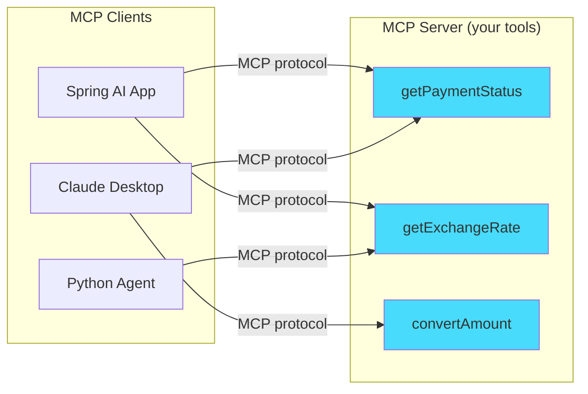
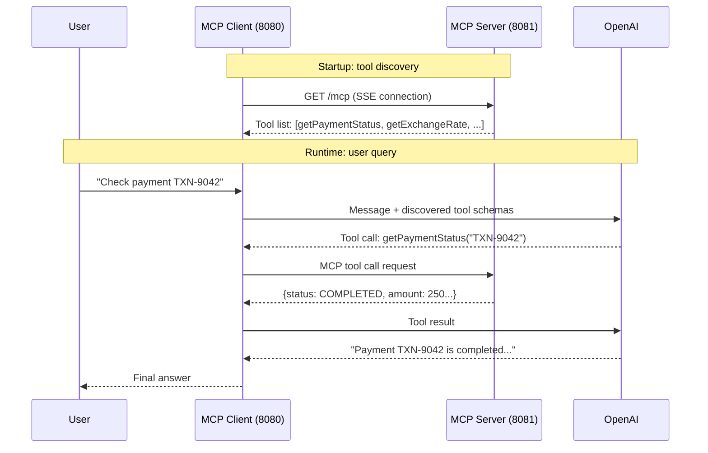

## The Problem

In the [function calling post](/posts/spring-ai-function-calling-tool-use/), tools live inside the same application as the AI model. That works fine for a single app. But what happens when:

- **Multiple AI apps** need the same tools (payment lookup, user search, etc.)
- **Different teams** own the tools vs. the AI layer
- **Non-Java clients** (Claude Desktop, Python agents) need access to your Java tools
- You want to **add tools dynamically** without redeploying the AI application

You need a **standard protocol** for exposing and consuming tools over the network. That's MCP — the Model Context Protocol.

---

## What Is MCP?

MCP is an open standard (created by Anthropic, adopted widely) that defines how AI applications discover and call tools from remote servers.



Think of it as REST for AI tools — a standard interface so any client can discover and invoke any server's tools without custom integration.

---

## What We Are Building

A **multi-module** Spring Boot project:

| Module | Role | Port |
|--------|------|------|
| `mcp-server` | Exposes payment tools via MCP (SSE transport) | 8081 |
| `mcp-client` | AI assistant that discovers + uses remote tools | 8080 |



The client never defines tool schemas locally. It discovers them from the server at startup.

---

## Prerequisites

| Component | Version |
|-----------|---------|
| Java | 21+ |
| Spring Boot | 3.5+ |
| Spring AI | 2.0.0 |
| OpenAI API key | [platform.openai.com](https://platform.openai.com) |
| Maven | 3.9+ |

---

## Project Setup

### Parent POM

```xml
<groupId>com.anupam</groupId>
<artifactId>spring-ai-mcp</artifactId>
<packaging>pom</packaging>

<properties>
    <java.version>21</java.version>
    <spring-ai.version>2.0.0</spring-ai.version>
</properties>

<modules>
    <module>mcp-server</module>
    <module>mcp-client</module>
</modules>

<dependencyManagement>
    <dependencies>
        <dependency>
            <groupId>org.springframework.ai</groupId>
            <artifactId>spring-ai-bom</artifactId>
            <version>${spring-ai.version}</version>
            <type>pom</type>
            <scope>import</scope>
        </dependency>
    </dependencies>
</dependencyManagement>
```

---

## Part 1: Building the MCP Server

### Server Dependencies

```xml
<dependencies>
    <dependency>
        <groupId>org.springframework.boot</groupId>
        <artifactId>spring-boot-starter-web</artifactId>
    </dependency>
    <dependency>
        <groupId>org.springframework.ai</groupId>
        <artifactId>spring-ai-starter-mcp-server-webmvc</artifactId>
    </dependency>
</dependencies>
```

That's it. One AI dependency. The `spring-ai-starter-mcp-server-webmvc` auto-configuration:
- Scans for `@Tool`-annotated beans
- Generates JSON schemas for parameters
- Registers tools with the MCP protocol handler
- Exposes an SSE endpoint for clients to connect

### Server Configuration

```yaml
spring:
  ai:
    mcp:
      server:
        name: payment-tools-server
        version: 1.0.0
        description: "MCP server exposing payment lookup and exchange rate tools"

server:
  port: 8081
```

### Define Tools with `@Tool`

```java
@Component
public class PaymentMcpTools {

    @Tool(description = "Get the current status and details of a payment by its transaction ID")
    public PaymentInfo getPaymentStatus(
            @ToolParam(description = "Transaction ID, e.g. TXN-9042") String transactionId) {

        PaymentInfo info = payments.get(transactionId);
        if (info == null) {
            throw new RuntimeException("Payment not found: " + transactionId);
        }
        return info;
    }

    @Tool(description = "Get the current exchange rate between two currencies. " +
            "Supported: USD, EUR, GBP, JPY, INR, CAD, AUD")
    public ExchangeRate getExchangeRate(
            @ToolParam(description = "Source currency code, e.g. USD") String from,
            @ToolParam(description = "Target currency code, e.g. EUR") String to) {

        // ... conversion logic
        return new ExchangeRate(from, to, rate, LocalDateTime.now());
    }

    @Tool(description = "Calculate the total amount in a target currency for a given payment")
    public String convertPaymentAmount(
            @ToolParam(description = "Transaction ID") String transactionId,
            @ToolParam(description = "Target currency code") String targetCurrency) {

        PaymentInfo payment = getPaymentStatus(transactionId);
        ExchangeRate rate = getExchangeRate(payment.currency(), targetCurrency);
        BigDecimal converted = payment.amount().multiply(rate.rate());
        return String.format("%s %s = %s %s", payment.amount(), payment.currency(),
                converted, targetCurrency);
    }
}
```

Notice: **the exact same `@Tool` annotation** from the function calling post. The only difference is the dependency — `spring-ai-starter-mcp-server-webmvc` instead of `spring-ai-starter-model-openai`. Your tool code doesn't change.

### Start the Server

```bash
cd mcp-server
./mvnw spring-boot:run
```

The server is now exposing tools at `http://localhost:8081` via the MCP SSE transport. Any MCP client can connect and discover `getPaymentStatus`, `getExchangeRate`, and `convertPaymentAmount`.

---

## Part 2: Building the MCP Client

### Client Dependencies

```xml
<dependencies>
    <dependency>
        <groupId>org.springframework.boot</groupId>
        <artifactId>spring-boot-starter-web</artifactId>
    </dependency>
    <dependency>
        <groupId>org.springframework.ai</groupId>
        <artifactId>spring-ai-starter-model-openai</artifactId>
    </dependency>
    <dependency>
        <groupId>org.springframework.ai</groupId>
        <artifactId>spring-ai-starter-mcp-client</artifactId>
    </dependency>
</dependencies>
```

### Client Configuration

```yaml
spring:
  ai:
    openai:
      api-key: ${OPENAI_API_KEY}
      chat:
        options:
          model: gpt-4o
          temperature: 0.3

    mcp:
      client:
        sse:
          connections:
            payment-tools:
              url: http://localhost:8081

server:
  port: 8080
```

The `mcp.client.sse.connections` section tells Spring AI where to find MCP servers. You can list multiple servers — each gets a logical name (`payment-tools` here).

### Wire MCP Tools into ChatClient

```java
@Configuration
public class AiConfig {

    @Bean
    public ChatClient chatClient(ChatModel chatModel, SyncMcpToolCallbackProvider mcpTools) {
        return ChatClient.builder(chatModel)
                .defaultSystem("""
                        You are a helpful payments assistant. You have access to tools
                        provided by an MCP server. Use them to look up payment status,
                        get exchange rates, and convert payment amounts.
                        """)
                .defaultTools(mcpTools)
                .build();
    }
}
```

`SyncMcpToolCallbackProvider` is auto-configured by Spring AI. It connects to all configured MCP servers, discovers their tools, and wraps them as `ToolCallback` instances. You just inject it and pass it to `.defaultTools()`.

### The Controller (No Tool Knowledge Needed)

```java
@RestController
@RequestMapping("/api/v1/assistant")
public class AssistantController {

    private final ChatClient chatClient;

    public AssistantController(ChatClient chatClient) {
        this.chatClient = chatClient;
    }

    @PostMapping("/chat")
    public ResponseEntity<ChatResponse> chat(@Valid @RequestBody ChatRequest request) {
        String answer = chatClient.prompt()
                .user(request.message())
                .call()
                .content();

        return ResponseEntity.ok(ChatResponse.of(answer));
    }
}
```

The controller has **zero knowledge of what tools exist**. It doesn't import `PaymentInfo` or `ExchangeRate`. Those types live on the server side only. The client just passes the MCP-provided tool callbacks to the model and lets the loop run.

---

## Testing

### 1. Start both applications

```bash
# Terminal 1 — MCP Server
cd mcp-server
./mvnw spring-boot:run

# Terminal 2 — MCP Client
cd mcp-client
export OPENAI_API_KEY=sk-your-key-here
./mvnw spring-boot:run
```

### 2. Query via the client

```bash
curl -X POST http://localhost:8080/api/v1/assistant/chat \
  -H "Content-Type: application/json" \
  -d '{"message": "What is the status of payment TXN-9042?"}'
```

```json
{
  "answer": "Payment TXN-9042 has been completed. It was $250.00 USD sent from Alice Johnson to Bob Smith on August 20, 2026.",
  "timestamp": "2026-08-22T11:00:00"
}
```

### 3. Use a tool that chains other tools

```bash
curl -X POST http://localhost:8080/api/v1/assistant/chat \
  -H "Content-Type: application/json" \
  -d '{"message": "Convert TXN-9043 amount to EUR"}'
```

```json
{
  "answer": "Payment TXN-9043 is $1,200.50 USD. At the current rate of 0.92, that equals approximately €1,104.46 EUR.",
  "timestamp": "2026-08-22T11:00:05"
}
```

---

## MCP vs Local Tools: When to Use Which

| Scenario | Use |
|----------|-----|
| Tools and AI in the same app | Local `@Tool` (simpler, no network hop) |
| Multiple AI apps share the same tools | MCP server (one source of truth) |
| Different teams own tools vs. AI layer | MCP (clean ownership boundary) |
| Non-Java clients need your Java tools | MCP (Claude Desktop, Python, etc.) |
| You want to add tools without redeploying the AI app | MCP (dynamic discovery) |
| Low-latency requirement | Local `@Tool` (no network round-trip) |

---

## Combining Local and MCP Tools

You can mix them freely:

```java
chatClient.prompt()
    .user(question)
    .tools(localTools, mcpTools)  // Both in one call
    .call()
    .content();
```

The model doesn't distinguish between local and remote tools — they all look like `ToolCallback` instances.

---

## Transport Options

MCP supports two transports:

| Transport | Use Case | Config Key |
|-----------|----------|------------|
| **SSE** (Server-Sent Events) | Remote servers over HTTP | `spring.ai.mcp.client.sse.connections` |
| **stdio** | Local processes (CLI tools, scripts) | `spring.ai.mcp.client.stdio.connections` |

### stdio example (connecting to an npm-based MCP server):

```yaml
spring:
  ai:
    mcp:
      client:
        stdio:
          connections:
            filesystem:
              command: npx
              args: ["-y", "@modelcontextprotocol/server-filesystem", "/tmp"]
```

---

## Security Considerations

MCP expands the attack surface beyond a single JVM:

1. **Authenticate MCP connections** — in production, add auth headers or mTLS between client and server
2. **Filter tools** — use `McpToolFilter` to restrict which discovered tools the client exposes to the model
3. **Network boundary** — keep MCP servers internal (VPC, service mesh). Don't expose them publicly.
4. **Tool name conflicts** — if two MCP servers expose a tool with the same name, use `DefaultMcpToolNamePrefixGenerator` to prefix them

```java
// Only allow specific tools from the MCP server
@Bean
McpToolFilter mcpToolFilter() {
    return (serverName, toolName) ->
            Set.of("getPaymentStatus", "getExchangeRate").contains(toolName);
}
```

---

## Common Problems

| Symptom | Cause | Fix |
|---------|-------|-----|
| `Connection refused` on startup | MCP server not running | Start the server first |
| No tools discovered | Wrong URL in client config | Check `spring.ai.mcp.client.sse.connections.*.url` |
| Tools work locally but not via MCP | Server not scanning `@Tool` beans | Ensure tool class has `@Component` |
| Slow first request | SSE connection + tool discovery on first call | This is normal; subsequent calls are fast |
| `ClassNotFoundException` on client | Trying to import server-side model classes | Client doesn't need server models — results are JSON strings |

---

## Full Working Example

The complete code is available at [github.com/AnupamSinha/spring-ai-mcp](https://github.com/AnupamSinha/spring-ai-mcp).

```bash
git clone https://github.com/AnupamSinha/spring-ai-mcp.git
cd spring-ai-mcp

# Terminal 1 — Start server
cd mcp-server && ../mvnw spring-boot:run

# Terminal 2 — Start client
cd mcp-client && export OPENAI_API_KEY=sk-... && ../mvnw spring-boot:run
```

---

## What's Next

- [Spring AI Agentic Patterns](/posts/spring-ai-agentic-patterns-streaming/) — multi-step tool chains where the model plans workflows autonomously, with streaming responses

---

## References

- [Spring AI Documentation — MCP Client](https://docs.spring.io/spring-ai/reference/api/mcp/mcp-client-boot-starter-docs.html)
- [Spring AI Documentation — MCP Server](https://docs.spring.io/spring-ai/reference/api/mcp/mcp-server-boot-starter-docs.html)
- [Model Context Protocol Specification](https://modelcontextprotocol.io)
- [Spring AI — Tool Calling](https://docs.spring.io/spring-ai/reference/api/tools.html)
- [Spring AI Project Home](https://spring.io/projects/spring-ai)
