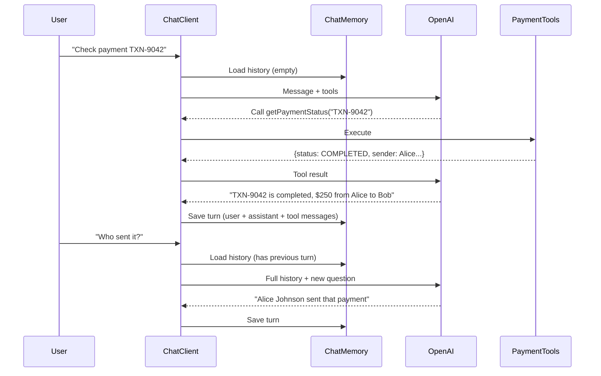
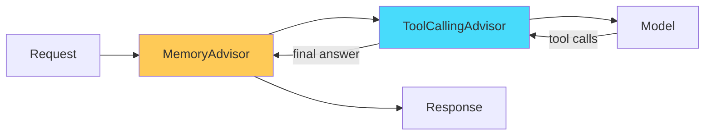
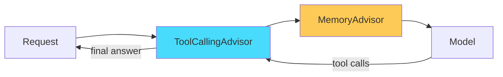

## The Problem

In the [previous post](/posts/spring-ai-function-calling-tool-use/), we built an assistant that calls tools. But every request is isolated — ask "What's the status of TXN-9042?" followed by "Who sent it?" and the model has no idea what "it" refers to.

Real conversations are multi-turn. Users say "check my last 3 payments" then follow up with "what's the exchange rate for the largest one?" The model needs to **remember** both the question history and the tool results from earlier turns.

Spring AI solves this with `MessageChatMemoryAdvisor` — a composable advisor that stores and replays conversation history automatically.

---

## What We Are Building

An extension of the payment assistant that:

1. **Remembers conversation history** — previous questions and answers persist across turns
2. **Remembers tool results** — the model can reference data from tools called in earlier turns
3. **Supports multiple conversations** — each user/session gets isolated memory



The model resolves "it" because it can see the full conversation history, including the tool result from turn 1.

---

## Memory Placement: Outside vs Inside the Tool Loop

This is the key architectural decision. Where you place the memory advisor relative to `ToolCallingAdvisor` changes what gets stored:

### Outside the Loop (Default — Recommended)



Memory stores: **user message + final assistant answer only**. Tool call/response messages are NOT persisted.

- Pros: Clean history, works with all memory backends, lower token usage on replay
- Cons: Model can't see *how* it got a previous answer (just the answer itself)
- Best for: Most applications

### Inside the Loop



Memory stores: **everything — user message, tool call requests, tool responses, final answer**.

- Pros: Full transparency, model can reason about previous tool calls
- Cons: Higher token usage, requires compatible memory backend (InMemory, Redis, or Neo4j)
- Best for: Complex agents that need to avoid repeating tool calls

**For this post, we'll use the default (outside the loop)** — it covers 90% of use cases.

---

## Implementation

### Step 1: Add the Memory Configuration

```java
import org.springframework.ai.chat.client.ChatClient;
import org.springframework.ai.chat.memory.ChatMemory;
import org.springframework.ai.chat.memory.InMemoryChatMemory;
import org.springframework.ai.chat.memory.MessageChatMemoryAdvisor;
import org.springframework.ai.chat.model.ChatModel;
import org.springframework.context.annotation.Bean;
import org.springframework.context.annotation.Configuration;

@Configuration
public class AiConfig {

    @Bean
    public ChatMemory chatMemory() {
        return new InMemoryChatMemory();
    }

    @Bean
    public ChatClient chatClient(ChatModel chatModel, ChatMemory chatMemory) {
        return ChatClient.builder(chatModel)
                .defaultSystem("""
                        You are a helpful payments assistant. You can look up payment
                        information, check transaction status, and provide exchange rates.
                        Use conversation context to resolve references like "it", "that payment",
                        or "the last one". If something is ambiguous, ask for clarification.
                        """)
                .defaultAdvisors(
                        MessageChatMemoryAdvisor.builder(chatMemory).build()
                )
                .build();
    }
}
```

`InMemoryChatMemory` stores history in a `ConcurrentHashMap`. For production, swap to Redis or a database-backed implementation.

### Step 2: Update the Service to Handle Conversation IDs

```java
import org.springframework.ai.chat.client.ChatClient;
import org.springframework.ai.chat.memory.ChatMemory;
import org.springframework.stereotype.Service;

@Service
public class AssistantService {

    private final ChatClient chatClient;
    private final PaymentTools paymentTools;

    public AssistantService(ChatClient chatClient, PaymentTools paymentTools) {
        this.chatClient = chatClient;
        this.paymentTools = paymentTools;
    }

    public String chat(String conversationId, String userMessage) {
        return chatClient.prompt()
                .user(userMessage)
                .tools(paymentTools)
                .advisors(a -> a.param(ChatMemory.CONVERSATION_ID, conversationId))
                .call()
                .content();
    }
}
```

The `conversationId` isolates different users' conversations. Each ID gets its own history. In a real app, this could be a session ID, a user ID, or a UUID generated per chat window.

### Step 3: Update the Controller

```java
@RestController
@RequestMapping("/api/v1/assistant")
public class AssistantController {

    private final AssistantService assistantService;

    public AssistantController(AssistantService assistantService) {
        this.assistantService = assistantService;
    }

    @PostMapping("/chat")
    public ResponseEntity<ChatResponse> chat(@Valid @RequestBody ChatRequest request) {
        String conversationId = request.conversationId() != null
                ? request.conversationId()
                : UUID.randomUUID().toString();

        String answer = assistantService.chat(conversationId, request.message());
        return ResponseEntity.ok(new ChatResponse(answer, conversationId, LocalDateTime.now()));
    }
}
```

```java
public record ChatRequest(
        @NotBlank String message,
        String conversationId  // optional — if null, starts a new conversation
) {}

public record ChatResponse(
        String answer,
        String conversationId,
        LocalDateTime timestamp
) {}
```

---

## Testing Multi-Turn Conversations

### Turn 1: Ask about a payment

```bash
curl -X POST http://localhost:8080/api/v1/assistant/chat \
  -H "Content-Type: application/json" \
  -d '{"message": "What is the status of TXN-9042?", "conversationId": "session-1"}'
```

```json
{
  "answer": "Payment TXN-9042 is completed. It was $250.00 USD sent from Alice Johnson to Bob Smith on August 20, 2026.",
  "conversationId": "session-1",
  "timestamp": "2026-08-22T10:00:00"
}
```

### Turn 2: Follow up with a pronoun reference

```bash
curl -X POST http://localhost:8080/api/v1/assistant/chat \
  -H "Content-Type: application/json" \
  -d '{"message": "Who sent it?", "conversationId": "session-1"}'
```

```json
{
  "answer": "Alice Johnson sent that payment.",
  "conversationId": "session-1",
  "timestamp": "2026-08-22T10:00:05"
}
```

Without memory, the model would say "I don't have enough context to determine what 'it' refers to."

### Turn 3: Ask a follow-up requiring a new tool call

```bash
curl -X POST http://localhost:8080/api/v1/assistant/chat \
  -H "Content-Type: application/json" \
  -d '{"message": "Convert that amount to EUR", "conversationId": "session-1"}'
```

```json
{
  "answer": "At the current rate of 0.92, $250.00 USD is approximately €230.00 EUR.",
  "conversationId": "session-1",
  "timestamp": "2026-08-22T10:00:10"
}
```

The model remembered "$250.00 USD" from turn 1 and called `getExchangeRate("USD", "EUR")` to compute the conversion.

---

## Memory Window: Limiting History Size

Conversations can grow long. Sending the full history every turn wastes tokens and eventually hits the context window limit. Control this with the `maxMessages` parameter:

```java
MessageChatMemoryAdvisor.builder(chatMemory)
        .maxMessages(20)  // Keep last 20 messages (10 turns)
        .build()
```

| Setting | Behavior |
|---------|----------|
| `maxMessages(10)` | Last 5 user/assistant pairs |
| `maxMessages(20)` | Last 10 turns — good default |
| `maxMessages(0)` or omit | Unlimited (careful with long conversations) |

---

## Production Memory Backends

`InMemoryChatMemory` works for demos but doesn't survive restarts. For production:

### Redis (Recommended for most apps)

```xml
<dependency>
    <groupId>org.springframework.ai</groupId>
    <artifactId>spring-ai-redis-store</artifactId>
</dependency>
```

```java
@Bean
public ChatMemory chatMemory(RedisTemplate<String, Object> redisTemplate) {
    return new RedisChatMemory(redisTemplate);
}
```

Benefits: Fast, supports TTL for automatic conversation expiry, horizontally scalable.

### Neo4j (For complex conversation graphs)

```java
@Bean
public ChatMemory chatMemory(Neo4jClient neo4jClient) {
    return new Neo4jChatMemory(neo4jClient);
}
```

Benefits: Query relationships between conversations, supports full tool message storage inside the loop.

---

## Inside-the-Loop Memory (Advanced)

If you need the model to see previous tool calls — for example, to avoid calling the same tool twice with the same arguments:

```java
@Bean
public ChatClient chatClient(ChatModel chatModel, ChatMemory chatMemory) {

    var memoryAdvisor = MessageChatMemoryAdvisor.builder(chatMemory)
            .order(BaseAdvisor.HIGHEST_PRECEDENCE + 400)  // Inside the tool loop
            .build();

    return ChatClient.builder(chatModel)
            .defaultSystem("...")
            .defaultAdvisors(memoryAdvisor)
            .build();
}
```

With order `400` (higher than `ToolCallingAdvisor`'s default of `300`), memory sits inside the loop. Now the stored history includes:

```
[UserMessage] "Check TXN-9042"
[AssistantMessage] tool_call: getPaymentStatus("TXN-9042")
[ToolResponseMessage] {status: "COMPLETED", amount: 250.00, ...}
[AssistantMessage] "Payment TXN-9042 is completed..."
```

> **Warning:** Only InMemory, Redis, and Neo4j backends support storing tool messages. JDBC-backed memory does NOT support this yet.

---

## Common Problems

| Symptom | Cause | Fix |
|---------|-------|-----|
| Model doesn't remember previous turns | Missing `conversationId` or different ID per request | Ensure same ID across the conversation |
| "I don't know what you're referring to" | Memory advisor not registered | Check `.defaultAdvisors()` includes `MessageChatMemoryAdvisor` |
| Token limit exceeded on long conversations | No message window set | Add `.maxMessages(20)` |
| Tool results not visible in later turns | Memory is outside the loop (default) | Either move memory inside the loop or accept this trade-off |
| Memory lost on app restart | Using `InMemoryChatMemory` | Switch to Redis or a persistent backend |

---

## Full Working Example

This builds on the [spring-ai-function](https://github.com/AnupamSinha/spring-ai-function) project. The `memory` branch adds conversation memory:

```bash
git clone https://github.com/AnupamSinha/spring-ai-function.git
cd spring-ai-function
git checkout memory
export OPENAI_API_KEY=sk-your-key-here
./mvnw spring-boot:run
```

---

## What's Next

- [Spring AI + MCP](/posts/spring-ai-mcp-server-client/) — expose your tools as a standardized MCP server that any AI client can consume
- [Spring AI Agentic Patterns](/posts/spring-ai-agentic-patterns-streaming/) — multi-step tool chains where the model plans workflows autonomously

---

## References

- [Spring AI Documentation — Chat Memory](https://docs.spring.io/spring-ai/reference/api/chatclient.html#_chat_memory)
- [Spring AI — MessageChatMemoryAdvisor](https://docs.spring.io/spring-ai/reference/api/advisors.html)
- [Spring AI — Tool Calling](https://docs.spring.io/spring-ai/reference/api/tools.html)
- [Spring AI Project Home](https://spring.io/projects/spring-ai)
