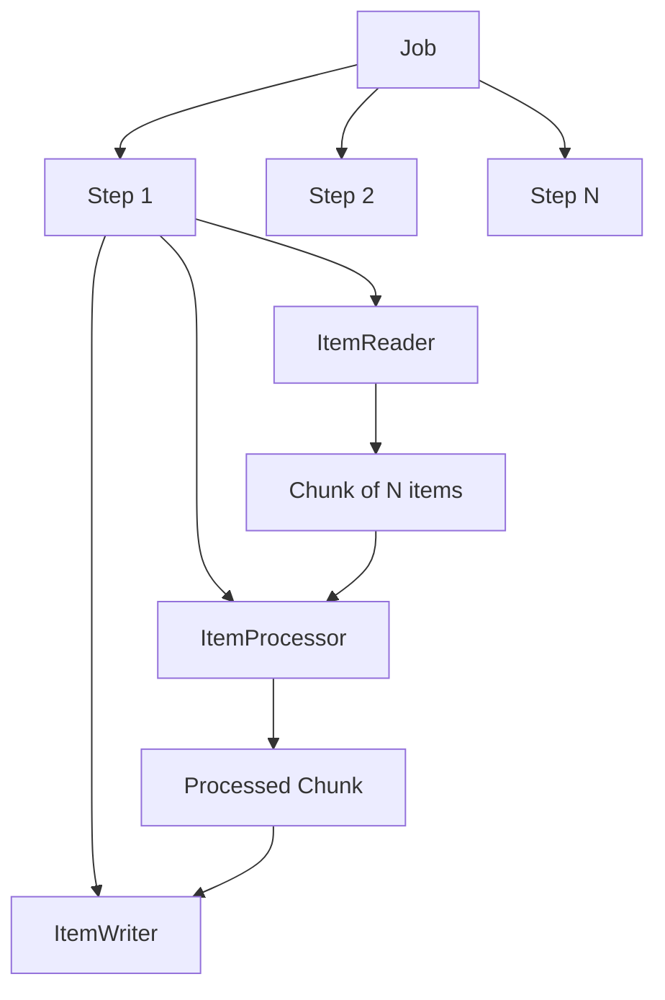
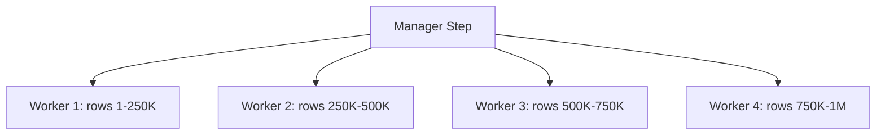

## The Problem

Every system eventually faces this: you need to process a large dataset — millions of transactions, user migrations, report generation, data cleanup. You can't load everything into memory. You can't afford to lose progress on failure. You need fault tolerance, restartability, and observability.

Writing this from scratch means reinventing:
- Chunked reading and writing
- Transaction management per chunk
- Skip/retry logic for bad records
- Job state persistence (where did we leave off?)
- Parallel execution for throughput

Spring Batch solves all of this with a battle-tested framework used in banking, insurance, and enterprise systems for over a decade.

---

## Spring Batch Architecture




Key concepts:
- **Job** — a complete batch process (e.g., "import transactions")
- **Step** — a single phase within a job (read → process → write)
- **Chunk** — a group of items processed together in one transaction
- **JobRepository** — stores execution metadata (status, progress, restartability)

The chunk-oriented model reads N items, processes them, then writes them as a batch. If the chunk fails, only that chunk rolls back — not the entire job.

---

## What We're Building

A transaction processing pipeline that:
1. **Reads** transactions from a CSV file (simulating a data feed)
2. **Processes** each transaction — validates amounts and flags suspicious ones
3. **Writes** validated transactions to PostgreSQL in bulk

The complete source code is available on [GitHub](https://github.com/anupamsinha/spring-batch-demo).

---

## Step 1: Read from CSV — FlatFileItemReader

Spring Batch provides `FlatFileItemReader` for delimited or fixed-width files. It handles file I/O, line mapping, and tracks the current position for restartability.

```java
@Bean
public FlatFileItemReader<Transaction> reader() {
    return new FlatFileItemReaderBuilder<Transaction>()
            .name("transactionReader")
            .resource(new ClassPathResource("sample-transactions.csv"))
            .linesToSkip(1) // skip header
            .delimited()
            .names("id", "accountId", "amount", "type", "timestamp")
            .fieldSetMapper(fieldSet -> new Transaction(
                    fieldSet.readLong("id"),
                    fieldSet.readString("accountId"),
                    new BigDecimal(fieldSet.readString("amount")),
                    fieldSet.readString("type"),
                    LocalDateTime.parse(fieldSet.readString("timestamp")),
                    false
            ))
            .build();
}
```

The reader is **stateful** — it remembers which line it last read. If the job restarts after a failure, it picks up from where it left off.

Other built-in readers:
- `JdbcCursorItemReader` — reads from a database using a cursor
- `JpaPagingItemReader` — reads using JPA pagination
- `JsonItemReader` — reads JSON arrays
- `StaxEventItemReader` — reads XML

---

## Step 2: Process — ItemProcessor

The processor applies business logic to each item. Returning `null` filters the item out.

```java
public class TransactionProcessor implements ItemProcessor<Transaction, Transaction> {

    private static final BigDecimal SUSPICIOUS_THRESHOLD = new BigDecimal("10000");

    @Override
    public Transaction process(Transaction transaction) {
        // Reject negative amounts
        if (transaction.amount().compareTo(BigDecimal.ZERO) < 0) {
            log.warn("Rejected transaction {} — negative amount", transaction.id());
            return null; // filtered out
        }

        // Flag suspicious transactions
        boolean suspicious = transaction.amount().compareTo(SUSPICIOUS_THRESHOLD) > 0;
        return transaction.withSuspicious(suspicious);
    }
}
```

Processors are composable — you can chain them:

```java
@Bean
public CompositeItemProcessor<Transaction, Transaction> compositeProcessor() {
    return new CompositeItemProcessorBuilder<Transaction, Transaction>()
            .delegates(validationProcessor(), enrichmentProcessor(), flaggingProcessor())
            .build();
}
```

---

## Step 3: Write to DB — JdbcBatchItemWriter

The writer receives a chunk of processed items and writes them in a single batch operation.

```java
@Bean
public JdbcBatchItemWriter<Transaction> writer(DataSource dataSource) {
    return new JdbcBatchItemWriterBuilder<Transaction>()
            .sql("""
                INSERT INTO transactions (id, account_id, amount, type, timestamp, suspicious)
                VALUES (:id, :accountId, :amount, :type, :timestamp, :suspicious)
                """)
            .beanMapped()
            .dataSource(dataSource)
            .build();
}
```

`beanMapped()` maps record/bean properties to named parameters. For indexed parameters, use `itemPreparedStatementSetter`.

Other built-in writers:
- `JpaItemWriter` — persists JPA entities
- `FlatFileItemWriter` — writes to CSV/text files
- `JsonFileItemWriter` — writes JSON
- `CompositeItemWriter` — writes to multiple destinations

---

## Assembling the Job

```java
@Bean
public Step importStep(JobRepository jobRepository,
                       PlatformTransactionManager transactionManager,
                       FlatFileItemReader<Transaction> reader,
                       TransactionProcessor processor,
                       JdbcBatchItemWriter<Transaction> writer) {
    return new StepBuilder("importTransactions", jobRepository)
            .<Transaction, Transaction>chunk(100, transactionManager)
            .reader(reader)
            .processor(processor)
            .writer(writer)
            .build();
}

@Bean
public Job importJob(JobRepository jobRepository, Step importStep) {
    return new JobBuilder("importTransactionsJob", jobRepository)
            .start(importStep)
            .build();
}
```

With a chunk size of 100, the framework reads 100 items, processes them, then writes all 100 in a single JDBC batch. One transaction per chunk.

---

## Skip & Retry

Production data is messy. Spring Batch handles bad records gracefully:

```java
@Bean
public Step faultTolerantStep(JobRepository jobRepository,
                              PlatformTransactionManager transactionManager,
                              FlatFileItemReader<Transaction> reader,
                              TransactionProcessor processor,
                              JdbcBatchItemWriter<Transaction> writer) {
    return new StepBuilder("importTransactions", jobRepository)
            .<Transaction, Transaction>chunk(100, transactionManager)
            .reader(reader)
            .processor(processor)
            .writer(writer)
            .faultTolerant()
            .skipLimit(10)                          // skip up to 10 bad records
            .skip(FlatFileParseException.class)     // skip parse errors
            .skip(ValidationException.class)        // skip validation failures
            .retryLimit(3)                          // retry up to 3 times
            .retry(DeadlockLoserDataAccessException.class) // retry on deadlocks
            .build();
}
```

When a skip occurs:
1. The chunk is rolled back
2. Each item in the chunk is re-processed individually
3. The bad item is skipped, the rest succeed
4. Skipped items are logged via `SkipListener`

```java
@Component
public class TransactionSkipListener implements SkipListener<Transaction, Transaction> {

    @Override
    public void onSkipInRead(Throwable t) {
        log.error("Skipped record during read: {}", t.getMessage());
    }

    @Override
    public void onSkipInProcess(Transaction item, Throwable t) {
        log.error("Skipped transaction {} during processing: {}", item.id(), t.getMessage());
    }

    @Override
    public void onSkipInWrite(Transaction item, Throwable t) {
        log.error("Skipped transaction {} during write: {}", item.id(), t.getMessage());
    }
}
```

---

## Partitioning — Parallel Execution

For millions of records, single-threaded processing is too slow. Partitioning splits the data across multiple threads:




```java
@Bean
public Step managerStep(JobRepository jobRepository,
                        Step workerStep,
                        Partitioner partitioner) {
    return new StepBuilder("managerStep", jobRepository)
            .partitioner("workerStep", partitioner)
            .step(workerStep)
            .gridSize(4) // 4 parallel workers
            .taskExecutor(taskExecutor())
            .build();
}

@Bean
public TaskExecutor taskExecutor() {
    var executor = new SimpleAsyncTaskExecutor("batch-");
    executor.setConcurrencyLimit(4);
    return executor;
}

@Bean
public Partitioner rangePartitioner() {
    return gridSize -> {
        Map<String, ExecutionContext> partitions = new HashMap<>();
        long totalRecords = 1_000_000;
        long rangeSize = totalRecords / gridSize;

        for (int i = 0; i < gridSize; i++) {
            ExecutionContext context = new ExecutionContext();
            context.putLong("minId", i * rangeSize + 1);
            context.putLong("maxId", (i + 1) * rangeSize);
            partitions.put("partition" + i, context);
        }
        return partitions;
    };
}
```

Each partition gets its own `ExecutionContext` with a range. The worker step's reader uses these bounds to query only its portion.

---

## Scheduling with @Scheduled

Run batch jobs on a schedule without external schedulers:

```java
@Component
@EnableScheduling
public class BatchScheduler {

    private final JobLauncher jobLauncher;
    private final Job importJob;

    public BatchScheduler(JobLauncher jobLauncher, Job importJob) {
        this.jobLauncher = jobLauncher;
        this.importJob = importJob;
    }

    @Scheduled(cron = "0 0 2 * * *") // every day at 2 AM
    public void runDailyImport() throws Exception {
        JobParameters params = new JobParametersBuilder()
                .addLocalDateTime("runTime", LocalDateTime.now())
                .toJobParameters();

        JobExecution execution = jobLauncher.run(importJob, params);
        log.info("Job finished with status: {}", execution.getStatus());
    }
}
```

> Each execution needs unique `JobParameters` — otherwise Spring Batch treats it as a re-run of the same instance.

For production systems, consider:
- **Spring Cloud Task** — for short-lived microservice batch jobs
- **Spring Cloud Data Flow** — for orchestrating complex batch pipelines
- External schedulers (Kubernetes CronJob, Airflow) for multi-service coordination

---

## Common Problems

| Problem | Cause | Solution |
|---------|-------|----------|
| Job runs on startup every time | `spring.batch.job.enabled=true` (default) | Set to `false` for scheduled/manual jobs |
| Job won't restart after failure | Same `JobParameters` = same instance | Add a unique parameter (timestamp, UUID) |
| OutOfMemoryError on large files | Using paging reader with huge page size | Use cursor-based reader or smaller chunks |
| Slow writes | Individual inserts per record | Use `JdbcBatchItemWriter` with larger chunk size |
| Duplicate processing after restart | Reader not marking position | Use `saveState(true)` on readers |
| Transaction timeout on large chunks | Chunk takes longer than TX timeout | Reduce chunk size or increase timeout |
| Skipped items not logged | No `SkipListener` configured | Add a listener to the step |
| Partitioned step hangs | Thread pool exhausted | Set `gridSize` ≤ pool size |

---

## Full Working Example

The complete project with Docker setup, sample data, and tests is on GitHub:

👉 [spring-batch-demo](https://github.com/anupamsinha/spring-batch-demo)

To run:
```bash
docker-compose up -d
./mvnw spring-boot:run
```

---

## References

- [Spring Batch Reference Documentation](https://docs.spring.io/spring-batch/reference/)
- [Spring Boot Batch Auto-configuration](https://docs.spring.io/spring-boot/reference/io/batch.html)
- [Spring Batch Samples](https://github.com/spring-projects/spring-batch/tree/main/spring-batch-samples)
- [Chunk-Oriented Processing](https://docs.spring.io/spring-batch/reference/step/chunk-oriented-processing.html)
- [Scaling and Parallel Processing](https://docs.spring.io/spring-batch/reference/scalability.html)
