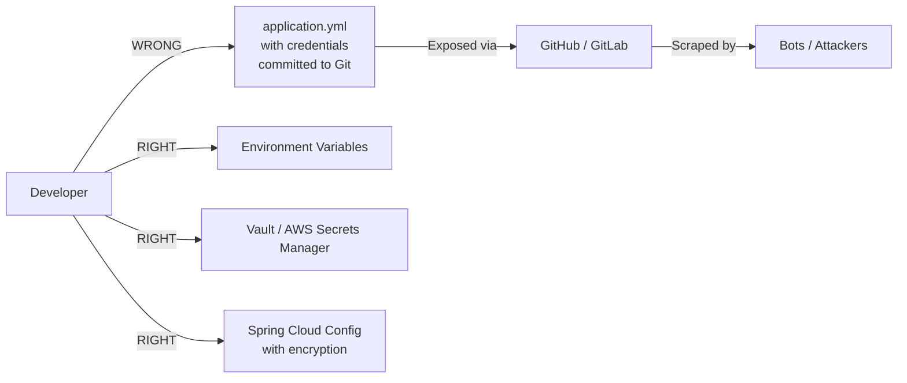

## The Problem — Security as an Afterthought

Most Spring Boot APIs ship with:
- Default security settings (which are surprisingly permissive)
- No rate limiting
- Actuator endpoints exposed to the internet
- Verbose error messages that leak internal details
- Credentials in `application.yml` committed to Git

Security is treated as "we'll add it later." Later never comes. Then you get a CVE notification at 3 AM.

This post maps each OWASP Top 10 vulnerability to concrete Spring Boot mitigations — with code you can copy.

---

## OWASP Top 10 Mapped to Spring Boot

| # | Vulnerability | Spring Boot Mitigation |
|---|--------------|----------------------|
| A01 | Broken Access Control | `@PreAuthorize`, method security, URL-based rules |
| A02 | Cryptographic Failures | TLS, encrypt at rest, never log secrets |
| A03 | Injection | Parameterized queries, input validation |
| A04 | Insecure Design | Threat modeling, secure defaults |
| A05 | Security Misconfiguration | Actuator lockdown, error handling, no defaults |
| A06 | Vulnerable Components | Dependency scanning, updates |
| A07 | Identification & Auth Failures | Strong passwords, MFA, session management |
| A08 | Software & Data Integrity | Signed JARs, CI/CD security |
| A09 | Security Logging & Monitoring | Structured logging, alerting |
| A10 | Server-Side Request Forgery | URL validation, allowlists |

---

## A01: Broken Access Control

The #1 vulnerability. Users accessing resources they shouldn't.

### Method-Level Security

```java
@Configuration
@EnableMethodSecurity
public class SecurityConfig {
    // enables @PreAuthorize, @PostAuthorize, @Secured
}
```

```java
@RestController
@RequestMapping("/api/admin")
public class AdminController {

    @PreAuthorize("hasRole('ADMIN')")
    @GetMapping("/users")
    public List<User> getAllUsers() {
        return userService.findAll();
    }

    @PreAuthorize("#userId == authentication.principal.id or hasRole('ADMIN')")
    @GetMapping("/users/{userId}")
    public User getUser(@PathVariable Long userId) {
        return userService.findById(userId);
    }
}
```

### URL-Based Rules

```java
@Bean
public SecurityFilterChain filterChain(HttpSecurity http) throws Exception {
    return http
        .authorizeHttpRequests(auth -> auth
            .requestMatchers("/api/public/**").permitAll()
            .requestMatchers("/api/admin/**").hasRole("ADMIN")
            .requestMatchers(HttpMethod.DELETE, "/api/**").hasRole("ADMIN")
            .anyRequest().authenticated()
        )
        .build();
}
```

### Common Mistakes

- Checking roles in the controller but not the service layer
- Using sequential IDs without ownership checks (IDOR)
- Forgetting that `permitAll()` order matters — first match wins

---

## A02: Cryptographic Failures

Never store or transmit sensitive data in plain text.

```java
// WRONG — plaintext password in config
spring.datasource.password=mypassword

// RIGHT — externalized secrets
spring.datasource.password=${DB_PASSWORD}
```

### Encrypt Sensitive Data

```java
@Entity
public class User {
    // Store hashed, never plain
    private String passwordHash;

    // Encrypt PII at rest
    @Convert(converter = EncryptedStringConverter.class)
    private String socialSecurityNumber;
}
```

### Force TLS

```yaml
server:
  ssl:
    enabled: true
    key-store: classpath:keystore.p12
    key-store-password: ${KEYSTORE_PASSWORD}
    key-store-type: PKCS12
```

---

## A03: Injection

Spring Data JPA prevents SQL injection by default — **if you use it correctly**.

```java
// VULNERABLE — string concatenation
@Query("SELECT u FROM User u WHERE u.email = '" + email + "'")
User findByEmailUnsafe(String email);

// SAFE — parameterized query
@Query("SELECT u FROM User u WHERE u.email = :email")
User findByEmail(@Param("email") String email);

// SAFE — Spring Data method naming
User findByEmail(String email);
```

### Input Validation

```java
public record CreateUserRequest(
    @NotBlank @Size(max = 100) String name,
    @Email @NotBlank String email,
    @Size(min = 8, max = 64) String password,
    @Pattern(regexp = "^\\+?[1-9]\\d{1,14}$") String phone
) {}

@PostMapping("/users")
public User createUser(@Valid @RequestBody CreateUserRequest request) {
    // Input is validated before reaching this point
    return userService.create(request);
}
```

### Global Validation Error Handler

```java
@RestControllerAdvice
public class ValidationExceptionHandler {

    @ExceptionHandler(MethodArgumentNotValidException.class)
    @ResponseStatus(HttpStatus.BAD_REQUEST)
    public Map<String, Object> handleValidation(MethodArgumentNotValidException ex) {
        Map<String, String> errors = new HashMap<>();
        ex.getBindingResult().getFieldErrors()
            .forEach(e -> errors.put(e.getField(), e.getDefaultMessage()));
        return Map.of("error", "Validation failed", "fields", errors);
    }
}
```

---

## A05: Security Misconfiguration

### Lock Down Actuator

```yaml
management:
  endpoints:
    web:
      exposure:
        include: health, info, metrics
  endpoint:
    health:
      show-details: never
  server:
    port: 9090  # Separate port, not accessible from internet
```

### Don't Expose Stack Traces

```yaml
server:
  error:
    include-message: never
    include-stacktrace: never
    include-binding-errors: never
```

```java
@RestControllerAdvice
public class GlobalExceptionHandler {

    @ExceptionHandler(Exception.class)
    @ResponseStatus(HttpStatus.INTERNAL_SERVER_ERROR)
    public Map<String, String> handleGeneric(Exception ex) {
        // Log the real error internally
        log.error("Unhandled exception", ex);
        // Return generic message to client
        return Map.of("error", "An unexpected error occurred");
    }
}
```

### Remove Defaults

```java
// Change default error path
server.error.path=/error

// Disable H2 console in production
spring.h2.console.enabled=false

// No default credentials
// NEVER use spring.security.user.name/password in production
```

---

## A07: Cross-Site Scripting (XSS)

For APIs returning JSON, XSS is less common — but if you render HTML or allow user content:

### Content-Security-Policy Header

```java
@Bean
public SecurityFilterChain filterChain(HttpSecurity http) throws Exception {
    return http
        .headers(headers -> headers
            .contentSecurityPolicy(csp ->
                csp.policyDirectives("default-src 'self'; script-src 'self'; style-src 'self'"))
        )
        .build();
}
```

---

## Security Headers

Every Spring Boot API should return these headers:

```java
@Bean
public SecurityFilterChain securityFilterChain(HttpSecurity http) throws Exception {
    return http
        .headers(headers -> headers
            .contentTypeOptions(ct -> {})  // X-Content-Type-Options: nosniff
            .frameOptions(frame -> frame.deny())  // X-Frame-Options: DENY
            .httpStrictTransportSecurity(hsts -> hsts
                .includeSubDomains(true)
                .maxAgeInSeconds(31536000))  // Strict-Transport-Security
            .contentSecurityPolicy(csp ->
                csp.policyDirectives("default-src 'self'"))
            .referrerPolicy(ref ->
                ref.policy(ReferrerPolicyHeaderWriter.ReferrerPolicy.STRICT_ORIGIN_WHEN_CROSS_ORIGIN))
        )
        .build();
}
```

| Header | Value | Purpose |
|--------|-------|---------|
| `X-Content-Type-Options` | `nosniff` | Prevents MIME sniffing |
| `X-Frame-Options` | `DENY` | Prevents clickjacking |
| `Strict-Transport-Security` | `max-age=31536000; includeSubDomains` | Forces HTTPS |
| `Content-Security-Policy` | `default-src 'self'` | Controls resource loading |
| `Referrer-Policy` | `strict-origin-when-cross-origin` | Limits referrer info |
| `X-XSS-Protection` | `0` | Deprecated but still sent |

---

## Rate Limiting

Without rate limiting, a single attacker can DoS your API or brute-force credentials.

### Using Bucket4j

```xml
<dependency>
    <groupId>com.bucket4j</groupId>
    <artifactId>bucket4j-core</artifactId>
    <version>8.10.1</version>
</dependency>
```

```java
@Component
public class RateLimitFilter extends OncePerRequestFilter {

    private final Map<String, Bucket> buckets = new ConcurrentHashMap<>();

    private Bucket createBucket() {
        return Bucket.builder()
                .addLimit(BandwidthBuilder.builder()
                    .capacity(100)
                    .refillGreedy(100, Duration.ofMinutes(1))
                    .build())
                .build();
    }

    @Override
    protected void doFilterInternal(HttpServletRequest request,
                                    HttpServletResponse response,
                                    FilterChain filterChain) throws ServletException, IOException {
        String clientIp = request.getRemoteAddr();
        Bucket bucket = buckets.computeIfAbsent(clientIp, k -> createBucket());

        if (bucket.tryConsume(1)) {
            filterChain.doFilter(request, response);
        } else {
            response.setStatus(HttpStatus.TOO_MANY_REQUESTS.value());
            response.getWriter().write("{\"error\": \"Rate limit exceeded\"}");
        }
    }
}
```

---

## Input Validation

Never trust client input. Validate everything:

```java
public record ProductRequest(
    @NotBlank(message = "Name is required")
    @Size(min = 2, max = 200, message = "Name must be 2-200 characters")
    String name,

    @NotNull(message = "Price is required")
    @Positive(message = "Price must be positive")
    @Digits(integer = 8, fraction = 2, message = "Price format invalid")
    BigDecimal price,

    @Size(max = 1000, message = "Description too long")
    String description,

    @NotBlank(message = "Category is required")
    @Pattern(regexp = "^(ELECTRONICS|CLOTHING|FOOD|BOOKS)$",
             message = "Invalid category")
    String category
) {}
```

### Custom Validators

```java
@Target({ElementType.FIELD})
@Retention(RetentionPolicy.RUNTIME)
@Constraint(validatedBy = SafeHtmlValidator.class)
public @interface SafeHtml {
    String message() default "Contains unsafe HTML";
    Class<?>[] groups() default {};
    Class<? extends Payload>[] payload() default {};
}

public class SafeHtmlValidator implements ConstraintValidator<SafeHtml, String> {
    private static final Pattern UNSAFE = Pattern.compile("<script|javascript:|on\\w+=", Pattern.CASE_INSENSITIVE);

    @Override
    public boolean isValid(String value, ConstraintValidatorContext context) {
        if (value == null) return true;
        return !UNSAFE.matcher(value).find();
    }
}
```

---

## Secrets Management

**Never commit secrets to Git. Ever.**



### Externalize All Secrets

```yaml
# application.yml — references, not values
spring:
  datasource:
    url: ${DB_URL}
    username: ${DB_USERNAME}
    password: ${DB_PASSWORD}

app:
  jwt:
    secret: ${JWT_SECRET}
  api-keys:
    stripe: ${STRIPE_API_KEY}
```

### .gitignore

```
.env
*.pem
*.key
application-local.yml
secrets/
```

---

## Production Security Checklist

| Item | Status | Notes |
|------|--------|-------|
| HTTPS enforced (TLS 1.2+) | Required | Redirect HTTP → HTTPS |
| Security headers configured | Required | CSP, HSTS, X-Frame-Options |
| Actuator locked down or on separate port | Required | Never expose `/env`, `/configprops` |
| Rate limiting enabled | Required | Per-IP and per-user |
| Input validation on all endpoints | Required | `@Valid` + custom validators |
| No secrets in Git | Required | Use env vars or vault |
| Error messages don't leak internals | Required | Generic messages to clients |
| CORS restricted to known origins | Required | Not `*` in production |
| Authentication on all non-public endpoints | Required | Default deny |
| SQL injection prevented | Required | Parameterized queries only |
| Dependency scanning enabled | Recommended | Dependabot, Snyk, or OWASP Dependency-Check |
| Security logging enabled | Recommended | Log auth failures, access denials |
| JWT expiration set (short-lived) | Recommended | 15 min access, 7 day refresh |
| Password hashing (bcrypt/argon2) | Required | Never MD5/SHA1 |
| CSRF protection for browser clients | Required | Spring Security default |

---

## Common Mistakes

| Mistake | Risk | Fix |
|---------|------|-----|
| `@CrossOrigin("*")` | Any site can call your API | Restrict to known origins |
| Actuator at `/actuator` with no auth | Env vars, beans, heap dumps exposed | Separate port + auth |
| `spring.security.user.password=admin` | Default credentials in prod | External secrets management |
| Catching Exception and returning `e.getMessage()` | Stack traces in responses | Generic error messages |
| No `@Valid` on request bodies | Injection, overflow, invalid data | Always validate |
| JWT with no expiration | Stolen token works forever | Short TTL + refresh token |
| Logging request bodies with passwords | Credentials in log files | Mask sensitive fields |
| H2 console enabled in prod | Remote code execution | `spring.h2.console.enabled=false` |
| CSRF disabled without understanding why | Cross-site attacks possible | Only disable for pure API + JWT |
| Using `String` for passwords in DTOs | Password stays in memory | Use `char[]` or clear after use |

---

## Security Testing

Don't just implement security — verify it:

```java
@SpringBootTest
@AutoConfigureMockMvc
class SecurityTest {

    @Autowired
    private MockMvc mockMvc;

    @Test
    void publicEndpointAccessibleWithoutAuth() throws Exception {
        mockMvc.perform(get("/api/public/health"))
                .andExpect(status().isOk());
    }

    @Test
    void protectedEndpointReturns401WithoutToken() throws Exception {
        mockMvc.perform(get("/api/products"))
                .andExpect(status().isUnauthorized());
    }

    @Test
    void adminEndpointReturns403ForRegularUser() throws Exception {
        mockMvc.perform(get("/api/admin/users")
                .with(jwt().authorities(new SimpleGrantedAuthority("ROLE_USER"))))
                .andExpect(status().isForbidden());
    }

    @Test
    void invalidInputReturns400() throws Exception {
        mockMvc.perform(post("/api/products")
                .contentType(MediaType.APPLICATION_JSON)
                .content("""
                    {"name": "", "price": -1}
                """))
                .andExpect(status().isBadRequest());
    }
}
```

---

## References

- [OWASP Top 10 (2021)](https://owasp.org/www-project-top-ten/)
- [OWASP API Security Top 10](https://owasp.org/www-project-api-security/)
- [Spring Security Reference](https://docs.spring.io/spring-security/reference/)
- [Bucket4j — Rate Limiting](https://github.com/bucket4j/bucket4j)
- [OWASP Dependency-Check](https://owasp.org/www-project-dependency-check/)
- [Spring Boot Security Best Practices](https://docs.spring.io/spring-boot/docs/current/reference/htmlsingle/#web.security)
