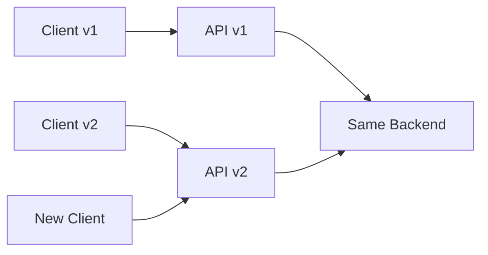
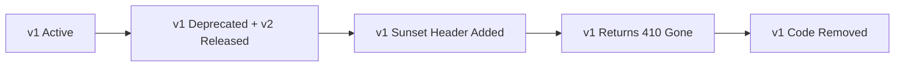

## The Problem — Breaking Changes

Your API is live. Clients depend on the response format. Now you need to:
- Rename a field (`userName` → `username`)
- Remove a deprecated field
- Change a data type (`String` → `Object`)
- Restructure the response entirely

Without versioning, every change risks breaking existing clients. You need a strategy that lets you evolve the API while giving clients time to migrate.



The challenge isn't implementing versions — it's choosing the right strategy and managing the lifecycle.

---

## Strategy 1: URI Path Versioning

The most visible and widely used approach. The version is part of the URL.

```
GET /api/v1/users/42
GET /api/v2/users/42
```

### Implementation

```java
@RestController
@RequestMapping("/api/v1/users")
public class UserControllerV1 {

    @GetMapping("/{id}")
    public UserResponseV1 getUser(@PathVariable Long id) {
        User user = userService.findById(id);
        return new UserResponseV1(user.getId(), user.getFirstName() + " " + user.getLastName(), user.getEmail());
    }
}

public record UserResponseV1(Long id, String userName, String email) {}
```

```java
@RestController
@RequestMapping("/api/v2/users")
public class UserControllerV2 {

    @GetMapping("/{id}")
    public UserResponseV2 getUser(@PathVariable Long id) {
        User user = userService.findById(id);
        return new UserResponseV2(
                user.getId(),
                new UserResponseV2.Name(user.getFirstName(), user.getLastName()),
                user.getEmail(),
                user.getCreatedAt()
        );
    }
}

public record UserResponseV2(Long id, Name name, String email, Instant createdAt) {
    public record Name(String first, String last) {}
}
```

### Shared Logic with a Versioned Facade

Avoid duplicating business logic. Version the response, not the service:

```java
@RestController
@RequestMapping("/api")
public class UserController {

    private final UserService userService;

    @GetMapping("/v1/users/{id}")
    public UserResponseV1 getUserV1(@PathVariable Long id) {
        return userService.findById(id).toV1();
    }

    @GetMapping("/v2/users/{id}")
    public UserResponseV2 getUserV2(@PathVariable Long id) {
        return userService.findById(id).toV2();
    }
}
```

---

## Strategy 2: Custom Header Versioning

The version lives in a request header, keeping URLs clean.

```
GET /api/users/42
X-API-Version: 1

GET /api/users/42
X-API-Version: 2
```

### Implementation with Custom RequestCondition

Spring MVC doesn't support header-based versioning out of the box, but you can build it with a custom annotation and `RequestCondition`:

```java
@Target({ElementType.METHOD, ElementType.TYPE})
@Retention(RetentionPolicy.RUNTIME)
public @interface ApiVersion {
    int value();
}
```

```java
public class ApiVersionCondition implements RequestCondition<ApiVersionCondition> {

    private final int version;

    public ApiVersionCondition(int version) {
        this.version = version;
    }

    @Override
    public ApiVersionCondition combine(ApiVersionCondition other) {
        // Method-level annotation takes precedence
        return new ApiVersionCondition(other.version);
    }

    @Override
    public ApiVersionCondition getMatchingCondition(HttpServletRequest request) {
        String headerVersion = request.getHeader("X-API-Version");
        if (headerVersion == null) {
            // Default to latest version if no header
            return this;
        }
        int requestedVersion = Integer.parseInt(headerVersion);
        if (requestedVersion == this.version) {
            return this;
        }
        return null; // no match
    }

    @Override
    public int compareTo(ApiVersionCondition other, HttpServletRequest request) {
        return Integer.compare(other.version, this.version); // higher version wins
    }
}
```

Register the condition via a custom `RequestMappingHandlerMapping`:

```java
public class ApiVersionRequestMappingHandlerMapping extends RequestMappingHandlerMapping {

    @Override
    protected RequestCondition<?> getCustomTypeCondition(Class<?> handlerType) {
        ApiVersion annotation = AnnotationUtils.findAnnotation(handlerType, ApiVersion.class);
        return annotation != null ? new ApiVersionCondition(annotation.value()) : null;
    }

    @Override
    protected RequestCondition<?> getCustomMethodCondition(Method method) {
        ApiVersion annotation = AnnotationUtils.findAnnotation(method, ApiVersion.class);
        return annotation != null ? new ApiVersionCondition(annotation.value()) : null;
    }
}
```

```java
@Configuration
public class WebMvcConfig implements WebMvcRegistrations {

    @Override
    public RequestMappingHandlerMapping getRequestMappingHandlerMapping() {
        return new ApiVersionRequestMappingHandlerMapping();
    }
}
```

Now use it in controllers:

```java
@RestController
@RequestMapping("/api/users")
public class UserController {

    @GetMapping("/{id}")
    @ApiVersion(1)
    public UserResponseV1 getUserV1(@PathVariable Long id) {
        return userService.findById(id).toV1();
    }

    @GetMapping("/{id}")
    @ApiVersion(2)
    public UserResponseV2 getUserV2(@PathVariable Long id) {
        return userService.findById(id).toV2();
    }
}
```

---

## Strategy 3: Content Negotiation (Accept Header)

Uses the `Accept` header with a vendor-specific media type:

```
GET /api/users/42
Accept: application/vnd.myapp.v1+json

GET /api/users/42
Accept: application/vnd.myapp.v2+json
```

### Implementation

```java
@RestController
@RequestMapping("/api/users")
public class UserController {

    @GetMapping(value = "/{id}", produces = "application/vnd.myapp.v1+json")
    public UserResponseV1 getUserV1(@PathVariable Long id) {
        return userService.findById(id).toV1();
    }

    @GetMapping(value = "/{id}", produces = "application/vnd.myapp.v2+json")
    public UserResponseV2 getUserV2(@PathVariable Long id) {
        return userService.findById(id).toV2();
    }
}
```

Register custom media types so Spring can serialize them as JSON:

```java
@Configuration
public class WebConfig implements WebMvcConfigurer {

    @Override
    public void configureContentNegotiation(ContentNegotiationConfigurer configurer) {
        configurer.defaultContentType(MediaType.APPLICATION_JSON);
    }

    @Override
    public void extendMessageConverters(List<HttpMessageConverter<?>> converters) {
        converters.stream()
                .filter(c -> c instanceof MappingJackson2HttpMessageConverter)
                .map(c -> (MappingJackson2HttpMessageConverter) c)
                .forEach(converter -> {
                    var types = new ArrayList<>(converter.getSupportedMediaTypes());
                    types.add(MediaType.parseMediaType("application/vnd.myapp.v1+json"));
                    types.add(MediaType.parseMediaType("application/vnd.myapp.v2+json"));
                    converter.setSupportedMediaTypes(types);
                });
    }
}
```

---

## Comparison

| Criteria | URI Path | Custom Header | Content Negotiation |
|----------|----------|---------------|---------------------|
| Visibility | High — version in URL | Low — hidden in headers | Low — hidden in Accept |
| Caching | Easy — URL-based caching works | Requires Vary header | Requires Vary header |
| Browser testing | Easy — just change URL | Needs tools (curl, Postman) | Needs tools |
| API gateway routing | Simple path matching | Header inspection | Header inspection |
| Client complexity | Low | Medium | Medium-High |
| URL cleanliness | Cluttered (/v1/, /v2/) | Clean | Clean |
| REST purist opinion | "Not RESTful" | Acceptable | Preferred |
| Real-world adoption | Most common (GitHub, Stripe) | Common (Azure) | Rare (GitHub alternative) |

---

## Deprecation Strategy

Versioning is only half the story. You need a plan for sunsetting old versions.

### Sunset Header (RFC 8594)

Signal to clients that a version is going away:

```java
@GetMapping("/{id}")
@ApiVersion(1)
public ResponseEntity<UserResponseV1> getUserV1(@PathVariable Long id) {
    UserResponseV1 response = userService.findById(id).toV1();
    return ResponseEntity.ok()
            .header("Sunset", "Sat, 01 Mar 2027 00:00:00 GMT")
            .header("Deprecation", "true")
            .header("Link", "</api/v2/users>; rel=\"successor-version\"")
            .body(response);
}
```

### @Deprecated Annotation for Internal Tracking

```java
@Deprecated(since = "v2", forRemoval = true)
@GetMapping("/{id}")
@ApiVersion(1)
public UserResponseV1 getUserV1(@PathVariable Long id) {
    return userService.findById(id).toV1();
}
```

### Deprecation Workflow



Timeline guidance:
- **Deprecation notice**: 6+ months before removal
- **Sunset header**: Start immediately when deprecated
- **410 Gone**: After sunset date passes
- **Code removal**: After confirming zero traffic on deprecated version

---

## When to Version

Not every change needs a new version. Follow these semantic rules:

**Breaking (requires new version):**
- Removing a field from the response
- Renaming a field
- Changing a field's type
- Removing an endpoint
- Changing error response format

**Non-breaking (safe without versioning):**
- Adding a new field to the response
- Adding a new endpoint
- Adding an optional request parameter
- Fixing a bug (even if output changes)
- Performance improvements

**Gray area (use feature flags or negotiate):**
- Adding a required request parameter
- Changing default values
- Changing pagination defaults

A useful rule: if existing clients break without code changes, it needs a version.

---

## Common Problems

| Problem | Cause | Solution |
|---------|-------|----------|
| Duplicated business logic | Separate controllers per version | Share service layer, version only the response mapping |
| Version explosion | Too many versions active | Strict deprecation policy with sunset dates |
| Testing combinatorics | Every endpoint × every version | Version integration tests, share unit tests for business logic |
| Documentation drift | Multiple API docs | Use OpenAPI groups per version |
| Default version confusion | No version header sent | Define a clear default (latest or oldest) and document it |
| Custom header not forwarded | Proxy/CDN strips headers | Whitelist `X-API-Version` in your reverse proxy config |
| Content negotiation 406 errors | Custom media type not registered | Register vendor types in message converters |
| Routing conflicts | Two methods match same request | Ensure `RequestCondition` properly differentiates |

---

## Recommendations

1. **Start with URI path versioning** — it's the simplest, most debuggable, and best supported by API gateways and caches
2. **Use header/content negotiation** when URL aesthetics matter or you have sophisticated clients (internal microservices, SDKs)
3. **Never version internal APIs** between your own services — use backward-compatible evolution instead
4. **Version the API, not individual endpoints** — all endpoints should be at the same version
5. **Limit active versions to 2-3** — more than that means your deprecation process is broken

---

## References

- [RFC 8594 — The Sunset HTTP Header Field](https://www.rfc-editor.org/rfc/rfc8594)
- [Spring MVC Request Mapping](https://docs.spring.io/spring-framework/reference/web/webmvc/mvc-controller/ann-requestmapping.html)
- [API Versioning — Microsoft REST API Guidelines](https://github.com/microsoft/api-guidelines/blob/vNext/azure/Guidelines.md)
- [Stripe API Versioning](https://stripe.com/docs/api/versioning)
- [GitHub API Versioning](https://docs.github.com/en/rest/about-the-rest-api/api-versions)
