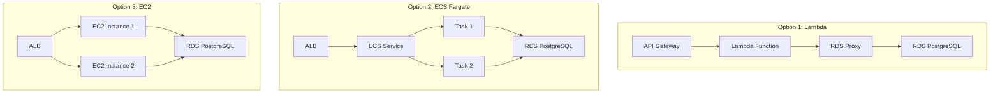
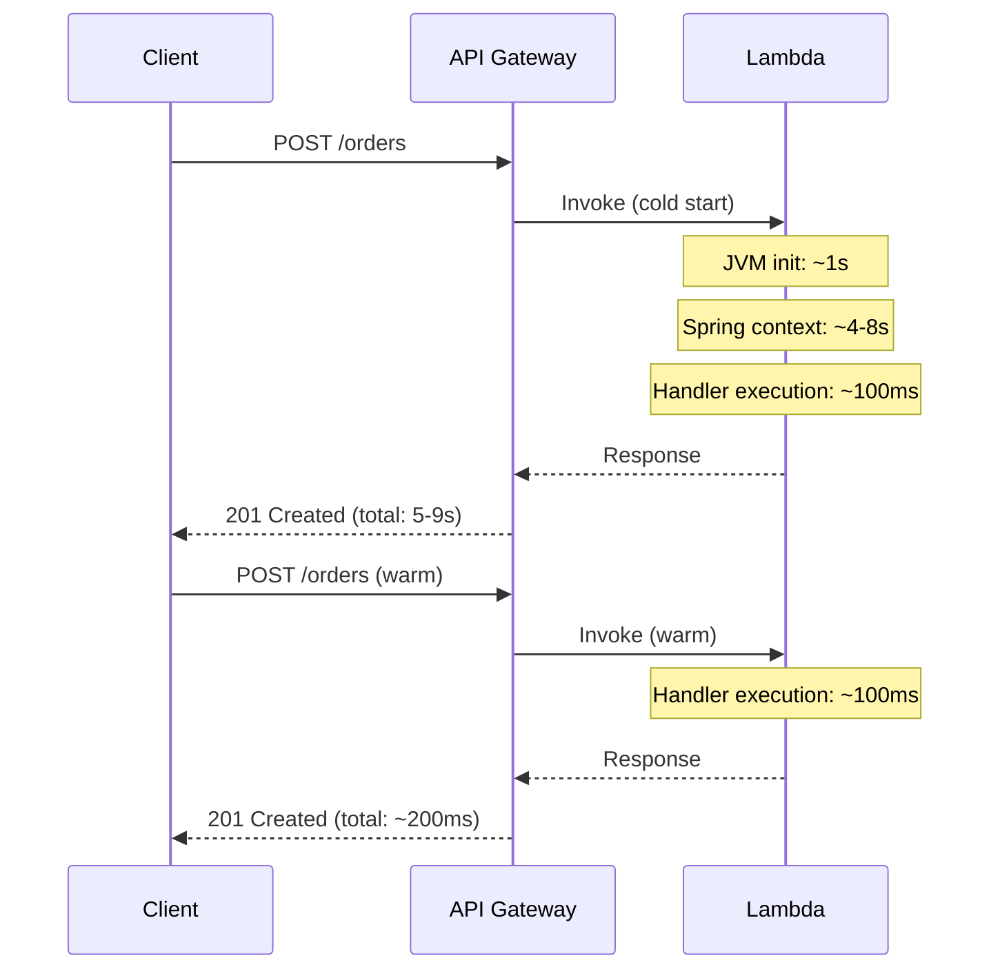
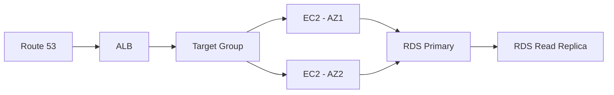

## The Problem — Which AWS Service?

You have a Spring Boot application ready for production. AWS offers dozens of compute options. The three most relevant for Spring Boot workloads are:

- **AWS Lambda** — serverless, pay per invocation
- **ECS Fargate** — containers without managing servers
- **EC2** — full control, traditional deployment

Each has different cost profiles, operational complexity, and performance characteristics. Choosing wrong means either overpaying or under-delivering.

## Three Deployment Models



## Option 1: AWS Lambda + SnapStart

### Spring Cloud Function

Convert your Spring Boot app to a Lambda function using Spring Cloud Function:

```xml
<dependency>
    <groupId>org.springframework.cloud</groupId>
    <artifactId>spring-cloud-function-adapter-aws</artifactId>
</dependency>
```

```java
@SpringBootApplication
public class OrderApplication {

    public static void main(String[] args) {
        SpringApplication.run(OrderApplication.class, args);
    }

    @Bean
    public Function<APIGatewayProxyRequestEvent, APIGatewayProxyResponseEvent> handleRequest(
            OrderService orderService, ObjectMapper mapper) {

        return request -> {
            try {
                Order order = mapper.readValue(request.getBody(), Order.class);
                Order saved = orderService.createOrder(order);

                APIGatewayProxyResponseEvent response = new APIGatewayProxyResponseEvent();
                response.setStatusCode(201);
                response.setBody(mapper.writeValueAsString(saved));
                return response;
            } catch (Exception e) {
                APIGatewayProxyResponseEvent response = new APIGatewayProxyResponseEvent();
                response.setStatusCode(500);
                response.setBody("{\"error\": \"" + e.getMessage() + "\"}");
                return response;
            }
        };
    }
}
```

### Cold Start Problem

Spring Boot on Lambda has a notorious cold start problem. A fresh JVM + Spring context initialization can take 5-15 seconds.



### Cold Start Optimization

| Strategy            | Cold Start Improvement | Tradeoff                                |
|---------------------|------------------------|-----------------------------------------|
| SnapStart           | ~80% reduction         | Java 11+ only, snapshot restore time    |
| GraalVM Native      | ~95% reduction         | Build time, reflection limitations      |
| Provisioned Concurrency | Eliminates cold start | Costs money even with no traffic       |
| Class Data Sharing  | ~20% reduction         | Minimal effort                          |
| Lazy initialization | ~30% reduction         | First-request latency shifts            |

### SnapStart Configuration

```yaml
# SAM template
Resources:
  OrderFunction:
    Type: AWS::Serverless::Function
    Properties:
      Handler: org.springframework.cloud.function.adapter.aws.FunctionInvoker::handleRequest
      Runtime: java21
      SnapStart:
        ApplyOn: PublishedVersions
      MemorySize: 1024
      Timeout: 30
      Environment:
        Variables:
          SPRING_DATASOURCE_URL: !Sub "jdbc:postgresql://${RDSProxy.Endpoint}:5432/orderdb"
```

SnapStart takes a snapshot of the initialized JVM after the first invocation. Subsequent cold starts restore from the snapshot instead of initializing from scratch.

## Option 2: ECS Fargate

For always-on workloads with predictable traffic, ECS Fargate runs your Spring Boot app as a container without managing EC2 instances.

### Dockerfile

```dockerfile
FROM eclipse-temurin:21-jre-alpine
WORKDIR /app
COPY target/order-service-0.0.1-SNAPSHOT.jar app.jar
EXPOSE 8080
ENTRYPOINT ["java", "-jar", "app.jar"]
```

### Task Definition

```json
{
  "family": "order-service",
  "networkMode": "awsvpc",
  "requiresCompatibilities": ["FARGATE"],
  "cpu": "512",
  "memory": "1024",
  "containerDefinitions": [
    {
      "name": "order-service",
      "image": "123456789012.dkr.ecr.us-east-1.amazonaws.com/order-service:latest",
      "portMappings": [
        { "containerPort": 8080, "protocol": "tcp" }
      ],
      "environment": [
        { "name": "SPRING_DATASOURCE_URL", "value": "jdbc:postgresql://rds-endpoint:5432/orderdb" }
      ],
      "secrets": [
        { "name": "SPRING_DATASOURCE_PASSWORD", "valueFrom": "arn:aws:secretsmanager:..." }
      ],
      "logConfiguration": {
        "logDriver": "awslogs",
        "options": {
          "awslogs-group": "/ecs/order-service",
          "awslogs-region": "us-east-1",
          "awslogs-stream-prefix": "ecs"
        }
      },
      "healthCheck": {
        "command": ["CMD-SHELL", "curl -f http://localhost:8080/actuator/health || exit 1"],
        "interval": 30,
        "timeout": 5,
        "retries": 3
      }
    }
  ]
}
```

### Auto-Scaling

```json
{
  "ServiceScalingTarget": {
    "MinCapacity": 2,
    "MaxCapacity": 10,
    "ResourceId": "service/my-cluster/order-service",
    "ScalableDimension": "ecs:service:DesiredCount"
  },
  "ScalingPolicy": {
    "PolicyType": "TargetTrackingScaling",
    "TargetTrackingScalingPolicyConfiguration": {
      "TargetValue": 70.0,
      "PredefinedMetricSpecification": {
        "PredefinedMetricType": "ECSServiceAverageCPUUtilization"
      },
      "ScaleInCooldown": 300,
      "ScaleOutCooldown": 60
    }
  }
}
```

## Option 3: Traditional EC2 + RDS

For workloads requiring full OS access, GPU instances, or custom networking:



This is the most familiar model but requires managing:
- AMIs and patching
- Auto Scaling Groups
- Instance types and sizing
- OS-level monitoring

## Connecting to RDS

### RDS Proxy (for Lambda)

Lambda creates many short-lived connections. Without RDS Proxy, you'll exhaust the database connection pool:

```yaml
spring:
  datasource:
    url: jdbc:postgresql://${RDS_PROXY_ENDPOINT}:5432/orderdb
    username: ${DB_USERNAME}
    password: ${DB_PASSWORD}
    hikari:
      maximum-pool-size: 2  # Lambda has limited connections
```

### IAM Authentication

Instead of storing passwords, use IAM database authentication:

```java
@Configuration
public class RdsIamConfig {

    @Bean
    public DataSource dataSource() {
        String token = RdsUtilities.builder()
                .region(Region.US_EAST_1)
                .build()
                .generateAuthenticationToken(builder -> builder
                        .hostname("my-db.cluster-xyz.us-east-1.rds.amazonaws.com")
                        .port(5432)
                        .username("app_user"));

        HikariConfig config = new HikariConfig();
        config.setJdbcUrl("jdbc:postgresql://my-db.cluster-xyz:5432/orderdb");
        config.setUsername("app_user");
        config.setPassword(token);
        return new HikariDataSource(config);
    }
}
```

### Secrets Manager Rotation

For ECS/EC2 deployments, use Secrets Manager with automatic rotation:

```java
@Configuration
public class SecretsConfig {

    @Value("${aws.secretsmanager.secret-id}")
    private String secretId;

    @Bean
    public DataSource dataSource(SecretsManagerClient smClient) {
        GetSecretValueResponse secret = smClient.getSecretValue(
                GetSecretValueRequest.builder().secretId(secretId).build());

        JsonNode credentials = new ObjectMapper().readTree(secret.secretString());

        HikariConfig config = new HikariConfig();
        config.setJdbcUrl("jdbc:postgresql://" + credentials.get("host").asText()
                + ":" + credentials.get("port").asText() + "/orderdb");
        config.setUsername(credentials.get("username").asText());
        config.setPassword(credentials.get("password").asText());
        return new HikariDataSource(config);
    }
}
```

## Cost Comparison

Assuming: 1 million requests/month, average 200ms execution, 512MB memory.

| Cost Factor        | Lambda                    | ECS Fargate (2 tasks)     | EC2 (2x t3.small)       |
|--------------------|---------------------------|---------------------------|--------------------------|
| Compute            | ~$4.17/month              | ~$36/month                | ~$30/month               |
| Always-on cost     | $0 (pay per use)          | $36/month (24/7)          | $30/month (24/7)         |
| API Gateway        | ~$3.50/month              | $0 (ALB: ~$16)            | $0 (ALB: ~$16)           |
| RDS Proxy          | ~$15/month (recommended)  | Not needed                | Not needed               |
| Total (low traffic)| ~$22/month                | ~$52/month                | ~$46/month               |
| At 100M req/month  | ~$420/month               | ~$72/month (auto-scale)   | ~$60/month (auto-scale)  |

**Key insight:** Lambda is cheapest at low traffic, most expensive at high traffic. ECS/EC2 cost stays relatively flat regardless of request count.

## Decision Matrix

| Criteria                          | Lambda              | ECS Fargate          | EC2                  |
|-----------------------------------|---------------------|----------------------|----------------------|
| Traffic pattern                   | Spiky / low         | Steady / growing     | Steady / high        |
| Cold start acceptable?            | Yes (with SnapStart)| N/A (always running) | N/A (always running) |
| Operational overhead              | Minimal             | Low                  | High                 |
| Cost at low traffic               | Lowest              | Medium               | Medium               |
| Cost at high traffic              | Highest             | Low                  | Lowest               |
| Startup time matters?             | Yes (seconds)       | Less (minutes OK)    | Less (minutes OK)    |
| Need persistent connections?      | No (use RDS Proxy)  | Yes                  | Yes                  |
| WebSocket / long-running needed?  | No                  | Yes                  | Yes                  |
| Team familiarity                  | Functions           | Containers           | Traditional ops      |

## Infrastructure as Code — CDK Snippet

```typescript
import * as cdk from 'aws-cdk-lib';
import * as ecs from 'aws-cdk-lib/aws-ecs';
import * as ecsPatterns from 'aws-cdk-lib/aws-ecs-patterns';
import * as rds from 'aws-cdk-lib/aws-rds';

export class OrderServiceStack extends cdk.Stack {
    constructor(scope: cdk.App, id: string) {
        super(scope, id);

        // RDS PostgreSQL
        const database = new rds.DatabaseInstance(this, 'OrderDB', {
            engine: rds.DatabaseInstanceEngine.postgres({
                version: rds.PostgresEngineVersion.VER_16,
            }),
            instanceType: ec2.InstanceType.of(ec2.InstanceClass.T4G, ec2.InstanceSize.MICRO),
            databaseName: 'orderdb',
            removalPolicy: cdk.RemovalPolicy.DESTROY,
        });

        // ECS Fargate Service with ALB
        const service = new ecsPatterns.ApplicationLoadBalancedFargateService(this, 'OrderService', {
            taskImageOptions: {
                image: ecs.ContainerImage.fromAsset('./'),
                containerPort: 8080,
                environment: {
                    SPRING_DATASOURCE_URL: `jdbc:postgresql://${database.dbInstanceEndpointAddress}:5432/orderdb`,
                },
                secrets: {
                    SPRING_DATASOURCE_PASSWORD: ecs.Secret.fromSecretsManager(database.secret!),
                },
            },
            cpu: 512,
            memoryLimitMiB: 1024,
            desiredCount: 2,
            publicLoadBalancer: true,
        });

        // Auto-scaling
        const scaling = service.service.autoScaleTaskCount({ maxCapacity: 10 });
        scaling.scaleOnCpuUtilization('CpuScaling', { targetUtilizationPercent: 70 });
    }
}
```

## Common Problems

| Problem                                 | Cause                                          | Solution                                               |
|-----------------------------------------|------------------------------------------------|--------------------------------------------------------|
| Lambda cold start > 10s                 | Full Spring Boot initialization                | Use SnapStart, GraalVM native, or provisioned concurrency |
| DB connection exhaustion (Lambda)       | Each invocation opens a new connection         | Use RDS Proxy to pool connections                      |
| ECS task fails health check             | App not ready within grace period              | Increase `healthCheckGracePeriodSeconds`               |
| High Lambda cost at scale               | Pay-per-invocation adds up                     | Migrate to ECS Fargate above breakeven point           |
| RDS publicly accessible                 | Security group misconfiguration                | Place RDS in private subnet, use VPC endpoints         |
| Secret rotation breaks app              | App caches old credentials                     | Use short-lived connections or Secrets Manager SDK     |
| ALB 502 during deployments              | Old tasks killed before new ones are healthy   | Use rolling deployment with `minimumHealthyPercent`    |
| Lambda timeout (default 3s)             | First request initializes Spring context       | Set timeout to 30s, use SnapStart                      |

## References

- [AWS Lambda with Spring Cloud Function](https://docs.spring.io/spring-cloud-function/reference/adapters/aws-intro.html)
- [AWS Lambda SnapStart](https://docs.aws.amazon.com/lambda/latest/dg/snapstart.html)
- [Amazon ECS Developer Guide](https://docs.aws.amazon.com/AmazonECS/latest/developerguide/)
- [Amazon RDS Proxy](https://docs.aws.amazon.com/AmazonRDS/latest/UserGuide/rds-proxy.html)
- [AWS CDK Documentation](https://docs.aws.amazon.com/cdk/v2/guide/home.html)
- [Spring Boot on AWS — AWS Blog](https://aws.amazon.com/blogs/opensource/spring-boot-on-aws/)
