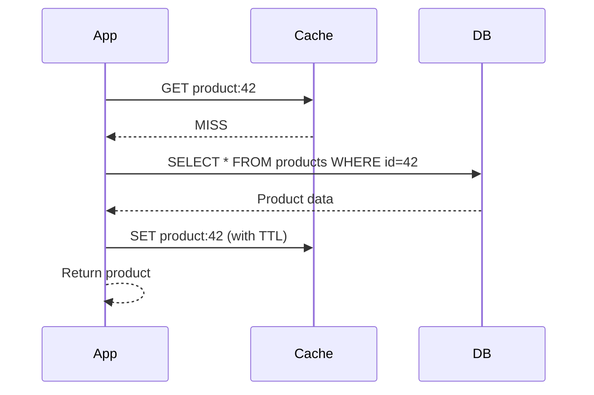
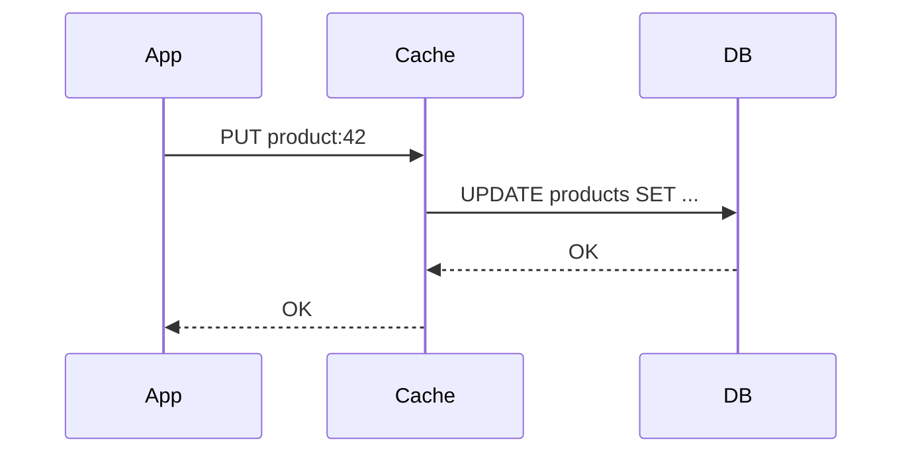
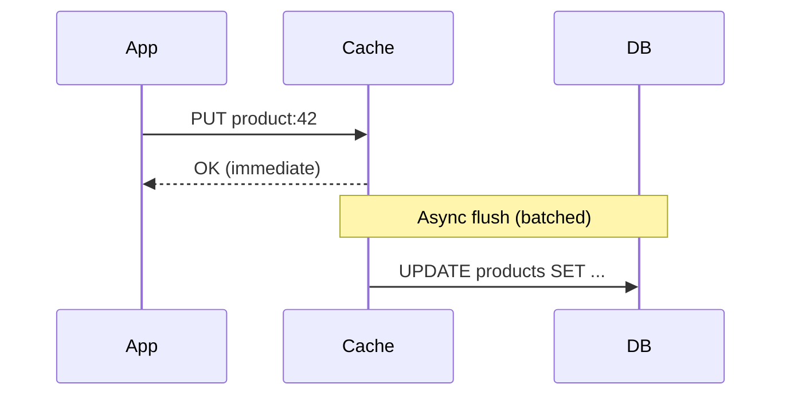
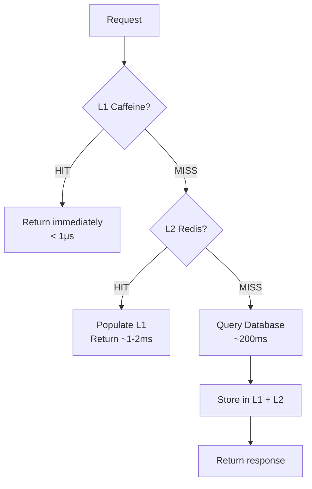

## The Problem

You have a product catalog service. A single `findById` query takes 200ms because it joins five tables, runs through business logic, and formats the response. Now multiply that by 1000 requests per minute — that's **200 seconds of CPU time** every minute for the exact same result.

Caching is the most effective performance optimization you can apply when data is read far more often than it's written. In this post, we'll build a multi-level caching solution with Spring Boot that reduces those 200ms reads to sub-millisecond responses.

We'll cover:
- In-memory caching with Caffeine
- Distributed caching with Redis
- Multi-level caching combining both
- The annotations that make it all work
- Production pitfalls that will bite you

---

## Caching Patterns

Before writing code, let's understand the three primary caching patterns.

### Cache-Aside (Lazy Loading)

The application checks the cache first. On a miss, it fetches from the database and stores the result in cache.



**Pros**: Only requested data is cached. Cache failures don't break reads.
**Cons**: First request is always slow (cold cache). Possible stale reads.

### Write-Through

Every write goes to both cache and database synchronously.



**Pros**: Cache is always consistent. No stale reads.
**Cons**: Write latency increases. Unused data may fill the cache.

### Write-Behind (Write-Back)

Writes go to the cache immediately and are asynchronously flushed to the database.



**Pros**: Fastest writes. Batch writes reduce DB load.
**Cons**: Risk of data loss if cache crashes before flush.

---

## Step 1: Simple Caching with Caffeine

Caffeine is the highest-performing in-memory cache for Java. It uses a W-TinyLFU eviction policy that outperforms LRU in most workloads.

### Dependencies

```xml
<dependency>
    <groupId>org.springframework.boot</groupId>
    <artifactId>spring-boot-starter-cache</artifactId>
</dependency>
<dependency>
    <groupId>com.github.ben-manes.caffeine</groupId>
    <artifactId>caffeine</artifactId>
</dependency>
```

### Enable Caching

```java
@SpringBootApplication
@EnableCaching
public class CachingApplication {
    public static void main(String[] args) {
        SpringApplication.run(CachingApplication.class, args);
    }
}
```

### Configure Caffeine

```java
@Bean
@Primary
public CacheManager caffeineCacheManager() {
    CaffeineCacheManager cacheManager = new CaffeineCacheManager("products", "productList");
    cacheManager.setCaffeine(Caffeine.newBuilder()
            .maximumSize(500)
            .expireAfterWrite(60, TimeUnit.SECONDS)
            .recordStats());
    return cacheManager;
}
```

Key settings:
- `maximumSize(500)` — Evicts least-valuable entries when full
- `expireAfterWrite(60s)` — Entries expire 60 seconds after creation
- `recordStats()` — Enables hit/miss metrics (useful for monitoring)

### Use @Cacheable

```java
@Cacheable(value = "products", key = "#id")
public Product findById(Long id) {
    log.info("Cache MISS — fetching product {} from database", id);
    simulateDatabaseDelay();
    return database.get(id);
}
```

First call: 200ms (database). Subsequent calls: <1ms (memory).

---

## Step 2: Distributed Caching with Redis

Caffeine is fast but local to a single JVM. When you scale to multiple instances, each has its own cache — leading to inconsistency and redundant database calls.

Redis solves this by providing a shared, network-accessible cache.

### Dependencies

```xml
<dependency>
    <groupId>org.springframework.boot</groupId>
    <artifactId>spring-boot-starter-data-redis</artifactId>
</dependency>
```

### Redis Configuration

```yaml
spring:
  data:
    redis:
      host: localhost
      port: 6379
      timeout: 2000ms
      lettuce:
        pool:
          max-active: 10
          max-idle: 5
          min-idle: 2
```

### Redis CacheManager

```java
@Bean
public CacheManager redisCacheManager(RedisConnectionFactory connectionFactory) {
    RedisCacheConfiguration config = RedisCacheConfiguration.defaultCacheConfig()
            .entryTtl(Duration.ofMinutes(10))
            .serializeValuesWith(
                    RedisSerializationContext.SerializationPair
                            .fromSerializer(new GenericJackson2JsonRedisSerializer()))
            .disableCachingNullValues();

    return RedisCacheManager.builder(connectionFactory)
            .cacheDefaults(config)
            .withCacheConfiguration("products",
                    config.entryTtl(Duration.ofMinutes(10)))
            .withCacheConfiguration("productList",
                    config.entryTtl(Duration.ofMinutes(5)))
            .build();
}
```

Redis gives you:
- **Shared state** across all instances
- **Persistence** — cache survives app restarts
- **Larger capacity** — not limited by JVM heap

The trade-off: every cache read/write is a network call (~1-2ms vs <1μs for Caffeine).

---

## Step 3: Multi-Level Caching (Caffeine L1 + Redis L2)

The optimal architecture combines both: Caffeine as L1 (fast, local) and Redis as L2 (shared, durable).



### How It Works

1. **Request arrives** — Check Caffeine (L1) first
2. **L1 HIT** — Return immediately, no network call
3. **L1 MISS** — Check Redis (L2)
4. **L2 HIT** — Populate L1 with the value, return
5. **L2 MISS** — Hit the database, store in both L1 and L2

### Implementation Strategy

Spring's `@Cacheable` doesn't natively support multi-level caching with a single annotation. You have two options:

**Option A**: Use `@Primary` on Caffeine and fall through to Redis manually:

```java
@Service
public class ProductService {

    private final CacheManager caffeineCacheManager;
    private final CacheManager redisCacheManager;

    @Cacheable(value = "products", key = "#id", cacheManager = "caffeineCacheManager")
    public Product findById(Long id) {
        // L1 miss — try L2
        Cache redisCache = redisCacheManager.getCache("products");
        if (redisCache != null) {
            Cache.ValueWrapper cached = redisCache.get(id);
            if (cached != null) {
                return (Product) cached.get();
            }
        }
        // L2 miss — hit database
        Product product = fetchFromDatabase(id);
        if (redisCache != null && product != null) {
            redisCache.put(id, product);
        }
        return product;
    }
}
```

**Option B**: Use a `CompositeCacheManager` that checks caches in order:

```java
@Bean
public CacheManager cacheManager(CacheManager caffeineCacheManager,
                                  CacheManager redisCacheManager) {
    CompositeCacheManager composite = new CompositeCacheManager();
    composite.setCacheManagers(List.of(caffeineCacheManager, redisCacheManager));
    composite.setFallbackToNoOpCache(false);
    return composite;
}
```

Option A gives more control over L1↔L2 promotion. Option B is simpler but less flexible.

---

## @Cacheable, @CacheEvict, @CachePut — When to Use Which

| Annotation | Behavior | Use Case |
|---|---|---|
| `@Cacheable` | Returns cached value on HIT; executes method on MISS | Read operations, expensive queries |
| `@CachePut` | Always executes method, updates cache with result | Write/update operations where cache must stay fresh |
| `@CacheEvict` | Removes entry from cache | Delete operations, data invalidation |
| `@Caching` | Combines multiple cache operations | Complex operations touching multiple caches |

### @Cacheable — Read-Through

```java
@Cacheable(value = "products", key = "#id")
public Product findById(Long id) { ... }
```

The method body only executes on a cache miss. The return value is stored in cache.

### @CachePut — Write and Refresh

```java
@CachePut(value = "products", key = "#result.id()")
@CacheEvict(value = "productList", key = "'allProducts'")
public Product save(Product product) { ... }
```

Always executes the method. Updates the `products` cache with the new value. Also evicts the product list since it's now stale.

### @CacheEvict — Invalidate

```java
@CacheEvict(value = "products", key = "#id")
public void delete(Long id) { ... }
```

Removes the cache entry. Next read will go to the database.

### Evict Everything

```java
@CacheEvict(value = "products", allEntries = true)
@Scheduled(fixedRate = 3600000) // every hour
public void evictAllProducts() {
    log.info("Evicting all product cache entries");
}
```

---

## TTL Strategies

### Fixed TTL

The simplest approach. Every entry expires after a fixed duration.

```java
.expireAfterWrite(60, TimeUnit.SECONDS)  // Caffeine
.entryTtl(Duration.ofMinutes(10))         // Redis
```

Good for: product catalogs, configuration data, reference data.

### Sliding Window (Expire After Access)

The TTL resets every time the entry is read.

```java
Caffeine.newBuilder()
    .expireAfterAccess(5, TimeUnit.MINUTES)
```

Good for: user sessions, frequently accessed hot data.

### Cache Warming

Pre-load critical data at startup to avoid cold-cache latency spikes.

```java
@Component
public class CacheWarmer implements ApplicationRunner {

    private final ProductService productService;

    @Override
    public void run(ApplicationArguments args) {
        log.info("Warming product cache...");
        productService.findAll(); // Triggers @Cacheable population
    }
}
```

### TTL Guidelines

| Data Type | Suggested TTL | Reasoning |
|---|---|---|
| Static reference data | 1-24 hours | Rarely changes |
| Product catalog | 5-15 minutes | Moderate change frequency |
| User session data | 30 min sliding | Reset on activity |
| Pricing / inventory | 30-60 seconds | High change frequency |
| Real-time data | Don't cache | Stale data is wrong data |

---

## Cache Key Design

Spring uses SpEL (Spring Expression Language) for cache keys.

### Basic Key

```java
@Cacheable(value = "products", key = "#id")
public Product findById(Long id) { ... }
// Key: products::42
```

### Composite Key

```java
@Cacheable(value = "products", key = "#category + ':' + #page")
public List<Product> findByCategory(String category, int page) { ... }
// Key: products::Electronics:0
```

### Object Property Key

```java
@Cacheable(value = "products", key = "#filter.category + ':' + #filter.minPrice")
public List<Product> search(ProductFilter filter) { ... }
```

### Custom KeyGenerator

For complex scenarios, implement a `KeyGenerator`:

```java
@Bean
public KeyGenerator productKeyGenerator() {
    return (target, method, params) -> {
        StringBuilder sb = new StringBuilder();
        sb.append(method.getName()).append(":");
        for (Object param : params) {
            sb.append(param.toString()).append(":");
        }
        return sb.toString();
    };
}
```

Usage:

```java
@Cacheable(value = "products", keyGenerator = "productKeyGenerator")
public List<Product> complexSearch(String q, String sort, int page) { ... }
```

### Key Design Best Practices

- Keep keys short — they consume memory in Redis
- Include only fields that affect the result
- Avoid using mutable objects as keys
- Use a consistent prefix/namespace to avoid collisions

---

## Common Pitfalls

| Pitfall | What Happens | Solution |
|---|---|---|
| **Self-invocation** | Calling a `@Cacheable` method from within the same class bypasses the proxy | Inject the service into itself, or extract to a separate class |
| **Mutable cached objects** | Caller modifies the cached object, corrupting future reads | Use records/immutable objects, or return defensive copies |
| **Missing Serializable** | Redis can't serialize the object | Implement `Serializable` or use a JSON serializer |
| **Null values** | Null results get cached, masking future writes | Use `unless = "#result == null"` or `disableCachingNullValues()` |
| **Large objects** | Serializing huge objects adds latency | Cache IDs/summaries, not full aggregates |
| **No TTL** | Stale data served indefinitely | Always set a TTL, even a long one |
| **Cache stampede** | Multiple threads hit DB simultaneously on expiry | Use `sync = true` on `@Cacheable` |
| **Inconsistent eviction** | Update DB but forget to evict cache | Use `@CachePut` + `@CacheEvict` together |

### Self-Invocation Fix

```java
// BROKEN — cache is bypassed
@Service
public class ProductService {
    public Product getProduct(Long id) {
        return findById(id); // direct call, no proxy!
    }

    @Cacheable("products")
    public Product findById(Long id) { ... }
}

// FIXED — use self-injection
@Service
public class ProductService {
    @Autowired
    private ProductService self;

    public Product getProduct(Long id) {
        return self.findById(id); // goes through proxy
    }
}
```

### Cache Stampede Prevention

```java
@Cacheable(value = "products", key = "#id", sync = true)
public Product findById(Long id) { ... }
```

With `sync = true`, only one thread executes the method on a cache miss. Others wait for the result.

---

## Full Working Example

The complete source code is available on GitHub:

[**github.com/AnupamSinha/spring-boot-examples/tree/main/15-caching**](https://github.com/AnupamSinha/spring-boot-examples/tree/main/15-caching)

### Running Locally

```bash
# Start Redis
docker compose up -d

# Run the application
./mvnw spring-boot:run
```

### Testing the Cache

```bash
# First call — 200ms (cache miss)
curl -w "\nTime: %{time_total}s\n" http://localhost:8080/api/products/1

# Second call — <5ms (cache hit)
curl -w "\nTime: %{time_total}s\n" http://localhost:8080/api/products/1

# Update — triggers cache refresh
curl -X PUT http://localhost:8080/api/products/1 \
  -H "Content-Type: application/json" \
  -d '{"name":"MacBook Pro 14\"","price":1999.99,"category":"Electronics"}'

# Next read reflects the update immediately
curl http://localhost:8080/api/products/1
```

### Project Structure

```
spring-boot-caching/
├── docker-compose.yml
├── pom.xml
└── src/main/java/com/anupam/caching/
    ├── CachingApplication.java
    ├── config/
    │   └── CacheConfig.java
    ├── controller/
    │   └── ProductController.java
    ├── model/
    │   └── Product.java
    └── service/
        └── ProductService.java
```

---

## References

- [Spring Framework Cache Abstraction](https://docs.spring.io/spring-framework/reference/integration/cache.html)
- [Caffeine GitHub — High performance caching library](https://github.com/ben-manes/caffeine)
- [Spring Data Redis Reference](https://docs.spring.io/spring-data/redis/reference/)
- [Caffeine W-TinyLFU Paper](https://arxiv.org/abs/1512.00727)
- [Redis Documentation](https://redis.io/docs/)
