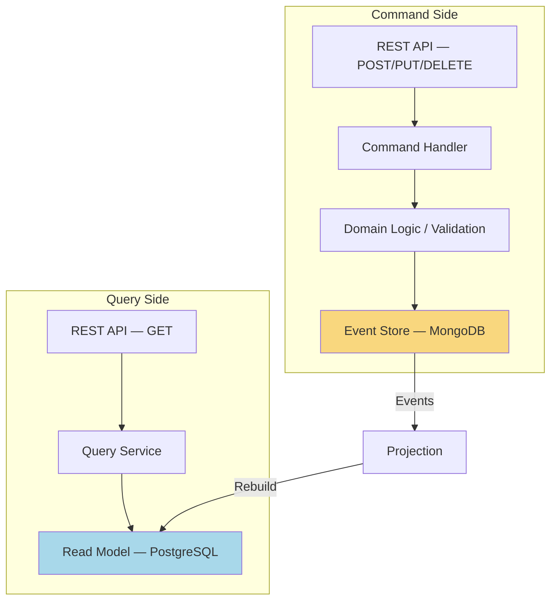
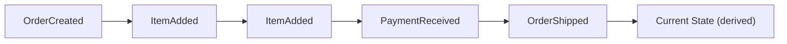
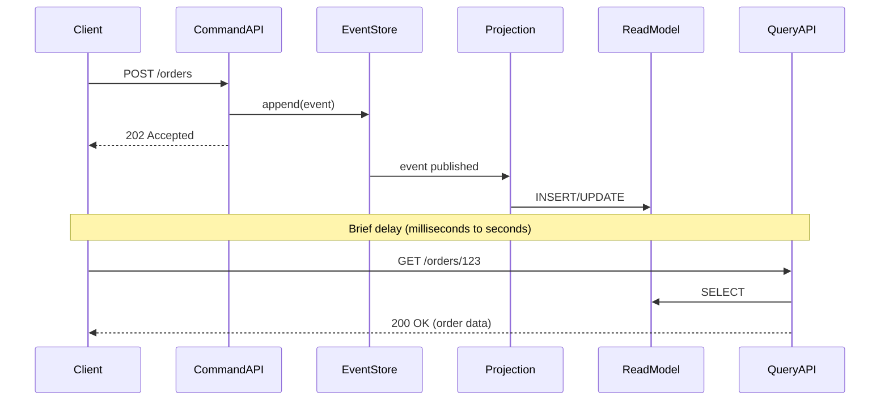

## The Problem

Traditional CRUD applications use a single data model for both reads and writes. This works fine until:

- Your read patterns diverge sharply from your write patterns
- You need an audit trail of every change that ever happened
- Different views of the same data need different structures
- Write throughput and read throughput need to scale independently

When you find yourself adding `_history` tables, fighting ORM lazy-loading issues on complex read queries, or denormalizing your write model to serve dashboards — you've outgrown a single model.

---

## What is CQRS?

CQRS (Command Query Responsibility Segregation) separates the write model (commands) from the read model (queries). Each side gets its own optimized data structure.




Commands mutate state. Queries never mutate. They don't even share a database.

---

## What is Event Sourcing?

Instead of storing the *current state* of an entity, you store every *event* that happened to it. The current state is derived by replaying events.




Benefits:
- **Complete audit trail** — you know exactly what happened and when
- **Temporal queries** — reconstruct state at any point in time
- **Event replay** — rebuild read models or fix bugs by reprocessing events
- **Debugging** — reproduce any issue by replaying the event sequence

---

## When to Use CQRS + Event Sourcing

| Use When | Avoid When |
|----------|-----------|
| Read/write patterns are very different | Simple CRUD with uniform access patterns |
| You need a complete audit trail | Audit requirements are minimal |
| Multiple read models from same data | One read view is sufficient |
| High read:write ratio (100:1+) | Balanced read/write load |
| Domain is complex with many business rules | Domain is mostly data entry |
| You need temporal queries | Current state is always sufficient |
| Team understands eventual consistency | Team expects immediate consistency |

---

## Implementation

### Project Structure

```
spring-boot-cqrs-eventsourcing/
├── docker-compose.yml          # PostgreSQL + MongoDB
├── src/main/java/com/anupam/cqrs/
│   ├── CqrsApplication.java
│   ├── command/
│   │   ├── CreateOrderCommand.java      # What to do (intent)
│   │   └── handler/
│   │       └── OrderCommandHandler.java # How to do it
│   ├── event/
│   │   ├── OrderCreatedEvent.java       # What happened (fact)
│   │   └── store/
│   │       ├── EventStore.java          # Interface
│   │       └── MongoEventStore.java     # MongoDB implementation
│   ├── projection/
│   │   └── OrderProjection.java         # Events → Read Model
│   ├── query/
│   │   └── OrderQueryService.java       # Reads from PostgreSQL
│   └── controller/
│       ├── OrderCommandController.java  # POST endpoints
│       └── OrderQueryController.java    # GET endpoints
└── src/main/resources/
    └── application.yml
```

### Command — Expressing Intent

Commands represent what the user *wants* to do. They are imperative and may be rejected.

```java
public record CreateOrderCommand(
    @NotBlank String customerId,
    @NotEmpty @Valid List<OrderItem> items
) {
    public record OrderItem(
        @NotBlank String productId,
        int quantity,
        BigDecimal price
    ) {}
}
```

### Command Handler — Processing Commands, Emitting Events

The handler validates business rules, and if valid, produces an event representing what happened.

```java
@Service
public class OrderCommandHandler {

    private final EventStore eventStore;
    private final ApplicationEventPublisher eventPublisher;

    public OrderCommandHandler(EventStore eventStore, ApplicationEventPublisher eventPublisher) {
        this.eventStore = eventStore;
        this.eventPublisher = eventPublisher;
    }

    public String handle(CreateOrderCommand command) {
        String orderId = UUID.randomUUID().toString();

        BigDecimal total = command.items().stream()
            .map(item -> item.price().multiply(BigDecimal.valueOf(item.quantity())))
            .reduce(BigDecimal.ZERO, BigDecimal::add);

        var event = new OrderCreatedEvent(
            UUID.randomUUID().toString(),
            orderId,
            command.customerId(),
            mapItems(command.items()),
            total,
            Instant.now()
        );

        // Persist to event store (source of truth)
        eventStore.append(orderId, event);

        // Publish for projections to consume
        eventPublisher.publishEvent(event);

        return orderId;
    }
}
```

Key distinction: the command handler does NOT write to the read model. It only appends to the event store and publishes events.

### Event — What Happened (Immutable Fact)

```java
public record OrderCreatedEvent(
    String eventId,
    String orderId,
    String customerId,
    List<EventItem> items,
    BigDecimal totalAmount,
    Instant timestamp
) {
    public record EventItem(
        String productId,
        int quantity,
        BigDecimal price
    ) {}
}
```

Events are past-tense, immutable facts. They describe what *did* happen, not what *should* happen.

---

## Event Store with MongoDB

MongoDB is a natural fit for event stores: schema-flexible, append-optimized, and good at document queries.

```java
@Repository
public class MongoEventStore implements EventStore {

    private final MongoTemplate mongoTemplate;

    @Override
    public void append(String aggregateId, Object event) {
        var envelope = new EventEnvelope(
            UUID.randomUUID().toString(),
            aggregateId,
            event.getClass().getSimpleName(),
            event,
            Instant.now()
        );
        mongoTemplate.save(envelope, "events");
    }

    @Override
    public List<Object> getEvents(String aggregateId) {
        var query = Query.query(Criteria.where("aggregateId").is(aggregateId));
        return mongoTemplate.find(query, EventEnvelope.class, "events")
            .stream()
            .map(EventEnvelope::payload)
            .toList();
    }

    @Document(collection = "events")
    record EventEnvelope(
        @Id String id,
        String aggregateId,
        String eventType,
        Object payload,
        Instant storedAt
    ) {}
}
```

Each event is wrapped in an `EventEnvelope` with metadata — aggregate ID, event type, and storage timestamp.

---

## Read Model with PostgreSQL

The read model is a denormalized, query-optimized view. It exists purely to serve reads fast.

```java
@Component
public class OrderProjection {

    private final JdbcTemplate jdbcTemplate;

    @EventListener
    @Transactional
    public void on(OrderCreatedEvent event) {
        jdbcTemplate.update("""
            INSERT INTO orders_read_model (order_id, customer_id, item_count, total_amount, status, created_at)
            VALUES (?, ?, ?, ?, ?, ?)
            ON CONFLICT (order_id) DO NOTHING
            """,
            event.orderId(),
            event.customerId(),
            event.items().size(),
            event.totalAmount(),
            "CREATED",
            Timestamp.from(event.timestamp())
        );
    }
}
```

The projection listens to events and materializes them into a relational structure optimized for queries. If you need a different read shape (e.g., a dashboard summary), you add another projection — you never change the event store.

---

## Eventual Consistency Trade-offs

With CQRS, the read model is **eventually consistent** with the write model. After a command succeeds, the read model might not reflect the change for a brief period.




Strategies for handling this:

| Strategy | How It Works | Trade-off |
|----------|-------------|-----------|
| Accept 202 + poll | Client polls until read model catches up | Simple; adds latency |
| Return command result | Command returns created ID, client knows it exists | Tight coupling |
| WebSocket/SSE | Push notification when projection completes | Complex; real-time |
| Optimistic UI | Client assumes success, reconciles later | Best UX; complex error handling |

---

## When NOT to Use CQRS

CQRS + Event Sourcing adds significant complexity. Don't use it when:

1. **Simple CRUD** — If your app is mostly forms saving to a database, a single model is fine.
2. **Small team** — The operational overhead (two databases, projections, eventual consistency) requires team maturity.
3. **Strong consistency required** — If users cannot tolerate stale reads (e.g., account balance after transfer), CQRS adds friction.
4. **Low event volume** — If you produce <100 events/day, the audit table approach is simpler.
5. **No replay requirement** — If you never need to rebuild state from history, you're paying complexity for nothing.

---

## Common Problems

| Problem | Cause | Solution |
|---------|-------|----------|
| Read model is stale | Projection lag or failure | Add health checks; monitor projection offset |
| Event schema changed | New fields added to event | Use event upcasters to migrate old events |
| Projection fails mid-batch | Exception during rebuild | Implement idempotent projections with dedup keys |
| Event store grows unbounded | Never truncating events | Use snapshots to compress old aggregate state |
| Duplicate events | At-least-once delivery | Make projections idempotent (ON CONFLICT DO NOTHING) |
| Cannot query across aggregates | Read model per aggregate | Build a dedicated cross-aggregate projection |

---

## Full Working Example

The complete source code is available on GitHub:

[spring-boot-cqrs-eventsourcing](https://github.com/anupamsinha/spring-boot-cqrs-eventsourcing)

Run locally with Docker:

```bash
# Start PostgreSQL + MongoDB
docker compose up -d

# Run the application
./mvnw spring-boot:run

# Create an order
curl -X POST http://localhost:8080/api/commands/orders \
  -H "Content-Type: application/json" \
  -d '{
    "customerId": "cust-42",
    "items": [
      {"productId": "prod-1", "quantity": 2, "price": 29.99},
      {"productId": "prod-7", "quantity": 1, "price": 49.99}
    ]
  }'

# Query orders by customer
curl http://localhost:8080/api/queries/orders/cust-42
```

---

## References

- [Martin Fowler — CQRS](https://martinfowler.com/bliki/CQRS.html)
- [Martin Fowler — Event Sourcing](https://martinfowler.com/eaaDev/EventSourcing.html)
- [Greg Young — CQRS Documents](https://cqrs.files.wordpress.com/2010/11/cqrs_documents.pdf)
- [Spring Framework — Application Events](https://docs.spring.io/spring-framework/reference/core/beans/context-introduction.html#context-functionality-events)
- [MongoDB — Event Store Design](https://www.mongodb.com/docs/manual/core/document/)
