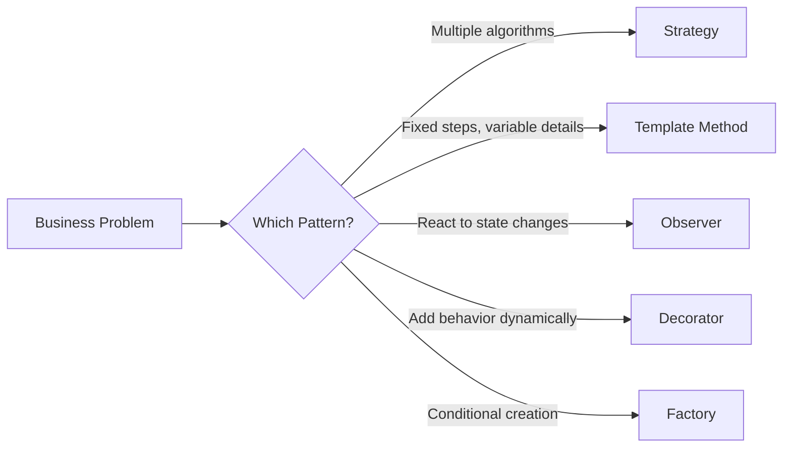
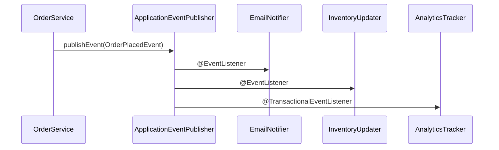
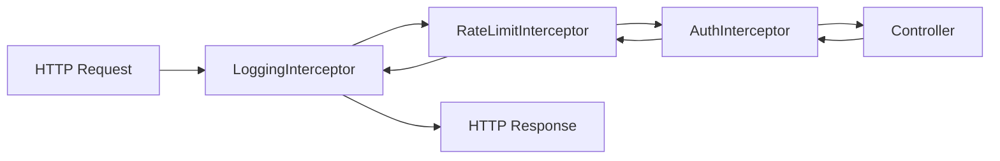

## The Problem

Every Spring Boot application uses design patterns — most developers just don't realize it. You inject interfaces, publish events, chain filters, and select beans conditionally. These are all classic Gang of Four patterns dressed in Spring clothing.

The problem isn't knowing pattern names. It's recognizing *when* a pattern solves your actual problem versus when it adds unnecessary abstraction. This post shows five patterns in real Spring Boot code — not toy examples, but production scenarios you'll encounter in any non-trivial application.



---

## Strategy Pattern — Multiple Payment Processors

The Strategy pattern defines a family of algorithms, encapsulates each one, and makes them interchangeable. In Spring Boot, this translates to an interface with multiple `@Service` implementations.

### The Interface (Strategy)

```java
public interface PaymentProcessor {

    String provider();

    PaymentResult charge(PaymentRequest request);

    boolean supports(PaymentMethod method);
}
```

### Implementations (Concrete Strategies)

```java
@Service
public class StripePaymentProcessor implements PaymentProcessor {

    private final StripeClient stripeClient;

    public StripePaymentProcessor(StripeClient stripeClient) {
        this.stripeClient = stripeClient;
    }

    @Override
    public String provider() {
        return "stripe";
    }

    @Override
    public PaymentResult charge(PaymentRequest request) {
        var charge = stripeClient.charges().create(
            ChargeCreateParams.builder()
                .setAmount(request.amountInCents())
                .setCurrency(request.currency())
                .setSource(request.token())
                .build()
        );
        return new PaymentResult(charge.getId(), charge.getStatus());
    }

    @Override
    public boolean supports(PaymentMethod method) {
        return method == PaymentMethod.CREDIT_CARD || method == PaymentMethod.DEBIT_CARD;
    }
}

@Service
public class PayPalPaymentProcessor implements PaymentProcessor {

    private final PayPalHttpClient payPalClient;

    @Override
    public String provider() {
        return "paypal";
    }

    @Override
    public PaymentResult charge(PaymentRequest request) {
        var orderRequest = new OrderRequest();
        orderRequest.intent("CAPTURE");
        // ... PayPal-specific logic
        return new PaymentResult(orderId, "COMPLETED");
    }

    @Override
    public boolean supports(PaymentMethod method) {
        return method == PaymentMethod.PAYPAL;
    }
}
```

### Strategy Selection via Map Injection

```java
@Service
public class PaymentService {

    private final Map<String, PaymentProcessor> processors;

    public PaymentService(List<PaymentProcessor> processorList) {
        this.processors = processorList.stream()
            .collect(Collectors.toMap(PaymentProcessor::provider, Function.identity()));
    }

    public PaymentResult processPayment(PaymentRequest request) {
        PaymentProcessor processor = processorList.stream()
            .filter(p -> p.supports(request.method()))
            .findFirst()
            .orElseThrow(() -> new UnsupportedPaymentMethodException(request.method()));

        return processor.charge(request);
    }
}
```

Spring injects all `PaymentProcessor` beans as a `List`. No `if-else` chains, no switch statements. Adding a new processor means creating a new `@Service` — zero changes to existing code (Open/Closed Principle).

---

## Template Method Pattern — Abstract Batch Processing

The Template Method defines the skeleton of an algorithm in a base class, letting subclasses override specific steps without changing the structure.

### The Abstract Template

```java
public abstract class AbstractBatchJob<T> {

    private static final Logger log = LoggerFactory.getLogger(AbstractBatchJob.class);

    /** Template method — defines the algorithm structure */
    public final BatchResult execute() {
        log.info("Starting batch job: {}", jobName());
        var startTime = Instant.now();

        List<T> items = fetchItems();
        log.info("Fetched {} items", items.size());

        List<T> validated = items.stream()
            .filter(this::validate)
            .toList();

        int successCount = 0;
        int failureCount = 0;

        for (T item : validated) {
            try {
                process(item);
                successCount++;
            } catch (Exception e) {
                handleError(item, e);
                failureCount++;
            }
        }

        onComplete(successCount, failureCount);

        return new BatchResult(jobName(), successCount, failureCount,
            Duration.between(startTime, Instant.now()));
    }

    // Abstract steps — subclasses must implement
    protected abstract String jobName();
    protected abstract List<T> fetchItems();
    protected abstract void process(T item);

    // Hook methods — subclasses can override
    protected boolean validate(T item) {
        return true;
    }

    protected void handleError(T item, Exception e) {
        log.error("Error processing item {}: {}", item, e.getMessage());
    }

    protected void onComplete(int success, int failures) {
        log.info("Job {} completed: {} success, {} failures", jobName(), success, failures);
    }
}
```

### Concrete Implementation

```java
@Component
public class OrderExportJob extends AbstractBatchJob<Order> {

    private final OrderRepository orderRepository;
    private final CsvExporter csvExporter;

    @Override
    protected String jobName() {
        return "order-export";
    }

    @Override
    protected List<Order> fetchItems() {
        return orderRepository.findByExportedFalse();
    }

    @Override
    protected boolean validate(Order order) {
        return order.getStatus() == OrderStatus.COMPLETED;
    }

    @Override
    protected void process(Order order) {
        csvExporter.export(order);
        order.setExported(true);
        orderRepository.save(order);
    }
}
```

The template ensures consistent logging, error handling, and metrics — while each job only defines its unique behavior.

---

## Observer Pattern — ApplicationEvent and @EventListener

Spring's event system is the Observer pattern built into the framework. Publishers don't know about subscribers, enabling loose coupling between components.



### The Event (Domain Event)

```java
public record OrderPlacedEvent(
    String orderId,
    String customerId,
    List<OrderItem> items,
    BigDecimal totalAmount,
    Instant occurredAt
) {
    public OrderPlacedEvent {
        Objects.requireNonNull(orderId);
        Objects.requireNonNull(customerId);
        occurredAt = occurredAt != null ? occurredAt : Instant.now();
    }
}
```

### The Publisher

```java
@Service
@Transactional
public class OrderService {

    private final OrderRepository orderRepository;
    private final ApplicationEventPublisher eventPublisher;

    public Order placeOrder(CreateOrderCommand command) {
        Order order = Order.create(command.customerId(), command.items());
        orderRepository.save(order);

        eventPublisher.publishEvent(new OrderPlacedEvent(
            order.getId(),
            order.getCustomerId(),
            order.getItems(),
            order.getTotalAmount(),
            Instant.now()
        ));

        return order;
    }
}
```

### The Listeners

```java
@Component
public class EmailNotificationListener {

    private final EmailService emailService;

    @EventListener
    public void onOrderPlaced(OrderPlacedEvent event) {
        emailService.sendOrderConfirmation(event.customerId(), event.orderId());
    }
}

@Component
public class InventoryListener {

    private final InventoryService inventoryService;

    @EventListener
    public void onOrderPlaced(OrderPlacedEvent event) {
        event.items().forEach(item ->
            inventoryService.decrementStock(item.productId(), item.quantity())
        );
    }
}

@Component
public class AnalyticsListener {

    private final AnalyticsClient analytics;

    @TransactionalEventListener(phase = TransactionPhase.AFTER_COMMIT)
    public void onOrderPlaced(OrderPlacedEvent event) {
        analytics.trackPurchase(event.orderId(), event.totalAmount());
    }
}
```

`@TransactionalEventListener` fires only after the transaction commits — critical for external systems where you don't want to send analytics for a rolled-back order.

---

## Decorator Pattern — HandlerInterceptor Chain

The Decorator pattern attaches additional behavior to an object dynamically. In Spring MVC, `HandlerInterceptor` chains decorate request handling with cross-cutting concerns.



### Custom Interceptors

```java
@Component
public class RequestLoggingInterceptor implements HandlerInterceptor {

    private static final Logger log = LoggerFactory.getLogger(RequestLoggingInterceptor.class);

    @Override
    public boolean preHandle(HttpServletRequest request, HttpServletResponse response,
                             Object handler) {
        request.setAttribute("startTime", System.nanoTime());
        log.info("→ {} {}", request.getMethod(), request.getRequestURI());
        return true;
    }

    @Override
    public void afterCompletion(HttpServletRequest request, HttpServletResponse response,
                                Object handler, Exception ex) {
        long start = (long) request.getAttribute("startTime");
        long duration = TimeUnit.NANOSECONDS.toMillis(System.nanoTime() - start);
        log.info("← {} {} [{}ms] status={}", request.getMethod(),
            request.getRequestURI(), duration, response.getStatus());
    }
}

@Component
public class RateLimitInterceptor implements HandlerInterceptor {

    private final RateLimiter rateLimiter;

    @Override
    public boolean preHandle(HttpServletRequest request, HttpServletResponse response,
                             Object handler) {
        String clientIp = request.getRemoteAddr();
        if (!rateLimiter.tryAcquire(clientIp)) {
            response.setStatus(HttpStatus.TOO_MANY_REQUESTS.value());
            return false; // Short-circuit — stops the chain
        }
        return true;
    }
}
```

### Registering the Chain

```java
@Configuration
public class WebConfig implements WebMvcConfigurer {

    private final RequestLoggingInterceptor loggingInterceptor;
    private final RateLimitInterceptor rateLimitInterceptor;

    @Override
    public void addInterceptors(InterceptorRegistry registry) {
        registry.addInterceptor(loggingInterceptor).order(1);
        registry.addInterceptor(rateLimitInterceptor).order(2)
            .addPathPatterns("/api/**");
    }
}
```

Each interceptor adds behavior without modifying the controller — and the order is explicitly controlled.

---

## Factory Pattern — Conditional Bean Creation

Spring's `@Conditional` annotations are a Factory pattern. The framework decides which bean to create based on runtime conditions.

```java
@Configuration
public class StorageConfig {

    @Bean
    @ConditionalOnProperty(name = "storage.type", havingValue = "s3")
    public StorageService s3StorageService(S3Client s3Client) {
        return new S3StorageService(s3Client);
    }

    @Bean
    @ConditionalOnProperty(name = "storage.type", havingValue = "local")
    public StorageService localStorageService(
            @Value("${storage.local.path}") String basePath) {
        return new LocalStorageService(Path.of(basePath));
    }

    @Bean
    @ConditionalOnProperty(name = "storage.type", havingValue = "gcs")
    public StorageService gcsStorageService(Storage gcsStorage) {
        return new GcsStorageService(gcsStorage);
    }
}
```

Or using `BeanFactory` for runtime selection:

```java
@Service
public class NotificationFactory {

    private final ApplicationContext context;

    public NotificationSender create(NotificationChannel channel) {
        return switch (channel) {
            case EMAIL -> context.getBean(EmailNotificationSender.class);
            case SMS -> context.getBean(SmsNotificationSender.class);
            case PUSH -> context.getBean(PushNotificationSender.class);
        };
    }
}
```

---

## Pattern Comparison

| Pattern | Intent | Spring Mechanism | When to Use |
|---------|--------|-----------------|-------------|
| Strategy | Swap algorithms | Multiple `@Service` + interface injection | Multiple payment processors, validators, exporters |
| Template Method | Fixed skeleton, variable steps | Abstract class with `final` template method | Batch jobs, ETL pipelines, report generators |
| Observer | Decouple event producers from consumers | `ApplicationEventPublisher` + `@EventListener` | Notifications, audit logs, async side effects |
| Decorator | Add behavior dynamically | `HandlerInterceptor`, `Filter` chains | Logging, rate limiting, authentication |
| Factory | Conditional object creation | `@Conditional*`, `BeanFactory` | Environment-specific implementations |

---

## When NOT to Use Patterns

Patterns solve recurring design problems. They don't make code better by default.

| Anti-Pattern | Symptom | Better Approach |
|-------------|---------|-----------------|
| Strategy with one implementation | Interface + one class for "flexibility" | Just use the class directly — extract later |
| Observer for synchronous flow | Event fired, only one listener, must succeed | Direct method call with clear error handling |
| Template Method with one subclass | Abstract class nobody extends | Regular class — refactor when second use case appears |
| Factory for static selection | Runtime lookup that never changes | Inject the specific bean directly |
| Decorator with one decorator | Single filter doing everything | Put logic in the controller or a service |

The YAGNI principle applies to patterns too. Introduce a pattern when you have the *second* use case, not the first.

---

## Key Takeaways

1. **Strategy** — Spring's interface injection makes this nearly free. Use it when you have 2+ algorithms.
2. **Template Method** — Perfect for batch processing where the skeleton is stable but details vary.
3. **Observer** — Spring events decouple components. Use `@TransactionalEventListener` for external calls.
4. **Decorator** — Interceptor chains add cross-cutting concerns without touching business logic.
5. **Factory** — `@Conditional` beans let the environment decide which implementation to wire.

---

## References

- [Gang of Four Design Patterns](https://refactoring.guru/design-patterns)
- [Spring Framework — Application Events](https://docs.spring.io/spring-framework/reference/core/beans/context-introduction.html#context-functionality-events)
- [Spring Boot — Conditional Beans](https://docs.spring.io/spring-boot/docs/current/reference/html/features.html#features.developing-auto-configuration)
- [Effective Java, 3rd Edition — Item 64: Refer to objects by their interfaces](https://www.oreilly.com/library/view/effective-java/9780134686097/)
