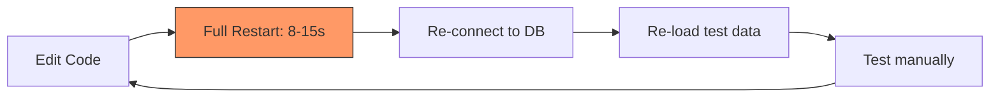
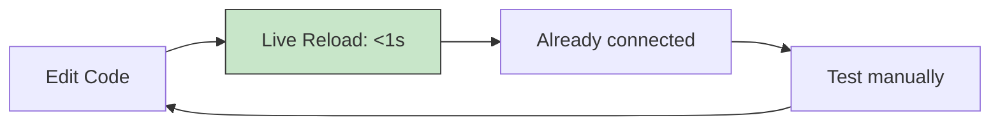
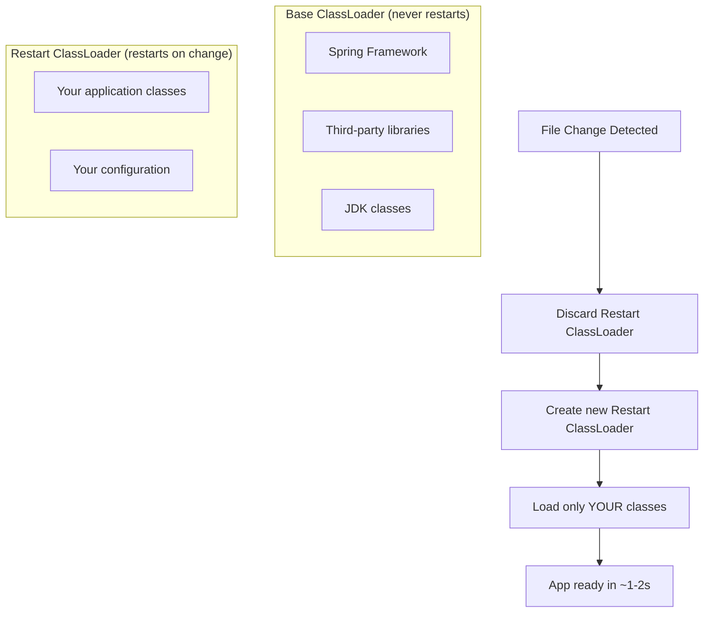
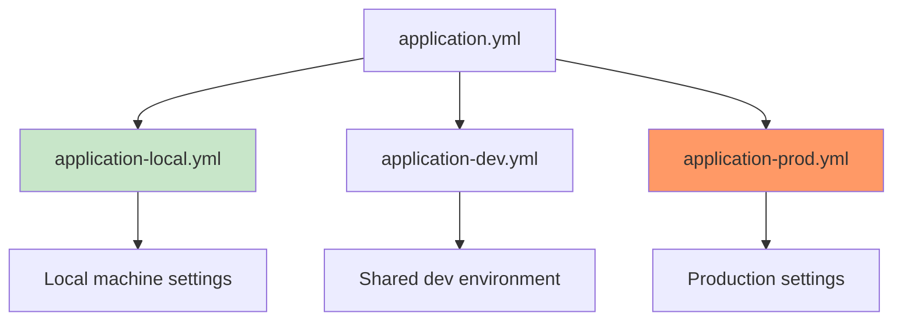

## The Problem — Slow Feedback Loops

Every time you change a line of code, you wait. Wait for the build. Wait for the restart. Wait for the database to be ready. Wait for the test to run.

A typical inner development loop without optimization:



With proper tooling, it becomes:



The difference is minutes per hour — hours per day — days per month.

## Spring Boot DevTools

Add one dependency and get instant productivity gains:

```xml
<dependency>
    <groupId>org.springframework.boot</groupId>
    <artifactId>spring-boot-devtools</artifactId>
    <scope>runtime</scope>
    <optional>true</optional>
</dependency>
```

### What DevTools Gives You

| Feature                  | What it does                                          | Default behavior        |
|--------------------------|------------------------------------------------------|-------------------------|
| Automatic restart        | Restarts app on classpath changes                    | Enabled                 |
| LiveReload               | Refreshes browser on resource changes                | Enabled (port 35729)    |
| Property defaults        | Disables template caching, enables SQL logging       | Enabled in dev          |
| Remote debugging         | Hot-deploy to remote applications                    | Disabled (opt-in)       |
| H2 console auto-enable  | Enables H2 web console automatically                 | Enabled                 |

### Restart vs Reload

DevTools uses two classloaders:



This is why DevTools restarts feel fast — it only reloads your code, not the entire framework.

### Property Defaults in Development

DevTools automatically sets these properties (only in development):

```properties
# Template engines — no caching
spring.thymeleaf.cache=false
spring.freemarker.cache=false

# Show SQL
spring.jpa.show-sql=true

# Detailed error pages
server.error.include-stacktrace=always
server.error.include-message=always

# Disable HTTPS requirement for actuator
management.endpoints.web.exposure.include=*
```

### Trigger File (Optional)

If restarts happen too often, configure a trigger file — restart only happens when you explicitly modify it:

```yaml
spring:
  devtools:
    restart:
      trigger-file: .reloadtrigger
```

Then touch the file when you want a restart:

```bash
touch .reloadtrigger
```

## Docker Compose Support

Spring Boot 3.1+ has built-in Docker Compose integration. It auto-starts your infrastructure containers when the application starts and stops them on shutdown.

```xml
<dependency>
    <groupId>org.springframework.boot</groupId>
    <artifactId>spring-boot-docker-compose</artifactId>
    <scope>runtime</scope>
    <optional>true</optional>
</dependency>
```

### How It Works

1. Spring Boot finds your `docker-compose.yml` (or `compose.yml`) in the project root
2. On app startup: runs `docker compose up`
3. Waits for services to be healthy
4. Auto-configures connection properties (database URL, port, credentials)
5. On app shutdown: runs `docker compose down` (configurable)

```yaml
# docker-compose.yml — Spring Boot reads this automatically
services:
  postgres:
    image: postgres:16
    ports:
      - "5432:5432"
    environment:
      POSTGRES_DB: myapp
      POSTGRES_USER: dev
      POSTGRES_PASSWORD: dev

  redis:
    image: redis:7
    ports:
      - "6379:6379"
```

You don't need to set `spring.datasource.url` — Spring Boot figures it out from the running container's port mapping.

### Configuration Options

```yaml
spring:
  docker:
    compose:
      enabled: true
      lifecycle-management: start-and-stop  # or start-only, none
      file: docker-compose.yml
      skip:
        in-tests: true  # Don't start containers during tests
      stop:
        timeout: 30s
```

### Supported Services (Auto-Configuration)

| Service        | Auto-configured property               |
|----------------|----------------------------------------|
| PostgreSQL     | `spring.datasource.url`                |
| MySQL          | `spring.datasource.url`                |
| MongoDB        | `spring.data.mongodb.uri`              |
| Redis          | `spring.data.redis.host/port`          |
| Kafka          | `spring.kafka.bootstrap-servers`       |
| RabbitMQ       | `spring.rabbitmq.host/port`            |
| Elasticsearch  | `spring.elasticsearch.uris`            |

## Testcontainers at Development Time

Testcontainers isn't just for tests. Since Spring Boot 3.1, you can use it to spin up infrastructure during local development with `@ServiceConnection`.

### Dev-Time Configuration

Create a test configuration class that Spring Boot uses when running in development:

```java
// src/test/java/com/example/TestOrderApplication.java
@TestConfiguration(proxyBeanMethods = false)
public class TestcontainersConfig {

    @Bean
    @ServiceConnection
    PostgreSQLContainer<?> postgresContainer() {
        return new PostgreSQLContainer<>("postgres:16");
    }

    @Bean
    @ServiceConnection
    KafkaContainer kafkaContainer() {
        return new KafkaContainer(DockerImageName.parse("confluentinc/cp-kafka:7.6.0"));
    }

    @Bean
    @ServiceConnection
    GenericContainer<?> redisContainer() {
        return new GenericContainer<>("redis:7")
                .withExposedPorts(6379);
    }
}
```

```java
// Run this instead of the main application class during development
public class TestOrderApplication {

    public static void main(String[] args) {
        SpringApplication.from(OrderApplication::main)
                .with(TestcontainersConfig.class)
                .run(args);
    }
}
```

Run with:

```bash
./mvnw spring-boot:test-run
```

### Docker Compose vs Testcontainers for Dev

| Aspect                    | Docker Compose Integration          | Testcontainers at Dev Time          |
|---------------------------|-------------------------------------|-------------------------------------|
| Configuration             | `docker-compose.yml`                | Java code (`@ServiceConnection`)    |
| Port mapping              | Fixed ports                         | Random ports (no conflicts)         |
| Data persistence          | Volumes persist data                | Fresh container every time          |
| Startup speed             | Reuses running containers           | Starts fresh each time              |
| Shared with non-Java devs | Yes (standard Docker Compose)      | No (requires Java/Maven)            |
| CI/CD friendly            | Yes                                 | Yes                                 |
| Multi-project conflicts   | Possible port conflicts             | Never (random ports)                |

## Profile Management

### application-local.yml

Keep local development settings separate from production:

```yaml
# application.yml (shared defaults)
spring:
  application:
    name: order-service
  jpa:
    hibernate:
      ddl-auto: validate
    show-sql: false

server:
  port: 8080
```

```yaml
# application-local.yml (local dev overrides)
spring:
  jpa:
    hibernate:
      ddl-auto: create-drop
    show-sql: true
  datasource:
    url: jdbc:postgresql://localhost:5432/orderdb
    username: dev
    password: dev

logging:
  level:
    org.hibernate.SQL: DEBUG
    org.hibernate.type.descriptor.sql.BasicBinder: TRACE
    com.example: DEBUG
```

Activate with:

```bash
# Environment variable
SPRING_PROFILES_ACTIVE=local ./mvnw spring-boot:run

# Or in IntelliJ: Run Configuration → Active profiles: local
```

### Profile Hierarchy



## Fast Startup Tips

| Technique                     | Startup Improvement | How to Enable                                        |
|-------------------------------|--------------------:|------------------------------------------------------|
| Lazy initialization           | ~30-50%             | `spring.main.lazy-initialization=true`               |
| Class Data Sharing (CDS)      | ~10-20%             | `-XX:SharedArchiveFile=app.jsa`                      |
| Virtual threads               | Fewer threads needed| `spring.threads.virtual.enabled=true`                |
| AOT processing                | ~40-60%             | `./mvnw spring-boot:process-aot`                     |
| GraalVM native                | ~90-95%             | `./mvnw -Pnative native:compile`                     |
| Exclude unused auto-config    | ~10-20%             | `spring.autoconfigure.exclude=[...]`                 |
| Index annotations             | ~5-10%              | Add `spring-context-indexer` dependency              |

### Lazy Initialization (Dev Only)

```yaml
# application-local.yml
spring:
  main:
    lazy-initialization: true
```

Beans are only created when first accessed. This dramatically reduces startup time but shifts the cost to the first request. Use only in development.

### Measuring Startup Time

Spring Boot 3.2+ includes startup metrics:

```yaml
spring:
  application:
    startup:
      track: true

management:
  endpoints:
    web:
      exposure:
        include: startup
```

Check `GET /actuator/startup` to see which beans take the longest to initialize.

## IDE Productivity — IntelliJ IDEA Shortcuts

| Shortcut (macOS)           | Action                                  | Why it matters                    |
|----------------------------|-----------------------------------------|-----------------------------------|
| `Cmd + Shift + A`         | Find Action                             | Find any IDE feature              |
| `Cmd + E`                 | Recent Files                            | Navigate without file tree        |
| `Cmd + Shift + Enter`     | Complete Statement                      | Adds semicolons, braces           |
| `Opt + Enter`             | Show Context Actions                    | Quick fixes, intentions           |
| `Cmd + Opt + L`           | Reformat Code                           | Consistent formatting             |
| `Ctrl + Shift + R`        | Run current test                        | Fastest test execution            |
| `Cmd + Shift + T`         | Go to Test / Create Test                | Jump between implementation/test  |
| `Cmd + Opt + M`           | Extract Method                          | Refactor inline code              |
| `Cmd + Shift + F`         | Find in Files                           | Global search                     |
| `Cmd + B`                 | Go to Declaration                       | Navigate to source                |

### HTTP Client Files

IntelliJ has a built-in HTTP client. Create `.http` files for quick API testing without leaving the IDE:

```http
### Create an order
POST http://localhost:8080/api/orders
Content-Type: application/json

{
  "customerId": "cust-123",
  "productName": "Mechanical Keyboard",
  "quantity": 1,
  "totalAmount": 149.99
}

### Get all orders
GET http://localhost:8080/api/orders

### Get order by ID
GET http://localhost:8080/api/orders/1

### Health check
GET http://localhost:8080/actuator/health
```

## Measuring Build Time

Track where time goes in your build:

```bash
# Maven with timing
./mvnw clean package -DskipTests --show-version -T 1C

# Profile the build
./mvnw clean package -Dprofile
```

### Build Speed Tips

| Optimization             | Improvement | Command/Config                                     |
|--------------------------|------------:|-----------------------------------------------------|
| Parallel builds          | ~30-40%     | `./mvnw -T 1C` (1 thread per core)                 |
| Skip tests (dev only)   | ~50-70%     | `./mvnw package -DskipTests`                        |
| Daemon mode              | ~20-30%     | Default in Maven 4 / use `mvnd`                     |
| Incremental compilation  | ~40-60%     | Default with `spring-boot-devtools`                  |
| Build cache (Gradle)     | ~50-80%     | `org.gradle.caching=true`                            |

## Common Problems

| Problem                                      | Cause                                         | Solution                                                    |
|----------------------------------------------|-----------------------------------------------|-------------------------------------------------------------|
| DevTools restart not working                 | IDE not auto-compiling on save                | IntelliJ: Enable "Build project automatically"              |
| Docker Compose not starting                  | `spring-boot-docker-compose` not on classpath | Verify dependency scope is `runtime`                        |
| Port already in use (Docker Compose)         | Previous containers still running             | `docker compose down` or use random ports (Testcontainers)  |
| Testcontainers slow first start              | Docker images not cached                      | Pull images ahead of time: `docker pull postgres:16`        |
| Lazy init causes first-request timeout       | Bean creation on first call takes too long    | Only use lazy init locally, not in production               |
| LiveReload not refreshing browser            | Browser extension not installed               | Install LiveReload extension or use `spring.devtools.livereload.enabled=true` |
| Profile not activating                       | Typo in profile name or YAML file naming      | Verify file is `application-{profile}.yml`                  |
| Docker Compose detects wrong file            | Multiple compose files in project             | Set `spring.docker.compose.file` explicitly                 |

## References

- [Spring Boot DevTools Reference](https://docs.spring.io/spring-boot/reference/using/devtools.html)
- [Spring Boot Docker Compose Support](https://docs.spring.io/spring-boot/reference/features/docker-compose.html)
- [Testcontainers at Development Time](https://docs.spring.io/spring-boot/reference/testing/testcontainers.html#testing.testcontainers.at-development-time)
- [Spring Boot AOT Processing](https://docs.spring.io/spring-boot/reference/packaging/aot.html)
- [IntelliJ HTTP Client](https://www.jetbrains.com/help/idea/http-client-in-product-code-editor.html)
- [Maven Daemon (mvnd)](https://github.com/apache/maven-mvnd)
