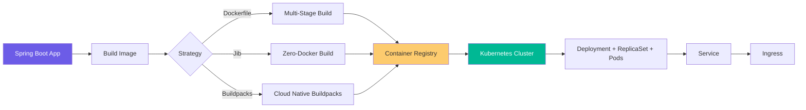
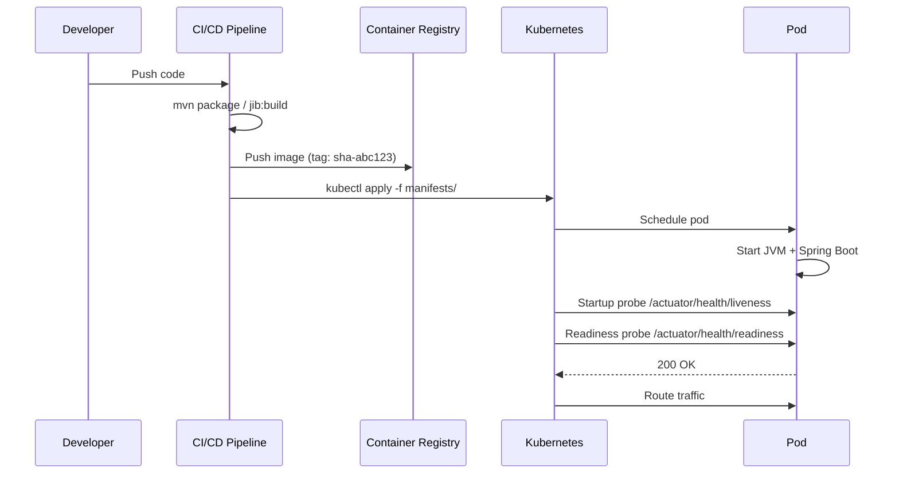
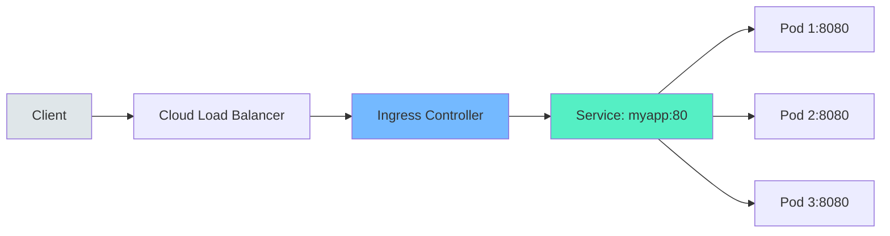
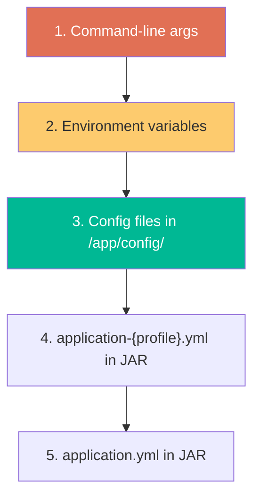
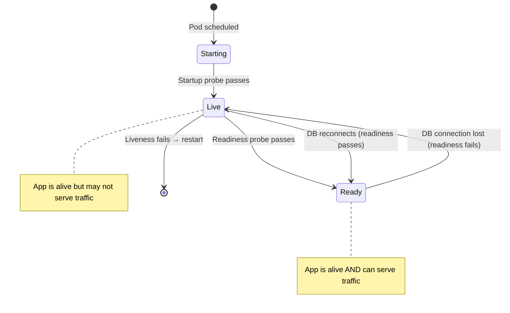
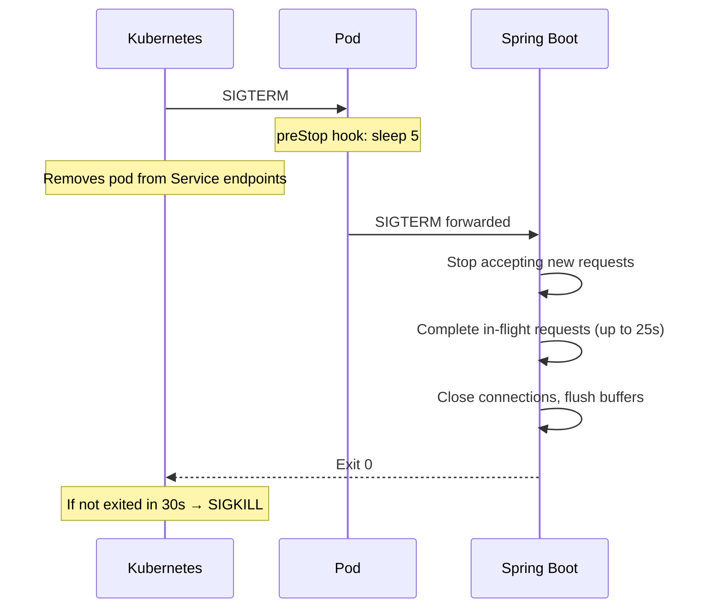

## The Problem

You've built the service. Tests pass. The JAR runs perfectly on your laptop. Now what?

Getting from `./mvnw package` to running reliably in production requires answering a long list of questions: How do you build a container image? How small can you make it? Where does configuration live? How does Kubernetes know your app is healthy? What happens when it runs out of memory?

Most tutorials cover one piece — here's a Dockerfile, here's a Deployment YAML. But the real challenge is wiring everything together: image build → registry push → K8s manifests → health probes → externalized config → resource limits → graceful shutdown.

This post walks through the full pipeline end-to-end.

---

## What We Are Building

A complete containerization and deployment pipeline for a Spring Boot 3.x application running on Java 21:





---

## Prerequisites

| Tool | Version | Purpose |
|------|---------|---------|
| Java | 21+ | Application runtime |
| Maven | 3.9+ | Build tool |
| Docker | 24+ | Container image building (not needed for Jib) |
| kubectl | 1.28+ | Kubernetes CLI |
| minikube / kind | Latest | Local K8s cluster for testing |
| Spring Boot | 3.3+ | Application framework |
| Spring Boot Actuator | Included | Health endpoints for probes |

Ensure `kubectl` is configured and pointing at your cluster:

```bash
kubectl cluster-info
kubectl get nodes
```

---

## Step 1: Multi-Stage Dockerfile

A multi-stage Dockerfile separates the build environment from the runtime environment. The result is a smaller, more secure image that contains only what's needed to run the application.

### The Dockerfile

```dockerfile
# ============================================
# Stage 1: Build
# ============================================
FROM eclipse-temurin:21-jdk-alpine AS builder

WORKDIR /app

# Copy only dependency descriptors first (cache layer)
COPY pom.xml mvnw ./
COPY .mvn .mvn

# Download dependencies (cached unless pom.xml changes)
RUN ./mvnw dependency:go-offline -B

# Copy source and build
COPY src src
RUN ./mvnw package -DskipTests -B && \
    java -Djarmode=tools -jar target/*.jar extract --layers --destination target/extracted

# ============================================
# Stage 2: Runtime
# ============================================
FROM eclipse-temurin:21-jre-alpine AS runtime

# Security: run as non-root
RUN addgroup -S appgroup && adduser -S appuser -G appgroup
USER appuser

WORKDIR /app

# Copy extracted layers (ordered by change frequency)
COPY --from=builder /app/target/extracted/dependencies/ ./
COPY --from=builder /app/target/extracted/spring-boot-loader/ ./
COPY --from=builder /app/target/extracted/snapshot-dependencies/ ./
COPY --from=builder /app/target/extracted/application/ ./

EXPOSE 8080

# JVM tuning for containers
ENV JAVA_OPTS="-XX:+UseZGC -XX:MaxRAMPercentage=75.0 -XX:+UseStringDeduplication"

ENTRYPOINT ["sh", "-c", "java $JAVA_OPTS org.springframework.boot.loader.launch.JarLauncher"]
```

### What Each Stage Does

**Stage 1 — Build:**

| Step | Why |
|------|-----|
| Copy `pom.xml` + Maven wrapper first | Docker caches this layer. Dependencies only re-download when `pom.xml` changes |
| `dependency:go-offline` | Downloads all dependencies into a cached layer |
| Copy source and build | Only this layer invalidates on code changes |
| Extract layers | Spring Boot's layered JAR tool separates dependencies from application code |

**Stage 2 — Runtime:**

| Step | Why |
|------|-----|
| `jre-alpine` base | ~180MB smaller than the JDK image |
| Non-root user | Security best practice — containers should never run as root |
| Copy layers in order | Least-changing layers first = better cache reuse |
| `MaxRAMPercentage=75.0` | JVM respects container memory limits instead of reading host memory |
| ZGC | Low-latency garbage collector, excellent for containers |

### Build and Run

```bash
# Build the image
docker build -t myapp:latest .

# Run locally
docker run -p 8080:8080 \
  -e SPRING_PROFILES_ACTIVE=prod \
  -e SPRING_DATASOURCE_URL=jdbc:postgresql://host.docker.internal:5432/mydb \
  --memory=512m \
  myapp:latest

# Check the image size
docker images myapp
# REPOSITORY   TAG       SIZE
# myapp        latest    ~290MB
```

### .dockerignore

Keep your build context clean:

```text
target/
.git/
.idea/
*.iml
.env
docker-compose*.yml
README.md
```

---

## Step 2: Building with Jib (Zero-Docker Approach)

Jib builds optimized container images **without Docker installed**. No Dockerfile, no Docker daemon, no root access needed. It integrates directly into your Maven (or Gradle) build.

### Maven Plugin Configuration

```xml
<plugin>
    <groupId>com.google.cloud.tools</groupId>
    <artifactId>jib-maven-plugin</artifactId>
    <version>3.4.4</version>
    <configuration>
        <from>
            <image>eclipse-temurin:21-jre-alpine</image>
        </from>
        <to>
            <image>ghcr.io/${env.GITHUB_REPOSITORY}/myapp</image>
            <tags>
                <tag>${project.version}</tag>
                <tag>latest</tag>
            </tags>
        </to>
        <container>
            <jvmFlags>
                <jvmFlag>-XX:+UseZGC</jvmFlag>
                <jvmFlag>-XX:MaxRAMPercentage=75.0</jvmFlag>
                <jvmFlag>-XX:+UseStringDeduplication</jvmFlag>
            </jvmFlags>
            <ports>
                <port>8080</port>
            </ports>
            <user>1000:1000</user>
            <creationTime>USE_CURRENT_TIMESTAMP</creationTime>
            <format>OCI</format>
        </container>
    </configuration>
</plugin>
```

### Build Commands

```bash
# Build and push directly to registry (no Docker needed)
./mvnw jib:build

# Build to local Docker daemon (requires Docker running)
./mvnw jib:dockerBuild

# Build to a tar file (portable, no Docker needed)
./mvnw jib:buildTar
```

### Why Jib?

Jib understands Java application structure. It automatically:

1. **Separates dependencies from classes** — your 80MB dependency layer is cached; only the 2MB application layer changes on each build
2. **Uses distroless/minimal base images** — smaller attack surface
3. **Reproduces builds** — same source = same image hash (with `creationTime=EPOCH`)
4. **Skips Docker entirely** — builds in CI without Docker-in-Docker hacks

---

## Step 3: Kubernetes Deployment Manifest

The Deployment is the core workload resource. It manages ReplicaSets which manage Pods.

### deployment.yaml

```yaml
apiVersion: apps/v1
kind: Deployment
metadata:
  name: myapp
  namespace: production
  labels:
    app.kubernetes.io/name: myapp
    app.kubernetes.io/version: "1.0.0"
    app.kubernetes.io/component: backend
    app.kubernetes.io/managed-by: kubectl
spec:
  replicas: 3
  revisionHistoryLimit: 5
  strategy:
    type: RollingUpdate
    rollingUpdate:
      maxSurge: 1
      maxUnavailable: 0
  selector:
    matchLabels:
      app.kubernetes.io/name: myapp
  template:
    metadata:
      labels:
        app.kubernetes.io/name: myapp
      annotations:
        prometheus.io/scrape: "true"
        prometheus.io/port: "8080"
        prometheus.io/path: "/actuator/prometheus"
    spec:
      serviceAccountName: myapp
      securityContext:
        runAsNonRoot: true
        runAsUser: 1000
        fsGroup: 1000
      terminationGracePeriodSeconds: 30
      containers:
        - name: myapp
          image: ghcr.io/anupamsinha/myapp:1.0.0
          imagePullPolicy: IfNotPresent
          ports:
            - name: http
              containerPort: 8080
              protocol: TCP
          env:
            - name: SPRING_PROFILES_ACTIVE
              value: "prod"
            - name: JAVA_OPTS
              value: "-XX:+UseZGC -XX:MaxRAMPercentage=75.0"
            - name: SPRING_DATASOURCE_URL
              valueFrom:
                configMapKeyRef:
                  name: myapp-config
                  key: database-url
            - name: SPRING_DATASOURCE_USERNAME
              valueFrom:
                secretKeyRef:
                  name: myapp-secrets
                  key: db-username
            - name: SPRING_DATASOURCE_PASSWORD
              valueFrom:
                secretKeyRef:
                  name: myapp-secrets
                  key: db-password
          resources:
            requests:
              cpu: "250m"
              memory: "512Mi"
            limits:
              cpu: "1000m"
              memory: "1Gi"
          startupProbe:
            httpGet:
              path: /actuator/health/liveness
              port: http
            initialDelaySeconds: 10
            periodSeconds: 5
            failureThreshold: 30
          livenessProbe:
            httpGet:
              path: /actuator/health/liveness
              port: http
            periodSeconds: 10
            failureThreshold: 3
          readinessProbe:
            httpGet:
              path: /actuator/health/readiness
              port: http
            periodSeconds: 5
            failureThreshold: 3
          lifecycle:
            preStop:
              exec:
                command: ["sh", "-c", "sleep 5"]
          volumeMounts:
            - name: config-volume
              mountPath: /app/config
              readOnly: true
      volumes:
        - name: config-volume
          configMap:
            name: myapp-config
```

### Key Decisions Explained

| Setting | Value | Rationale |
|---------|-------|-----------|
| `maxSurge: 1, maxUnavailable: 0` | Zero-downtime deploys | Never drops below desired replica count during rollout |
| `runAsNonRoot: true` | Security | Prevents container escape attacks |
| `terminationGracePeriodSeconds: 30` | Graceful shutdown | Matches Spring Boot's default graceful shutdown window |
| `preStop: sleep 5` | Connection draining | Gives load balancers time to remove the pod before shutdown starts |
| `revisionHistoryLimit: 5` | Rollback | Keep last 5 ReplicaSets for `kubectl rollout undo` |

---

## Step 4: Service and Ingress

### service.yaml

```yaml
apiVersion: v1
kind: Service
metadata:
  name: myapp
  namespace: production
  labels:
    app.kubernetes.io/name: myapp
spec:
  type: ClusterIP
  ports:
    - name: http
      port: 80
      targetPort: http
      protocol: TCP
  selector:
    app.kubernetes.io/name: myapp
```

### ingress.yaml

```yaml
apiVersion: networking.k8s.io/v1
kind: Ingress
metadata:
  name: myapp
  namespace: production
  annotations:
    nginx.ingress.kubernetes.io/rewrite-target: /
    nginx.ingress.kubernetes.io/ssl-redirect: "true"
    nginx.ingress.kubernetes.io/proxy-body-size: "10m"
    cert-manager.io/cluster-issuer: "letsencrypt-prod"
spec:
  ingressClassName: nginx
  tls:
    - hosts:
        - api.myapp.example.com
      secretName: myapp-tls
  rules:
    - host: api.myapp.example.com
      http:
        paths:
          - path: /
            pathType: Prefix
            backend:
              service:
                name: myapp
                port:
                  name: http
```

### How Traffic Flows



The Service provides stable internal DNS (`myapp.production.svc.cluster.local`) and load balances across healthy pods. The Ingress terminates TLS and routes external traffic.

---

## Step 5: ConfigMaps and Secrets

Keep configuration out of your container image. Use ConfigMaps for non-sensitive values and Secrets for credentials.

### configmap.yaml

```yaml
apiVersion: v1
kind: ConfigMap
metadata:
  name: myapp-config
  namespace: production
data:
  database-url: "jdbc:postgresql://postgres.production.svc:5432/myapp"
  redis-host: "redis.production.svc"
  redis-port: "6379"
  application.yml: |
    server:
      shutdown: graceful
    spring:
      lifecycle:
        timeout-per-shutdown-phase: 25s
      jpa:
        open-in-view: false
        hibernate:
          ddl-auto: validate
    management:
      endpoints:
        web:
          exposure:
            include: health, info, prometheus, metrics
      endpoint:
        health:
          probes:
            enabled: true
          show-details: when_authorized
```

### secret.yaml

```yaml
apiVersion: v1
kind: Secret
metadata:
  name: myapp-secrets
  namespace: production
type: Opaque
data:
  db-username: bXlhcHB1c2Vy        # base64 encoded
  db-password: c3VwZXJTZWNyZXQxMjM=  # base64 encoded
```

> **Important:** Never commit Secrets to Git. Use a sealed-secrets controller, external-secrets operator, or Vault to manage production secrets.

### Using Secrets from Vault (Production Recommended)

```yaml
apiVersion: secrets-store.csi.x-k8s.io/v1
kind: SecretProviderClass
metadata:
  name: myapp-vault-secrets
  namespace: production
spec:
  provider: vault
  parameters:
    vaultAddress: "https://vault.internal:8200"
    roleName: "myapp"
    objects: |
      - objectName: "db-username"
        secretPath: "secret/data/myapp/database"
        secretKey: "username"
      - objectName: "db-password"
        secretPath: "secret/data/myapp/database"
        secretKey: "password"
```

### Spring Boot Configuration Hierarchy

Spring Boot resolves configuration in this order (highest priority first):



Environment variables from ConfigMaps/Secrets override everything in the JAR. The ConfigMap-mounted file at `/app/config/application.yml` overrides the packaged one.

---

## Step 6: Health Probes Deep Dive

Kubernetes uses three probes to determine pod health. Getting them wrong is the #1 cause of unnecessary restarts and deployment failures.

### Probe Types

| Probe | Question It Answers | Failure Action |
|-------|--------------------|----|
| **Startup** | "Has the app finished starting?" | Keep waiting (up to `failureThreshold × periodSeconds`) |
| **Liveness** | "Is the app alive or deadlocked?" | Kill and restart the pod |
| **Readiness** | "Can the app serve traffic right now?" | Remove from Service endpoints (no traffic) |

### Spring Boot Actuator Mapping

```yaml
# application.yml
management:
  endpoint:
    health:
      probes:
        enabled: true
      group:
        readiness:
          include: readinessState, db, redis
        liveness:
          include: livenessState
  health:
    redis:
      enabled: true
    db:
      enabled: true
```

| Probe Path | Actuator Endpoint | What It Checks |
|-----------|-------------------|----------------|
| `/actuator/health/liveness` | LivenessStateHealthIndicator | App is running, not deadlocked |
| `/actuator/health/readiness` | ReadinessStateHealthIndicator + db + redis | App can serve requests |

### Why Separate Them?



A database outage should make the app **not ready** (stop receiving new requests) but NOT **not live** (don't restart — the DB will come back).

**Rule of thumb:** Liveness checks only what the app controls (is the JVM alive?). Readiness checks external dependencies (can we reach the database?).

### Probe Timing Guidelines

```yaml
startupProbe:
  initialDelaySeconds: 10   # Wait for JVM + Spring context
  periodSeconds: 5           # Check every 5s
  failureThreshold: 30       # Allow up to 160s total startup (10 + 30×5)

livenessProbe:
  periodSeconds: 10          # Don't check too aggressively
  failureThreshold: 3        # 30s of failures before restart
  # NO initialDelaySeconds — startup probe handles the wait

readinessProbe:
  periodSeconds: 5           # Check frequently for fast recovery
  failureThreshold: 3        # 15s of failures before removing from LB
```

### Custom Health Indicators

Add domain-specific health checks:

```java
import org.springframework.boot.actuate.health.Health;
import org.springframework.boot.actuate.health.HealthIndicator;
import org.springframework.stereotype.Component;

@Component
public class PaymentGatewayHealthIndicator implements HealthIndicator {

    private final PaymentGatewayClient gatewayClient;

    public PaymentGatewayHealthIndicator(PaymentGatewayClient gatewayClient) {
        this.gatewayClient = gatewayClient;
    }

    @Override
    public Health health() {
        try {
            var response = gatewayClient.ping();
            if (response.isHealthy()) {
                return Health.up()
                        .withDetail("latency", response.latencyMs() + "ms")
                        .build();
            }
            return Health.down()
                    .withDetail("reason", response.errorMessage())
                    .build();
        } catch (Exception e) {
            return Health.down(e).build();
        }
    }
}
```

Add this to the readiness group:

```yaml
management:
  endpoint:
    health:
      group:
        readiness:
          include: readinessState, db, redis, paymentGateway
```

---

## Graceful Shutdown

When Kubernetes terminates a pod (during scaling down or rolling update), you need to drain in-flight requests before the JVM exits.

### The Shutdown Sequence



### Spring Boot Configuration

```yaml
server:
  shutdown: graceful

spring:
  lifecycle:
    timeout-per-shutdown-phase: 25s  # Must be < terminationGracePeriodSeconds
```

The `preStop: sleep 5` in the Deployment gives the Service time to remove the pod from its endpoints before the app starts shutting down. Without it, new requests may arrive at a pod that's already shutting down.

---

## Production Readiness Checklist

| Category | Item | Status |
|----------|------|--------|
| **Image** | Multi-stage or Jib build | ☐ |
| **Image** | Non-root user | ☐ |
| **Image** | Minimal base image (JRE, not JDK) | ☐ |
| **Image** | Image scanning (Trivy/Snyk) in CI | ☐ |
| **Image** | Specific image tag, never `latest` in prod | ☐ |
| **K8s** | Resource requests AND limits set | ☐ |
| **K8s** | All three probes configured | ☐ |
| **K8s** | Graceful shutdown + preStop hook | ☐ |
| **K8s** | Pod Disruption Budget (PDB) | ☐ |
| **K8s** | Anti-affinity for spreading pods across nodes | ☐ |
| **K8s** | NetworkPolicy restricting ingress/egress | ☐ |
| **Config** | No secrets in image or Git | ☐ |
| **Config** | ConfigMap/Secret for all env-specific values | ☐ |
| **Config** | Spring profile set via environment | ☐ |
| **Observability** | Structured JSON logging | ☐ |
| **Observability** | Prometheus metrics exposed | ☐ |
| **Observability** | Distributed tracing (OpenTelemetry) | ☐ |
| **Observability** | Log aggregation (EFK/Loki) | ☐ |
| **Security** | SecurityContext (non-root, read-only FS) | ☐ |
| **Security** | ServiceAccount with minimal RBAC | ☐ |
| **Security** | TLS everywhere (Ingress + internal mTLS) | ☐ |
| **Resilience** | HPA (Horizontal Pod Autoscaler) configured | ☐ |
| **Resilience** | Rollback strategy tested | ☐ |
| **Resilience** | At least 2 replicas in production | ☐ |

---

## Comparison: Docker vs Jib vs Buildpacks

| Feature | Multi-Stage Docker | Jib | Cloud Native Buildpacks |
|---------|-------------------|-----|------------------------|
| Docker required? | Yes (build + daemon) | No | Yes (or `pack` CLI) |
| Dockerfile needed? | Yes | No | No |
| Build speed (repeat) | Fast (cached layers) | Fastest (only changed layers pushed) | Moderate |
| Image size | Small (~290MB) | Smallest (~260MB) | Larger (~350MB) |
| Layer optimization | Manual (extract layers) | Automatic | Automatic |
| Reproducibility | Depends on build | Excellent (deterministic) | Good |
| CI/CD integration | Standard everywhere | Maven/Gradle plugin | `pack` CLI or kpack |
| Customization | Full control | Limited to plugin config | Limited (buildpack choice) |
| Learning curve | Low (Dockerfiles are universal) | Low (Maven plugin) | Medium (buildpack concepts) |
| Security scanning | Standard tools | Standard tools | Standard tools |
| Best for | Full control, complex builds | Java projects, fast CI | Platform teams, standardization |

### When to Use What

- **Multi-Stage Dockerfile** — You need full control, have custom native dependencies, or your team already knows Docker well.
- **Jib** — Pure Java projects where you want the fastest, most reproducible builds. Excellent for CI pipelines without Docker-in-Docker.
- **Buildpacks** — Platform teams that want a standard "source → image" experience across multiple languages without developers writing Dockerfiles.

---

## Horizontal Pod Autoscaler

Scale based on CPU or custom metrics:

```yaml
apiVersion: autoscaling/v2
kind: HorizontalPodAutoscaler
metadata:
  name: myapp
  namespace: production
spec:
  scaleTargetRef:
    apiVersion: apps/v1
    kind: Deployment
    name: myapp
  minReplicas: 2
  maxReplicas: 10
  metrics:
    - type: Resource
      resource:
        name: cpu
        target:
          type: Utilization
          averageUtilization: 70
    - type: Resource
      resource:
        name: memory
        target:
          type: Utilization
          averageUtilization: 80
  behavior:
    scaleDown:
      stabilizationWindowSeconds: 300
      policies:
        - type: Pods
          value: 1
          periodSeconds: 60
    scaleUp:
      stabilizationWindowSeconds: 30
      policies:
        - type: Percent
          value: 50
          periodSeconds: 60
```

The `scaleDown.stabilizationWindowSeconds: 300` prevents thrashing — it waits 5 minutes after load drops before removing pods.

---

## Pod Disruption Budget

Protect availability during voluntary disruptions (node drains, cluster upgrades):

```yaml
apiVersion: policy/v1
kind: PodDisruptionBudget
metadata:
  name: myapp
  namespace: production
spec:
  minAvailable: 2
  selector:
    matchLabels:
      app.kubernetes.io/name: myapp
```

This guarantees at least 2 pods remain running during a rolling node update.

---

## Common Problems

| Symptom | Cause | Fix |
|---------|-------|-----|
| Pod stuck in `CrashLoopBackOff` | App fails to start within startup probe window | Increase `failureThreshold` on startup probe, or fix the slow startup (lazy init, reduce classpath scanning) |
| Pod restarts randomly | Liveness probe failing under load | Don't include external dependency checks in liveness; increase `failureThreshold` |
| Deployment stuck at "1/3 ready" | Readiness probe failing | Check `kubectl logs` and `kubectl describe pod`; verify the probe path and port |
| `OOMKilled` | Memory limit too low | Set `memory.limit` ≥ heap + metaspace + thread stacks + overhead. Rule of thumb: `limit = 1.5 × MaxRAMPercentage-calculated-heap` |
| Slow rolling updates | `maxUnavailable: 0` with slow readiness | Tune readiness `periodSeconds` lower; ensure startup is fast |
| Requests fail during deploy | No `preStop` hook | Add `preStop: sleep 5` to give LB time to drain |
| Image pull errors | Wrong registry/tag or missing imagePullSecret | Verify image exists: `docker pull <image>`; add `imagePullSecrets` to pod spec |
| Environment variables not updating | ConfigMap changed but pods not restarted | Restart pods: `kubectl rollout restart deployment/myapp` or use a config hash annotation |
| Connection refused after scale-up | New pod not ready yet | Verify readiness probe passes before Service routes traffic (this is automatic if probes are correct) |
| JVM ignores container memory limits | Old JVM or missing flags | Use Java 17+ (container-aware by default); set `-XX:MaxRAMPercentage=75.0` |

---

## Namespace and RBAC Setup

```yaml
apiVersion: v1
kind: Namespace
metadata:
  name: production
  labels:
    name: production
---
apiVersion: v1
kind: ServiceAccount
metadata:
  name: myapp
  namespace: production
---
apiVersion: rbac.authorization.k8s.io/v1
kind: Role
metadata:
  name: myapp-role
  namespace: production
rules:
  - apiGroups: [""]
    resources: ["configmaps"]
    verbs: ["get", "watch"]
---
apiVersion: rbac.authorization.k8s.io/v1
kind: RoleBinding
metadata:
  name: myapp-rolebinding
  namespace: production
subjects:
  - kind: ServiceAccount
    name: myapp
    namespace: production
roleRef:
  kind: Role
  name: myapp-role
  apiGroup: rbac.authorization.k8s.io
```

---

## Full Working Example

The complete project with all manifests, Dockerfile, Jib configuration, and a Makefile for common operations:

```bash
git clone https://github.com/AnupamSinha/spring-boot-k8s-deploy.git
cd spring-boot-k8s-deploy
```

### Project Structure

```text
spring-boot-k8s-deploy/
├── src/
│   └── main/
│       ├── java/...
│       └── resources/
│           ├── application.yml
│           └── application-prod.yml
├── k8s/
│   ├── base/
│   │   ├── deployment.yaml
│   │   ├── service.yaml
│   │   ├── configmap.yaml
│   │   └── kustomization.yaml
│   └── overlays/
│       ├── dev/
│       │   └── kustomization.yaml
│       └── prod/
│           ├── kustomization.yaml
│           ├── hpa.yaml
│           └── pdb.yaml
├── Dockerfile
├── .dockerignore
├── Makefile
└── pom.xml
```

### Quick Start

```bash
# Option 1: Docker build + local K8s
make docker-build
make k8s-deploy-dev

# Option 2: Jib build (no Docker needed)
./mvnw jib:dockerBuild
make k8s-deploy-dev

# Verify
kubectl get pods -n dev -l app.kubernetes.io/name=myapp
kubectl logs -n dev -l app.kubernetes.io/name=myapp --tail=50
curl http://localhost:8080/actuator/health
```

### Makefile Targets

```makefile
.PHONY: docker-build jib-build k8s-deploy-dev k8s-deploy-prod rollback

IMAGE_NAME := ghcr.io/anupamsinha/myapp
VERSION := $(shell mvn help:evaluate -Dexpression=project.version -q -DforceStdout)

docker-build:
	docker build -t $(IMAGE_NAME):$(VERSION) .

jib-build:
	./mvnw jib:build -Djib.to.image=$(IMAGE_NAME):$(VERSION)

k8s-deploy-dev:
	kubectl apply -k k8s/overlays/dev

k8s-deploy-prod:
	kubectl apply -k k8s/overlays/prod

rollback:
	kubectl rollout undo deployment/myapp -n production

status:
	kubectl rollout status deployment/myapp -n production
```

---

## References

- [Spring Boot Docker Guide](https://spring.io/guides/topicals/spring-boot-docker/)
- [Spring Boot Actuator — Health Probes](https://docs.spring.io/spring-boot/reference/actuator/endpoints.html#actuator.endpoints.kubernetes-probes)
- [Jib — Containerize your Java app](https://github.com/GoogleContainerTools/jib)
- [Kubernetes Deployments](https://kubernetes.io/docs/concepts/workloads/controllers/deployment/)
- [Kubernetes Probes](https://kubernetes.io/docs/tasks/configure-pod-container/configure-liveness-readiness-startup-probes/)
- [Kubernetes ConfigMaps and Secrets](https://kubernetes.io/docs/concepts/configuration/)
- [Cloud Native Buildpacks](https://buildpacks.io/)
- [Spring Boot Layered JARs](https://docs.spring.io/spring-boot/reference/container-images/efficient-images.html)
- [Kubernetes HPA](https://kubernetes.io/docs/tasks/run-application/horizontal-pod-autoscale/)
- [Pod Disruption Budgets](https://kubernetes.io/docs/tasks/run-application/configure-pdb/)
