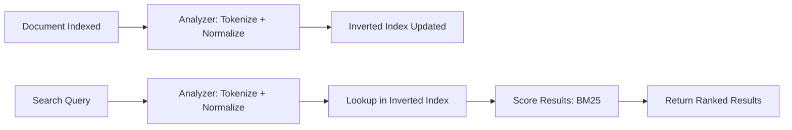

## The Problem: Why SQL LIKE Doesn't Scale

Every application eventually needs search. The first instinct is `WHERE title LIKE '%keyword%'`. It works for a few hundred rows but falls apart quickly:

| Issue | SQL LIKE | Elasticsearch |
|-------|----------|---------------|
| Performance on 1M+ rows | Full table scan — seconds | Inverted index — milliseconds |
| Typo tolerance | None | Fuzzy matching built-in |
| Relevance scoring | None — binary match | TF-IDF / BM25 scoring |
| Multi-field search | Manual UNION logic | Multi-match with field boosting |
| Aggregations | GROUP BY — limited | Native facets, histograms |
| Highlighting | Manual string ops | Built-in `<em>` wrapping |

If your users type "elastcsearch" (typo) and expect results, you need a real search engine.

---

## What is Elasticsearch?

Elasticsearch is a distributed search and analytics engine built on Apache Lucene. It stores data as JSON documents and builds an **inverted index** — a mapping from every term to the documents that contain it.



When you index "Spring Boot Elasticsearch Tutorial":
- Tokenizer splits into: `[spring, boot, elasticsearch, tutorial]`
- Each token maps to the document ID
- A search for "elasticsearch" instantly finds the document via the index

---

## Setup: Docker Compose

We run Elasticsearch 8.14 as a single node with security disabled for development:

```yaml
version: '3.8'

services:
  elasticsearch:
    image: docker.elastic.co/elasticsearch/elasticsearch:8.14.0
    container_name: elasticsearch
    environment:
      - discovery.type=single-node
      - xpack.security.enabled=false
      - xpack.security.http.ssl.enabled=false
      - ES_JAVA_OPTS=-Xms512m -Xmx512m
    ports:
      - "9200:9200"
    volumes:
      - es_data:/usr/share/elasticsearch/data
    healthcheck:
      test: ["CMD-SHELL", "curl -f http://localhost:9200/_cluster/health || exit 1"]
      interval: 10s
      timeout: 5s
      retries: 10

volumes:
  es_data:
    driver: local
```

Start it:

```bash
docker-compose up -d
curl http://localhost:9200  # verify it's running
```

---

## Dependencies

```xml
<dependency>
    <groupId>org.springframework.boot</groupId>
    <artifactId>spring-boot-starter-data-elasticsearch</artifactId>
</dependency>
<dependency>
    <groupId>org.springframework.boot</groupId>
    <artifactId>spring-boot-starter-web</artifactId>
</dependency>
```

Configuration in `application.yml`:

```yaml
spring:
  elasticsearch:
    uris: http://localhost:9200
```

---

## Document Mapping: @Document and @Field

Elasticsearch documents map to Java classes with annotations:

```java
@Document(indexName = "articles")
public class Article {

    @Id
    private String id;

    @Field(type = FieldType.Text, analyzer = "standard")
    private String title;

    @Field(type = FieldType.Text, analyzer = "standard")
    private String content;

    @Field(type = FieldType.Keyword)
    private String author;

    @Field(type = FieldType.Keyword)
    private List<String> tags;

    @Field(type = FieldType.Date, format = DateFormat.date)
    private LocalDate publishedAt;
}
```

Key field types:

| FieldType | Use Case | Analyzed? | Exact Match? |
|-----------|----------|-----------|--------------|
| `Text` | Full-text searchable content | Yes | No |
| `Keyword` | Filtering, sorting, aggregations | No | Yes |
| `Date` | Date range queries | No | Yes |
| `Integer/Long` | Numeric range queries | No | Yes |

**Text** fields are analyzed (tokenized + normalized) for full-text search. **Keyword** fields are stored as-is for exact match, sorting, and aggregations.

---

## ElasticsearchRepository: Derived Queries

Spring Data Elasticsearch provides repository support just like Spring Data JPA:

```java
@Repository
public interface ArticleRepository extends ElasticsearchRepository<Article, String> {

    List<Article> findByAuthor(String author);

    List<Article> findByTagsContaining(String tag);
}
```

Derived query methods work the same way you know from JPA — the method name is parsed into an Elasticsearch query.

---

## Custom Queries with @Query

For real search functionality, use the `@Query` annotation with native Elasticsearch JSON:

```java
@Query("""
    {
      "multi_match": {
        "query": "?0",
        "fields": ["title^3", "content"],
        "type": "best_fields"
      }
    }
    """)
List<Article> searchByTitleAndContent(String query);
```

The `^3` boosts title matches — a match in the title is weighted 3x higher than content.

### Fuzzy Matching

Handle typos with fuzziness:

```java
@Query("""
    {
      "multi_match": {
        "query": "?0",
        "fields": ["title^3", "content"],
        "fuzziness": "AUTO"
      }
    }
    """)
List<Article> fuzzySearch(String query);
```

`fuzziness: AUTO` uses edit distance based on term length:
- 1-2 characters: exact match
- 3-5 characters: 1 edit allowed
- 6+ characters: 2 edits allowed

### Compound Query: Bool with Filters

```java
@Query("""
    {
      "bool": {
        "must": [
          { "multi_match": { "query": "?0", "fields": ["title^3", "content"] } }
        ],
        "filter": [
          { "term": { "author": "?1" } }
        ]
      }
    }
    """)
List<Article> searchByQueryAndAuthor(String query, String author);
```

The `must` clause scores results, while `filter` narrows without affecting score — more efficient for exact-match conditions.

---

## Full-Text Search with Relevance Scoring

Elasticsearch uses the **BM25** algorithm (an evolution of TF-IDF) to score documents:

- **Term Frequency (TF)**: How often the term appears in the document
- **Inverse Document Frequency (IDF)**: How rare the term is across all documents
- **Field Length Normalization**: Shorter fields get a boost (a match in a 5-word title > a match in a 5000-word body)

The result: documents are ranked by **how relevant** they are, not just whether they match.

---

## Highlighting: Wrap Matches in Tags

Show users exactly which part of the text matched:

```java
public List<SearchHit<Article>> searchWithHighlighting(String query) {
    var highlightFields = List.of(
            new HighlightField("title"),
            new HighlightField("content")
    );
    var highlight = new Highlight(highlightFields);

    NativeQuery searchQuery = NativeQuery.builder()
            .withQuery(q -> q.multiMatch(m -> m
                    .query(query)
                    .fields("title^3", "content")))
            .withHighlightQuery(new HighlightQuery(highlight, Article.class))
            .build();

    SearchHits<Article> searchHits = elasticsearchOperations.search(searchQuery, Article.class);
    return searchHits.getSearchHits();
}
```

The response includes highlight fragments:

```json
{
  "content": { ... },
  "highlightFields": {
    "title": ["Getting Started with <em>Elasticsearch</em>"],
    "content": ["<em>Elasticsearch</em> is a distributed search engine..."]
  }
}
```

---

## Aggregations: Analytics on Your Data

Aggregations let you compute summaries without fetching documents.

### Articles Per Author (Terms Aggregation)

```java
public Map<String, Long> getArticlesPerAuthor() {
    NativeQuery query = NativeQuery.builder()
            .withAggregation("authors",
                    Aggregation.of(a -> a.terms(t -> t.field("author").size(50))))
            .withMaxResults(0)  // we don't need documents, just aggregation
            .build();

    SearchHits<Article> searchHits = elasticsearchOperations.search(query, Article.class);
    Map<String, Long> authorCounts = new HashMap<>();

    ElasticsearchAggregations aggregations =
            (ElasticsearchAggregations) searchHits.getAggregations();
    var authorAgg = aggregations.aggregations().get(0).aggregation().getAggregate();
    List<StringTermsBucket> buckets = authorAgg.sterms().buckets().array();
    for (StringTermsBucket bucket : buckets) {
        authorCounts.put(bucket.key().stringValue(), bucket.docCount());
    }

    return authorCounts;
}
```

### Tag Cloud (Terms Aggregation)

```java
public Map<String, Long> getTagCloud() {
    NativeQuery query = NativeQuery.builder()
            .withAggregation("tags",
                    Aggregation.of(a -> a.terms(t -> t.field("tags").size(100))))
            .withMaxResults(0)
            .build();

    // ... similar extraction logic
}
```

---

## Indexing Strategies

### Bulk Indexing

For initial data loads, use bulk operations:

```java
public List<Article> saveAll(List<Article> articles) {
    return (List<Article>) articleRepository.saveAll(articles);
}
```

Under the hood, Spring Data Elasticsearch uses the Bulk API — much faster than individual saves.

### Async Indexing

For production, consider async indexing to avoid blocking request threads:

```java
@Async
public CompletableFuture<Article> saveAsync(Article article) {
    Article saved = articleRepository.save(article);
    return CompletableFuture.completedFuture(saved);
}
```

### Index Aliases and Zero-Downtime Reindexing

For production deployments, use index aliases:

1. Create `articles-v2` with updated mapping
2. Reindex data from `articles-v1` to `articles-v2`
3. Switch the `articles` alias to point to `articles-v2`
4. Delete `articles-v1`

No downtime. No code changes.

---

## Elasticsearch vs Database LIKE: Full Comparison

| Feature | SQL LIKE | Elasticsearch |
|---------|----------|---------------|
| Query | `WHERE title LIKE '%term%'` | `multi_match` with BM25 |
| Index usage | None (full scan) | Inverted index |
| Latency (1M docs) | 500ms–5s | 5–50ms |
| Fuzzy/typo | Not supported | Built-in |
| Relevance ranking | None | BM25 scoring |
| Facets/aggregations | Expensive GROUP BY | Native, sub-second |
| Highlighting | Manual | Built-in |
| Scaling | Vertical only | Horizontal (shards) |
| Maintenance | Zero | Cluster management |

---

## Common Problems

| Problem | Cause | Solution |
|---------|-------|----------|
| No results for known data | Text field queried as keyword | Check mapping — use `Text` for searchable fields |
| Keyword field not searchable | Field mapped as `Keyword` | Keyword is exact-match only; use `Text` for full-text |
| Slow indexing | Single-document inserts | Use bulk API |
| Stale search results | Near-real-time delay (1s default) | Call `refresh` API or accept 1s delay |
| OOM on large result sets | Fetching too many docs | Use pagination (`from`/`size`) |
| Score 0.0 on filter queries | Using `filter` context | `filter` doesn't score — use `must` for scoring |

---

## Full Working Example

The complete implementation is available on GitHub:

[**spring-boot-examples/33-elasticsearch**](https://github.com/AnupamSinha/spring-boot-examples/tree/main/33-elasticsearch)

Clone and run:

```bash
git clone https://github.com/AnupamSinha/spring-boot-examples.git
cd spring-boot-examples/33-elasticsearch
docker-compose up -d
./mvnw spring-boot:run
```

---

## References

- [Spring Data Elasticsearch Documentation](https://docs.spring.io/spring-data/elasticsearch/reference/)
- [Elasticsearch Reference — Query DSL](https://www.elastic.co/guide/en/elasticsearch/reference/current/query-dsl.html)
- [Elasticsearch Reference — Aggregations](https://www.elastic.co/guide/en/elasticsearch/reference/current/search-aggregations.html)
- [BM25 Scoring Explained](https://www.elastic.co/blog/practical-bm25-part-2-the-bm25-algorithm-and-its-variables)
