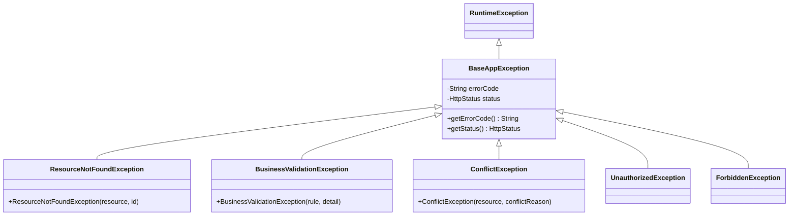

## The Problem: Inconsistent Error Responses

Without proper error handling, your API returns different error formats depending on where the error occurs:

```json
// Spring default (missing endpoint)
{ "timestamp": "...", "status": 404, "error": "Not Found", "path": "/api/users/999" }

// Your manual response
{ "code": "USER_NOT_FOUND", "message": "User 999 does not exist" }

// Validation error (default)
{ "timestamp": "...", "status": 400, "errors": [...] }

// Unhandled exception
{ "timestamp": "...", "status": 500, "error": "Internal Server Error" }
```

Your API consumers deal with four different formats. Every client needs special-case parsing.

The fix: a **single, consistent error response contract** for every error condition.

---

## The Error Response Contract: RFC 7807 ProblemDetail

Spring Boot 3.x natively supports [RFC 7807](https://www.rfc-editor.org/rfc/rfc7807) (Problem Details for HTTP APIs):

```json
{
  "type": "https://api.example.com/errors/user-not-found",
  "title": "User Not Found",
  "status": 404,
  "detail": "User with ID 999 does not exist",
  "instance": "/api/users/999",
  "errorCode": "USER_NOT_FOUND",
  "traceId": "6a2b3c4d5e6f7890"
}
```

| Field | Purpose |
|-------|---------|
| `type` | URI reference identifying the error type (documentation link) |
| `title` | Human-readable summary |
| `status` | HTTP status code |
| `detail` | Human-readable explanation specific to this occurrence |
| `instance` | URI of the specific request that failed |
| Custom fields | Any additional context (`errorCode`, `traceId`, `fieldErrors`) |

Enable in Spring Boot 3.x:

```yaml
spring:
  mvc:
    problemdetails:
      enabled: true
```

---

## @ControllerAdvice + @ExceptionHandler

The foundation of Spring Boot error handling. A single class catches exceptions from all controllers:

```java
@RestControllerAdvice
public class GlobalExceptionHandler {

    @ExceptionHandler(ResourceNotFoundException.class)
    public ProblemDetail handleNotFound(ResourceNotFoundException ex,
                                        HttpServletRequest request) {
        ProblemDetail problem = ProblemDetail.forStatusAndDetail(
                HttpStatus.NOT_FOUND, ex.getMessage());
        problem.setTitle("Resource Not Found");
        problem.setType(URI.create("https://api.example.com/errors/not-found"));
        problem.setInstance(URI.create(request.getRequestURI()));
        problem.setProperty("errorCode", ex.getErrorCode());
        problem.setProperty("traceId", MDC.get("traceId"));
        return problem;
    }

    @ExceptionHandler(BusinessValidationException.class)
    public ProblemDetail handleBusinessValidation(BusinessValidationException ex,
                                                   HttpServletRequest request) {
        ProblemDetail problem = ProblemDetail.forStatusAndDetail(
                HttpStatus.UNPROCESSABLE_ENTITY, ex.getMessage());
        problem.setTitle("Business Rule Violation");
        problem.setType(URI.create("https://api.example.com/errors/validation"));
        problem.setInstance(URI.create(request.getRequestURI()));
        problem.setProperty("errorCode", ex.getErrorCode());
        problem.setProperty("traceId", MDC.get("traceId"));
        return problem;
    }

    @ExceptionHandler(ConflictException.class)
    public ProblemDetail handleConflict(ConflictException ex,
                                        HttpServletRequest request) {
        ProblemDetail problem = ProblemDetail.forStatusAndDetail(
                HttpStatus.CONFLICT, ex.getMessage());
        problem.setTitle("Resource Conflict");
        problem.setType(URI.create("https://api.example.com/errors/conflict"));
        problem.setInstance(URI.create(request.getRequestURI()));
        problem.setProperty("errorCode", ex.getErrorCode());
        return problem;
    }

    @ExceptionHandler(Exception.class)
    public ProblemDetail handleUnexpected(Exception ex, HttpServletRequest request) {
        // Log the full stack trace — never expose it to the client
        log.error("Unexpected error on {}", request.getRequestURI(), ex);

        ProblemDetail problem = ProblemDetail.forStatusAndDetail(
                HttpStatus.INTERNAL_SERVER_ERROR,
                "An unexpected error occurred. Please try again later.");
        problem.setTitle("Internal Server Error");
        problem.setType(URI.create("https://api.example.com/errors/internal"));
        problem.setInstance(URI.create(request.getRequestURI()));
        problem.setProperty("traceId", MDC.get("traceId"));
        return problem;
    }
}
```

---

## Custom Exception Hierarchy

A well-designed exception hierarchy maps cleanly to HTTP status codes:




### Base Exception

```java
public abstract class BaseAppException extends RuntimeException {

    private final String errorCode;
    private final HttpStatus status;

    protected BaseAppException(String message, String errorCode, HttpStatus status) {
        super(message);
        this.errorCode = errorCode;
        this.status = status;
    }

    public String getErrorCode() { return errorCode; }
    public HttpStatus getStatus() { return status; }
}
```

### Concrete Exceptions

```java
public class ResourceNotFoundException extends BaseAppException {

    public ResourceNotFoundException(String resource, Object id) {
        super(
            String.format("%s with ID %s not found", resource, id),
            "RESOURCE_NOT_FOUND",
            HttpStatus.NOT_FOUND
        );
    }
}

public class BusinessValidationException extends BaseAppException {

    public BusinessValidationException(String rule, String detail) {
        super(detail, rule, HttpStatus.UNPROCESSABLE_ENTITY);
    }
}

public class ConflictException extends BaseAppException {

    public ConflictException(String resource, String reason) {
        super(
            String.format("%s conflict: %s", resource, reason),
            "RESOURCE_CONFLICT",
            HttpStatus.CONFLICT
        );
    }
}
```

### Usage in Service Layer

```java
@Service
public class UserService {

    public User getById(Long id) {
        return userRepository.findById(id)
                .orElseThrow(() -> new ResourceNotFoundException("User", id));
    }

    public User register(UserRegistration request) {
        if (userRepository.existsByEmail(request.email())) {
            throw new ConflictException("User", "Email already registered");
        }
        if (request.age() < 18) {
            throw new BusinessValidationException(
                    "MIN_AGE_REQUIREMENT",
                    "User must be at least 18 years old");
        }
        return userRepository.save(mapToEntity(request));
    }
}
```

---

## Validation Errors: @Valid and MethodArgumentNotValidException

Jakarta Bean Validation errors need special handling to return per-field errors:

```java
@ExceptionHandler(MethodArgumentNotValidException.class)
public ProblemDetail handleValidation(MethodArgumentNotValidException ex,
                                       HttpServletRequest request) {
    ProblemDetail problem = ProblemDetail.forStatusAndDetail(
            HttpStatus.BAD_REQUEST, "Request validation failed");
    problem.setTitle("Validation Error");
    problem.setType(URI.create("https://api.example.com/errors/validation"));
    problem.setInstance(URI.create(request.getRequestURI()));

    List<Map<String, String>> fieldErrors = ex.getBindingResult()
            .getFieldErrors().stream()
            .map(error -> Map.of(
                    "field", error.getField(),
                    "message", error.getDefaultMessage(),
                    "rejectedValue", String.valueOf(error.getRejectedValue())
            ))
            .toList();

    problem.setProperty("fieldErrors", fieldErrors);
    problem.setProperty("errorCode", "VALIDATION_FAILED");
    return problem;
}
```

Response:

```json
{
  "type": "https://api.example.com/errors/validation",
  "title": "Validation Error",
  "status": 400,
  "detail": "Request validation failed",
  "fieldErrors": [
    { "field": "email", "message": "must be a valid email", "rejectedValue": "not-an-email" },
    { "field": "name", "message": "must not be blank", "rejectedValue": "" }
  ],
  "errorCode": "VALIDATION_FAILED"
}
```

---

## ProblemDetail: Spring Boot 3.x Native Support

Spring Boot 3.x has built-in RFC 7807 support. Enable it and Spring auto-converts many exceptions:

```yaml
spring:
  mvc:
    problemdetails:
      enabled: true
```

Built-in mappings:

| Exception | Status | ProblemDetail title |
|-----------|--------|---------------------|
| `HttpRequestMethodNotSupportedException` | 405 | Method Not Allowed |
| `HttpMediaTypeNotAcceptableException` | 406 | Not Acceptable |
| `MissingServletRequestParameterException` | 400 | Bad Request |
| `TypeMismatchException` | 400 | Bad Request |
| `NoHandlerFoundException` | 404 | Not Found |

Your `@ControllerAdvice` extends this with application-specific exceptions.

---

## Async Error Handling

### @Async Exceptions

`@Async` methods run in a separate thread. Exceptions don't propagate to the caller:

```java
@Configuration
@EnableAsync
public class AsyncConfig implements AsyncConfigurer {

    @Override
    public AsyncUncaughtExceptionHandler getAsyncUncaughtExceptionHandler() {
        return (throwable, method, params) -> {
            log.error("Async error in method {}: {}", method.getName(), throwable.getMessage(), throwable);
            // Alert monitoring, send to dead-letter queue, etc.
        };
    }
}
```

### CompletableFuture Error Handling

For async methods that return `CompletableFuture`:

```java
@Async
public CompletableFuture<PaymentResult> processPayment(PaymentRequest request) {
    return CompletableFuture.supplyAsync(() -> {
        // processing logic
        return paymentGateway.charge(request);
    }).exceptionally(throwable -> {
        log.error("Payment processing failed for order {}", request.orderId(), throwable);
        return PaymentResult.failed(request.orderId(), throwable.getMessage());
    });
}
```

In the controller:

```java
@PostMapping("/payments")
public CompletableFuture<ResponseEntity<PaymentResult>> pay(@RequestBody PaymentRequest request) {
    return paymentService.processPayment(request)
            .thenApply(result -> result.isSuccess()
                    ? ResponseEntity.ok(result)
                    : ResponseEntity.status(HttpStatus.PAYMENT_REQUIRED).body(result));
}
```

---

## WebSocket Error Handling

WebSocket errors need `@MessageExceptionHandler` — `@ControllerAdvice` doesn't apply to WebSocket message handling:

```java
@Controller
public class ChatController {

    @MessageMapping("/chat")
    @SendTo("/topic/messages")
    public ChatMessage handleMessage(ChatMessage message) {
        if (message.content().isBlank()) {
            throw new IllegalArgumentException("Message content cannot be empty");
        }
        return message;
    }

    @MessageExceptionHandler(IllegalArgumentException.class)
    @SendToUser("/queue/errors")
    public ErrorMessage handleWebSocketError(IllegalArgumentException ex) {
        return new ErrorMessage("VALIDATION_ERROR", ex.getMessage());
    }

    @MessageExceptionHandler(Exception.class)
    @SendToUser("/queue/errors")
    public ErrorMessage handleGenericWebSocketError(Exception ex) {
        log.error("WebSocket error", ex);
        return new ErrorMessage("INTERNAL_ERROR", "An unexpected error occurred");
    }
}
```

Key differences from REST:
- Use `@MessageExceptionHandler` instead of `@ExceptionHandler`
- Use `@SendToUser("/queue/errors")` to send error back to the specific client
- No HTTP status codes — use application-level error codes

---

## Error Response Structure: Before and After

| Scenario | Before (inconsistent) | After (RFC 7807) |
|----------|----------------------|-------------------|
| Not Found | `{ "error": "User not found" }` | `{ "type": ".../not-found", "title": "Resource Not Found", "status": 404, "detail": "User with ID 999 not found" }` |
| Validation | `{ "errors": ["email invalid"] }` | `{ "type": ".../validation", "status": 400, "fieldErrors": [...] }` |
| Conflict | `HTTP 500 + stack trace` | `{ "type": ".../conflict", "status": 409, "detail": "Email already registered" }` |
| Server Error | Stack trace in response | `{ "type": ".../internal", "status": 500, "detail": "Unexpected error", "traceId": "abc123" }` |

---

## Error Codes Strategy

HTTP status codes tell you the category. Application error codes tell you the exact problem:

```java
public enum ErrorCode {
    // Auth
    AUTH_TOKEN_EXPIRED("Token has expired"),
    AUTH_INVALID_CREDENTIALS("Invalid username or password"),

    // User
    USER_NOT_FOUND("User does not exist"),
    USER_EMAIL_TAKEN("Email already registered"),
    USER_UNDERAGE("Must be at least 18 years old"),

    // Payment
    PAYMENT_INSUFFICIENT_FUNDS("Insufficient funds"),
    PAYMENT_GATEWAY_TIMEOUT("Payment gateway not responding"),

    // General
    VALIDATION_FAILED("Request validation failed"),
    RESOURCE_CONFLICT("Resource state conflict"),
    INTERNAL_ERROR("Internal server error");

    private final String defaultMessage;

    ErrorCode(String defaultMessage) { this.defaultMessage = defaultMessage; }
    public String getDefaultMessage() { return defaultMessage; }
}
```

Clients can switch on error codes for programmatic handling:

```javascript
if (error.errorCode === 'USER_EMAIL_TAKEN') {
  showError('This email is already registered. Try logging in instead.');
}
```

---

## Common Mistakes

| Mistake | Problem | Fix |
|---------|---------|-----|
| Catching generic `Exception` in service layer | Hides the actual error type | Let exceptions propagate to `@ControllerAdvice` |
| Returning stack traces to clients | Security risk (exposes internals) | Log internally, return generic message |
| Using `@ResponseStatus` on exception class | Can't add context or custom fields | Use `@ExceptionHandler` with `ProblemDetail` |
| Different error formats per endpoint | Client parsing nightmare | Centralize in `@ControllerAdvice` |
| Logging and rethrowing | Double-logged errors | Log at the boundary only |
| `HTTP 200` with error body | Breaks HTTP semantics | Use proper status codes |
| No traceId in error response | Can't correlate client report to server logs | Include `traceId` from MDC |
| Swallowing exceptions silently | Errors disappear | Always log or propagate |

---

## Complete Implementation Pattern

Putting it all together — a production-ready error handling setup:

```java
@RestControllerAdvice
public class GlobalExceptionHandler {

    private static final Logger log = LoggerFactory.getLogger(GlobalExceptionHandler.class);

    // --- Application Exceptions ---

    @ExceptionHandler(BaseAppException.class)
    public ProblemDetail handleAppException(BaseAppException ex, HttpServletRequest request) {
        ProblemDetail problem = ProblemDetail.forStatusAndDetail(ex.getStatus(), ex.getMessage());
        problem.setTitle(ex.getStatus().getReasonPhrase());
        problem.setInstance(URI.create(request.getRequestURI()));
        problem.setProperty("errorCode", ex.getErrorCode());
        problem.setProperty("traceId", MDC.get("traceId"));
        return problem;
    }

    // --- Validation ---

    @ExceptionHandler(MethodArgumentNotValidException.class)
    public ProblemDetail handleValidation(MethodArgumentNotValidException ex,
                                           HttpServletRequest request) {
        ProblemDetail problem = ProblemDetail.forStatusAndDetail(
                HttpStatus.BAD_REQUEST, "Validation failed");
        problem.setTitle("Validation Error");
        problem.setInstance(URI.create(request.getRequestURI()));
        problem.setProperty("errorCode", "VALIDATION_FAILED");
        problem.setProperty("fieldErrors", ex.getBindingResult().getFieldErrors().stream()
                .map(e -> Map.of("field", e.getField(), "message", e.getDefaultMessage()))
                .toList());
        problem.setProperty("traceId", MDC.get("traceId"));
        return problem;
    }

    @ExceptionHandler(ConstraintViolationException.class)
    public ProblemDetail handleConstraintViolation(ConstraintViolationException ex,
                                                    HttpServletRequest request) {
        ProblemDetail problem = ProblemDetail.forStatusAndDetail(
                HttpStatus.BAD_REQUEST, "Constraint violation");
        problem.setTitle("Validation Error");
        problem.setInstance(URI.create(request.getRequestURI()));
        problem.setProperty("errorCode", "CONSTRAINT_VIOLATION");
        problem.setProperty("violations", ex.getConstraintViolations().stream()
                .map(v -> Map.of("path", v.getPropertyPath().toString(),
                                 "message", v.getMessage()))
                .toList());
        return problem;
    }

    // --- Catch-all ---

    @ExceptionHandler(Exception.class)
    public ProblemDetail handleUnexpected(Exception ex, HttpServletRequest request) {
        log.error("Unhandled exception on {} {}", request.getMethod(),
                request.getRequestURI(), ex);

        ProblemDetail problem = ProblemDetail.forStatusAndDetail(
                HttpStatus.INTERNAL_SERVER_ERROR,
                "An unexpected error occurred. Please contact support with the traceId.");
        problem.setTitle("Internal Server Error");
        problem.setInstance(URI.create(request.getRequestURI()));
        problem.setProperty("errorCode", "INTERNAL_ERROR");
        problem.setProperty("traceId", MDC.get("traceId"));
        return problem;
    }
}
```

---

## References

- [RFC 7807 — Problem Details for HTTP APIs](https://www.rfc-editor.org/rfc/rfc7807)
- [Spring Boot Error Handling Documentation](https://docs.spring.io/spring-boot/reference/web/servlet.html#web.servlet.spring-mvc.error-handling)
- [Spring MVC — ProblemDetail](https://docs.spring.io/spring-framework/reference/web/webmvc/mvc-ann-rest-exceptions.html)
- [Jakarta Bean Validation](https://jakarta.ee/specifications/bean-validation/)
