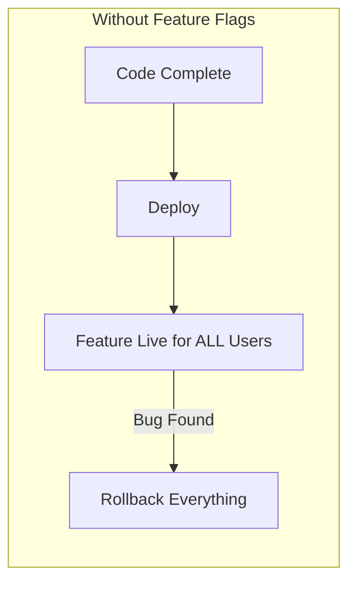
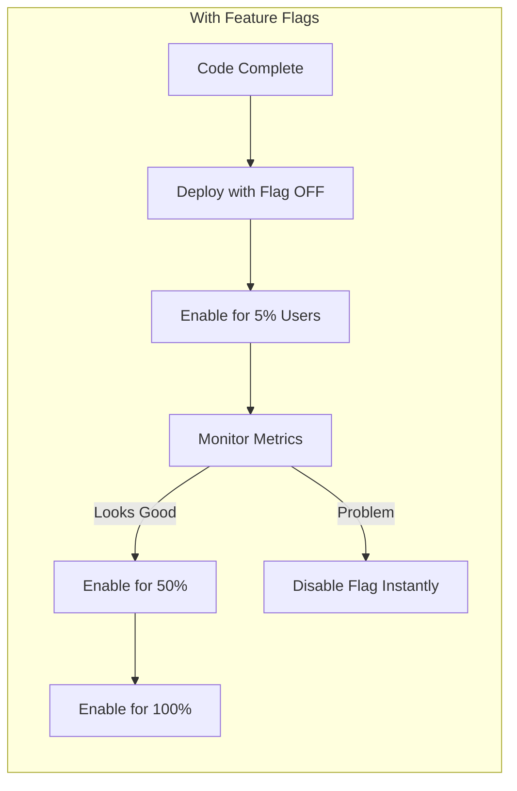
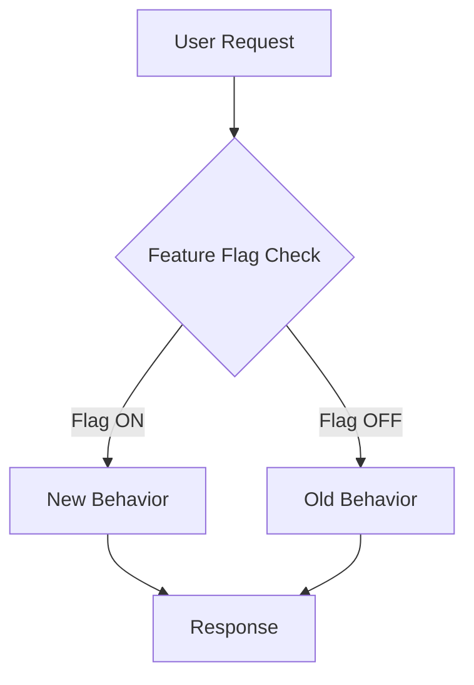
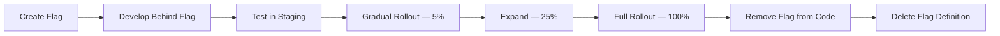

## The Problem — Deploy ≠ Release

In traditional deployment workflows, deploying code means releasing features. This creates pressure:

- Teams batch features into large releases (risky)
- Broken features require rollback of everything
- No way to test in production with a subset of users
- Friday deploys are terrifying

What if you could deploy code with features **turned off**, then enable them gradually at runtime — without redeploying?





---

## What Are Feature Flags?

Feature flags (also called feature toggles) are conditional statements that control which code paths execute. They decouple **deployment** (pushing code) from **release** (enabling behavior).



Types of feature flags:

| Type | Purpose | Lifespan | Example |
|------|---------|----------|---------|
| Release toggle | Decouple deploy from release | Days to weeks | New checkout flow |
| Experiment toggle | A/B testing | Weeks to months | Recommendation algorithm |
| Ops toggle | Kill switch for unstable features | Permanent | Circuit breaker |
| Permission toggle | Gatekeep premium features | Permanent | Premium search |

---

## Setup with Togglz

[Togglz](https://www.togglz.org/) is a mature feature flag library for Java with first-class Spring Boot integration.

### Maven Dependencies

```xml
<dependencies>
    <dependency>
        <groupId>org.togglz</groupId>
        <artifactId>togglz-spring-boot-starter</artifactId>
        <version>4.4.0</version>
    </dependency>
    <dependency>
        <groupId>org.togglz</groupId>
        <artifactId>togglz-console</artifactId>
        <version>4.4.0</version>
    </dependency>
</dependencies>
```

### Application Configuration

```yaml
togglz:
  enabled: true
  feature-enums: com.anupam.flags.feature.AppFeatures
  console:
    enabled: true
    path: /togglz-console
    secured: false  # Set true in production
  state-repository:
    type: IN_MEMORY  # Use JDBC or Redis in production
```

---

## Defining Features

Features are defined as an enum implementing `Feature`:

```java
public enum AppFeatures implements Feature {

    @Label("New Checkout Flow")
    NEW_CHECKOUT,

    @Label("Dark Mode")
    @EnabledByDefault
    DARK_MODE,

    @Label("Premium Search")
    PREMIUM_SEARCH
}
```

Register the enum with a `FeatureProvider` bean:

```java
@Configuration
public class FeatureConfig {

    @Bean
    public FeatureProvider featureProvider() {
        return new EnumBasedFeatureProvider(AppFeatures.class);
    }
}
```

---

## Activation Strategies

Togglz supports multiple strategies for controlling when a flag is active:

### Percentage-Based (Gradual Rollout)

```java
// Activate for 10% of users
FeatureState state = new FeatureState(AppFeatures.NEW_CHECKOUT)
    .setEnabled(true)
    .setStrategyId("gradual")
    .setParameter("percentage", "10");
featureManager.setFeatureState(state);
```

### User-Based

```java
// Only enable for specific users
FeatureState state = new FeatureState(AppFeatures.PREMIUM_SEARCH)
    .setEnabled(true)
    .setStrategyId("username")
    .setParameter("users", "admin,beta-tester-1,beta-tester-2");
featureManager.setFeatureState(state);
```

### Time-Based (Scheduled Release)

```java
// Enable after a specific date
FeatureState state = new FeatureState(AppFeatures.NEW_CHECKOUT)
    .setEnabled(true)
    .setStrategyId("release-date")
    .setParameter("date", "2026-09-01")
    .setParameter("time", "09:00:00");
featureManager.setFeatureState(state);
```

### Server IP (Canary Deployment)

```java
// Enable on specific server instances
FeatureState state = new FeatureState(AppFeatures.NEW_CHECKOUT)
    .setEnabled(true)
    .setStrategyId("server-ip")
    .setParameter("ips", "10.0.1.5,10.0.1.6");
featureManager.setFeatureState(state);
```

---

## Using in Code

### Basic Check with FeatureManager

```java
@RestController
@RequestMapping("/api/products")
public class ProductController {

    private final FeatureManager featureManager;

    @GetMapping
    public ResponseEntity<Map<String, Object>> searchProducts(@RequestParam String query) {
        if (featureManager.isActive(AppFeatures.PREMIUM_SEARCH)) {
            // Enhanced: full-text, faceted, weighted scoring
            return ResponseEntity.ok(Map.of(
                "searchMode", "premium",
                "results", premiumSearch(query),
                "facets", List.of("category", "brand", "price-range")
            ));
        } else {
            // Basic: simple LIKE query
            return ResponseEntity.ok(Map.of(
                "searchMode", "basic",
                "results", basicSearch(query)
            ));
        }
    }
}
```

### Service Layer Pattern

```java
@Service
public class CheckoutService {

    private final FeatureManager featureManager;
    private final LegacyCheckout legacyCheckout;
    private final NewCheckout newCheckout;

    public CheckoutResult processCheckout(Cart cart) {
        if (featureManager.isActive(AppFeatures.NEW_CHECKOUT)) {
            return newCheckout.process(cart);
        }
        return legacyCheckout.process(cart);
    }
}
```

---

## REST Toggle Endpoint

For runtime control without restarting the application:

```java
@RestController
@RequestMapping("/api/features")
public class FeatureToggleController {

    private final FeatureManager featureManager;

    @GetMapping
    public ResponseEntity<List<Map<String, Object>>> getAllFeatures() {
        var features = Arrays.stream(AppFeatures.values())
            .map(feature -> Map.<String, Object>of(
                "name", feature.name(),
                "enabled", featureManager.isActive(feature)
            ))
            .toList();
        return ResponseEntity.ok(features);
    }

    @PutMapping("/{featureName}/enable")
    public ResponseEntity<?> enable(@PathVariable String featureName) {
        AppFeatures feature = AppFeatures.valueOf(featureName.toUpperCase());
        featureManager.setFeatureState(new FeatureState(feature, true));
        return ResponseEntity.ok(Map.of("feature", feature.name(), "enabled", true));
    }

    @PutMapping("/{featureName}/disable")
    public ResponseEntity<?> disable(@PathVariable String featureName) {
        AppFeatures feature = AppFeatures.valueOf(featureName.toUpperCase());
        featureManager.setFeatureState(new FeatureState(feature, false));
        return ResponseEntity.ok(Map.of("feature", feature.name(), "enabled", false));
    }
}
```

Usage:

```bash
# Check all flags
curl http://localhost:8080/api/features

# Enable new checkout
curl -X PUT http://localhost:8080/api/features/NEW_CHECKOUT/enable

# Disable if problems detected
curl -X PUT http://localhost:8080/api/features/NEW_CHECKOUT/disable
```

---

## Togglz Admin Console

Togglz ships with a web-based admin console at `/togglz-console`. It provides:

- View all features and their current state
- Toggle features on/off
- Configure activation strategies
- Set strategy parameters (percentage, user list, etc.)

In production, secure it with Spring Security:

```java
@Bean
public SecurityFilterChain securityFilterChain(HttpSecurity http) throws Exception {
    return http
        .authorizeHttpRequests(auth -> auth
            .requestMatchers("/togglz-console/**").hasRole("ADMIN")
            .anyRequest().permitAll()
        )
        .build();
}
```

---

## Feature Flag Lifecycle

Every flag should follow a defined lifecycle:



Critical rule: **flags are temporary**. A flag that lives forever becomes technical debt.

| Phase | Duration | Action |
|-------|----------|--------|
| Development | 1-2 sprints | Code behind flag, flag is OFF |
| Testing | Days | Enable in staging, internal users |
| Gradual rollout | 1-2 weeks | 5% → 25% → 50% → 100% |
| Permanent release | 1 sprint | Flag always ON, test removal |
| Cleanup | Next sprint | Remove flag checks, delete enum entry |

---

## Anti-Patterns — Flag Debt

Feature flags can become technical debt if not managed:

| Anti-Pattern | Symptom | Solution |
|-------------|---------|----------|
| Permanent release toggles | Flag enabled for 6+ months | Remove flag; make feature permanent |
| Nested flags | `if (flagA && flagB && !flagC)` | Flatten logic; one flag per decision |
| Flag in shared library | Flag check in utility code | Keep flags in application layer |
| No flag ownership | Nobody knows who owns OLD_FEATURE_V2 | Assign owner per flag; add expiry date |
| Testing only happy path | Only test with flag ON | Test both paths; test flag transitions |

---

## Common Problems

| Problem | Cause | Solution |
|---------|-------|----------|
| Flag state lost on restart | Using IN_MEMORY state repository | Use JDBC, Redis, or MongoDB state repo |
| Inconsistent state across instances | Each instance has own state | Use centralized state store (database/Redis) |
| Cannot roll back flag change | No history of who changed what | Enable audit log in Togglz |
| Performance impact | Flag check hits database per request | Cache flag state with TTL |
| Flag not picked up in tests | Test doesn't configure Togglz | Use `@TestFeature` annotation or mock FeatureManager |
| Too many flags | No cleanup process | Set expiry dates; alert when flag > 30 days old |

---

## Full Working Example

The complete source code is available on GitHub:

[spring-boot-feature-flags](https://github.com/anupamsinha/spring-boot-feature-flags)

```bash
# Run the application
./mvnw spring-boot:run

# Test search with PREMIUM_SEARCH off (default)
curl "http://localhost:8080/api/products?query=laptop"
# → {"searchMode": "basic", ...}

# Enable premium search
curl -X PUT http://localhost:8080/api/features/PREMIUM_SEARCH/enable

# Test search again
curl "http://localhost:8080/api/products?query=laptop"
# → {"searchMode": "premium", "facets": [...], ...}

# Togglz Admin Console
open http://localhost:8080/togglz-console
```

---

## References

- [Togglz — Feature Flags for Java](https://www.togglz.org/)
- [Martin Fowler — Feature Toggles](https://martinfowler.com/articles/feature-toggles.html)
- [Trunk Based Development](https://trunkbaseddevelopment.com/)
- [Pete Hodgson — Feature Toggles (Types)](https://martinfowler.com/articles/feature-toggles.html#CategoriesOfToggles)
- [Spring Boot Auto-configuration](https://docs.spring.io/spring-boot/docs/current/reference/html/using.html#using.auto-configuration)
