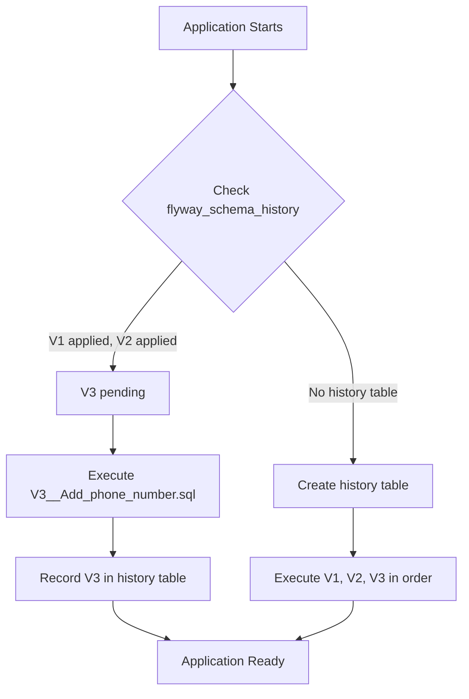
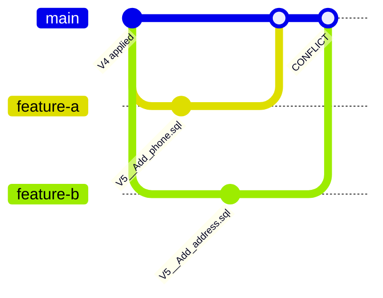

## The Problem

Your application is live. Hundreds of users. The database has a `users` table, and now you need to add a `phone_number` column. You open pgAdmin, run `ALTER TABLE`, and... someone on your team does the same thing on staging but with a different column name. QA runs migrations and gets a different schema than production.

Schema changes in production are terrifying because:

- There's no version history for DDL
- You can't review a schema change in a pull request
- Rolling back a column drop is impossible without a backup
- Multiple developers stepping on each other's changes
- Environments drift out of sync silently

## Why Not `ddl-auto=update`

Hibernate's `ddl-auto=update` is tempting:

```yaml
spring:
  jpa:
    hibernate:
      ddl-auto: update
```

But it will **never**:
- Remove a column (data loss risk)
- Rename a column (creates a new one instead)
- Change a column type correctly
- Add indexes with specific configurations
- Run data migrations

It's fine for prototyping. It's dangerous for anything with real users.

## What is Flyway

Flyway is a database migration tool that versions your schema like you version your code. It maintains a history table (`flyway_schema_history`) that tracks which migrations have been applied:



The `flyway_schema_history` table looks like this:

| installed_rank | version | description | type | script | checksum | installed_on | execution_time | success |
|---|---|---|---|---|---|---|---|---|
| 1 | 1 | Create tables | SQL | V1__Create_tables.sql | -12345 | 2026-01-15 | 245 | true |
| 2 | 2 | Add indexes | SQL | V2__Add_indexes.sql | 67890 | 2026-02-01 | 89 | true |

## Setup with Spring Boot

Add Flyway to your `pom.xml`:

```xml
<dependency>
    <groupId>org.flywaydb</groupId>
    <artifactId>flyway-core</artifactId>
</dependency>
<dependency>
    <groupId>org.flywaydb</groupId>
    <artifactId>flyway-database-postgresql</artifactId>
</dependency>
```

Configure in `application.yml`:

```yaml
spring:
  datasource:
    url: jdbc:postgresql://localhost:5432/myapp
    username: admin
    password: admin
  flyway:
    enabled: true
    locations: classpath:db/migration
    baseline-on-migrate: true
  jpa:
    hibernate:
      ddl-auto: validate  # Flyway manages schema, Hibernate only validates
```

> **Key insight**: Set `ddl-auto=validate`. Let Flyway own the schema. Hibernate validates that entities match the schema at startup.

## Writing Migrations

Place SQL files in `src/main/resources/db/migration/`:

### V1__Create_tables.sql

```sql
CREATE TABLE users (
    id         BIGSERIAL PRIMARY KEY,
    username   VARCHAR(100) NOT NULL UNIQUE,
    email      VARCHAR(255) NOT NULL UNIQUE,
    created_at TIMESTAMP DEFAULT CURRENT_TIMESTAMP
);

CREATE TABLE orders (
    id         BIGSERIAL PRIMARY KEY,
    user_id    BIGINT NOT NULL REFERENCES users(id),
    total      NUMERIC(12, 2) NOT NULL,
    status     VARCHAR(20) DEFAULT 'PENDING',
    created_at TIMESTAMP DEFAULT CURRENT_TIMESTAMP
);
```

### V2__Add_indexes.sql

```sql
CREATE INDEX idx_orders_user_id ON orders(user_id);
CREATE INDEX idx_orders_status ON orders(status);
CREATE INDEX idx_users_email ON users(email);
```

### V3__Add_phone_number.sql

```sql
ALTER TABLE users ADD COLUMN phone_number VARCHAR(20);
```

Each migration runs **exactly once**, in version order, and is never modified after it's been applied.

## Naming Convention

| Pattern | Example | Purpose |
|---------|---------|---------|
| `V{version}__{description}.sql` | `V1__Create_tables.sql` | Versioned migration (runs once) |
| `V{version}.{sub}__{description}.sql` | `V1.1__Add_column.sql` | Sub-versioned migration |
| `R__{description}.sql` | `R__Create_views.sql` | Repeatable migration (runs on change) |
| `U{version}__{description}.sql` | `U3__Undo_phone_number.sql` | Undo migration (Flyway Teams only) |

Rules:
- The `__` (double underscore) separates version from description
- Descriptions use underscores for spaces
- Versions are compared numerically: `V10` comes after `V9`, not after `V1`
- **Never** modify a migration after it's been applied — Flyway checksums will fail

## Repeatable Migrations

Repeatable migrations re-run whenever their content changes. Perfect for:

- Database views
- Stored procedures
- Reference data that evolves

### R__Create_order_summary_view.sql

```sql
CREATE OR REPLACE VIEW order_summary AS
SELECT
    u.username,
    COUNT(o.id) AS total_orders,
    SUM(o.total) AS lifetime_value,
    MAX(o.created_at) AS last_order_date
FROM users u
LEFT JOIN orders o ON o.user_id = u.id
GROUP BY u.username;
```

Repeatable migrations always run **after** all versioned migrations, and they re-execute whenever you change their checksum.

## Environment-Specific Migrations

Use Spring profiles to load different migration locations:

```yaml
# application.yml (shared)
spring:
  flyway:
    locations: classpath:db/migration

---
# application-dev.yml
spring:
  flyway:
    locations: classpath:db/migration,classpath:db/dev
    # db/dev/ contains test data inserts

---
# application-prod.yml
spring:
  flyway:
    locations: classpath:db/migration,classpath:db/prod
    # db/prod/ contains production-only config
```

Keep environment-specific SQL (seed data, test fixtures) separate from schema migrations.

## Rollback Strategies

Flyway is **forward-only** by design. There's no built-in rollback for the open-source version. Here are the strategies:

### Strategy 1: Forward-Fix (Recommended)

If `V5__Add_column.sql` was wrong, don't delete it. Write `V6__Fix_column.sql`:

```sql
-- V6__Fix_column_type.sql
ALTER TABLE users ALTER COLUMN phone_number TYPE VARCHAR(30);
```

This preserves history and is safe for all environments.

### Strategy 2: Undo Migrations (Flyway Teams)

With a paid license, you can write undo scripts:

```sql
-- U5__Add_column.sql (undo for V5)
ALTER TABLE users DROP COLUMN phone_number;
```

Then run: `flyway undo`

### Strategy 3: Clean + Migrate (Dev Only)

For development, you can nuke everything and start fresh:

```bash
flyway clean
flyway migrate
```

> **Never** run `flyway clean` against production. Configure `flyway.cleanDisabled=true` for production profiles.

## Team Workflow

### Branching and Merge Conflicts

When two developers both create `V5__*.sql` on different branches:



**Solution**: Use timestamps or ticket numbers in versions:

```
V20260822_001__Add_phone_number.sql
V20260822_002__Add_address.sql
```

Or use a sequential numbering convention with merge coordination (team agrees who gets the next number).

### Code Review Checklist for Migrations

- [ ] Migration is backwards-compatible (old code still works)
- [ ] Large tables: uses `CONCURRENTLY` for index creation
- [ ] No `DROP COLUMN` without confirming data loss is acceptable
- [ ] Matching JPA entity changes in the same PR
- [ ] Migration tested locally with `flyway validate`

## Flyway vs Liquibase

| Feature | Flyway | Liquibase |
|---------|--------|-----------|
| Migration format | Plain SQL (preferred), Java | XML, YAML, JSON, SQL |
| Learning curve | Low — it's just SQL | Medium — XML changeset syntax |
| Rollback (OSS) | No | Yes (with rollback tags) |
| Diff generation | No | Yes (`liquibase diff`) |
| Database support | 20+ databases | 50+ databases |
| Spring Boot integration | First-class (`spring.flyway.*`) | First-class (`spring.liquibase.*`) |
| Checksum validation | SHA-1 per file | SHA-1 per changeset |
| Repeatable migrations | Yes | Yes (via `runAlways`) |
| Conditional execution | No (use Java migrations) | Yes (preconditions) |
| Community size | Large | Large |
| Best for | Teams that prefer SQL | Teams that need database-agnostic XML |

**My recommendation**: Use Flyway if your team writes SQL naturally and you're on a single database. Use Liquibase if you need database-agnostic migrations or rollback support in the open-source version.

## Production Tips

### Baseline an Existing Database

If you're adding Flyway to an existing database:

```yaml
spring:
  flyway:
    baseline-on-migrate: true
    baseline-version: 0
```

This creates a baseline entry in the history table without running any migrations for existing schemas.

### Validate Before Deploy

Add validation to your CI pipeline:

```bash
flyway validate -url=jdbc:postgresql://... -user=admin -password=***
```

This catches checksum mismatches and missing migrations before you deploy.

### Repair

If a migration fails halfway (non-transactional DDL on MySQL), the history table gets corrupted. Fix it:

```bash
flyway repair
```

This removes failed entries and realigns checksums.

### Locking

Flyway uses database-level locking (`SELECT FOR UPDATE` on the history table) to prevent concurrent migrations. You don't need to coordinate deploys in a cluster — only one instance runs migrations.

## Common Problems

| Problem | Cause | Fix |
|---------|-------|-----|
| `Migration checksum mismatch` | Modified an already-applied migration | Never edit applied migrations; write a new one |
| `Found non-empty schema without history table` | Adding Flyway to existing DB | Set `baseline-on-migrate=true` |
| `Migration V5 failed` | SQL error in migration file | Fix SQL, run `flyway repair`, then `flyway migrate` |
| Schema out of sync with entities | Missing migration for new entity field | Write migration, set `ddl-auto=validate` to catch early |
| Duplicate version numbers | Two developers used same version | Use timestamp-based versions |
| Slow migrations on large tables | `ALTER TABLE` locks entire table | Use `CONCURRENTLY` for indexes, batch data migrations |
| `FlywayException: Validate failed` in CI | Pending migrations not applied | Run `flyway migrate` before validate, or use `flyway info` |

## References

- [Flyway Documentation](https://documentation.red-gate.com/fd)
- [Spring Boot — Flyway Integration](https://docs.spring.io/spring-boot/reference/data/sql.html#data.sql.schema-creation.flyway)
- [Liquibase Documentation](https://docs.liquibase.com/)
- [Flyway Naming Patterns](https://documentation.red-gate.com/fd/migrations-184127470.html)
- [PostgreSQL — ALTER TABLE](https://www.postgresql.org/docs/current/sql-altertable.html)
- [Database Migration Best Practices — Vlad Mihalcea](https://vladmihalcea.com/flyway-database-schema-migrations/)
