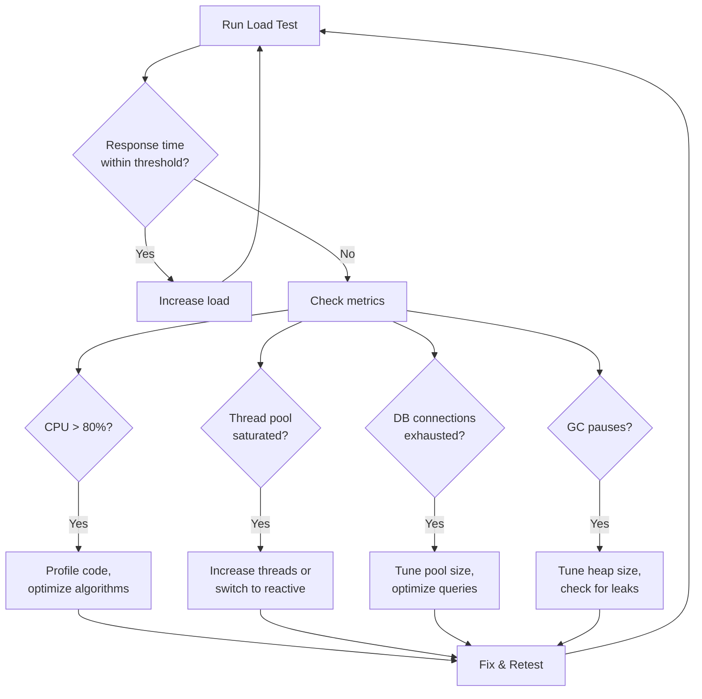

## The Problem — Works in Dev, Dies in Prod

Your application runs perfectly on your laptop. Response times are instant. Everything feels snappy.

Then you deploy to production. 500 concurrent users hit the server. Response times climb from 50ms to 5 seconds. The thread pool saturates. The database connection pool fills up. The JVM starts garbage collecting constantly. Your pager goes off at 2 AM.

Load testing before deployment is the difference between "we know our limits" and "we'll find out in production."

---

## What is Gatling

Gatling is a load testing tool built on Scala with:
- A **code-as-test** DSL (no XML configuration files)
- **High-performance** engine (async, non-blocking — can simulate thousands of users on a single machine)
- **Beautiful HTML reports** with response time distributions, percentiles, and throughput graphs
- **Assertions** for CI/CD integration (fail the build if response times exceed thresholds)

Unlike JMeter's GUI-based approach, Gatling simulations are code — version controlled, reviewable, and composable.

---

## Setup

### Target Application (Spring Boot)

```xml
<dependency>
    <groupId>org.springframework.boot</groupId>
    <artifactId>spring-boot-starter-web</artifactId>
</dependency>
<dependency>
    <groupId>org.springframework.boot</groupId>
    <artifactId>spring-boot-starter-actuator</artifactId>
</dependency>
```

### Gatling Module

```xml
<dependencies>
    <dependency>
        <groupId>io.gatling.highcharts</groupId>
        <artifactId>gatling-charts-highcharts</artifactId>
        <version>3.11.5</version>
        <scope>test</scope>
    </dependency>
    <dependency>
        <groupId>io.gatling</groupId>
        <artifactId>gatling-test-framework</artifactId>
        <version>3.11.5</version>
        <scope>test</scope>
    </dependency>
</dependencies>

<build>
    <plugins>
        <plugin>
            <groupId>net.alchim31.maven</groupId>
            <artifactId>scala-maven-plugin</artifactId>
            <version>4.9.1</version>
        </plugin>
        <plugin>
            <groupId>io.gatling</groupId>
            <artifactId>gatling-maven-plugin</artifactId>
            <version>4.9.6</version>
        </plugin>
    </plugins>
</build>
```

---

## Writing a Simulation

A Gatling simulation has four parts:
1. **HTTP Protocol** — base URL, headers
2. **Scenarios** — user behavior (what they do)
3. **Injection Profile** — how many users, how fast
4. **Assertions** — pass/fail criteria

```scala
class ProductApiSimulation extends Simulation {

  val httpProtocol = http
    .baseUrl("http://localhost:8080")
    .acceptHeader("application/json")
    .contentTypeHeader("application/json")

  val getAllProducts = scenario("Get All Products")
    .exec(
      http("GET /api/products")
        .get("/api/products")
        .check(status.is(200))
        .check(jsonPath("$[0].id").exists)
        .check(responseTimeInMillis.lte(500))
    )

  setUp(
    getAllProducts.inject(rampUsers(100).during(30.seconds))
  ).protocols(httpProtocol)
    .assertions(
      global.responseTime.percentile3.lt(1000),
      global.successfulRequests.percent.gt(95.0)
    )
}
```

---

## Injection Profiles

Injection profiles define how users enter the system. Choose based on what you're testing:

| Profile | Code | Use Case |
|---------|------|----------|
| Ramp up | `rampUsers(100).during(30.seconds)` | Normal load growth |
| At once | `atOnceUsers(200)` | Spike testing (flash sale) |
| Constant rate | `constantUsersPerSec(50).during(60.seconds)` | Sustained throughput |
| Staircase | `incrementUsersPerSec(10).times(5).eachLevelLasting(30.seconds)` | Finding capacity |
| Nothing | `nothingFor(10.seconds)` | Think time between phases |
| Peak + valley | Combine multiple `inject()` calls | Real traffic patterns |

### Mixed Workload Example

Real traffic isn't one endpoint. Model realistic user behavior:

```scala
val mixedWorkload = scenario("Mixed Workload")
  .randomSwitch(
    60.0 -> exec(http("GET /api/products").get("/api/products")),
    30.0 -> exec(http("GET /api/products/{id}").get("/api/products/1")),
    10.0 -> exec(http("POST /api/products")
              .post("/api/products")
              .body(StringBody("""{"name": "New", "price": 19.99}""")))
  )
```

This mirrors real traffic: 60% list, 30% detail, 10% create.

---

## Running Tests

```bash
# Start your Spring Boot app
cd app && mvn spring-boot:run

# In another terminal, run Gatling
cd gatling && mvn gatling:test -Dgatling.simulationClass=simulations.ProductApiSimulation
```

Gatling prints real-time progress:

```
================================================================================
---- Global Information --------------------------------------------------------
> request count                                        300 (OK=297    KO=3     )
> min response time                                     12 (OK=12     KO=503   )
> max response time                                    487 (OK=487    KO=512   )
> mean response time                                    89 (OK=87     KO=508   )
> std deviation                                         74 (OK=71     KO=4     )
> response time 50th percentile                         67 (OK=67     KO=508   )
> response time 75th percentile                        112 (OK=112    KO=512   )
> response time 95th percentile                        234 (OK=232    KO=512   )
> response time 99th percentile                        412 (OK=410    KO=512   )
> mean requests/sec                                     10 (OK=9.9    KO=0.1   )
---- Response Time Distribution ------------------------------------------------
> t < 800 ms                                           297 ( 99%)
> 800 ms <= t < 1200 ms                                  0 (  0%)
> t >= 1200 ms                                           0 (  0%)
> failed                                                 3 (  1%)
================================================================================
```

---

## Reading HTML Reports

After the test, Gatling generates a detailed HTML report at `target/gatling/`:

Key metrics to examine:

- **Response Time Distribution** — where most requests land (p50, p75, p95, p99)
- **Active Users Over Time** — did all users get served or did they queue?
- **Response Time Percentiles Over Time** — when did performance degrade?
- **Requests Per Second** — actual throughput achieved

The p95 and p99 are what matter. The mean lies — it hides the tail latency that real users experience.

---

## Assertions

Assertions let you fail the build when performance degrades:

```scala
setUp(...)
  .assertions(
    global.responseTime.percentile3.lt(1000),      // p95 < 1000ms
    global.successfulRequests.percent.gt(95.0),     // >95% success
    forAll.responseTime.max.lt(5000),               // No request > 5s
    details("GET /api/products")
      .responseTime.mean.lt(200)                    // This endpoint < 200ms mean
  )
```

If assertions fail, the Maven build fails — perfect for CI gates.

---

## Identifying Bottlenecks



Common Spring Boot bottlenecks under load:

1. **Tomcat thread pool** — default is 200 threads. If all 200 are blocked waiting on I/O, new requests queue.
2. **Database connection pool** — HikariCP default is 10 connections. Under load, threads wait for connections.
3. **Synchronous blocking** — a `Thread.sleep()` or slow HTTP call blocks a thread.
4. **GC pressure** — creating too many objects per request causes frequent garbage collection.

---

## CI Integration — GitHub Actions

```yaml
name: Load Test
on: [push]
jobs:
  load-test:
    runs-on: ubuntu-latest
    steps:
      - uses: actions/checkout@v4
      - uses: actions/setup-java@v4
        with:
          distribution: temurin
          java-version: 21
      - name: Start application
        run: cd app && mvn spring-boot:run &
      - name: Wait for app
        run: |
          for i in $(seq 1 30); do
            curl -s http://localhost:8080/api/products && break || sleep 2
          done
      - name: Run Gatling
        run: cd gatling && mvn gatling:test
      - name: Upload Report
        uses: actions/upload-artifact@v4
        with:
          name: gatling-report
          path: gatling/target/gatling/**/index.html
```

The build fails if assertions aren't met — performance regressions are caught before merge.

---

## Gatling vs JMeter vs k6

| Criteria | Gatling | JMeter | k6 |
|----------|---------|--------|-----|
| Language | Scala DSL | XML/GUI | JavaScript |
| Protocol | HTTP, WebSocket | HTTP, JDBC, JMS, etc. | HTTP, WebSocket, gRPC |
| Reports | Beautiful HTML (built-in) | Basic (needs plugins) | Cloud dashboard or JSON |
| Scalability | Thousands of users per machine | Hundreds per machine | Thousands per machine |
| CI-friendly | Yes (Maven/Gradle) | Possible but awkward | Yes (CLI) |
| Learning curve | Medium (Scala) | Low (GUI) | Low (JavaScript) |
| Code as test | Yes | No (XML) | Yes |
| Resource usage | Low (async I/O) | High (threads) | Low (Go runtime) |
| Cloud option | Gatling Enterprise | BlazeMeter | Grafana Cloud k6 |

**Choose Gatling when**: you want beautiful reports, code-as-test, and Maven/Gradle integration for Java projects.

---

## Common Problems

| Problem | Cause | Solution |
|---------|-------|----------|
| "Connection refused" | App not running | Start Spring Boot before Gatling |
| All requests fail | Wrong base URL | Check `http.baseUrl()` |
| Unrealistic results | No think time | Add `pause()` between requests |
| "Too many open files" | OS limit | Increase `ulimit -n 65535` |
| Scala compilation errors | Wrong Scala version | Match `scala.version` to Gatling's |
| Maven can't find Gatling | Missing plugin | Add `gatling-maven-plugin` |
| Results show 0 users | Wrong simulation class | Use `-Dgatling.simulationClass=` |

---

## Full Working Example

Complete project with Spring Boot app and Gatling simulations:

[https://github.com/AnupamSinha/spring-boot-examples/tree/main/32-gatling](https://github.com/AnupamSinha/spring-boot-examples/tree/main/32-gatling)

```bash
# Start the target app
cd 32-gatling/app && mvn spring-boot:run

# Run load test (in another terminal)
cd 32-gatling/gatling
mvn gatling:test -Dgatling.simulationClass=simulations.ProductApiSimulation

# Open the HTML report
open target/gatling/productapisimulation-*/index.html
```

---

## References

- [Gatling Documentation](https://docs.gatling.io/)
- [Gatling Cheat Sheet](https://docs.gatling.io/reference/script/core/simulation/)
- [Gatling Maven Plugin](https://docs.gatling.io/reference/integrations/build-tools/maven-plugin/)
- [Spring Boot Performance Tuning](https://docs.spring.io/spring-boot/docs/current/reference/htmlsingle/#actuator.metrics)
- [Source Code — 32-gatling](https://github.com/AnupamSinha/spring-boot-examples/tree/main/32-gatling)
