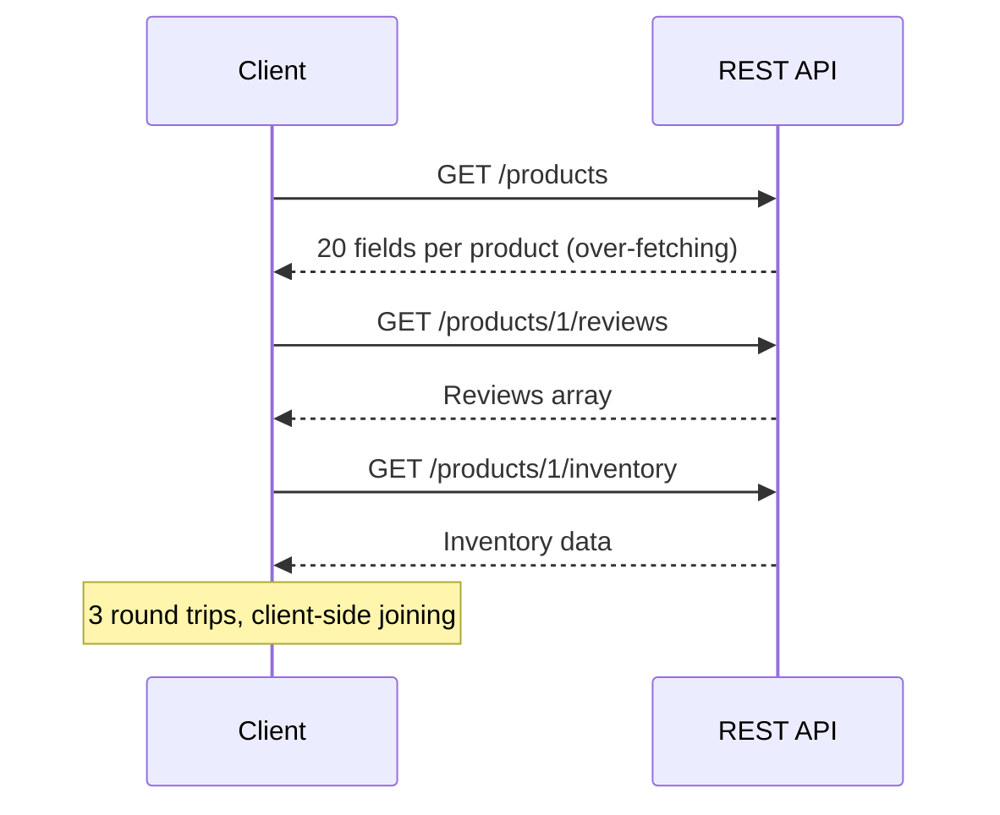
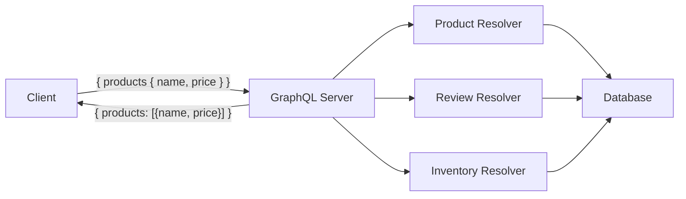
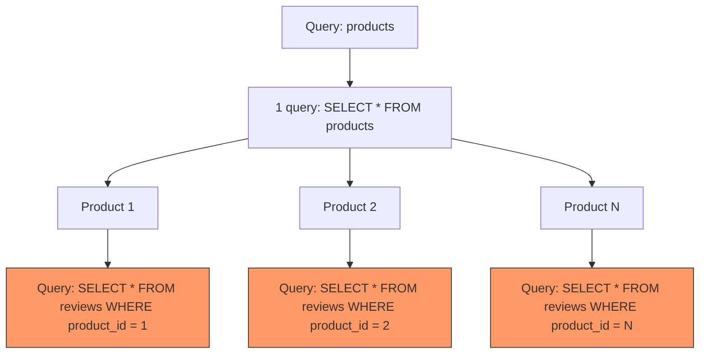

## The Problem — Over-Fetching, Under-Fetching, and Round Trips

REST APIs return fixed response shapes. When a mobile client needs only product name and price, it still receives the full 20-field payload. When a dashboard needs products with reviews, ratings, and inventory — that's three API calls and a client-side join.



GraphQL solves this: the client specifies exactly what it needs in a single request, and the server returns precisely that shape.

## What is GraphQL

GraphQL is a query language for APIs — not a database query language. The client describes the data shape, and the server resolves it.



Key concepts:
- **Schema** — defines types, queries, and mutations (the contract)
- **Queries** — read operations (like GET)
- **Mutations** — write operations (like POST/PUT/DELETE)
- **Resolvers** — functions that fetch data for each field
- **Schema-first** — you write the schema, then implement resolvers

## Setup

### Dependencies (pom.xml)

```xml
<dependency>
    <groupId>org.springframework.boot</groupId>
    <artifactId>spring-boot-starter-graphql</artifactId>
</dependency>
<dependency>
    <groupId>org.springframework.boot</groupId>
    <artifactId>spring-boot-starter-web</artifactId>
</dependency>
<dependency>
    <groupId>org.springframework.boot</groupId>
    <artifactId>spring-boot-starter-data-jpa</artifactId>
</dependency>
<dependency>
    <groupId>com.h2database</groupId>
    <artifactId>h2</artifactId>
    <scope>runtime</scope>
</dependency>
```

### application.yml

```yaml
spring:
  graphql:
    graphiql:
      enabled: true
    schema:
      printer:
        enabled: true
  datasource:
    url: jdbc:h2:mem:graphqldb
    driver-class-name: org.h2.Driver
    username: sa
    password:
  jpa:
    hibernate:
      ddl-auto: create-drop
```

## Schema Definition

Place your schema at `src/main/resources/graphql/schema.graphqls`. Spring Boot auto-detects it.

```graphql
type Product {
    id: ID!
    name: String!
    description: String
    category: String!
    price: Float!
    reviews: [Review!]!
}

type Review {
    id: ID!
    author: String!
    comment: String!
    rating: Int!
    createdAt: String!
}

type Query {
    products: [Product!]!
    productById(id: ID!): Product
    productsByCategory(category: String!): [Product!]!
}

input ProductInput {
    name: String!
    description: String
    category: String!
    price: Float!
}

input ReviewInput {
    author: String!
    comment: String!
    rating: Int!
}

type Mutation {
    createProduct(input: ProductInput!): Product!
    updateProduct(id: ID!, input: ProductInput!): Product!
    deleteProduct(id: ID!): Boolean!
    addReview(productId: ID!, input: ReviewInput!): Review!
}
```

### Schema Design Rules

| Rule                             | Example                              |
|----------------------------------|--------------------------------------|
| Use `!` for non-nullable fields  | `name: String!`                      |
| Use `input` types for mutations  | `input ProductInput { ... }`         |
| Prefix with action for mutations | `createProduct`, `deleteProduct`     |
| Use `ID!` for identifiers        | `id: ID!`                            |
| Plural for lists                 | `products: [Product!]!`              |

## Implementing Resolvers

### @QueryMapping — Read Operations

```java
@Controller
public class ProductGraphqlController {

    private final ProductRepository productRepository;

    @QueryMapping
    public List<Product> products() {
        return productRepository.findAll();
    }

    @QueryMapping
    public Product productById(@Argument Long id) {
        return productRepository.findById(id).orElse(null);
    }

    @QueryMapping
    public List<Product> productsByCategory(@Argument String category) {
        return productRepository.findByCategory(category);
    }
}
```

The method name must match the field name in the schema. `@Argument` maps GraphQL arguments to method parameters.

### @MutationMapping — Write Operations

```java
@MutationMapping
public Product createProduct(@Argument ProductInput input) {
    Product product = new Product(
            input.name(), input.description(),
            input.category(), input.price()
    );
    return productRepository.save(product);
}

@MutationMapping
public Review addReview(@Argument Long productId, @Argument ReviewInput input) {
    Product product = productRepository.findById(productId)
            .orElseThrow(() -> new RuntimeException("Product not found"));

    Review review = new Review(input.author(), input.comment(),
                               input.rating(), product);
    return reviewRepository.save(review);
}

record ProductInput(String name, String description,
                    String category, BigDecimal price) {}
record ReviewInput(String author, String comment, int rating) {}
```

### @SchemaMapping — Nested Types

For resolving nested fields (like `Product.reviews`), use `@SchemaMapping`:

```java
@SchemaMapping(typeName = "Product", field = "reviews")
public List<Review> reviews(Product product) {
    return reviewRepository.findByProductId(product.getId());
}
```

This is called for each product in the result — which leads to the N+1 problem.

## N+1 Problem + @BatchMapping

If you query 10 products with reviews, `@SchemaMapping` fires 10 separate SQL queries for reviews. That's the N+1 problem.



### Solution: @BatchMapping

`@BatchMapping` receives all parent objects at once and returns a map:

```java
@BatchMapping
public Map<Product, List<Review>> reviews(List<Product> products) {
    List<Long> productIds = products.stream()
            .map(Product::getId)
            .toList();

    // Single query for ALL reviews
    List<Review> allReviews = reviewRepository.findByProductIdIn(productIds);

    Map<Long, List<Review>> reviewsByProductId = allReviews.stream()
            .collect(Collectors.groupingBy(r -> r.getProduct().getId()));

    return products.stream()
            .collect(Collectors.toMap(
                    product -> product,
                    product -> reviewsByProductId.getOrDefault(
                            product.getId(), List.of())
            ));
}
```

Now instead of N+1 queries, we execute exactly 2: one for products, one for all their reviews.

## Error Handling

Spring GraphQL integrates with `DataFetcherExceptionResolver` for consistent error responses:

```java
@Component
public class GraphqlExceptionHandler implements DataFetcherExceptionResolver {

    @Override
    public Mono<List<GraphQLError>> resolveException(
            Throwable ex, DataFetchingEnvironment env) {

        if (ex instanceof EntityNotFoundException) {
            return Mono.just(List.of(
                    GraphqlErrorBuilder.newError(env)
                            .message(ex.getMessage())
                            .errorType(ErrorType.NOT_FOUND)
                            .build()
            ));
        }

        return Mono.just(List.of(
                GraphqlErrorBuilder.newError(env)
                        .message("Internal error")
                        .errorType(ErrorType.INTERNAL_ERROR)
                        .build()
        ));
    }
}
```

GraphQL errors follow a standard format:

```json
{
  "errors": [
    {
      "message": "Product not found: 99",
      "locations": [{"line": 2, "column": 3}],
      "path": ["productById"],
      "extensions": { "classification": "NOT_FOUND" }
    }
  ],
  "data": { "productById": null }
}
```

## GraphiQL for Testing

With `spring.graphql.graphiql.enabled=true`, navigate to `http://localhost:8080/graphiql` to get an interactive IDE with:

- Schema explorer (left sidebar)
- Auto-completion
- Query history
- Variable support

Example query to test:

```graphql
{
  products {
    id
    name
    price
    reviews {
      author
      rating
      comment
    }
  }
}
```

## GraphQL vs REST — Comparison

| Aspect                    | GraphQL                                | REST                                  |
|---------------------------|----------------------------------------|---------------------------------------|
| Data fetching             | Client specifies exact fields          | Server decides response shape         |
| Endpoints                 | Single endpoint (`/graphql`)           | Multiple endpoints per resource       |
| Over-fetching             | Not possible — client picks fields     | Common — full resource returned       |
| Under-fetching            | Not possible — nested queries          | Requires multiple calls               |
| Versioning                | No versioning — deprecate fields       | URL versioning (`/v1/`, `/v2/`)       |
| Caching                   | Complex (POST-based)                   | Simple (HTTP caching, ETags)          |
| File uploads              | Not built-in                           | Native multipart support              |
| Real-time                 | Subscriptions (WebSocket)              | SSE, WebSocket, polling               |
| Tooling                   | GraphiQL, schema introspection         | Swagger/OpenAPI                       |
| Learning curve            | Higher                                 | Lower                                 |

## When to Use Which

**Choose GraphQL when:**
- Multiple frontend clients need different data shapes
- Deeply nested related data
- Rapid frontend iteration (no backend changes for new views)
- Mobile clients where bandwidth matters

**Choose REST when:**
- Simple CRUD with predictable access patterns
- File upload/download is primary
- HTTP caching is critical
- Team is experienced with REST, new to GraphQL

## Common Problems

| Problem                              | Cause                                         | Solution                                                  |
|--------------------------------------|-----------------------------------------------|-----------------------------------------------------------|
| N+1 queries                          | `@SchemaMapping` runs per parent              | Use `@BatchMapping` or DataLoader                         |
| Schema not found                     | File not in `src/main/resources/graphql/`     | Move to correct location, use `.graphqls` extension       |
| `@Argument` returns null             | Name mismatch with schema                     | Ensure parameter name matches schema argument name        |
| Circular references in JSON          | Bidirectional JPA relationships                | Use DTOs or `@JsonIgnore` on one side                     |
| Mutation input not binding           | Missing `input` keyword in schema             | Use `input ProductInput` not `type ProductInput`          |
| Large query depth causes timeouts    | No depth limiting                             | Configure `spring.graphql.schema.inspection.enabled=true` |
| GraphiQL not loading                 | `graphiql.enabled` not set                    | Add to `application.yml`                                  |

## Full Working Example

The complete project is available on GitHub:

[spring-boot-graphql on GitHub](https://github.com/anupamsinha/spring-boot-graphql)

```bash
git clone https://github.com/anupamsinha/spring-boot-graphql.git
cd spring-boot-graphql
./mvnw spring-boot:run
# Open http://localhost:8080/graphiql
```

## References

- [Spring for GraphQL Reference](https://docs.spring.io/spring-graphql/reference/)
- [GraphQL Specification](https://spec.graphql.org/)
- [Spring Boot + GraphQL Guide](https://spring.io/guides/gs/graphql-server)
- [GraphQL Java Documentation](https://www.graphql-java.com/documentation/getting-started)
- [Netflix DGS Framework](https://netflix.github.io/dgs/)
