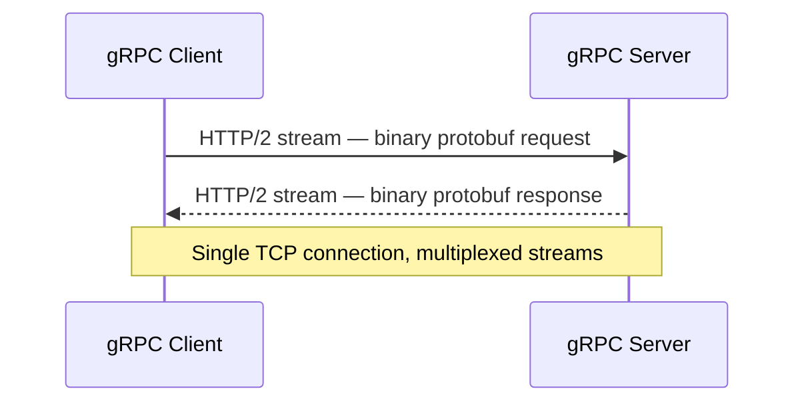
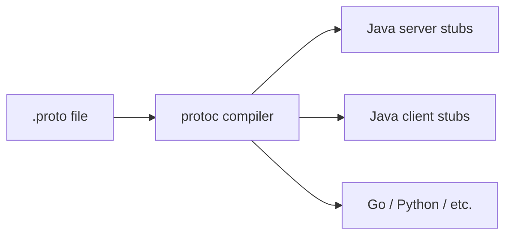
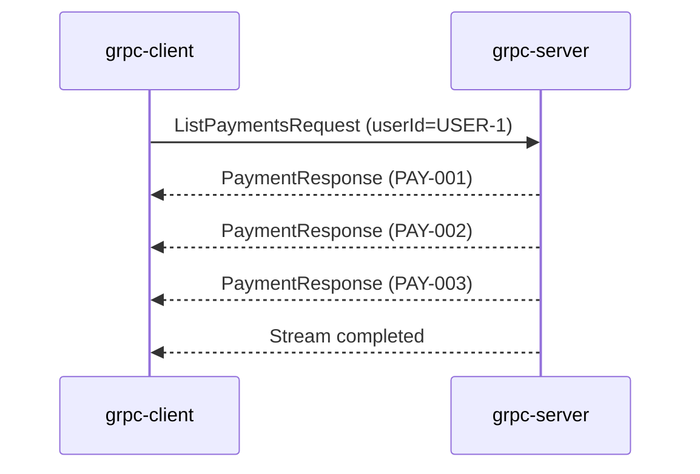

## The Problem

Microservices talk to each other constantly. In most Spring Boot projects, that means REST over HTTP/1.1 with JSON payloads. It works, but the overhead adds up:

- **Text-based serialization** — JSON is human-readable but expensive to parse. Every field name is sent on every request.
- **One request per connection** — HTTP/1.1 opens a new connection (or waits for an existing one) for each call. Head-of-line blocking is real.
- **No contract enforcement** — OpenAPI specs are optional and often drift from the actual implementation.
- **No streaming** — Polling or WebSockets are bolted on as afterthoughts.

For **internal** service-to-service calls where humans never read the payload, we can do much better.

---

## What Is gRPC?

gRPC is a high-performance RPC framework originally developed at Google. It uses **Protocol Buffers** (protobuf) for serialization and **HTTP/2** for transport.



Key properties:

| Feature | Description |
|---------|-------------|
| **Protocol Buffers** | Binary serialization — 3-10x smaller than JSON, 20-100x faster to parse |
| **HTTP/2** | Multiplexed streams over a single TCP connection, header compression |
| **Code generation** | Strongly typed client and server stubs generated from `.proto` files |
| **Streaming** | First-class support for unary, server-streaming, client-streaming, and bidirectional streaming |
| **Deadlines** | Built-in timeout propagation across service boundaries |



---

## What We Are Building

A multi-module Spring Boot project with:

1. **proto** — Shared `.proto` definitions and generated stubs
2. **grpc-server** — Exposes a `PaymentService` over gRPC on port 9090
3. **grpc-client** — REST API (port 8080) that calls the gRPC server internally


---

## Step 1: Define the Proto

Create `proto/src/main/proto/payment.proto`:

```protobuf
syntax = "proto3";

option java_multiple_files = true;
option java_package = "com.anupam.grpc.proto";
option java_outer_classname = "PaymentProto";

package payment;

message PaymentRequest {
  string payment_id = 1;
}

message ListPaymentsRequest {
  string user_id = 1;
  int32 page_size = 2;
}

message PaymentResponse {
  string payment_id = 1;
  string user_id = 2;
  double amount = 3;
  string currency = 4;
  string status = 5;
  string created_at = 6;
}

service PaymentService {
  // Unary RPC — one request, one response
  rpc GetPayment(PaymentRequest) returns (PaymentResponse);

  // Server streaming — one request, stream of responses
  rpc ListPayments(ListPaymentsRequest) returns (stream PaymentResponse);
}
```

The `protobuf-maven-plugin` compiles this into Java classes during `mvn compile`:

```xml
<plugin>
    <groupId>org.xolstice.maven.plugins</groupId>
    <artifactId>protobuf-maven-plugin</artifactId>
    <version>0.6.1</version>
    <configuration>
        <protocArtifact>
            com.google.protobuf:protoc:${protobuf.version}:exe:${os.detected.classifier}
        </protocArtifact>
        <pluginId>grpc-java</pluginId>
        <pluginArtifact>
            io.grpc:protoc-gen-grpc-java:${grpc.version}:exe:${os.detected.classifier}
        </pluginArtifact>
    </configuration>
    <executions>
        <execution>
            <goals>
                <goal>compile</goal>
                <goal>compile-custom</goal>
            </goals>
        </execution>
    </executions>
</plugin>
```

After compilation, you get:
- `PaymentRequest`, `PaymentResponse`, `ListPaymentsRequest` — message classes
- `PaymentServiceGrpc` — base classes for server implementation and client stubs

---

## Step 2: Server Implementation

The `grpc-server` module uses `net.devh:grpc-server-spring-boot-starter` to integrate gRPC into Spring Boot seamlessly.

### Application class

```java
@SpringBootApplication
public class GrpcServerApplication {
    public static void main(String[] args) {
        SpringApplication.run(GrpcServerApplication.class, args);
    }
}
```

### PaymentGrpcService

Annotate with `@GrpcService` — the starter auto-registers it with the gRPC server:

```java
@GrpcService
public class PaymentGrpcService extends PaymentServiceGrpc.PaymentServiceImplBase {

    private final Map<String, PaymentResponse> payments = new ConcurrentHashMap<>();

    @Override
    public void getPayment(PaymentRequest request,
                           StreamObserver<PaymentResponse> responseObserver) {
        String paymentId = request.getPaymentId();

        if (paymentId == null || paymentId.isBlank()) {
            responseObserver.onError(Status.INVALID_ARGUMENT
                    .withDescription("Payment ID must not be empty")
                    .asRuntimeException());
            return;
        }

        PaymentResponse payment = payments.get(paymentId);

        if (payment == null) {
            responseObserver.onError(Status.NOT_FOUND
                    .withDescription("Payment not found: " + paymentId)
                    .asRuntimeException());
            return;
        }

        responseObserver.onNext(payment);
        responseObserver.onCompleted();
    }

    @Override
    public void listPayments(ListPaymentsRequest request,
                             StreamObserver<PaymentResponse> responseObserver) {
        String userId = request.getUserId();
        int pageSize = request.getPageSize() > 0 ? request.getPageSize() : 10;

        payments.values().stream()
                .filter(p -> p.getUserId().equals(userId))
                .limit(pageSize)
                .forEach(responseObserver::onNext);

        responseObserver.onCompleted();
    }
}
```

### Configuration

```yaml
spring:
  application:
    name: grpc-server

grpc:
  server:
    port: 9090
```

The pattern for every gRPC method:
1. Validate the request
2. Do the work
3. Call `responseObserver.onNext(response)` (once for unary, multiple times for streaming)
4. Call `responseObserver.onCompleted()`
5. On failure, call `responseObserver.onError(statusException)`

---

## Step 3: Client Implementation

The `grpc-client` module uses `net.devh:grpc-client-spring-boot-starter` to inject gRPC stubs.

### PaymentClientService

```java
@Service
public class PaymentClientService {

    private static final Logger log = LoggerFactory.getLogger(PaymentClientService.class);

    @GrpcClient("payment-service")
    private PaymentServiceGrpc.PaymentServiceBlockingStub paymentStub;

    public PaymentResponse getPayment(String paymentId) {
        log.info("Requesting payment: {}", paymentId);
        PaymentRequest request = PaymentRequest.newBuilder()
                .setPaymentId(paymentId)
                .build();
        return paymentStub.getPayment(request);
    }

    public List<PaymentResponse> listPayments(String userId, int pageSize) {
        log.info("Listing payments for user: {}", userId);
        ListPaymentsRequest request = ListPaymentsRequest.newBuilder()
                .setUserId(userId)
                .setPageSize(pageSize)
                .build();

        Iterator<PaymentResponse> iterator = paymentStub.listPayments(request);
        List<PaymentResponse> payments = new ArrayList<>();
        iterator.forEachRemaining(payments::add);
        return payments;
    }
}
```

The `@GrpcClient("payment-service")` annotation injects a stub configured by the name in `application.yml`.

### REST Controller

Expose gRPC results as a standard REST API:

```java
@RestController
@RequestMapping("/api/payments")
public class PaymentController {

    private final PaymentClientService paymentClientService;

    public PaymentController(PaymentClientService paymentClientService) {
        this.paymentClientService = paymentClientService;
    }

    @GetMapping("/{paymentId}")
    public ResponseEntity<?> getPayment(@PathVariable String paymentId) {
        try {
            PaymentResponse response = paymentClientService.getPayment(paymentId);
            return ResponseEntity.ok(toMap(response));
        } catch (StatusRuntimeException e) {
            return handleGrpcError(e);
        }
    }

    @GetMapping
    public ResponseEntity<?> listPayments(
            @RequestParam String userId,
            @RequestParam(defaultValue = "10") int pageSize) {
        try {
            List<PaymentResponse> responses =
                    paymentClientService.listPayments(userId, pageSize);
            return ResponseEntity.ok(responses.stream()
                    .map(this::toMap).toList());
        } catch (StatusRuntimeException e) {
            return handleGrpcError(e);
        }
    }
}
```

### Client Configuration

```yaml
spring:
  application:
    name: grpc-client

server:
  port: 8080

grpc:
  client:
    payment-service:
      address: static://localhost:9090
      negotiation-type: plaintext
```

---

## Step 4: Server Streaming

The `ListPayments` RPC demonstrates **server streaming**. Instead of returning a single response, the server sends multiple `PaymentResponse` messages over the same HTTP/2 stream:



On the server side, you call `onNext()` for each item:

```java
payments.values().stream()
        .filter(p -> p.getUserId().equals(userId))
        .limit(pageSize)
        .forEach(responseObserver::onNext);

responseObserver.onCompleted();
```

On the client side, you receive an `Iterator`:

```java
Iterator<PaymentResponse> iterator = paymentStub.listPayments(request);
iterator.forEachRemaining(payments::add);
```

This is powerful for:
- **Large result sets** — Stream rows instead of buffering the entire list in memory
- **Real-time feeds** — Push data as it becomes available
- **Progress updates** — Report processing status incrementally

---

## gRPC vs REST Comparison

| Aspect | REST + JSON | gRPC + Protobuf |
|--------|------------|-----------------|
| **Serialization** | JSON (text, ~verbose) | Protobuf (binary, compact) |
| **Transport** | HTTP/1.1 (one req/conn) | HTTP/2 (multiplexed streams) |
| **Payload size** | Larger (field names repeated) | 3-10x smaller |
| **Parse speed** | Slower (text parsing) | 20-100x faster |
| **Code generation** | Optional (OpenAPI) | Built-in and required |
| **Streaming** | Workarounds (SSE, WebSocket) | Native (4 patterns) |
| **Browser support** | Native | Requires grpc-web proxy |
| **Human readability** | Easy to debug with curl | Binary — needs tooling |
| **Contract** | Can drift from spec | Proto file is the contract |
| **Tooling** | Mature ecosystem | Growing (grpcurl, Postman) |

**When to use gRPC:**
- Internal service-to-service communication
- High-throughput, low-latency requirements
- Streaming use cases
- Polyglot environments (one proto, many languages)

**When to stick with REST:**
- Public APIs consumed by browsers
- Simple CRUD with few calls
- Team familiarity and tooling preferences

---

## Error Handling

gRPC uses **status codes** instead of HTTP status codes. Map them to HTTP when exposing a REST facade:

| gRPC Status | HTTP Status | Typical Use |
|-------------|-------------|-------------|
| `OK` | 200 | Success |
| `INVALID_ARGUMENT` | 400 | Bad request data |
| `NOT_FOUND` | 404 | Resource doesn't exist |
| `ALREADY_EXISTS` | 409 | Duplicate creation |
| `PERMISSION_DENIED` | 403 | Insufficient permissions |
| `UNAUTHENTICATED` | 401 | Missing/invalid credentials |
| `DEADLINE_EXCEEDED` | 504 | Timeout |
| `UNAVAILABLE` | 503 | Server temporarily down |
| `INTERNAL` | 500 | Unexpected server error |

In the server, return errors with meaningful descriptions:

```java
responseObserver.onError(Status.NOT_FOUND
        .withDescription("Payment not found: " + paymentId)
        .asRuntimeException());
```

In the client controller, translate to HTTP:

```java
private ResponseEntity<Map<String, String>> handleGrpcError(StatusRuntimeException e) {
    HttpStatus httpStatus = switch (e.getStatus().getCode()) {
        case NOT_FOUND -> HttpStatus.NOT_FOUND;
        case INVALID_ARGUMENT -> HttpStatus.BAD_REQUEST;
        case PERMISSION_DENIED -> HttpStatus.FORBIDDEN;
        case UNAUTHENTICATED -> HttpStatus.UNAUTHORIZED;
        case DEADLINE_EXCEEDED -> HttpStatus.GATEWAY_TIMEOUT;
        case UNAVAILABLE -> HttpStatus.SERVICE_UNAVAILABLE;
        default -> HttpStatus.INTERNAL_SERVER_ERROR;
    };
    return ResponseEntity.status(httpStatus)
            .body(Map.of("error", e.getStatus().getDescription()));
}
```

### Deadlines

Always set deadlines to avoid hanging calls:

```java
PaymentServiceGrpc.PaymentServiceBlockingStub stubWithDeadline =
        paymentStub.withDeadlineAfter(5, TimeUnit.SECONDS);
```

If the server doesn't respond within the deadline, the client receives `DEADLINE_EXCEEDED`.

---

## Common Problems

| Problem | Cause | Solution |
|---------|-------|----------|
| `UNAVAILABLE: io exception` | Server not running or wrong port | Verify `grpc.server.port` matches client address |
| `UNIMPLEMENTED` | Method not overridden in service impl | Extend the correct `ImplBase` class and override the method |
| `Could not find protoc` | OS classifier not detected | Add `os-maven-plugin` as a build extension |
| Stubs not generated | Missing `compile-custom` goal | Ensure both `compile` and `compile-custom` goals are configured |
| `DEADLINE_EXCEEDED` | Slow server or network issues | Increase deadline or optimize server logic |
| `ClassNotFoundException` for proto classes | Proto module not built first | Run `mvn install` from the parent to build modules in order |
| `negotiation-type` error | TLS mismatch | Use `plaintext` for local dev, `tls` for production |

---

## Full Working Example

The complete source code for this project is available on GitHub:

[**github.com/AnupamSinha/spring-boot-grpc**](https://github.com/AnupamSinha/spring-boot-grpc)

```bash
# Clone and build
git clone https://github.com/AnupamSinha/spring-boot-grpc.git
cd spring-boot-grpc
mvn clean install

# Terminal 1 — start gRPC server
cd grpc-server && mvn spring-boot:run

# Terminal 2 — start REST client
cd grpc-client && mvn spring-boot:run

# Terminal 3 — test
curl http://localhost:8080/api/payments/PAY-001
curl "http://localhost:8080/api/payments?userId=USER-1&pageSize=10"
```

---

## References

- [gRPC Official Documentation](https://grpc.io/docs/)
- [Protocol Buffers Language Guide](https://protobuf.dev/programming-guides/proto3/)
- [grpc-spring-boot-starter (net.devh)](https://github.com/yidongnan/grpc-spring-boot-starter)
- [Spring Boot 3.5 Release Notes](https://spring.io/blog/2025/05/22/spring-boot-3-5-0-available-now)
- [HTTP/2 Specification (RFC 9113)](https://httpwg.org/specs/rfc9113.html)
- [gRPC Status Codes](https://grpc.github.io/grpc/core/md_doc_statuscodes.html)
