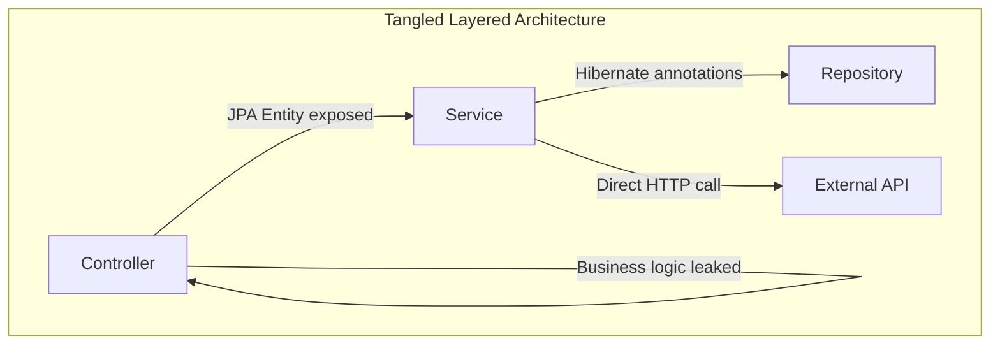
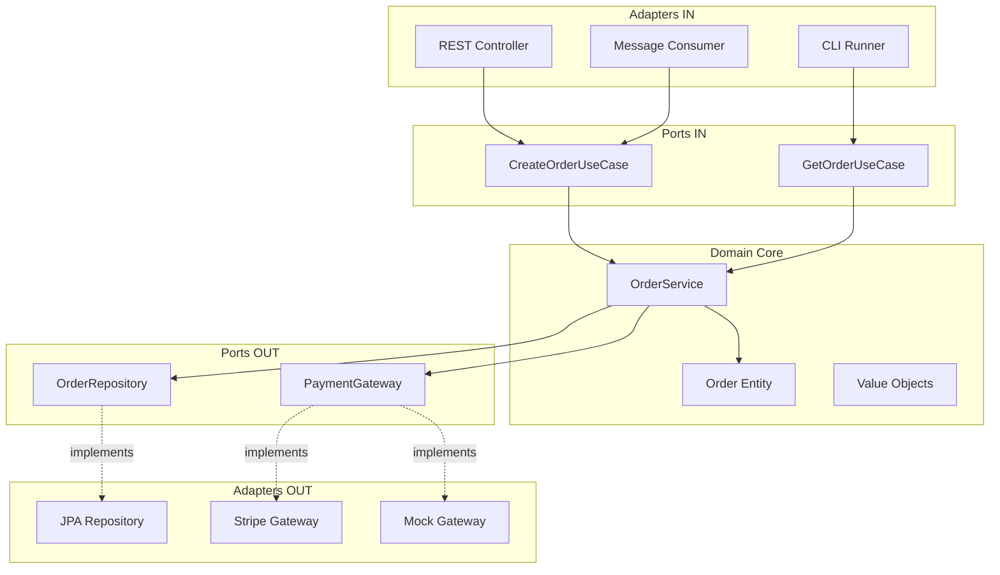
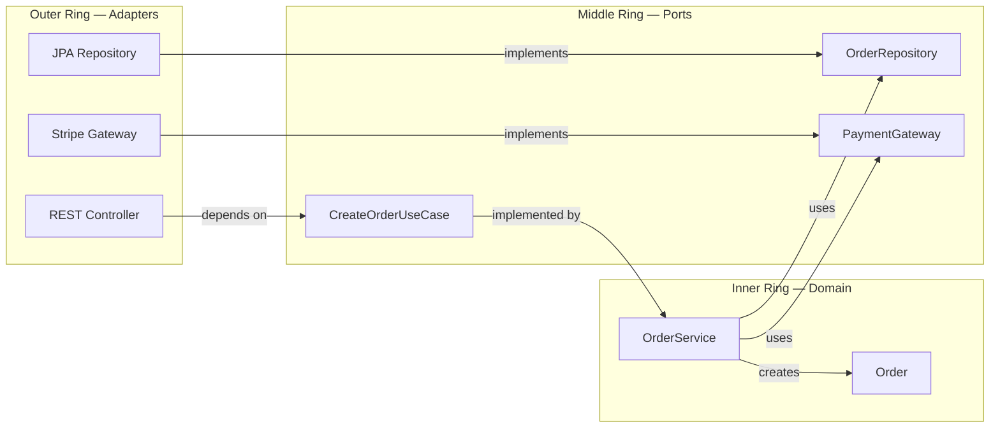

## The Problem — Tangled Layers

Most Spring Boot applications start with a clean layered structure: Controller → Service → Repository. Over time, the boundaries blur:

- Services import JPA annotations for custom queries
- Domain logic leaks into controllers
- External API calls are embedded in service methods
- Tests require a full Spring context just to test business rules

The result is a codebase where changing your database means rewriting business logic, and swapping a payment provider touches twenty files.



---

## What is Hexagonal Architecture?

Hexagonal Architecture (also called Ports & Adapters), proposed by Alistair Cockburn, places the **domain** at the center. Everything else — databases, web frameworks, external APIs — connects through **ports** (interfaces) and **adapters** (implementations).



The key rule: **dependencies point inward**. The domain never knows about Spring, JPA, or HTTP.

---

## Package Structure

```
src/main/java/com/anupam/hexagonal/
├── domain/
│   ├── model/
│   │   ├── Order.java              # Domain entity (pure Java)
│   │   └── OrderStatus.java        # Domain enum
│   ├── port/
│   │   ├── in/
│   │   │   ├── CreateOrderUseCase.java   # Input port
│   │   │   └── GetOrderUseCase.java      # Input port
│   │   └── out/
│   │       ├── OrderRepository.java      # Output port
│   │       └── PaymentGateway.java       # Output port
│   └── service/
│       └── OrderService.java       # Implements use cases
├── adapter/
│   ├── in/
│   │   └── web/
│   │       └── OrderController.java     # REST adapter
│   └── out/
│       ├── persistence/
│       │   ├── JpaOrderRepository.java  # JPA adapter
│       │   └── OrderEntity.java         # JPA entity
│       └── payment/
│           └── StripePaymentGateway.java # Payment adapter
└── HexagonalApplication.java
```

Notice: the `domain` package has **zero** Spring imports. The `adapter` package contains all framework-specific code.

---

## Domain Layer — Pure Java, No Spring

### Domain Entity

```java
public class Order {

    private final String id;
    private final String customerId;
    private final List<LineItem> items;
    private OrderStatus status;
    private final Instant createdAt;

    /** Factory method for creating new orders */
    public static Order create(String customerId, List<LineItem> items) {
        if (items == null || items.isEmpty()) {
            throw new IllegalArgumentException("Order must have at least one item");
        }
        return new Order(UUID.randomUUID().toString(), customerId, items,
            OrderStatus.PENDING, Instant.now());
    }

    /** Domain logic: calculate total */
    public BigDecimal totalAmount() {
        return items.stream()
            .map(LineItem::subtotal)
            .reduce(BigDecimal.ZERO, BigDecimal::add);
    }

    /** Domain logic: state transition with invariant checking */
    public void confirm() {
        if (status != OrderStatus.PAYMENT_PROCESSING) {
            throw new IllegalStateException("Cannot confirm order in status: " + status);
        }
        this.status = OrderStatus.CONFIRMED;
    }

    public void startPayment() {
        if (status != OrderStatus.PENDING) {
            throw new IllegalStateException("Cannot start payment in status: " + status);
        }
        this.status = OrderStatus.PAYMENT_PROCESSING;
    }

    public record LineItem(String productId, String productName,
                           int quantity, BigDecimal unitPrice) {
        public BigDecimal subtotal() {
            return unitPrice.multiply(BigDecimal.valueOf(quantity));
        }
    }
}
```

No `@Entity`, no `@Column`, no `@Service`. This is plain Java that can be tested with JUnit alone.

---

## Input Ports + Adapters

### Input Port (Use Case Interface)

```java
public interface CreateOrderUseCase {

    Order createOrder(CreateOrderCommand command);

    record CreateOrderCommand(
        String customerId,
        List<OrderItemCommand> items
    ) {
        public record OrderItemCommand(
            String productId, String productName, int quantity, BigDecimal unitPrice
        ) {}
    }
}
```

The port defines what the application *can do*. It lives in the domain package.

### Input Adapter (REST Controller)

```java
@RestController
@RequestMapping("/api/orders")
public class OrderController {

    private final CreateOrderUseCase createOrderUseCase;
    private final GetOrderUseCase getOrderUseCase;

    public OrderController(CreateOrderUseCase createOrderUseCase,
                           GetOrderUseCase getOrderUseCase) {
        this.createOrderUseCase = createOrderUseCase;
        this.getOrderUseCase = getOrderUseCase;
    }

    @PostMapping
    public ResponseEntity<OrderResponse> create(@Valid @RequestBody CreateOrderRequest request) {
        var command = new CreateOrderCommand(
            request.customerId(),
            request.items().stream()
                .map(i -> new OrderItemCommand(i.productId(), i.productName(),
                    i.quantity(), i.unitPrice()))
                .toList()
        );
        Order order = createOrderUseCase.createOrder(command);
        return ResponseEntity.status(HttpStatus.CREATED).body(toResponse(order));
    }
}
```

The controller depends on the **port** (interface), not on `OrderService` directly. If you swap the service implementation, the controller doesn't change.

---

## Output Ports + Adapters

### Output Port (Repository Interface in Domain)

```java
public interface OrderRepository {
    Order save(Order order);
    Optional<Order> findById(String orderId);
    List<Order> findByCustomerId(String customerId);
}
```

This is NOT a Spring Data interface. It's defined by the domain, describing what the domain needs.

### Output Adapter (JPA Implementation)

```java
@Repository
public class JpaOrderRepository implements OrderRepository {

    private final SpringDataOrderRepository springRepo;
    private final ObjectMapper objectMapper;

    @Override
    public Order save(Order order) {
        OrderEntity entity = toEntity(order);
        springRepo.save(entity);
        return order;
    }

    @Override
    public Optional<Order> findById(String orderId) {
        return springRepo.findById(orderId).map(this::toDomain);
    }

    private OrderEntity toEntity(Order order) {
        // Maps domain model → JPA entity
    }

    private Order toDomain(OrderEntity entity) {
        // Maps JPA entity → domain model
    }
}
```

The adapter handles the mapping between the domain model and the persistence model. The domain never sees `@Entity` or Hibernate.

---

## The Dependency Rule



Arrows **always** point inward. Outer layers depend on inner layers. Inner layers define interfaces (ports) that outer layers implement.

---

## Testing Each Layer

### Unit Test Domain (No Spring Context)

```java
class OrderTest {

    @Test
    void shouldCalculateTotal() {
        var items = List.of(
            new Order.LineItem("p1", "Widget", 2, new BigDecimal("10.00")),
            new Order.LineItem("p2", "Gadget", 1, new BigDecimal("25.00"))
        );
        Order order = Order.create("customer-1", items);

        assertThat(order.totalAmount()).isEqualByComparingTo("45.00");
    }

    @Test
    void shouldRejectEmptyItems() {
        assertThatThrownBy(() -> Order.create("customer-1", List.of()))
            .isInstanceOf(IllegalArgumentException.class);
    }

    @Test
    void shouldEnforceStateTransitions() {
        var items = List.of(new Order.LineItem("p1", "Widget", 1, BigDecimal.TEN));
        Order order = Order.create("customer-1", items);

        assertThatThrownBy(order::confirm)
            .isInstanceOf(IllegalStateException.class);
    }
}
```

### Unit Test Service (Mock Ports)

```java
@ExtendWith(MockitoExtension.class)
class OrderServiceTest {

    @Mock OrderRepository orderRepository;
    @Mock PaymentGateway paymentGateway;
    @InjectMocks OrderService orderService;

    @Test
    void shouldCreateOrderAndChargePayment() {
        when(paymentGateway.charge(any(), any(), any()))
            .thenReturn(new PaymentResult("txn-1", PaymentStatus.SUCCESS));
        when(orderRepository.save(any())).thenAnswer(i -> i.getArgument(0));

        var command = new CreateOrderCommand("cust-1", List.of(
            new OrderItemCommand("p1", "Widget", 2, BigDecimal.TEN)
        ));

        Order result = orderService.createOrder(command);

        assertThat(result.getStatus()).isEqualTo(OrderStatus.CONFIRMED);
        verify(paymentGateway).charge("cust-1", new BigDecimal("20.00"), "USD");
    }
}
```

### Integration Test Adapter

```java
@DataJpaTest
class JpaOrderRepositoryTest {

    @Autowired SpringDataOrderRepository springRepo;
    private JpaOrderRepository repository;

    @BeforeEach
    void setUp() {
        repository = new JpaOrderRepository(springRepo, new ObjectMapper());
    }

    @Test
    void shouldSaveAndRetrieveOrder() {
        Order order = Order.create("cust-1", List.of(
            new Order.LineItem("p1", "Widget", 1, BigDecimal.TEN)
        ));

        repository.save(order);
        Optional<Order> found = repository.findById(order.getId());

        assertThat(found).isPresent();
        assertThat(found.get().getCustomerId()).isEqualTo("cust-1");
    }
}
```

---

## Architecture Comparison

| Aspect | Layered | Hexagonal | Onion |
|--------|---------|-----------|-------|
| Dependency direction | Top-down (Controller → Service → Repo) | Inward (Adapters → Ports → Domain) | Inward (Infra → Application → Domain) |
| Domain purity | Often polluted with JPA/Spring | Framework-free | Framework-free |
| Testability | Requires Spring context for most tests | Domain testable without framework | Domain testable without framework |
| Complexity | Low | Medium | Medium-High |
| When to use | Simple CRUD, small teams | Multiple adapters, testability focus | Complex domain, DDD focus |
| Package structure | By layer (controller/, service/, repo/) | By feature with layers inside | Concentric rings |

---

## Common Problems

| Problem | Cause | Solution |
|---------|-------|----------|
| Domain imports Spring annotations | Developer shortcut | Enforce with ArchUnit tests |
| Adapter-to-adapter calls | Bypassing domain | Route all logic through use cases |
| Mapping boilerplate | Entity ↔ Domain conversions | Use MapStruct or explicit mapper classes |
| Too many ports for simple CRUD | Over-engineering | Start with one use case interface per aggregate |
| Domain service becomes a God class | Too many use cases in one class | Split into focused services per aggregate action |

ArchUnit test to enforce the dependency rule:

```java
@AnalyzeClasses(packages = "com.anupam.hexagonal")
class ArchitectureTest {

    @ArchTest
    static final ArchRule domainShouldNotDependOnAdapters =
        noClasses().that().resideInAPackage("..domain..")
            .should().dependOnClassesThat()
            .resideInAPackage("..adapter..");

    @ArchTest
    static final ArchRule domainShouldNotDependOnSpring =
        noClasses().that().resideInAPackage("..domain..")
            .should().dependOnClassesThat()
            .resideInAPackage("org.springframework..");
}
```

---

## Full Working Example

The complete source code is available on GitHub:

[spring-boot-hexagonal](https://github.com/anupamsinha/spring-boot-hexagonal)

```bash
# Run the application (H2 in-memory database)
./mvnw spring-boot:run

# Create an order
curl -X POST http://localhost:8080/api/orders \
  -H "Content-Type: application/json" \
  -d '{
    "customerId": "cust-42",
    "items": [
      {"productId": "p1", "productName": "Widget", "quantity": 2, "unitPrice": 10.00}
    ]
  }'

# Get orders by customer
curl http://localhost:8080/api/orders/customer/cust-42
```

---

## References

- [Alistair Cockburn — Hexagonal Architecture](https://alistair.cockburn.us/hexagonal-architecture/)
- [Get Your Hands Dirty on Clean Architecture — Tom Hombergs](https://www.packtpub.com/product/get-your-hands-dirty-on-clean-architecture/9781839211966)
- [ArchUnit — Architecture Tests](https://www.archunit.org/)
- [Spring Boot Reference](https://docs.spring.io/spring-boot/docs/current/reference/html/)
