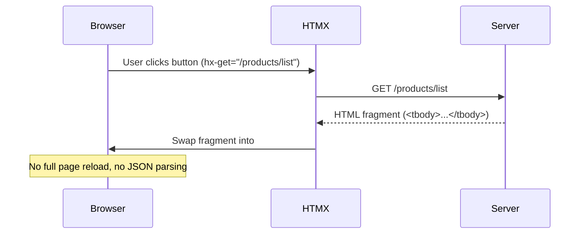

## The Problem — SPA Fatigue for CRUD Apps

Every internal tool starts the same way. Someone says "we need a dashboard" and suddenly you're configuring Webpack, setting up a React project, managing state with Redux, and writing 2000 lines of JavaScript to render a table with pagination.

For most CRUD apps — admin panels, internal tools, dashboards — a full SPA is overkill. You don't need client-side routing. You don't need a virtual DOM. You don't need a 200MB `node_modules` folder just to display a form.

What you actually need: the ability to update parts of a page without a full reload. That's it.

Enter HTMX.

---

## What is HTMX

HTMX is a 14KB JavaScript library that extends HTML with attributes for making HTTP requests and swapping content. Instead of building a JSON API and rendering on the client, you return **HTML fragments** from the server and let HTMX swap them into the page.

The philosophy: **hypermedia as the engine of application state** (HATEOAS) — the way the web was designed to work.



Key insight: the server owns the rendering. No duplication of templates between frontend and backend.

---

## Setup

We need three dependencies:

```xml
<dependency>
    <groupId>org.springframework.boot</groupId>
    <artifactId>spring-boot-starter-web</artifactId>
</dependency>
<dependency>
    <groupId>org.springframework.boot</groupId>
    <artifactId>spring-boot-starter-thymeleaf</artifactId>
</dependency>
<dependency>
    <groupId>org.webjars.npm</groupId>
    <artifactId>htmx.org</artifactId>
    <version>2.0.0</version>
</dependency>
```

Include HTMX in your template:

```html
<script src="/webjars/htmx.org/dist/htmx.min.js"></script>
```

No npm install. No build step. One script tag.

---

## HTMX Attributes

HTMX works through HTML attributes. Here are the ones we'll use:

| Attribute | Purpose | Example |
|-----------|---------|---------|
| `hx-get` | Make a GET request | `hx-get="/products/list"` |
| `hx-post` | Make a POST request | `hx-post="/products"` |
| `hx-delete` | Make a DELETE request | `hx-delete="/products/1"` |
| `hx-swap` | How to swap the response | `hx-swap="innerHTML"` / `"outerHTML"` / `"beforeend"` |
| `hx-target` | Which element to update | `hx-target="#product-table-body"` |
| `hx-trigger` | When to fire the request | `hx-trigger="click"` / `"input changed delay:500ms"` |
| `hx-confirm` | Show confirmation before request | `hx-confirm="Are you sure?"` |
| `hx-indicator` | Show loading indicator | `hx-indicator="#spinner"` |

The mental model: any element can make any HTTP request and put the response anywhere on the page.

---

## Thymeleaf Fragments — Partial Page Updates

The power of HTMX with Spring Boot comes from returning **fragments** — partial HTML that gets swapped into the existing page.

A full page template (`products.html`) renders the initial load. Subsequent interactions return only the parts that changed.

**Product row fragment** (`fragments/product-row.html`):

```html
<tr th:id="'product-' + ${product.id()}">
    <td th:text="${product.id()}"></td>
    <td th:text="${product.name()}"></td>
    <td th:text="'$' + ${product.price()}"></td>
    <td>
        <button class="delete-btn"
                th:attr="hx-delete='/products/' + ${product.id()}"
                hx-confirm="Are you sure?"
                th:attr="hx-target='#product-' + ${product.id()}"
                hx-swap="outerHTML">
            Delete
        </button>
    </td>
</tr>
```

**Product list fragment** (`fragments/product-list.html`):

```html
<th:block th:each="product : ${products}">
    <!-- renders each product row -->
</th:block>
```

The controller returns fragment view names:

```java
@GetMapping("/list")
public String productList(Model model) {
    model.addAttribute("products", productService.findAll());
    return "fragments/product-list";
}
```

---

## Building a Product CRUD — No JavaScript Needed

Here's the complete controller:

```java
@Controller
@RequestMapping("/products")
public class ProductController {

    private final ProductService productService;

    public ProductController(ProductService productService) {
        this.productService = productService;
    }

    @GetMapping
    public String productsPage(Model model) {
        model.addAttribute("products", productService.findAll());
        return "products";
    }

    @GetMapping("/list")
    public String productList(Model model) {
        model.addAttribute("products", productService.findAll());
        return "fragments/product-list";
    }

    @PostMapping
    public String createProduct(@RequestParam String name,
                                @RequestParam BigDecimal price,
                                Model model) {
        Product product = productService.create(name, price);
        model.addAttribute("product", product);
        return "fragments/product-row";
    }

    @DeleteMapping("/{id}")
    @ResponseBody
    public String deleteProduct(@PathVariable Long id) {
        productService.delete(id);
        return "";
    }
}
```

**Create** — `hx-post="/products"` sends form data, server returns a new `<tr>`, HTMX appends it to the table body (`hx-swap="beforeend"`).

**Delete** — `hx-delete="/products/1"` fires the request, server returns empty string, HTMX removes the row (`hx-swap="outerHTML"` replaces the row with nothing).

**List** — `hx-get="/products/list"` fetches the full table body fragment and replaces the current content.

Zero JavaScript written. The browser handles everything.

---

## Active Search

One of HTMX's killer features: real-time search with a single attribute.

```html
<input type="search"
       name="query"
       placeholder="Search products..."
       hx-get="/products/search"
       hx-trigger="input changed delay:500ms, search"
       hx-target="#product-table-body"
       hx-swap="innerHTML"/>
```

The `hx-trigger="input changed delay:500ms"` means: fire the request 500ms after the user stops typing, but only if the value actually changed. Built-in debouncing with no JavaScript.

The controller:

```java
@GetMapping("/search")
public String searchProducts(@RequestParam(defaultValue = "") String query, Model model) {
    model.addAttribute("products", productService.search(query));
    return "fragments/product-list";
}
```

---

## Infinite Scroll

HTMX supports infinite scroll out of the box:

```html
<tr hx-get="/products/page?page=2"
    hx-trigger="revealed"
    hx-swap="afterend">
    <td colspan="4">Loading more...</td>
</tr>
```

The `hx-trigger="revealed"` fires when the element scrolls into view. The response includes the next page of rows plus another trigger row for the following page. Pagination without a single line of JavaScript.

---

## HTMX vs React/Angular

| Criteria | HTMX | React/Angular |
|----------|------|---------------|
| Bundle size | 14KB | 100KB+ (gzipped) |
| Build step | None | Webpack/Vite required |
| State management | Server owns state | Client state (Redux, Zustand) |
| SEO | Built-in (server-rendered) | Requires SSR/SSG |
| Learning curve | HTML attributes | JSX, hooks, lifecycle |
| Real-time updates | WebSocket + hx-swap-oob | WebSocket + state update |
| Offline support | Limited | Service workers |
| Complex UI interactions | Gets awkward | Natural fit |
| Team skills needed | Backend devs can ship UI | Frontend specialization |
| Time to first feature | Minutes | Hours (setup alone) |

---

## When to Use HTMX

HTMX shines when:

- **Internal tools and admin panels** — nobody cares if it's React, they care if it works
- **CRUD applications** — forms, tables, basic interactions
- **Backend teams shipping UI** — no frontend hire needed
- **Prototyping** — get something working in minutes
- **Content-heavy sites** — blogs, docs, e-commerce

Stick with React/Angular when:

- Complex client-side state (drag-and-drop, real-time collaboration)
- Offline-first requirements
- Heavy animations and transitions
- Mobile apps via React Native

---

## Common Problems

| Problem | Cause | Solution |
|---------|-------|----------|
| HTMX not firing requests | Script not loaded | Check WebJars path: `/webjars/htmx.org/dist/htmx.min.js` |
| Fragment renders full page | Wrong view name returned | Return `"fragments/product-row"` not `"products"` |
| Delete doesn't remove row | Wrong hx-target | Use `th:attr="hx-target='#product-' + ${product.id()}"` with `hx-swap="outerHTML"` |
| Form doesn't reset after submit | Missing reset handler | Add `hx-on::after-request="this.reset()"` |
| CORS errors | HTMX sends different origin | Not an issue with same-origin (monolithic app) |
| Thymeleaf caching in dev | Default caching enabled | Set `spring.thymeleaf.cache=false` |
| 406 Not Acceptable | Content negotiation issue | Ensure controller returns view name, not `@ResponseBody` |

---

## Full Working Example

The complete project with all source code is available at:

[https://github.com/AnupamSinha/spring-boot-examples/tree/main/29-htmx](https://github.com/AnupamSinha/spring-boot-examples/tree/main/29-htmx)

Run it:

```bash
cd 29-htmx
mvn spring-boot:run
# Open http://localhost:8080/products
```

You'll see a product table with:
- Real-time search (type in the search box)
- Add products (fill the form, click Add)
- Delete products (click Delete, confirm)
- No page reloads at any point

---

## References

- [HTMX Documentation](https://htmx.org/docs/)
- [HTMX Examples](https://htmx.org/examples/)
- [Spring Boot + Thymeleaf](https://docs.spring.io/spring-boot/docs/current/reference/htmlsingle/#web.servlet.spring-mvc.template-engines)
- [Hypermedia Systems (Book)](https://hypermedia.systems/)
- [WebJars](https://www.webjars.org/)
- [Source Code — 29-htmx](https://github.com/AnupamSinha/spring-boot-examples/tree/main/29-htmx)
