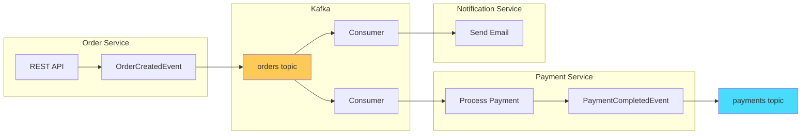
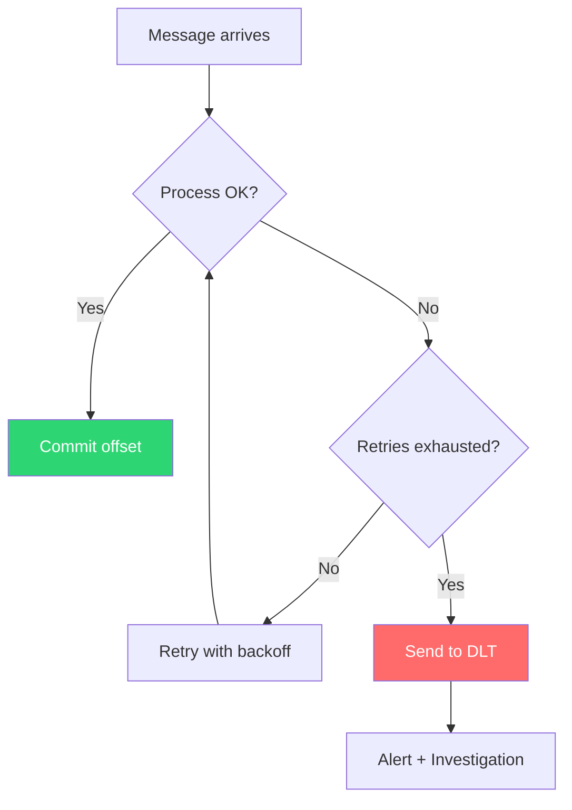
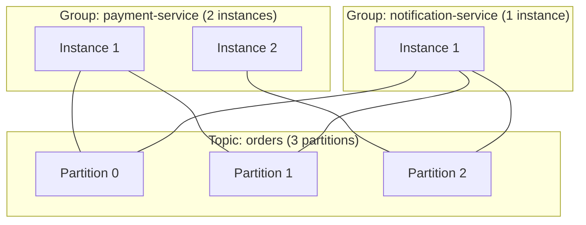

## The Problem

Your [Spring Modulith](/posts/spring-modulith-modular-monoliths/) application uses events internally. But when modules become separate services — different deployables, different databases, different teams — you need events that cross process boundaries.

Synchronous REST calls between services create tight coupling, cascading failures, and retry storms. You need an **event broker** that decouples producers from consumers, buffers during spikes, and guarantees delivery.

Apache Kafka is the industry standard for this. Spring Kafka makes it feel like writing a `@Service`.

---

## What We Are Building

An order processing pipeline with three services communicating via Kafka events:




Key patterns demonstrated:
- **Event publishing** (producer)
- **Event consumption** (consumer groups)
- **Dead Letter Topic (DLT)** for failed messages
- **Retry and error handling**
- **Integration testing with Testcontainers**

---

## Prerequisites

| Component | Version |
|-----------|---------|
| Java | 21+ |
| Spring Boot | 3.5+ |
| Docker | Latest (for Kafka) |
| Maven | 3.9+ |

---

## Project Structure

```
spring-boot-kafka-microservices/
├── pom.xml (parent)
├── docker-compose.yml
├── shared-events/          # Event schemas (shared library)
├── order-service/          # Produces OrderCreatedEvent
├── payment-service/        # Consumes orders, produces PaymentCompletedEvent
└── notification-service/   # Consumes both events, sends notifications
```

---

## Step 1: Infrastructure (docker-compose.yml)

```yaml
services:
  kafka:
    image: confluentinc/cp-kafka:7.6.0
    container_name: kafka
    ports:
      - "9092:9092"
    environment:
      KAFKA_NODE_ID: 1
      KAFKA_LISTENER_SECURITY_PROTOCOL_MAP: CONTROLLER:PLAINTEXT,PLAINTEXT:PLAINTEXT
      KAFKA_ADVERTISED_LISTENERS: PLAINTEXT://localhost:9092
      KAFKA_PROCESS_ROLES: broker,controller
      KAFKA_CONTROLLER_QUORUM_VOTERS: 1@kafka:29093
      KAFKA_CONTROLLER_LISTENER_NAMES: CONTROLLER
      KAFKA_LISTENERS: PLAINTEXT://0.0.0.0:9092,CONTROLLER://0.0.0.0:29093
      CLUSTER_ID: "MkU3OEVBNTcwNTJENDM2Qk"
      KAFKA_OFFSETS_TOPIC_REPLICATION_FACTOR: 1
```

```bash
docker compose up -d
```

KRaft mode (no ZooKeeper). Single broker for development.

---

## Step 2: Shared Event Schemas

```java
// shared-events module
public record OrderCreatedEvent(
        String orderId,
        String customerId,
        BigDecimal totalAmount,
        List<OrderItem> items,
        Instant createdAt
) {}

public record PaymentCompletedEvent(
        String paymentId,
        String orderId,
        String status,
        BigDecimal amount,
        Instant processedAt
) {}

public record OrderItem(
        String productId,
        String name,
        int quantity,
        BigDecimal price
) {}
```

Shared events as records — immutable, serializable, versioned as a library.

---

## Step 3: Order Service (Producer)

### Configuration

```yaml
spring:
  kafka:
    bootstrap-servers: localhost:9092
    producer:
      key-serializer: org.apache.kafka.common.serialization.StringSerializer
      value-serializer: org.springframework.kafka.support.serializer.JsonSerializer
      properties:
        spring.json.type.mapping: >
          orderCreated:com.anupam.events.OrderCreatedEvent
```

### Publishing Events

```java
@Service
public class OrderService {

    private final KafkaTemplate<String, OrderCreatedEvent> kafkaTemplate;

    public OrderService(KafkaTemplate<String, OrderCreatedEvent> kafkaTemplate) {
        this.kafkaTemplate = kafkaTemplate;
    }

    public Order createOrder(CreateOrderRequest request) {
        Order order = new Order(UUID.randomUUID().toString(), request.customerId(),
                request.items(), OrderStatus.CREATED);

        // Publish event — Kafka handles delivery
        OrderCreatedEvent event = new OrderCreatedEvent(
                order.orderId(),
                order.customerId(),
                order.totalAmount(),
                order.items(),
                Instant.now()
        );

        kafkaTemplate.send("orders", order.orderId(), event)
                .whenComplete((result, ex) -> {
                    if (ex != null) {
                        log.error("Failed to publish OrderCreatedEvent: {}", order.orderId(), ex);
                    } else {
                        log.info("Published OrderCreatedEvent to partition {} offset {}",
                                result.getRecordMetadata().partition(),
                                result.getRecordMetadata().offset());
                    }
                });

        return order;
    }
}
```

Key design: the event is published **after** the order is created in-memory. In production, use the Outbox Pattern (save event to DB in same transaction, publish asynchronously) for guaranteed delivery.

---

## Step 4: Payment Service (Consumer)

### Configuration

```yaml
spring:
  kafka:
    bootstrap-servers: localhost:9092
    consumer:
      group-id: payment-service
      auto-offset-reset: earliest
      key-deserializer: org.apache.kafka.common.serialization.StringDeserializer
      value-deserializer: org.springframework.kafka.support.serializer.JsonDeserializer
      properties:
        spring.json.trusted.packages: "com.anupam.events"
```

### Consuming Events

```java
@Service
public class PaymentProcessor {

    private final KafkaTemplate<String, PaymentCompletedEvent> kafkaTemplate;

    @KafkaListener(topics = "orders", groupId = "payment-service")
    public void handleOrderCreated(OrderCreatedEvent event) {
        log.info("Processing payment for order: {}", event.orderId());

        // Simulate payment processing
        PaymentResult result = processPayment(event);

        // Publish downstream event
        PaymentCompletedEvent paymentEvent = new PaymentCompletedEvent(
                UUID.randomUUID().toString(),
                event.orderId(),
                result.status(),
                event.totalAmount(),
                Instant.now()
        );

        kafkaTemplate.send("payments", event.orderId(), paymentEvent);
        log.info("Payment {} for order {}", result.status(), event.orderId());
    }
}
```

---

## Step 5: Error Handling with Dead Letter Topic

Failed messages shouldn't block the queue. Route them to a DLT:

```java
@Configuration
public class KafkaConfig {

    @Bean
    public DefaultErrorHandler errorHandler(KafkaTemplate<String, Object> template) {
        // Retry 3 times with backoff, then send to DLT
        DeadLetterPublishingRecoverer recoverer =
                new DeadLetterPublishingRecoverer(template);

        BackOff backOff = new FixedBackOff(1000L, 3); // 1s interval, 3 retries

        DefaultErrorHandler handler = new DefaultErrorHandler(recoverer, backOff);

        // Don't retry these — they'll never succeed
        handler.addNotRetryableExceptions(
                JsonParseException.class,
                DeserializationException.class
        );

        return handler;
    }
}
```

```java
// Monitor the DLT for failed messages
@KafkaListener(topics = "orders.DLT", groupId = "dlt-processor")
public void handleDeadLetter(ConsumerRecord<String, byte[]> record) {
    log.error("Dead letter received — topic: {}, key: {}, reason: {}",
            record.topic(), record.key(),
            new String(record.headers().lastHeader("kafka_dlt-exception-message").value()));
    // Alert, store for investigation, or attempt manual reprocessing
}
```




---

## Step 6: Notification Service (Multi-Topic Consumer)

```java
@Service
public class NotificationService {

    @KafkaListener(topics = "orders", groupId = "notification-service")
    public void onOrderCreated(OrderCreatedEvent event) {
        sendEmail(event.customerId(),
                "Order Confirmed",
                "Your order " + event.orderId() + " has been placed.");
    }

    @KafkaListener(topics = "payments", groupId = "notification-service")
    public void onPaymentCompleted(PaymentCompletedEvent event) {
        sendEmail(getCustomerForOrder(event.orderId()),
                "Payment Processed",
                "Payment of " + event.amount() + " for order " + event.orderId() + " is " + event.status());
    }
}
```

Notice: the notification service has its own `groupId`. It processes the same `orders` topic independently from the payment service — Kafka delivers to both.

---

## Step 7: Integration Testing with Testcontainers

```java
@SpringBootTest
@Testcontainers
class OrderEventFlowTest {

    @Container
    @ServiceConnection
    static KafkaContainer kafka = new KafkaContainer(
            DockerImageName.parse("confluentinc/cp-kafka:7.6.0"));

    @Autowired
    private KafkaTemplate<String, OrderCreatedEvent> kafkaTemplate;

    @Autowired
    private PaymentProcessor paymentProcessor;

    @Test
    void shouldProcessOrderAndPublishPaymentEvent() throws Exception {
        OrderCreatedEvent order = new OrderCreatedEvent(
                "ORD-001", "CUST-42", new BigDecimal("99.99"),
                List.of(new OrderItem("P1", "Widget", 1, new BigDecimal("99.99"))),
                Instant.now());

        kafkaTemplate.send("orders", order.orderId(), order).get();

        Awaitility.await()
                .atMost(Duration.ofSeconds(15))
                .untilAsserted(() ->
                        assertThat(paymentProcessor.getProcessedOrders())
                                .contains("ORD-001"));
    }
}
```

---

## Consumer Group Mechanics




- Each consumer group gets **all messages** independently
- Within a group, partitions are **distributed** across instances
- Scaling = adding instances to a group (up to partition count)

---

## Production Considerations

### Exactly-Once Semantics

```yaml
spring:
  kafka:
    producer:
      transaction-id-prefix: order-service-
      acks: all
    consumer:
      isolation-level: read_committed
```

### Idempotent Consumers

Even with exactly-once, design consumers to be idempotent:

```java
@KafkaListener(topics = "orders", groupId = "payment-service")
public void handleOrderCreated(OrderCreatedEvent event) {
    // Idempotency check — skip if already processed
    if (paymentRepository.existsByOrderId(event.orderId())) {
        log.info("Order {} already processed, skipping", event.orderId());
        return;
    }
    processPayment(event);
}
```

### Monitoring

Key Kafka metrics to watch:
- `kafka.consumer.lag` — how far behind consumers are
- `kafka.producer.record-send-rate` — throughput
- `kafka.consumer.commit-latency` — offset commit time

---

## Common Problems

| Symptom | Cause | Fix |
|---------|-------|-----|
| Consumer never receives messages | Wrong `group-id` or topic doesn't exist | Verify topic exists, check `auto-offset-reset` |
| `DeserializationException` | Producer/consumer schema mismatch | Ensure `spring.json.trusted.packages` is set |
| Messages processed multiple times | Consumer crashes before commit | Make consumers idempotent |
| Consumer lag growing | Processing too slow | Add consumer instances (scale out) |
| Ordering broken | Messages for same entity in different partitions | Use entity ID as message key |
| `TimeoutException` on send | Broker unreachable | Check `bootstrap-servers`, network |

---

## Full Working Example

The complete multi-module project is at [github.com/AnupamSinha/spring-boot-examples/tree/main/10-kafka-microservices](https://github.com/AnupamSinha/spring-boot-examples/tree/main/10-kafka-microservices).

```bash
git clone https://github.com/AnupamSinha/spring-boot-examples/tree/main/10-kafka-microservices
cd spring-boot-kafka-microservices
docker compose up -d
./mvnw spring-boot:run -pl order-service
./mvnw spring-boot:run -pl payment-service
./mvnw spring-boot:run -pl notification-service
```

---

## References

- [Spring for Apache Kafka Documentation](https://docs.spring.io/spring-kafka/reference/)
- [Apache Kafka Documentation](https://kafka.apache.org/documentation/)
- [Spring Boot Kafka Auto-Configuration](https://docs.spring.io/spring-boot/reference/messaging/kafka.html)
- [Confluent Kafka Tutorials](https://developer.confluent.io/tutorials/)
- [Testcontainers Kafka Module](https://testcontainers.com/modules/kafka/)
