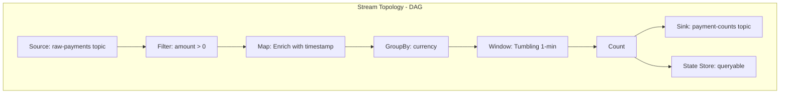
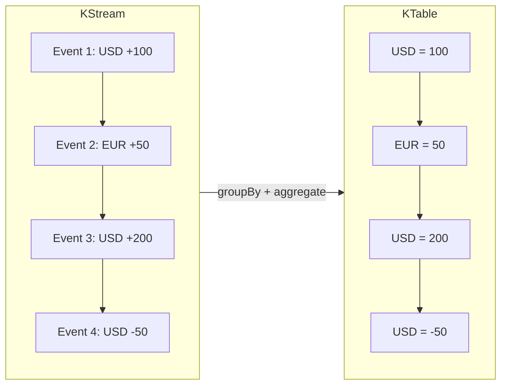

## The Problem: Batch Is Too Slow, Consumers Are Stateless

Traditional Kafka consumers process messages one at a time. They're great for fire-and-forget tasks but fall apart when you need:

- Counting events over time windows (e.g., payments per minute per currency)
- Joining data from multiple topics in real-time
- Maintaining running aggregates without an external database
- Sub-second latency from event to insight

A Kafka consumer can read messages — but it has no memory, no aggregation engine, and no concept of time windows.

**Kafka Streams** solves this. It's a lightweight library (not a cluster) that turns your Spring Boot app into a stream processor with built-in state management.

---

## What Are Kafka Streams?

Kafka Streams is a client library for building real-time applications that process data stored in Kafka topics. Unlike Spark or Flink, it doesn't require a separate cluster — it runs inside your application.




A **topology** is a directed acyclic graph (DAG) of stream processors. Data flows from source topics through transformations to sink topics or state stores.

---

## Kafka Streams vs Kafka Consumer

| Feature | Kafka Consumer | Kafka Streams |
|---------|---------------|---------------|
| Stateful processing | Manual (external DB) | Built-in state stores |
| Windowed aggregations | Manual timer logic | Native time windows |
| Joins (stream-stream, stream-table) | Not supported | First-class support |
| Exactly-once semantics | Complex to implement | Built-in |
| Scaling | Manual partition assignment | Automatic rebalancing |
| Deployment | Any | Embedded in your app |
| External cluster | No | No |
| Backpressure | Manual | Automatic |

---

## Setup

### Docker Compose — Kafka (KRaft Mode)

No Zookeeper needed. Kafka 3.8 runs in KRaft mode:

```yaml
services:
  kafka:
    image: apache/kafka:3.8.0
    environment:
      KAFKA_NODE_ID: 1
      KAFKA_PROCESS_ROLES: broker,controller
      KAFKA_LISTENERS: PLAINTEXT://0.0.0.0:9092,CONTROLLER://0.0.0.0:9093,EXTERNAL://0.0.0.0:29092
      KAFKA_ADVERTISED_LISTENERS: PLAINTEXT://kafka:9092,EXTERNAL://localhost:29092
      KAFKA_CONTROLLER_QUORUM_VOTERS: 1@kafka:9093
      KAFKA_CONTROLLER_LISTENER_NAMES: CONTROLLER
      CLUSTER_ID: 'MkU3OEVBNTcwNTJENDM2Qk'
    ports:
      - "29092:29092"
```

### Dependencies

```xml
<dependency>
    <groupId>org.springframework.kafka</groupId>
    <artifactId>spring-kafka</artifactId>
</dependency>
<dependency>
    <groupId>org.apache.kafka</groupId>
    <artifactId>kafka-streams</artifactId>
</dependency>
```

### Configuration

```yaml
spring:
  kafka:
    bootstrap-servers: localhost:29092
    streams:
      application-id: payment-stream-processor
```

---

## Enabling Kafka Streams in Spring Boot

```java
@Configuration
@EnableKafkaStreams
public class KafkaStreamsConfig {

    @Bean(name = KafkaStreamsDefaultProperties.DEFAULT_STREAMS_CONFIG_BEAN_NAME)
    public KafkaStreamsConfiguration kafkaStreamsConfiguration() {
        Map<String, Object> props = new HashMap<>();
        props.put(StreamsConfig.APPLICATION_ID_CONFIG, "payment-stream-processor");
        props.put(StreamsConfig.BOOTSTRAP_SERVERS_CONFIG, "localhost:29092");
        props.put(StreamsConfig.DEFAULT_KEY_SERDE_CLASS_CONFIG, Serdes.StringSerde.class.getName());
        props.put(StreamsConfig.DEFAULT_VALUE_SERDE_CLASS_CONFIG, Serdes.StringSerde.class.getName());
        props.put(StreamsConfig.COMMIT_INTERVAL_MS_CONFIG, 1000);
        return new KafkaStreamsConfiguration(props);
    }
}
```

`@EnableKafkaStreams` creates a `StreamsBuilderFactoryBean` that manages the lifecycle of your Kafka Streams instance.

---

## Building a Topology

The topology is where all the processing logic lives. In Spring Boot, you inject `StreamsBuilder`:

```java
@Component
public class PaymentStreamTopology {

    public static final String STATE_STORE_NAME = "payment-counts-store";

    @Autowired
    public void buildTopology(StreamsBuilder streamsBuilder) {
        // 1. Read from source topic
        KStream<String, String> rawStream = streamsBuilder.stream("raw-payments");

        // 2. Deserialize + filter invalid
        KStream<String, RawPayment> payments = rawStream
                .mapValues(this::deserialize)
                .filter((key, payment) -> payment != null);

        // 3. Filter: positive amounts only
        KStream<String, RawPayment> validPayments = payments
                .filter((key, payment) -> payment.amount() > 0);

        // 4. Transform: enrich with processing metadata
        KStream<String, EnrichedPayment> enriched = validPayments
                .mapValues(raw -> new EnrichedPayment(
                        raw.id(), raw.currency(), raw.amount(),
                        raw.amount() > 10000 ? "HIGH_VALUE" : "NORMAL",
                        Instant.now()
                ));

        // 5. Group by currency → window → count
        KTable<Windowed<String>, Long> counts = enriched
                .groupBy((key, p) -> p.currency())
                .windowedBy(TimeWindows.ofSizeWithNoGrace(Duration.ofMinutes(1)))
                .count(Materialized.as(STATE_STORE_NAME));

        // 6. Write to output topic
        counts.toStream()
                .map((windowedKey, count) -> KeyValue.pair(windowedKey.key(),
                        formatJson(windowedKey, count)))
                .to("payment-counts");
    }
}
```

Each step is a processor node in the topology graph. Kafka Streams handles partitioning, rebalancing, and fault tolerance.

---

## KStream vs KTable

This is the fundamental duality in Kafka Streams:




| Concept | KStream | KTable |
|---------|---------|--------|
| Semantics | Append-only event log | Latest value per key |
| Analogy | Transaction log | Current balance |
| Operations | filter, map, join, branch | aggregate, reduce, join |
| Storage | None (pass-through) | State store (RocksDB) |

**KStream**: Every record is an independent event.  
**KTable**: Every record is an update to the latest value for that key.

---

## Windowed Aggregations

Kafka Streams supports three window types:

| Window Type | Description | Use Case |
|-------------|-------------|----------|
| **Tumbling** | Fixed-size, non-overlapping | "Payments per minute" |
| **Hopping** | Fixed-size, overlapping | "5-min average updated every 1 min" |
| **Session** | Activity-based, gap-triggered | "User sessions with 30-min timeout" |

### Tumbling Window (our example)

```java
.windowedBy(TimeWindows.ofSizeWithNoGrace(Duration.ofMinutes(1)))
.count()
```

Every 1-minute window is independent. At minute boundary, the count resets for the new window.

### Hopping Window

```java
.windowedBy(TimeWindows.ofSizeAndGrace(Duration.ofMinutes(5), Duration.ZERO)
        .advanceBy(Duration.ofMinutes(1)))
.count()
```

5-minute windows that advance every 1 minute — overlapping provides smoother aggregates.

### Session Window

```java
.windowedBy(SessionWindows.ofInactivityGapWithNoGrace(Duration.ofMinutes(30)))
.count()
```

Windows close after 30 minutes of inactivity for that key.

---

## State Stores: Queryable from REST

State stores are Kafka Streams' built-in storage (backed by RocksDB). The magic: they're queryable from your REST API.

```java
@GetMapping("/api/streams/counts")
public Map<String, Object> getPaymentCounts() {
    KafkaStreams kafkaStreams = factoryBean.getKafkaStreams();

    ReadOnlyWindowStore<String, Long> windowStore = kafkaStreams.store(
            StoreQueryParameters.fromNameAndType(
                    PaymentStreamTopology.STATE_STORE_NAME,
                    QueryableStoreTypes.windowStore()
            )
    );

    Instant now = Instant.now();
    Instant oneMinuteAgo = now.minusSeconds(60);

    Map<String, Long> counts = new HashMap<>();
    for (String currency : List.of("USD", "EUR", "GBP", "JPY", "INR")) {
        try (WindowStoreIterator<Long> iterator =
                     windowStore.fetch(currency, oneMinuteAgo, now)) {
            long total = 0;
            while (iterator.hasNext()) {
                total += iterator.next().value;
            }
            if (total > 0) counts.put(currency, total);
        }
    }

    return Map.of("window", Map.of("from", oneMinuteAgo, "to", now), "counts", counts);
}
```

This is called **Interactive Queries** — reading from Kafka Streams state stores via HTTP without an external database.

---

## Interactive Queries: Expose State via Endpoint

The pattern:

1. Define a `Materialized` state store in your topology
2. Inject `StreamsBuilderFactoryBean` into your controller
3. Get the `KafkaStreams` instance
4. Query the store with `StoreQueryParameters`

For multi-instance deployments, Kafka Streams can discover which instance owns which partition — enabling distributed queries across instances.

---

## Testing with TopologyTestDriver

Kafka Streams provides `TopologyTestDriver` for unit testing without a running Kafka broker:

```java
@Test
void shouldFilterNegativeAmounts() {
    StreamsBuilder builder = new StreamsBuilder();
    new PaymentStreamTopology().buildTopology(builder);
    Topology topology = builder.build();

    try (TopologyTestDriver driver = new TopologyTestDriver(topology, props)) {
        TestInputTopic<String, String> inputTopic =
                driver.createInputTopic("raw-payments",
                        new StringSerializer(), new StringSerializer());

        TestOutputTopic<String, String> outputTopic =
                driver.createOutputTopic("payment-counts",
                        new StringDeserializer(), new StringDeserializer());

        // Send a negative amount — should be filtered out
        inputTopic.pipeInput("key1", "{\"id\":\"1\",\"currency\":\"USD\",\"amount\":-50}");

        assertTrue(outputTopic.isEmpty());
    }
}
```

No Kafka broker needed. Tests run in milliseconds.

---

## Common Problems

| Problem | Cause | Solution |
|---------|-------|----------|
| `StreamsException: TopologyException` | Topic doesn't exist | Create topics before starting or set `auto.create.topics.enable=true` |
| State store query returns empty | Store not yet ready (rebalancing) | Check `KafkaStreams.state() == RUNNING` before querying |
| Duplicate processing after restart | At-least-once default | Enable exactly-once: `processing.guarantee=exactly_once_v2` |
| High memory usage | Large state stores | Configure RocksDB cache size, enable changelog compaction |
| Rebalancing storms | Frequent restarts or slow processing | Increase `max.poll.interval.ms`, tune `session.timeout.ms` |
| Serialization errors | Serde mismatch | Match Serde to actual data type in Consumed/Produced/Grouped |

---

## Full Working Example

The complete implementation is available on GitHub:

[**spring-boot-examples/34-kafka-streams**](https://github.com/AnupamSinha/spring-boot-examples/tree/main/34-kafka-streams)

Clone and run:

```bash
git clone https://github.com/AnupamSinha/spring-boot-examples.git
cd spring-boot-examples/34-kafka-streams
docker-compose up -d
./mvnw spring-boot:run
```

The app auto-produces test events and processes them. Query the state store:

```bash
curl http://localhost:8080/api/streams/counts
```

---

## References

- [Spring for Apache Kafka Documentation](https://docs.spring.io/spring-kafka/reference/)
- [Apache Kafka Streams Documentation](https://kafka.apache.org/documentation/streams/)
- [Kafka Streams Developer Guide — Interactive Queries](https://kafka.apache.org/documentation/streams/developer-guide/interactive-queries.html)
- [Confluent — Kafka Streams Windowing](https://developer.confluent.io/courses/kafka-streams/windowing/)
