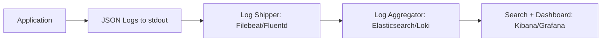

## The Problem: Unstructured Logs Are Unsearchable at Scale

Your application logs look like this:

```
2026-08-22 10:15:42.123 INFO  [main] c.a.UserService - User created: john@email.com
2026-08-22 10:15:42.456 ERROR [http-nio-8080-1] c.a.PaymentService - Payment failed for order 12345
```

In development, this is fine. In production with 50 instances, 10,000 requests/second, and a log aggregator (ELK, Loki, Datadog):

- How do you find all logs for a specific request?
- How do you filter errors for a specific service?
- How do you parse the timestamp, level, and message reliably?
- How do you correlate a user's journey across microservices?

Unstructured text logs require regex parsing. **Structured JSON logs** are instantly queryable.

---

## Log Levels Strategy

| Level | Use For | Example |
|-------|---------|---------|
| `TRACE` | Very detailed diagnostic info. Never in production. | Method entry/exit, loop iterations |
| `DEBUG` | Diagnostic info for development. Production: off by default. | Variable values, SQL queries, request details |
| `INFO` | Normal business events. Production baseline. | "User registered", "Order placed", "Payment processed" |
| `WARN` | Something unexpected but recoverable. Investigate soon. | "Retry attempt 2/3", "Cache miss — falling back to DB" |
| `ERROR` | Something failed. Requires attention. May lose data. | "Payment gateway timeout", "Database connection refused" |

### Guidelines

- **INFO** should tell the story of what your application is doing
- **WARN** should be actionable — if nobody would investigate it, it's DEBUG
- **ERROR** means something is broken right now
- Never log at ERROR for expected business cases (e.g., "user not found" is WARN, not ERROR)
- Never log sensitive data at any level

---

## Structured JSON Logging

### Why JSON?



JSON logs are machine-parseable without custom regex. Every field is a queryable attribute.

### Setup with logstash-logback-encoder

Add the dependency:

```xml
<dependency>
    <groupId>net.logstash.logback</groupId>
    <artifactId>logstash-logback-encoder</artifactId>
    <version>7.4</version>
</dependency>
```

Create `src/main/resources/logback-spring.xml`:

```xml
<?xml version="1.0" encoding="UTF-8"?>
<configuration>
    <springProfile name="dev">
        <appender name="CONSOLE" class="ch.qos.logback.core.ConsoleAppender">
            <encoder>
                <pattern>%d{HH:mm:ss.SSS} %highlight(%-5level) [%thread] %cyan(%logger{36}) - %msg%n</pattern>
            </encoder>
        </appender>
        <root level="DEBUG">
            <appender-ref ref="CONSOLE"/>
        </root>
    </springProfile>

    <springProfile name="prod">
        <appender name="JSON" class="ch.qos.logback.core.ConsoleAppender">
            <encoder class="net.logstash.logback.encoder.LogstashEncoder">
                <includeMdcKeyName>traceId</includeMdcKeyName>
                <includeMdcKeyName>spanId</includeMdcKeyName>
                <includeMdcKeyName>userId</includeMdcKeyName>
                <customFields>{"service":"my-service","env":"prod"}</customFields>
            </encoder>
        </appender>
        <root level="INFO">
            <appender-ref ref="JSON"/>
        </root>
    </springProfile>
</configuration>
```

**Result in production:**

```json
{
  "@timestamp": "2026-08-22T10:15:42.123Z",
  "level": "INFO",
  "logger_name": "com.anupam.UserService",
  "message": "User registered successfully",
  "thread_name": "http-nio-8080-exec-1",
  "traceId": "6a2b3c4d5e6f7890",
  "spanId": "a1b2c3d4",
  "userId": "usr_123",
  "service": "my-service",
  "env": "prod"
}
```

Every field is searchable in Elasticsearch/Loki without regex.

---

## Correlation IDs with Micrometer Tracing

A correlation ID links all logs from a single request — even across microservices.

Spring Boot 3.x integrates Micrometer Tracing which automatically propagates `traceId` and `spanId` via MDC:

```xml
<dependency>
    <groupId>io.micrometer</groupId>
    <artifactId>micrometer-tracing-bridge-brave</artifactId>
</dependency>
```

Configuration:

```yaml
management:
  tracing:
    sampling:
      probability: 1.0  # 100% in dev, reduce in prod

logging:
  pattern:
    level: "%5p [${spring.application.name:},%X{traceId:-},%X{spanId:-}]"
```

Now every log line automatically includes:

```
INFO [my-service,6a2b3c4d5e6f7890,a1b2c3d4] c.a.OrderService - Order created: ORD-001
INFO [my-service,6a2b3c4d5e6f7890,b2c3d4e5] c.a.PaymentService - Payment initiated for ORD-001
```

Search by `traceId` to see the full request journey.

---

## MDC Context Propagation

MDC (Mapped Diagnostic Context) stores per-thread context that's included in every log line. Problem: it breaks with `@Async` and thread pools.

### Adding Custom MDC Values

```java
@Component
public class UserContextFilter extends OncePerRequestFilter {

    @Override
    protected void doFilterInternal(HttpServletRequest request,
                                    HttpServletResponse response,
                                    FilterChain filterChain) throws ServletException, IOException {
        try {
            String userId = extractUserId(request);
            if (userId != null) {
                MDC.put("userId", userId);
            }
            MDC.put("requestPath", request.getRequestURI());
            filterChain.doFilter(request, response);
        } finally {
            MDC.clear();
        }
    }
}
```

### Propagating MDC to @Async Threads

MDC is ThreadLocal — it doesn't propagate to child threads by default:

```java
@Configuration
@EnableAsync
public class AsyncConfig implements AsyncConfigurer {

    @Override
    public Executor getAsyncExecutor() {
        ThreadPoolTaskExecutor executor = new ThreadPoolTaskExecutor();
        executor.setCorePoolSize(5);
        executor.setMaxPoolSize(10);
        executor.setTaskDecorator(new MdcTaskDecorator());
        executor.initialize();
        return executor;
    }
}

public class MdcTaskDecorator implements TaskDecorator {

    @Override
    public Runnable decorate(Runnable runnable) {
        Map<String, String> contextMap = MDC.getCopyOfContextMap();
        return () -> {
            try {
                if (contextMap != null) {
                    MDC.setContextMap(contextMap);
                }
                runnable.run();
            } finally {
                MDC.clear();
            }
        };
    }
}
```

Now `@Async` methods inherit the MDC context (traceId, userId, etc.) from the calling thread.

---

## What to Log and What NOT to Log

| DO Log | DO NOT Log |
|--------|------------|
| Business events (user registered, order placed) | Passwords or credentials |
| Errors with full stack trace | Credit card numbers (full) |
| Request IDs / correlation IDs | Session tokens / JWT contents |
| Performance metrics (duration, count) | PII without consent (SSN, full address) |
| External service calls (URL, status, duration) | Request/response bodies (unless DEBUG + sanitized) |
| State transitions (order PENDING → PAID) | File contents |

---

## Sensitive Data Masking

Even with careful coding, sensitive data can leak into logs. Add a safety net:

```java
public class MaskingPatternLayout extends PatternLayout {

    private Pattern multilinePattern;
    private final List<String> maskPatterns = new ArrayList<>();

    public void addMaskPattern(String maskPattern) {
        maskPatterns.add(maskPattern);
        multilinePattern = Pattern.compile(
                String.join("|", maskPatterns), Pattern.MULTILINE);
    }

    @Override
    public String doLayout(ILoggingEvent event) {
        return maskMessage(super.doLayout(event));
    }

    private String maskMessage(String message) {
        if (multilinePattern == null) return message;

        StringBuilder sb = new StringBuilder(message);
        Matcher matcher = multilinePattern.matcher(sb);
        while (matcher.find()) {
            if (matcher.group().length() > 4) {
                int start = matcher.start() + 4;
                int end = matcher.end();
                for (int i = start; i < end; i++) {
                    sb.setCharAt(i, '*');
                }
            }
        }
        return sb.toString();
    }
}
```

Configure in Logback:

```xml
<encoder class="ch.qos.logback.classic.encoder.PatternLayoutEncoder">
    <layout class="com.anupam.logging.MaskingPatternLayout">
        <maskPattern>\b\d{4}[\s-]?\d{4}[\s-]?\d{4}[\s-]?\d{4}\b</maskPattern>
        <maskPattern>(?i)password\s*[:=]\s*\S+</maskPattern>
        <maskPattern>Bearer\s+[A-Za-z0-9\-._~+/]+=*</maskPattern>
        <pattern>%d{HH:mm:ss.SSS} %-5level [%thread] %logger{36} - %msg%n</pattern>
    </layout>
</encoder>
```

Credit cards become `4242************4242`, passwords become `password=****`, tokens get masked.

---

## Log Configuration per Environment

| Environment | Format | Level | Appender |
|-------------|--------|-------|----------|
| Local Dev | Colored console | DEBUG | Console |
| CI/Test | Plain text | INFO | Console |
| Production | JSON | INFO | Console (→ stdout → log shipper) |

Spring profiles make this seamless:

```xml
<springProfile name="dev">
    <!-- colored human-readable console -->
</springProfile>

<springProfile name="prod">
    <!-- JSON to stdout, picked up by Filebeat/Fluentd -->
</springProfile>
```

Activate with:

```bash
# Dev
./mvnw spring-boot:run -Dspring-boot.run.profiles=dev

# Production
java -jar app.jar --spring.profiles.active=prod
```

---

## Performance: Async Appender and Log Level Guards

### Async Appender

Logging blocks the calling thread. For high-throughput apps, use async:

```xml
<appender name="ASYNC_JSON" class="ch.qos.logback.classic.AsyncAppender">
    <queueSize>1024</queueSize>
    <discardingThreshold>0</discardingThreshold>
    <neverBlock>true</neverBlock>
    <appender-ref ref="JSON"/>
</appender>
```

- `neverBlock=true`: never block the application thread (drop log if queue is full)
- `discardingThreshold=0`: don't discard any logs (except when queue is full + neverBlock)

### Log Level Guards

Avoid expensive string construction when the level is disabled:

```java
// BAD: String is always constructed
log.debug("Processing user: " + user.toDetailedString());

// GOOD: String only constructed if DEBUG is enabled
log.debug("Processing user: {}", user.getId());

// GOOD for expensive operations: explicit guard
if (log.isDebugEnabled()) {
    log.debug("Full user details: {}", user.toDetailedString());
}
```

SLF4J's `{}` placeholders use lazy evaluation — the `toString()` is only called if the level is active.

---

## Complete Logback Configuration

A production-ready `logback-spring.xml`:

```xml
<?xml version="1.0" encoding="UTF-8"?>
<configuration scan="true" scanPeriod="30 seconds">

    <springProperty scope="context" name="APP_NAME"
                    source="spring.application.name" defaultValue="unknown"/>

    <!-- Dev: colored human-readable -->
    <springProfile name="dev,local">
        <appender name="CONSOLE" class="ch.qos.logback.core.ConsoleAppender">
            <encoder>
                <pattern>%d{HH:mm:ss.SSS} %highlight(%-5level) [%15.15thread] %cyan(%-40.40logger{39}) : %msg%n</pattern>
            </encoder>
        </appender>
        <root level="DEBUG">
            <appender-ref ref="CONSOLE"/>
        </root>
        <logger name="org.springframework" level="INFO"/>
        <logger name="org.hibernate.SQL" level="DEBUG"/>
    </springProfile>

    <!-- Production: structured JSON -->
    <springProfile name="prod,staging">
        <appender name="JSON" class="ch.qos.logback.core.ConsoleAppender">
            <encoder class="net.logstash.logback.encoder.LogstashEncoder">
                <includeMdcKeyName>traceId</includeMdcKeyName>
                <includeMdcKeyName>spanId</includeMdcKeyName>
                <includeMdcKeyName>userId</includeMdcKeyName>
                <customFields>{"service":"${APP_NAME}"}</customFields>
                <timestampPattern>yyyy-MM-dd'T'HH:mm:ss.SSS'Z'</timestampPattern>
                <fieldNames>
                    <timestamp>@timestamp</timestamp>
                    <version>[ignore]</version>
                </fieldNames>
            </encoder>
        </appender>

        <appender name="ASYNC_JSON" class="ch.qos.logback.classic.AsyncAppender">
            <queueSize>2048</queueSize>
            <discardingThreshold>0</discardingThreshold>
            <neverBlock>true</neverBlock>
            <appender-ref ref="JSON"/>
        </appender>

        <root level="INFO">
            <appender-ref ref="ASYNC_JSON"/>
        </root>
        <logger name="org.springframework" level="WARN"/>
        <logger name="org.hibernate" level="WARN"/>
    </springProfile>
</configuration>
```

---

## Common Anti-Patterns

| Anti-Pattern | Problem | Fix |
|--------------|---------|-----|
| `e.printStackTrace()` | Goes to stderr, no level, no context | Use `log.error("msg", e)` |
| Logging and throwing | Same error logged twice (or more) | Log at the boundary, throw everywhere else |
| `log.error("Error: " + e.getMessage())` | Loses stack trace | Use `log.error("Error processing", e)` — exception as last arg |
| Excessive INFO in loops | Noise drowns signal | Use DEBUG for per-item, INFO for batch summary |
| Logging full request/response bodies | PII leaks, huge volume | Log summary only (method, path, status, duration) |
| Different log format per service | Unparseable in aggregator | Standardize JSON format across all services |
| Not logging correlation IDs | Cannot trace requests | Use Micrometer Tracing + MDC |
| `System.out.println` for debugging | No level, no timestamp, no context | Always use SLF4J: `log.debug(...)` |

---

## References

- [Spring Boot Logging Documentation](https://docs.spring.io/spring-boot/reference/features/logging.html)
- [Logstash Logback Encoder](https://github.com/logfellow/logstash-logback-encoder)
- [Micrometer Tracing — Spring Boot](https://docs.spring.io/spring-boot/reference/actuator/tracing.html)
- [SLF4J Manual](https://www.slf4j.org/manual.html)
- [Logback Documentation](https://logback.qos.ch/documentation.html)
