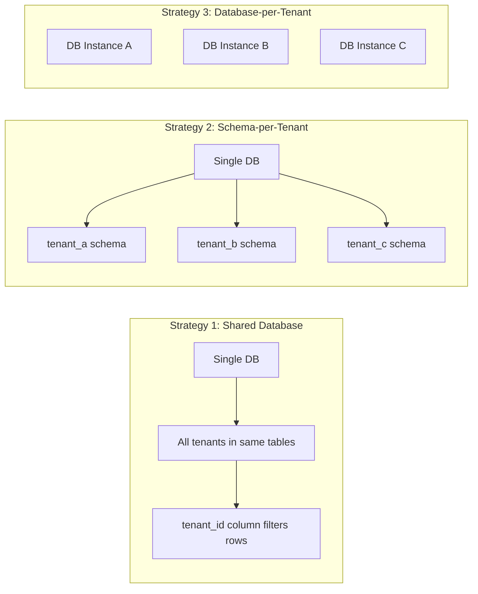
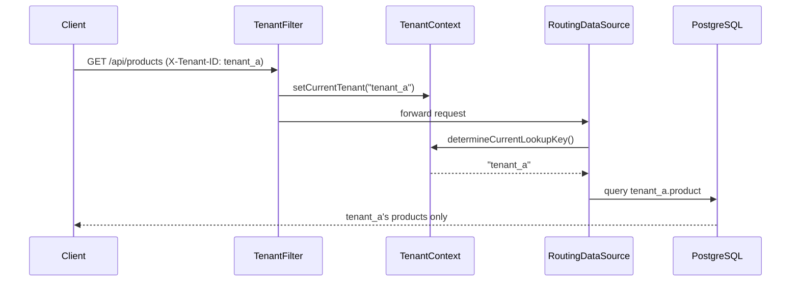

## The Problem

You're building a SaaS product. Ten customers sign up. Then a hundred. Each one expects their data to be completely isolated from everyone else's — but you don't want to deploy a separate application instance for each customer.

This is the multi-tenancy problem: **one application, multiple customers (tenants), complete data isolation**.

Get it wrong and you leak data between customers. Get it right and you have a scalable architecture that handles thousands of tenants with a single deployment.

## Multi-Tenancy Strategies

There are three main approaches to multi-tenancy, each with different tradeoffs:




| Strategy | Isolation | Cost | Complexity | Best For |
|----------|-----------|------|------------|----------|
| Shared DB (row-level) | Low | Low | Low | Many small tenants |
| Schema-per-tenant | Medium | Medium | Medium | Moderate isolation needs |
| Database-per-tenant | High | High | High | Regulated industries, large tenants |

## What We're Building

We'll implement **Strategy 2: Schema-per-Tenant** as the primary approach, then show how to add **row-level filtering** as an alternative. The architecture:




## Strategy 1: Schema-per-Tenant

### TenantContext — ThreadLocal Holder

The simplest piece — a `ThreadLocal` that holds the current tenant ID for the duration of a request:

```java
public final class TenantContext {

    private static final ThreadLocal<String> CURRENT_TENANT = new ThreadLocal<>();

    public static String getCurrentTenant() {
        return CURRENT_TENANT.get();
    }

    public static void setCurrentTenant(String tenantId) {
        CURRENT_TENANT.set(tenantId);
    }

    public static void clear() {
        CURRENT_TENANT.remove();
    }
}
```

> **Important**: Always call `clear()` in a `finally` block. If you don't, the tenant ID can leak to the next request on the same thread (thread pool reuse).

### TenantFilter — Extracting the Tenant

A servlet filter reads the `X-Tenant-ID` header and populates the context:

```java
@Component
@Order(1)
public class TenantFilter implements Filter {

    private static final String TENANT_HEADER = "X-Tenant-ID";

    @Override
    public void doFilter(ServletRequest request, ServletResponse response,
                         FilterChain chain) throws IOException, ServletException {

        HttpServletRequest httpRequest = (HttpServletRequest) request;
        String tenantId = httpRequest.getHeader(TENANT_HEADER);

        if (tenantId == null || tenantId.isBlank()) {
            HttpServletResponse httpResponse = (HttpServletResponse) response;
            httpResponse.setStatus(HttpServletResponse.SC_BAD_REQUEST);
            httpResponse.getWriter().write("Missing required header: " + TENANT_HEADER);
            return;
        }

        try {
            TenantContext.setCurrentTenant(tenantId);
            chain.doFilter(request, response);
        } finally {
            TenantContext.clear();
        }
    }
}
```

### TenantRoutingDataSource — Routing Connections

Spring's `AbstractRoutingDataSource` selects the target DataSource based on a lookup key. We override one method:

```java
public class TenantRoutingDataSource extends AbstractRoutingDataSource {

    @Override
    protected Object determineCurrentLookupKey() {
        return TenantContext.getCurrentTenant();
    }
}
```

### DataSourceConfig — Wiring Multiple DataSources

Each tenant schema gets its own DataSource. The routing DataSource wraps them all:

```java
@Configuration
public class DataSourceConfig {

    @Value("${spring.datasource.url}")
    private String baseUrl;

    @Value("${spring.datasource.username}")
    private String username;

    @Value("${spring.datasource.password}")
    private String password;

    @Bean
    public DataSource dataSource() {
        TenantRoutingDataSource routingDataSource = new TenantRoutingDataSource();

        Map<Object, Object> targetDataSources = new HashMap<>();
        targetDataSources.put("tenant_a", buildDataSource("tenant_a"));
        targetDataSources.put("tenant_b", buildDataSource("tenant_b"));

        routingDataSource.setTargetDataSources(targetDataSources);
        routingDataSource.setDefaultTargetDataSource(buildDataSource("tenant_a"));
        routingDataSource.afterPropertiesSet();

        return routingDataSource;
    }

    private DataSource buildDataSource(String schema) {
        String url = baseUrl + "?currentSchema=" + schema;
        return DataSourceBuilder.create()
                .url(url)
                .username(username)
                .password(password)
                .driverClassName("org.postgresql.Driver")
                .build();
    }
}
```

For production, you'd load tenant configurations from a database or configuration service rather than hardcoding them.

## Strategy 2: Row-Level with Hibernate Filters

If you prefer a single schema with a `tenant_id` discriminator column, Hibernate's `@Filter` annotation does the heavy lifting:

```java
@Entity
@Table(name = "product")
@FilterDef(name = "tenantFilter", parameters = @ParamDef(name = "tenantId", type = String.class))
@Filter(name = "tenantFilter", condition = "tenant_id = :tenantId")
public class Product {

    @Id
    @GeneratedValue(strategy = GenerationType.IDENTITY)
    private Long id;

    @Column(name = "tenant_id", nullable = false)
    private String tenantId;

    private String name;
    private BigDecimal price;
}
```

Enable the filter at the start of each request:

```java
@Component
public class TenantHibernateFilter {

    private final EntityManager entityManager;

    public TenantHibernateFilter(EntityManager entityManager) {
        this.entityManager = entityManager;
    }

    public void enableFilter(String tenantId) {
        Session session = entityManager.unwrap(Session.class);
        session.enableFilter("tenantFilter")
               .setParameter("tenantId", tenantId);
    }
}
```

This approach is simpler to set up but offers less isolation — a bug in your filter logic could expose another tenant's data.

## Tenant Resolution

The `X-Tenant-ID` header works for development, but production systems typically resolve tenants from:

### JWT Claims

```java
public class JwtTenantResolver {

    public String resolve(HttpServletRequest request) {
        String token = request.getHeader("Authorization");
        // Decode JWT and extract tenant claim
        DecodedJWT jwt = JWT.decode(token.replace("Bearer ", ""));
        return jwt.getClaim("tenant_id").asString();
    }
}
```

### Subdomain

```java
public class SubdomainTenantResolver {

    public String resolve(HttpServletRequest request) {
        String host = request.getServerName(); // acme.myapp.com
        return host.split("\\.")[0];           // "acme"
    }
}
```

### Path Prefix

```
GET /api/tenants/acme/products → tenant = "acme"
```

In practice, JWT claims are the most common choice for APIs — the tenant is baked into the authentication token and can't be forged by the client.

## Security Considerations

Multi-tenancy introduces a class of vulnerabilities that don't exist in single-tenant apps:

1. **Cross-tenant data leakage** — Always validate that the resolved tenant matches the authenticated user's tenant. Never trust a header alone in production.

2. **ThreadLocal leaks** — If `TenantContext.clear()` isn't called, stale tenant IDs persist on pooled threads. Use `try/finally` religiously.

3. **Connection pool isolation** — With schema-per-tenant, ensure connection pools are properly sized. One slow tenant shouldn't exhaust connections for everyone.

4. **DDL operations** — Schema migrations must run against all tenant schemas. Use Flyway with a loop over tenants, or a tool like `Flyway Teams` with multi-schema support.

5. **Caching** — If you use Spring's `@Cacheable`, cache keys must include the tenant ID. Otherwise, Tenant A's cached product list might be served to Tenant B.

## Common Problems

| Problem | Cause | Fix |
|---------|-------|-----|
| Wrong tenant's data returned | ThreadLocal not cleared | Always clear in `finally` block |
| `Could not determine target DataSource` | Unknown tenant ID in header | Validate tenant exists before routing |
| Connection pool exhaustion | Too many tenants, too few connections | Use HikariCP per-tenant with max-pool-size limits |
| Hibernate cache returns stale data | Cache key doesn't include tenant | Include tenant in cache region or key |
| Schema migrations miss a tenant | Manual schema management | Automate with Flyway + tenant registry |
| `NullPointerException` in `determineCurrentLookupKey` | Filter not applied (e.g., health endpoints) | Exclude actuator/health paths from filter |

## Full Working Example

The complete implementation is available on GitHub:

- [spring-boot-multi-tenancy](https://github.com/anupamsinha/spring-boot-multi-tenancy) — Schema-per-tenant with `AbstractRoutingDataSource`, PostgreSQL 16, Docker Compose setup

Clone it, run `docker-compose up -d`, and hit the API with different `X-Tenant-ID` headers to see tenant isolation in action.

## References

- [Spring AbstractRoutingDataSource Javadoc](https://docs.spring.io/spring-framework/docs/current/javadoc-api/org/springframework/jdbc/datasource/lookup/AbstractRoutingDataSource.html)
- [Hibernate ORM — Filters](https://docs.jboss.org/hibernate/orm/6.4/userguide/html_single/Hibernate_User_Guide.html#pc-filter)
- [Vlad Mihalcea — A Beginner's Guide to Database Multitenancy](https://vladmihalcea.com/database-multitenancy/)
- [Spring Boot with Multiple DataSources](https://docs.spring.io/spring-boot/reference/data/sql.html)
- [PostgreSQL Schema Documentation](https://www.postgresql.org/docs/current/ddl-schemas.html)
