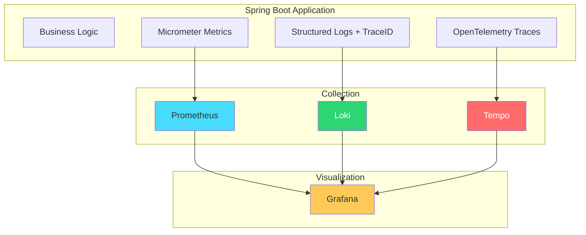

## The Problem

Your [distributed tracing post](/posts/spring-cloud-gateway-micrometer-tracing-brave-zipkin/) covers trace propagation between services. But observability is three pillars — not one:

1. **Metrics** — is the system healthy? (latency, error rate, throughput)
2. **Logs** — what happened? (structured events with context)
3. **Traces** — where did it go? (request path across services)

In production you need all three, correlated. When a 500 error fires, you should jump from the metric alert → to the log entry → to the full trace — in one click.

This post builds that complete stack with the LGTM stack (Loki, Grafana, Tempo, Mimir/Prometheus).

---

## What We Are Building



One Grafana dashboard where you can:
- See request rate and error rate (metrics from Prometheus)
- Click an error → see the log line (from Loki)
- Click the trace ID in the log → see the full distributed trace (from Tempo)

---

## Prerequisites

| Component | Version |
|-----------|---------|
| Java | 21+ |
| Spring Boot | 3.5+ |
| Docker Compose | Latest |
| Maven | 3.9+ |

---

## Step 1: Infrastructure (docker-compose.yml)

```yaml
services:
  prometheus:
    image: prom/prometheus:v2.53.0
    container_name: prometheus
    ports:
      - "9090:9090"
    volumes:
      - ./observability/prometheus.yml:/etc/prometheus/prometheus.yml

  loki:
    image: grafana/loki:3.1.0
    container_name: loki
    ports:
      - "3100:3100"

  tempo:
    image: grafana/tempo:2.5.0
    container_name: tempo
    ports:
      - "3200:3200"    # Tempo API
      - "4317:4317"    # OTLP gRPC
      - "4318:4318"    # OTLP HTTP
    volumes:
      - ./observability/tempo.yml:/etc/tempo/config.yml
    command: ["-config.file=/etc/tempo/config.yml"]

  grafana:
    image: grafana/grafana:11.1.0
    container_name: grafana
    ports:
      - "3000:3000"
    environment:
      GF_SECURITY_ADMIN_PASSWORD: admin
    volumes:
      - ./observability/grafana-datasources.yml:/etc/grafana/provisioning/datasources/datasources.yml
```

### Prometheus config (observability/prometheus.yml)

```yaml
global:
  scrape_interval: 15s

scrape_configs:
  - job_name: 'spring-boot-app'
    metrics_path: '/actuator/prometheus'
    static_configs:
      - targets: ['host.docker.internal:8080']
```

### Tempo config (observability/tempo.yml)

```yaml
server:
  http_listen_port: 3200

distributor:
  receivers:
    otlp:
      protocols:
        grpc:
          endpoint: "0.0.0.0:4317"
        http:
          endpoint: "0.0.0.0:4318"

storage:
  trace:
    backend: local
    local:
      path: /var/tempo/traces
```

### Grafana datasources (observability/grafana-datasources.yml)

```yaml
apiVersion: 1
datasources:
  - name: Prometheus
    type: prometheus
    url: http://prometheus:9090
    isDefault: true
  - name: Loki
    type: loki
    url: http://loki:3100
  - name: Tempo
    type: tempo
    url: http://tempo:3200
```

```bash
docker compose up -d
```

---

## Step 2: Spring Boot Dependencies

```xml
<dependencies>
    <dependency>
        <groupId>org.springframework.boot</groupId>
        <artifactId>spring-boot-starter-web</artifactId>
    </dependency>
    <dependency>
        <groupId>org.springframework.boot</groupId>
        <artifactId>spring-boot-starter-actuator</artifactId>
    </dependency>

    <!-- Metrics → Prometheus -->
    <dependency>
        <groupId>io.micrometer</groupId>
        <artifactId>micrometer-registry-prometheus</artifactId>
    </dependency>

    <!-- Tracing → OpenTelemetry → Tempo -->
    <dependency>
        <groupId>io.micrometer</groupId>
        <artifactId>micrometer-tracing-bridge-otel</artifactId>
    </dependency>
    <dependency>
        <groupId>io.opentelemetry</groupId>
        <artifactId>opentelemetry-exporter-otlp</artifactId>
    </dependency>

    <!-- Structured Logging → Loki -->
    <dependency>
        <groupId>com.github.loki4j</groupId>
        <artifactId>loki-logback-appender</artifactId>
        <version>1.5.1</version>
    </dependency>
</dependencies>
```

| Dependency | Purpose |
|-----------|---------|
| `micrometer-registry-prometheus` | Exposes metrics at `/actuator/prometheus` |
| `micrometer-tracing-bridge-otel` | Bridges Micrometer tracing to OpenTelemetry |
| `opentelemetry-exporter-otlp` | Exports traces to Tempo via OTLP |
| `loki-logback-appender` | Ships logs directly to Loki |

---

## Step 3: Application Configuration

```yaml
spring:
  application:
    name: payment-service

management:
  endpoints:
    web:
      exposure:
        include: health,info,prometheus,metrics
  tracing:
    sampling:
      probability: 1.0  # Sample 100% in dev. Use 0.1 (10%) in production.
  otlp:
    tracing:
      endpoint: http://localhost:4318/v1/traces

logging:
  pattern:
    correlation: "[${spring.application.name:},%X{traceId:-},%X{spanId:-}] "
```

The `correlation` pattern injects `traceId` and `spanId` into every log line. This is the glue between logs and traces.

---

## Step 4: Logback Configuration for Loki

```xml
<!-- src/main/resources/logback-spring.xml -->
<configuration>
    <include resource="org/springframework/boot/logging/logback/defaults.xml"/>

    <!-- Console with trace correlation -->
    <appender name="CONSOLE" class="ch.qos.logback.core.ConsoleAppender">
        <encoder>
            <pattern>%d{HH:mm:ss.SSS} [%thread] %-5level [%X{traceId:-},%X{spanId:-}] %logger{36} - %msg%n</pattern>
        </encoder>
    </appender>

    <!-- Ship to Loki with labels -->
    <appender name="LOKI" class="com.github.loki4j.logback.Loki4jAppender">
        <http>
            <url>http://localhost:3100/loki/api/v1/push</url>
        </http>
        <format>
            <label>
                <pattern>app=${spring.application.name},level=%level</pattern>
            </label>
            <message>
                <pattern>%d{HH:mm:ss.SSS} [%thread] %-5level [%X{traceId:-},%X{spanId:-}] %logger{36} - %msg%n</pattern>
            </message>
        </format>
    </appender>

    <root level="INFO">
        <appender-ref ref="CONSOLE"/>
        <appender-ref ref="LOKI"/>
    </root>
</configuration>
```

Every log line in Loki includes the `traceId`. Click it in Grafana → jump to the full trace in Tempo.

---

## Step 5: Custom Metrics

```java
@Service
public class PaymentService {

    private final Counter paymentCounter;
    private final Timer paymentTimer;

    public PaymentService(MeterRegistry meterRegistry) {
        this.paymentCounter = Counter.builder("payments.processed")
                .description("Total payments processed")
                .tag("type", "all")
                .register(meterRegistry);

        this.paymentTimer = Timer.builder("payments.duration")
                .description("Payment processing duration")
                .register(meterRegistry);
    }

    public PaymentResult processPayment(PaymentRequest request) {
        return paymentTimer.record(() -> {
            // Business logic
            PaymentResult result = doProcess(request);

            paymentCounter.increment();
            Counter.builder("payments.processed")
                    .tag("status", result.status())
                    .register(meterRegistry)
                    .increment();

            return result;
        });
    }
}
```

These custom metrics appear in Prometheus alongside the auto-configured ones (HTTP request duration, JVM memory, thread pools, etc.).

---

## Step 6: Custom Spans for Fine-Grained Tracing

```java
@Service
public class PaymentService {

    private final ObservationRegistry observationRegistry;

    public PaymentService(ObservationRegistry observationRegistry) {
        this.observationRegistry = observationRegistry;
    }

    public PaymentResult processPayment(PaymentRequest request) {
        Observation observation = Observation.createNotStarted("payment.process", observationRegistry)
                .lowCardinalityKeyValue("payment.method", request.method())
                .highCardinalityKeyValue("payment.id", request.paymentId());

        return observation.observe(() -> {
            validatePayment(request);
            PaymentResult result = chargeProvider(request);
            saveResult(result);
            return result;
        });
    }

    private void validatePayment(PaymentRequest request) {
        Observation.createNotStarted("payment.validate", observationRegistry)
                .observe(() -> {
                    // Validation logic — appears as a child span
                });
    }
}
```

This creates nested spans: `payment.process` → `payment.validate` → `payment.charge` visible in Tempo.

---

## Step 7: Correlation in Action

When a request flows through the system:

```
2026-08-22 10:30:01 [http-nio-8080-exec-1] INFO  [abc123def456,span789] PaymentController - Received payment request
2026-08-22 10:30:01 [http-nio-8080-exec-1] INFO  [abc123def456,span790] PaymentService - Processing payment PAY-001
2026-08-22 10:30:02 [http-nio-8080-exec-1] INFO  [abc123def456,span791] PaymentService - Payment PAY-001 completed
```

The `abc123def456` trace ID is the same across all log lines for this request. In Grafana:

1. **Prometheus** shows a spike in `payments.duration` → you click to investigate
2. **Loki** shows the log lines with that trace ID → you see the error message
3. **Tempo** shows the full trace → you see which span was slow (the external provider call)

---

## Grafana Dashboard Queries

### Request rate (Prometheus)

```promql
rate(http_server_requests_seconds_count{application="payment-service"}[5m])
```

### Error rate (Prometheus)

```promql
rate(http_server_requests_seconds_count{application="payment-service", status=~"5.."}[5m])
/ rate(http_server_requests_seconds_count{application="payment-service"}[5m])
```

### P99 latency (Prometheus)

```promql
histogram_quantile(0.99, rate(http_server_requests_seconds_bucket{application="payment-service"}[5m]))
```

### Find error logs (Loki)

```logql
{app="payment-service"} |= "ERROR"
```

### Find logs for a specific trace (Loki)

```logql
{app="payment-service"} |= "abc123def456"
```

---

## Auto-Configured Metrics (Free)

Spring Boot + Micrometer gives you these with zero code:

| Metric | What It Measures |
|--------|-----------------|
| `http_server_requests_seconds` | Request duration, status codes, endpoints |
| `jvm_memory_used_bytes` | Heap and non-heap memory |
| `jvm_threads_states` | Thread pool utilization |
| `system_cpu_usage` | CPU utilization |
| `hikaricp_connections_active` | Database connection pool |
| `spring_kafka_listener_seconds` | Kafka consumer processing time |

---

## Production Sampling

Don't trace 100% in production — it's expensive:

```yaml
management:
  tracing:
    sampling:
      probability: 0.1  # 10% of requests
```

For errors, always capture:

```java
@Bean
public SpanExportingPredicate alwaysExportErrors() {
    return span -> span.getStatus() == StatusData.error() || Math.random() < 0.1;
}
```

---

## Common Problems

| Symptom | Cause | Fix |
|---------|-------|-----|
| No traces in Tempo | OTLP endpoint wrong | Verify `management.otlp.tracing.endpoint` |
| No metrics in Prometheus | Actuator not exposed | Add `management.endpoints.web.exposure.include=prometheus` |
| Logs missing traceId | No tracing bridge | Add `micrometer-tracing-bridge-otel` dependency |
| Grafana shows no data | Datasource misconfigured | Check URLs in `grafana-datasources.yml` |
| High cardinality metrics | Using user IDs as tags | Use `highCardinalityKeyValue` for high-cardinality, not tags |
| Trace not connecting across services | Missing propagation header | Ensure `traceparent` header is forwarded |

---

## Full Working Example

The complete project with Docker Compose, Grafana dashboards, and instrumented app is at [github.com/AnupamSinha/spring-boot-observability](https://github.com/AnupamSinha/spring-boot-observability).

```bash
git clone https://github.com/AnupamSinha/spring-boot-observability.git
cd spring-boot-observability
docker compose up -d   # Starts Prometheus, Loki, Tempo, Grafana
./mvnw spring-boot:run
# Open Grafana at http://localhost:3000 (admin/admin)
```

---

## References

- [Spring Boot Observability Documentation](https://docs.spring.io/spring-boot/reference/actuator/observability.html)
- [Micrometer Documentation](https://micrometer.io/docs)
- [OpenTelemetry Java SDK](https://opentelemetry.io/docs/languages/java/)
- [Grafana LGTM Stack](https://grafana.com/oss/lgtm-stack/)
- [Loki4j Logback Appender](https://loki4j.github.io/loki-logback-appender/)
- [Spring Boot Actuator — Prometheus](https://docs.spring.io/spring-boot/reference/actuator/metrics.html#actuator.metrics.export.prometheus)
