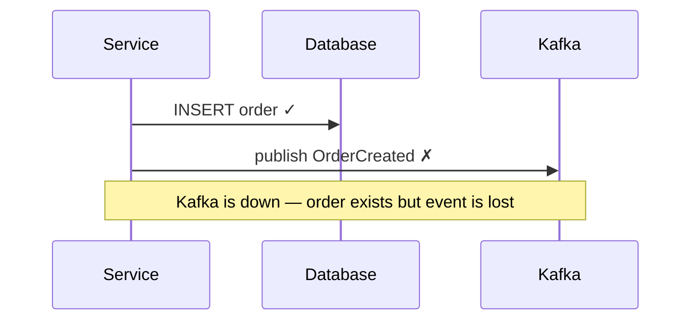
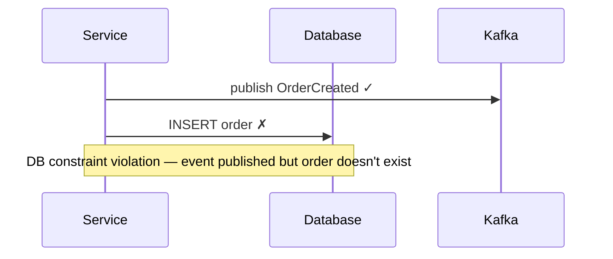
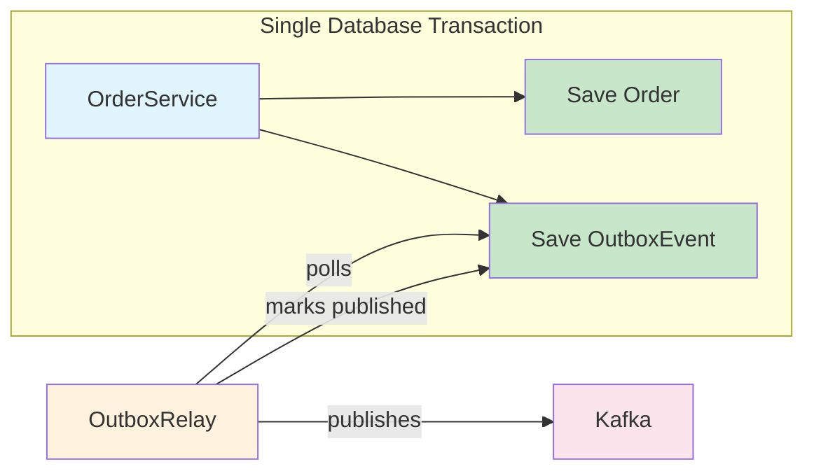
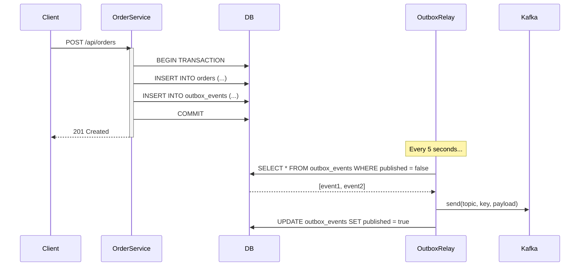

## The Problem — The Dual-Write Trap

You save an order to the database, then publish an event to Kafka. Sounds simple. But what happens when one succeeds and the other fails?



Or worse:



This is the **dual-write problem**: writing to two systems (database + message broker) without a single atomic transaction. You can't wrap Kafka and PostgreSQL in the same transaction — they're different systems with different transaction protocols.

### Why Not Distributed Transactions (2PC)?

Two-phase commit sounds like the answer, but it's impractical for microservices:

- Kafka doesn't support XA transactions
- 2PC is slow (holding locks across network calls)
- A coordinator failure blocks all participants
- It doesn't scale with many services

## The Outbox Pattern

The solution is elegantly simple: don't write to two systems. Write to one system (the database) twice — once for the domain entity, once for the event — in a single transaction.



**How it works:**

1. `OrderService` saves the `Order` and an `OutboxEvent` in the **same database transaction**
2. If either fails, both are rolled back — consistency guaranteed
3. A separate `OutboxRelay` component polls the outbox table for unpublished events
4. It publishes each event to Kafka
5. After successful publish, it marks the event as published

This guarantees **at-least-once delivery** — the event will eventually be published as long as the relay keeps running.

## Implementation

### The Outbox Table

```sql
CREATE TABLE outbox_events (
    id              UUID PRIMARY KEY,
    aggregate_type  VARCHAR(255) NOT NULL,
    aggregate_id    VARCHAR(255) NOT NULL,
    event_type      VARCHAR(255) NOT NULL,
    payload         TEXT NOT NULL,
    created_at      TIMESTAMP NOT NULL DEFAULT NOW(),
    published       BOOLEAN NOT NULL DEFAULT FALSE,
    published_at    TIMESTAMP
);

CREATE INDEX idx_outbox_unpublished ON outbox_events (published, created_at)
    WHERE published = FALSE;
```

The JPA entity:

```java
@Entity
@Table(name = "outbox_events")
public class OutboxEvent {

    @Id
    private UUID id;

    @Column(nullable = false)
    private String aggregateType;

    @Column(nullable = false)
    private String aggregateId;

    @Column(nullable = false)
    private String eventType;

    @Column(nullable = false, columnDefinition = "TEXT")
    private String payload;

    @Column(nullable = false)
    private Instant createdAt;

    @Column(nullable = false)
    private boolean published;

    private Instant publishedAt;
}
```

### OrderService — The Atomic Write

The critical piece: both writes happen in the **same `@Transactional` method**.

```java
@Service
public class OrderService {

    private final OrderRepository orderRepository;
    private final OutboxRepository outboxRepository;
    private final ObjectMapper objectMapper;

    @Transactional
    public Order createOrder(Order order) {
        // Write 1: save the domain entity
        Order savedOrder = orderRepository.save(order);

        // Write 2: save the outbox event (same transaction!)
        OutboxEvent event = new OutboxEvent(
                "Order",
                savedOrder.getId().toString(),
                "OrderCreated",
                toJson(savedOrder)
        );
        outboxRepository.save(event);

        return savedOrder;
    }

    @Transactional
    public Order confirmOrder(Long orderId) {
        Order order = orderRepository.findById(orderId)
                .orElseThrow(() -> new RuntimeException("Order not found"));

        order.setStatus(OrderStatus.CONFIRMED);
        Order savedOrder = orderRepository.save(order);

        OutboxEvent event = new OutboxEvent(
                "Order",
                savedOrder.getId().toString(),
                "OrderConfirmed",
                toJson(savedOrder)
        );
        outboxRepository.save(event);

        return savedOrder;
    }

    private String toJson(Object obj) {
        try {
            return objectMapper.writeValueAsString(obj);
        } catch (JsonProcessingException e) {
            throw new RuntimeException("Failed to serialize", e);
        }
    }
}
```

If the database write fails (constraint violation, connection lost), neither the order nor the event is persisted. Consistency is maintained.

### OutboxRelay — The Polling Publisher

The relay runs on a schedule, picks up unpublished events, and sends them to Kafka:

```java
@Component
public class OutboxRelay {

    private static final Logger log = LoggerFactory.getLogger(OutboxRelay.class);

    private final OutboxRepository outboxRepository;
    private final KafkaTemplate<String, String> kafkaTemplate;

    @Scheduled(fixedDelay = 5000)
    @Transactional
    public void pollAndPublish() {
        List<OutboxEvent> unpublished =
                outboxRepository.findByPublishedFalseOrderByCreatedAtAsc();

        for (OutboxEvent event : unpublished) {
            try {
                String topic = event.getAggregateType().toLowerCase() + "-events";

                kafkaTemplate.send(topic, event.getAggregateId(), event.getPayload());

                event.setPublished(true);
                event.setPublishedAt(Instant.now());
                outboxRepository.save(event);

                log.info("Published event: {} / {}", event.getEventType(), event.getId());
            } catch (Exception e) {
                log.error("Failed to publish event {}: {}", event.getId(), e.getMessage());
                break; // Stop — retry on next poll
            }
        }
    }
}
```

### Sequence Diagram — Full Flow



## Idempotent Consumers

Since the outbox guarantees **at-least-once** delivery (not exactly-once), consumers must handle duplicates. If the relay crashes after publishing to Kafka but before marking the event as published, it will re-publish on the next poll.

Strategies for idempotency:

```java
@KafkaListener(topics = "order-events")
public void handleOrderEvent(ConsumerRecord<String, String> record) {
    String eventId = record.headers()
            .lastHeader("event-id").value().toString();

    // Check if already processed
    if (processedEventRepository.existsById(eventId)) {
        log.info("Duplicate event {}, skipping", eventId);
        return;
    }

    // Process the event
    processOrder(record.value());

    // Mark as processed
    processedEventRepository.save(new ProcessedEvent(eventId, Instant.now()));
}
```

## Polling vs CDC (Debezium)

| Aspect                  | Polling (this approach)              | CDC with Debezium                        |
|-------------------------|--------------------------------------|------------------------------------------|
| Latency                 | Depends on poll interval (seconds)   | Near real-time (milliseconds)            |
| Complexity              | Simple — just `@Scheduled`           | Requires Debezium + Kafka Connect        |
| Infrastructure          | App + DB + Kafka                     | App + DB + Kafka + Kafka Connect + Debezium |
| Ordering guarantee      | Within poll batch (by createdAt)     | Guaranteed by WAL position               |
| No outbox table needed  | No — needs explicit outbox table     | Can read directly from WAL               |
| DB load                 | Periodic query on outbox table       | Reads from WAL — minimal DB load         |
| Cleanup                 | Must delete/archive old events       | Events never stored in app table         |
| Scaling                 | Single poller (or use locks)         | Kafka Connect scales horizontally        |

### When to Use Polling

- You want simplicity — no extra infrastructure
- Event latency of a few seconds is acceptable
- You have a small to medium event volume
- Your team doesn't have Kafka Connect expertise

### When to Use CDC (Debezium)

- You need sub-second latency
- High event volume (thousands/sec)
- You want to avoid querying the outbox table
- You already run Kafka Connect in production

## When to Use the Outbox Pattern

**Use it when:**
- You write to a database and publish events to a broker
- Exactly-once semantics between DB and broker matter
- You can't afford lost events (payments, orders, notifications)
- You don't want distributed transactions

**Don't use it when:**
- Eventual consistency isn't acceptable (rare)
- You only have one data store (no dual-write)
- Events are fire-and-forget (logging, analytics)
- You already use a framework that handles this (Axon, Eventuate)

## Common Problems

| Problem                                 | Cause                                                | Solution                                                    |
|-----------------------------------------|------------------------------------------------------|-------------------------------------------------------------|
| Events published out of order           | Multiple relay instances running                     | Use a single relay or `SELECT ... FOR UPDATE SKIP LOCKED`   |
| Duplicate events in Kafka               | Relay crashes after publish, before marking published| Make consumers idempotent (deduplication table)             |
| Outbox table grows forever              | Old published events not cleaned up                  | Scheduled job to delete events older than N days            |
| Relay blocked by poison event           | One event always fails to serialize/publish          | Add retry count, move to dead-letter after N retries        |
| High DB load from polling               | Poll interval too aggressive                         | Increase interval or switch to CDC                          |
| Events missing after deploy             | Relay disabled during deployment window              | Run relay as separate process, or ensure zero-downtime deploy |
| Transaction too large                   | Saving large payloads in outbox                      | Store minimal payload, let consumer fetch full data         |

## Full Working Example

The complete project is available on GitHub:

[spring-boot-outbox-pattern on GitHub](https://github.com/anupamsinha/spring-boot-outbox-pattern)

```bash
git clone https://github.com/anupamsinha/spring-boot-outbox-pattern.git
cd spring-boot-outbox-pattern
docker compose up -d
./mvnw spring-boot:run
```

Test it:

```bash
# Create an order
curl -X POST http://localhost:8080/api/orders \
  -H "Content-Type: application/json" \
  -d '{
    "customerId": "cust-123",
    "productName": "Mechanical Keyboard",
    "quantity": 1,
    "totalAmount": 149.99
  }'

# Check Kafka topic (use kafka-console-consumer or kcat)
docker exec kafka /opt/kafka/bin/kafka-console-consumer.sh \
  --bootstrap-server localhost:9092 \
  --topic order-events \
  --from-beginning
```

## References

- [Microservices Patterns — Chris Richardson (Transactional Outbox)](https://microservices.io/patterns/data/transactional-outbox.html)
- [Debezium Outbox Event Router](https://debezium.io/documentation/reference/transformations/outbox-event-router.html)
- [Spring Kafka Reference](https://docs.spring.io/spring-kafka/reference/)
- [Kafka Exactly-Once Semantics](https://www.confluent.io/blog/exactly-once-semantics-are-possible-heres-how-apache-kafka-does-it/)
