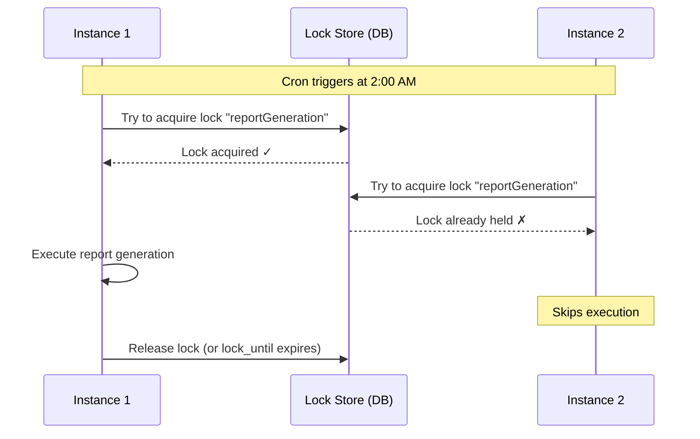

## The Problem: Duplicate Jobs in Clustered Deployments

You deploy two instances of your Spring Boot app behind a load balancer. Both have `@Scheduled(cron = "0 0 2 * * *")` to generate a daily report. What happens at 2 AM?

**Both instances execute the job.** Two reports. Two emails. Two database writes.

This is the #1 surprise in production scheduling. Spring `@Scheduled` is instance-local — it has no awareness of other instances.

---

## @Scheduled Basics

The simplest scheduling in Spring Boot. Add `@EnableScheduling` and annotate methods:

```java
@SpringBootApplication
@EnableScheduling
public class SchedulingApplication {
    public static void main(String[] args) {
        SpringApplication.run(SchedulingApplication.class, args);
    }
}
```

### fixedRate vs fixedDelay vs Cron

| Attribute | Behavior | Example | Use Case |
|-----------|----------|---------|----------|
| `fixedRate` | Next run starts N ms after previous **start** | `@Scheduled(fixedRate = 60000)` | Periodic polling (even if previous is still running) |
| `fixedDelay` | Next run starts N ms after previous **completion** | `@Scheduled(fixedDelay = 30000)` | Dependent tasks (must finish before next starts) |
| `cron` | Unix-style cron expression | `@Scheduled(cron = "0 0 2 * * *")` | Time-specific execution (daily at 2 AM) |
| `initialDelay` | Delay before first execution | `@Scheduled(fixedRate=5000, initialDelay=10000)` | Wait for app warmup |

### Cron Expression Cheat Sheet

| Expression | Meaning |
|------------|---------|
| `0 0 2 * * *` | Daily at 2:00 AM |
| `0 */15 * * * *` | Every 15 minutes |
| `0 0 9-17 * * MON-FRI` | Every hour 9 AM–5 PM, weekdays |
| `0 0 0 1 * *` | First day of every month at midnight |
| `0 30 6 * * MON` | Every Monday at 6:30 AM |

Format: `second minute hour day-of-month month day-of-week`

---

## Thread Pool Configuration: The Default Single Thread Trap

By default, Spring Boot uses a **single-threaded** scheduler. If one task takes 5 minutes, all other scheduled tasks are blocked for 5 minutes.

```java
@Configuration
public class SchedulerConfig {

    @Bean
    public ThreadPoolTaskScheduler taskScheduler() {
        ThreadPoolTaskScheduler scheduler = new ThreadPoolTaskScheduler();
        scheduler.setPoolSize(5);
        scheduler.setThreadNamePrefix("scheduled-task-");
        scheduler.setErrorHandler(throwable ->
                log.error("Scheduled task error: {}", throwable.getMessage()));
        scheduler.setWaitForTasksToCompleteOnShutdown(true);
        scheduler.setAwaitTerminationSeconds(30);
        return scheduler;
    }
}
```

**Rule of thumb**: Set pool size to the number of concurrent scheduled tasks you expect.

---

## Distributed Locking with ShedLock

ShedLock ensures that a scheduled task is executed at most once across all instances. It uses a shared lock store (database, Redis, etc.).




Only one instance acquires the lock. The others skip the execution entirely.

---

## ShedLock Setup

### 1. Dependencies

```xml
<dependency>
    <groupId>net.javacrumbs.shedlock</groupId>
    <artifactId>shedlock-spring</artifactId>
    <version>5.13.0</version>
</dependency>
<dependency>
    <groupId>net.javacrumbs.shedlock</groupId>
    <artifactId>shedlock-provider-jdbc-template</artifactId>
    <version>5.13.0</version>
</dependency>
```

### 2. Lock Table DDL

```sql
CREATE TABLE IF NOT EXISTS shedlock (
    name       VARCHAR(64)  NOT NULL,
    lock_until TIMESTAMP    NOT NULL,
    locked_at  TIMESTAMP    NOT NULL,
    locked_by  VARCHAR(255) NOT NULL,
    PRIMARY KEY (name)
);
```

### 3. Configuration

```java
@Configuration
@EnableSchedulerLock(defaultLockAtMostFor = "10m")
public class ShedLockConfig {

    @Bean
    public LockProvider lockProvider(DataSource dataSource) {
        return new JdbcTemplateLockProvider(
                JdbcTemplateLockProvider.Configuration.builder()
                        .withJdbcTemplate(new JdbcTemplate(dataSource))
                        .usingDbTime()
                        .build()
        );
    }
}
```

### 4. Annotate Tasks

```java
@Scheduled(cron = "0 0 2 * * *")
@SchedulerLock(
        name = "reportGeneration",
        lockAtLeastFor = "5m",     // hold lock at least 5 min (prevent double-execution)
        lockAtMostFor = "30m"      // release lock after 30 min max (safety net)
)
public void generateDailyReport() {
    // only one instance executes this
}
```

**lockAtLeastFor**: Prevents the lock from being released too quickly. If the task finishes in 1 second, the lock is still held for 5 minutes — ensuring the other instance doesn't also execute within the same cron trigger window.

**lockAtMostFor**: Safety net. If the instance crashes mid-execution, the lock expires after this duration instead of being held forever.

---

## Quartz: When You Need More

`@Scheduled` is simple and stateless. When you need more, consider Quartz:

| Feature | @Scheduled | Quartz |
|---------|-----------|--------|
| Setup complexity | Minimal | Moderate (tables, config) |
| Dynamic schedules | No (compile-time only) | Yes (runtime CRUD) |
| Job persistence | None | Database-backed |
| Misfire handling | None (missed = skipped) | Configurable policies |
| Clustering | Manual (ShedLock) | Built-in |
| Job chaining/dependencies | None | Listeners and triggers |
| Job parameters | None | JobDataMap |
| Pause/resume individual jobs | None | Full lifecycle control |

**When to use Quartz:**
- Users configure schedules at runtime (admin panel)
- Jobs must survive restarts (persisted to DB)
- Complex misfire policies (retry, fire immediately, etc.)
- Job dependencies (Job B runs after Job A completes)

**When @Scheduled + ShedLock is enough:**
- Fixed schedules known at compile time
- Simple cron/rate/delay patterns
- Just need distributed lock protection

---

## @Scheduled vs Quartz vs Spring Cloud Task

| Dimension | @Scheduled + ShedLock | Quartz | Spring Cloud Task |
|-----------|----------------------|--------|-------------------|
| Deployment | In-app | In-app | Separate launcher |
| Persistence | Lock table only | Full job store | Task execution DB |
| Scaling model | Lock-based | Clustered scheduler | External trigger (K8s cron) |
| Best for | Simple periodic jobs | Complex scheduling | Cloud-native, short-lived tasks |

---

## Monitoring Scheduled Tasks

### Custom Status Endpoint

Expose last-run times via REST:

```java
@GetMapping("/api/tasks/status")
public ResponseEntity<Map<String, Object>> getStatus() {
    Map<String, Object> status = new HashMap<>();
    status.put("reportGeneration", Map.of(
            "lastRun", reportTask.getLastRunTime() != null
                    ? reportTask.getLastRunTime().toString() : "never",
            "schedule", "cron: 0 0 2 * * * (daily at 2 AM)"
    ));
    status.put("healthCheck", Map.of(
            "lastRun", healthCheckTask.getLastRunTime().toString(),
            "serviceStatus", healthCheckTask.getServiceStatus()
    ));
    return ResponseEntity.ok(status);
}
```

### Actuator Integration

Spring Boot Actuator exposes scheduled task info:

```yaml
management:
  endpoints:
    web:
      exposure:
        include: scheduledtasks
```

```bash
curl http://localhost:8080/actuator/scheduledtasks
```

Returns all registered scheduled tasks with their configuration.

---

## Common Problems

| Problem | Cause | Solution |
|---------|-------|----------|
| Tasks not executing | Missing `@EnableScheduling` | Add to main class or config |
| Tasks blocking each other | Single-thread default | Configure `ThreadPoolTaskScheduler` with pool size > 1 |
| Duplicate execution in cluster | No distributed lock | Add ShedLock with `@SchedulerLock` |
| Task runs longer than interval | `fixedRate` + slow task | Use `fixedDelay` or add `lockAtLeastFor` |
| Cron not firing | Wrong cron format | Spring uses 6-field cron (includes seconds) |
| Lock never released after crash | `lockAtMostFor` too high or missing | Always set reasonable `lockAtMostFor` |
| Missed execution after downtime | @Scheduled has no misfire handling | Use Quartz if misfires must be handled |
| ShedLock table not found | DDL not applied | Add `schema.sql` or Flyway migration |

---

## Full Working Example

The complete implementation is available on GitHub:

[**spring-boot-examples/35-scheduling**](https://github.com/AnupamSinha/spring-boot-examples/tree/main/35-scheduling)

Clone and run:

```bash
git clone https://github.com/AnupamSinha/spring-boot-examples.git
cd spring-boot-examples/35-scheduling
./mvnw spring-boot:run
```

Check task status:

```bash
curl http://localhost:8080/api/tasks/status

# Manually trigger a task
curl -X POST http://localhost:8080/api/tasks/trigger/healthcheck
```

---

## References

- [Spring Framework — Task Execution and Scheduling](https://docs.spring.io/spring-framework/reference/integration/scheduling.html)
- [ShedLock GitHub Repository](https://github.com/lukas-krecan/ShedLock)
- [Quartz Scheduler Documentation](http://www.quartz-scheduler.org/documentation/)
- [Spring Boot Actuator — Scheduled Tasks Endpoint](https://docs.spring.io/spring-boot/reference/actuator/endpoints.html)
