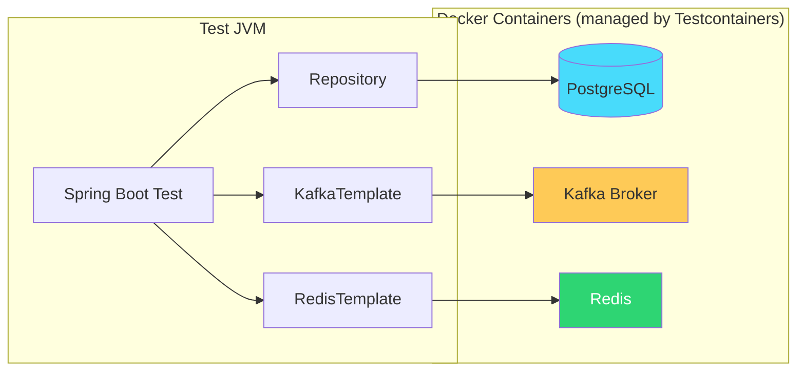

## The Problem

Your unit tests pass. Your mocks are green. You deploy to staging and the app explodes because:

- The SQL query uses a PostgreSQL-specific feature that H2 doesn't support
- The Kafka serializer config works locally but not with the real broker
- The Redis TTL behaves differently in your mock than in actual Redis

**Mocks lie. Real infrastructure doesn't.**

Testcontainers solves this by spinning up real Docker containers for your tests. PostgreSQL in a container. Kafka in a container. Redis in a container. Same engines as production — disposable, reproducible, fast.

---

## What We Are Building

A test suite that:

1. **Tests against real PostgreSQL** — JPA repositories, custom queries, migrations
2. **Tests against real Kafka** — producer/consumer integration
3. **Tests against real Redis** — caching behavior with actual TTLs
4. **Runs in CI/CD** — GitHub Actions with Docker-in-Docker



No mocks. No embedded databases. No "works on my machine."

---

## Prerequisites

| Component | Version |
|-----------|---------|
| Java | 21+ |
| Spring Boot | 3.5+ |
| Docker | Running (Testcontainers needs it) |
| Maven | 3.9+ |

---

## Setup

### Dependencies (pom.xml)

```xml
<dependencies>
    <!-- Application dependencies -->
    <dependency>
        <groupId>org.springframework.boot</groupId>
        <artifactId>spring-boot-starter-data-jpa</artifactId>
    </dependency>
    <dependency>
        <groupId>org.postgresql</groupId>
        <artifactId>postgresql</artifactId>
        <scope>runtime</scope>
    </dependency>

    <!-- Test dependencies -->
    <dependency>
        <groupId>org.springframework.boot</groupId>
        <artifactId>spring-boot-starter-test</artifactId>
        <scope>test</scope>
    </dependency>
    <dependency>
        <groupId>org.springframework.boot</groupId>
        <artifactId>spring-boot-testcontainers</artifactId>
        <scope>test</scope>
    </dependency>
    <dependency>
        <groupId>org.testcontainers</groupId>
        <artifactId>postgresql</artifactId>
        <scope>test</scope>
    </dependency>
    <dependency>
        <groupId>org.testcontainers</groupId>
        <artifactId>kafka</artifactId>
        <scope>test</scope>
    </dependency>
    <dependency>
        <groupId>org.testcontainers</groupId>
        <artifactId>junit-jupiter</artifactId>
        <scope>test</scope>
    </dependency>
</dependencies>
```

| Dependency | Purpose |
|-----------|---------|
| `spring-boot-testcontainers` | `@ServiceConnection` auto-configuration |
| `org.testcontainers:postgresql` | PostgreSQL container support |
| `org.testcontainers:kafka` | Kafka container support |
| `org.testcontainers:junit-jupiter` | JUnit 5 lifecycle integration |

---

## Pattern 1: PostgreSQL with `@ServiceConnection`

The simplest approach — Spring Boot 3.1+ auto-configures the datasource from the container:

```java
@SpringBootTest
@Testcontainers
class PaymentRepositoryIntegrationTest {

    @Container
    @ServiceConnection
    static PostgreSQLContainer<?> postgres = new PostgreSQLContainer<>("postgres:16-alpine");

    @Autowired
    private PaymentRepository paymentRepository;

    @Test
    void shouldSaveAndRetrievePayment() {
        Payment payment = new Payment();
        payment.setTransactionId("TXN-001");
        payment.setAmount(new BigDecimal("250.00"));
        payment.setStatus(PaymentStatus.COMPLETED);

        Payment saved = paymentRepository.save(payment);

        assertThat(saved.getId()).isNotNull();
        assertThat(paymentRepository.findByTransactionId("TXN-001"))
                .isPresent()
                .hasValueSatisfying(p -> {
                    assertThat(p.getAmount()).isEqualByComparingTo("250.00");
                    assertThat(p.getStatus()).isEqualTo(PaymentStatus.COMPLETED);
                });
    }

    @Test
    void shouldFindPaymentsByStatus() {
        paymentRepository.save(createPayment("TXN-001", PaymentStatus.COMPLETED));
        paymentRepository.save(createPayment("TXN-002", PaymentStatus.PENDING));
        paymentRepository.save(createPayment("TXN-003", PaymentStatus.COMPLETED));

        List<Payment> completed = paymentRepository.findByStatus(PaymentStatus.COMPLETED);

        assertThat(completed).hasSize(2);
    }
}
```

**What `@ServiceConnection` does:** Spring Boot detects the container type (PostgreSQL) and auto-configures `spring.datasource.url`, `username`, and `password` from the running container. Zero manual property wiring.

---

## Pattern 2: Dynamic Properties (Pre-3.1 or Custom Config)

For cases where `@ServiceConnection` doesn't cover your setup:

```java
@SpringBootTest
@Testcontainers
class CustomConfigTest {

    @Container
    static PostgreSQLContainer<?> postgres = new PostgreSQLContainer<>("postgres:16-alpine")
            .withDatabaseName("testdb")
            .withInitScript("schema.sql");

    @DynamicPropertySource
    static void configureProperties(DynamicPropertyRegistry registry) {
        registry.add("spring.datasource.url", postgres::getJdbcUrl);
        registry.add("spring.datasource.username", postgres::getUsername);
        registry.add("spring.datasource.password", postgres::getPassword);
    }

    // tests...
}
```

Use `@DynamicPropertySource` when you need custom database names, init scripts, or non-standard property mappings.

---

## Pattern 3: Kafka Integration Test

```java
@SpringBootTest
@Testcontainers
class PaymentEventIntegrationTest {

    @Container
    @ServiceConnection
    static KafkaContainer kafka = new KafkaContainer(
            DockerImageName.parse("confluentinc/cp-kafka:7.6.0"));

    @Autowired
    private KafkaTemplate<String, PaymentEvent> kafkaTemplate;

    @Autowired
    private PaymentEventConsumer consumer;

    @Test
    void shouldPublishAndConsumePaymentEvent() throws Exception {
        PaymentEvent event = new PaymentEvent("TXN-100", "COMPLETED", BigDecimal.TEN);

        kafkaTemplate.send("payments", event.transactionId(), event).get();

        // Wait for consumer to process
        Awaitility.await()
                .atMost(Duration.ofSeconds(10))
                .untilAsserted(() ->
                        assertThat(consumer.getProcessedEvents()).contains(event));
    }
}
```

The Kafka container starts a real broker. Your producer serializes, the consumer deserializes — exactly like production.

---

## Pattern 4: Shared Container (Faster Test Suites)

Starting a container per test class is slow. Share containers across the entire suite:

```java
public abstract class BaseIntegrationTest {

    @Container
    @ServiceConnection
    protected static final PostgreSQLContainer<?> POSTGRES =
            new PostgreSQLContainer<>("postgres:16-alpine")
                    .withReuse(true);

    @Container
    @ServiceConnection
    protected static final KafkaContainer KAFKA =
            new KafkaContainer(DockerImageName.parse("confluentinc/cp-kafka:7.6.0"))
                    .withReuse(true);
}
```

```java
@SpringBootTest
class PaymentServiceTest extends BaseIntegrationTest {
    // Uses shared POSTGRES and KAFKA containers
}

@SpringBootTest
class NotificationServiceTest extends BaseIntegrationTest {
    // Same containers, already running — fast startup
}
```

Enable reuse in `~/.testcontainers.properties`:

```properties
testcontainers.reuse.enable=true
```

---

## Pattern 5: Test Slicing with Testcontainers

You don't always need a full `@SpringBootTest`. Use slices for faster, focused tests:

### `@DataJpaTest` — Repository layer only

```java
@DataJpaTest
@Testcontainers
@AutoConfigureTestDatabase(replace = AutoConfigureTestDatabase.Replace.NONE)
class PaymentRepositorySliceTest {

    @Container
    @ServiceConnection
    static PostgreSQLContainer<?> postgres = new PostgreSQLContainer<>("postgres:16-alpine");

    @Autowired
    private PaymentRepository paymentRepository;

    @Test
    void nativeQueryShouldWork() {
        // Tests PostgreSQL-specific features (JSON operators, window functions, etc.)
        List<Payment> results = paymentRepository.findHighValuePayments(BigDecimal.valueOf(1000));
        assertThat(results).isEmpty();
    }
}
```

`@AutoConfigureTestDatabase(replace = NONE)` tells Spring Boot NOT to replace your datasource with an embedded DB — use the real Testcontainers one.

---

## Pattern 6: Redis Container

```java
@SpringBootTest
@Testcontainers
class CacheIntegrationTest {

    @Container
    @ServiceConnection
    static GenericContainer<?> redis = new GenericContainer<>("redis:7-alpine")
            .withExposedPorts(6379);

    @Autowired
    private PaymentService paymentService;

    @Autowired
    private CacheManager cacheManager;

    @Test
    void shouldCachePaymentLookup() {
        // First call — cache miss, hits DB
        PaymentInfo first = paymentService.getPayment("TXN-001");

        // Second call — cache hit, returns from Redis
        PaymentInfo second = paymentService.getPayment("TXN-001");

        assertThat(first).isEqualTo(second);
        // Verify only one DB query was made (via spy or query count)
    }

    @Test
    void cacheShouldExpireAfterTtl() throws Exception {
        paymentService.getPayment("TXN-001");

        // Wait for TTL (e.g., 5 seconds in test config)
        Thread.sleep(6000);

        // Cache expired — next call hits DB again
        Cache cache = cacheManager.getCache("payments");
        assertThat(cache.get("TXN-001")).isNull();
    }
}
```

---

## CI/CD: GitHub Actions

```yaml
name: Integration Tests

on: [push, pull_request]

jobs:
  test:
    runs-on: ubuntu-latest

    steps:
      - uses: actions/checkout@v4

      - uses: actions/setup-java@v4
        with:
          java-version: '21'
          distribution: 'temurin'

      - name: Run integration tests
        run: ./mvnw verify -Pintegration-tests
```

That's it. GitHub Actions runners have Docker pre-installed. Testcontainers works out of the box — no Docker Compose files, no service containers to configure.

---

## Test Organization Strategy

```
src/test/java/
├── unit/                          # Fast, no containers
│   ├── PaymentServiceTest.java
│   └── ValidatorTest.java
├── integration/                   # Testcontainers
│   ├── BaseIntegrationTest.java   # Shared container config
│   ├── PaymentRepositoryIT.java
│   ├── KafkaProducerIT.java
│   └── CacheIT.java
└── e2e/                           # Full app tests
    └── PaymentFlowE2ETest.java
```

Maven profile to separate them:

```xml
<profiles>
    <profile>
        <id>integration-tests</id>
        <build>
            <plugins>
                <plugin>
                    <groupId>org.apache.maven.plugins</groupId>
                    <artifactId>maven-failsafe-plugin</artifactId>
                    <configuration>
                        <includes>
                            <include>**/*IT.java</include>
                        </includes>
                    </configuration>
                </plugin>
            </plugins>
        </build>
    </profile>
</profiles>
```

---

## Testcontainers vs Alternatives

| Approach | Pros | Cons |
|----------|------|------|
| **H2 in-memory** | Fast, no Docker | SQL dialect differences, missing features |
| **Embedded Kafka** | No Docker needed | Deprecated, config doesn't match real broker |
| **Docker Compose (manual)** | Full control | Not lifecycle-managed, port conflicts |
| **Testcontainers** | Real engines, lifecycle-managed, portable | Requires Docker, slightly slower startup |

Testcontainers wins when **correctness matters more than speed**. For a 30-second test that catches a production bug, it's worth it.

---

## Performance Tips

| Tip | Impact |
|-----|--------|
| Use `withReuse(true)` | Containers survive between test runs (~10x faster) |
| Share containers via base class | One container per suite, not per class |
| Use alpine images | `postgres:16-alpine` starts faster than full image |
| Use `@DataJpaTest` over `@SpringBootTest` | Loads only JPA slice |
| Parallel test execution | Testcontainers is thread-safe |
| Use `ryuk` cleanup | Automatic container cleanup (enabled by default) |

---

## Common Problems

| Symptom | Cause | Fix |
|---------|-------|-----|
| `Could not connect to Ryuk` | Docker not running | Start Docker Desktop |
| Container starts but tests fail to connect | Wrong port mapping | Use `container.getMappedPort()` or `@ServiceConnection` |
| Tests pass locally, fail in CI | CI runner lacks Docker | Use `ubuntu-latest` (has Docker) |
| Slow test suite (> 2 min) | Container per class | Switch to shared containers with `withReuse(true)` |
| `Connection refused` after container starts | App connects before container is ready | Testcontainers has built-in wait strategies — check logs |
| Flyway/Liquibase conflicts | Schema already exists on reused container | Use `withReuse(false)` for migration tests |

---

## Full Working Example

The complete test suite with PostgreSQL, Kafka, and Redis examples is at [github.com/AnupamSinha/spring-boot-testcontainers](https://github.com/AnupamSinha/spring-boot-testcontainers).

```bash
git clone https://github.com/AnupamSinha/spring-boot-testcontainers.git
cd spring-boot-testcontainers
./mvnw verify
```

---

## References

- [Testcontainers Official Documentation](https://testcontainers.com/)
- [Spring Boot Testcontainers Support](https://docs.spring.io/spring-boot/reference/testing/testcontainers.html)
- [Spring Boot @ServiceConnection](https://docs.spring.io/spring-boot/reference/testing/testcontainers.html#testing.testcontainers.service-connections)
- [Testcontainers — Best Practices](https://testcontainers.com/guides/best-practices/)
- [Spring Boot Testing Documentation](https://docs.spring.io/spring-boot/reference/testing/index.html)
