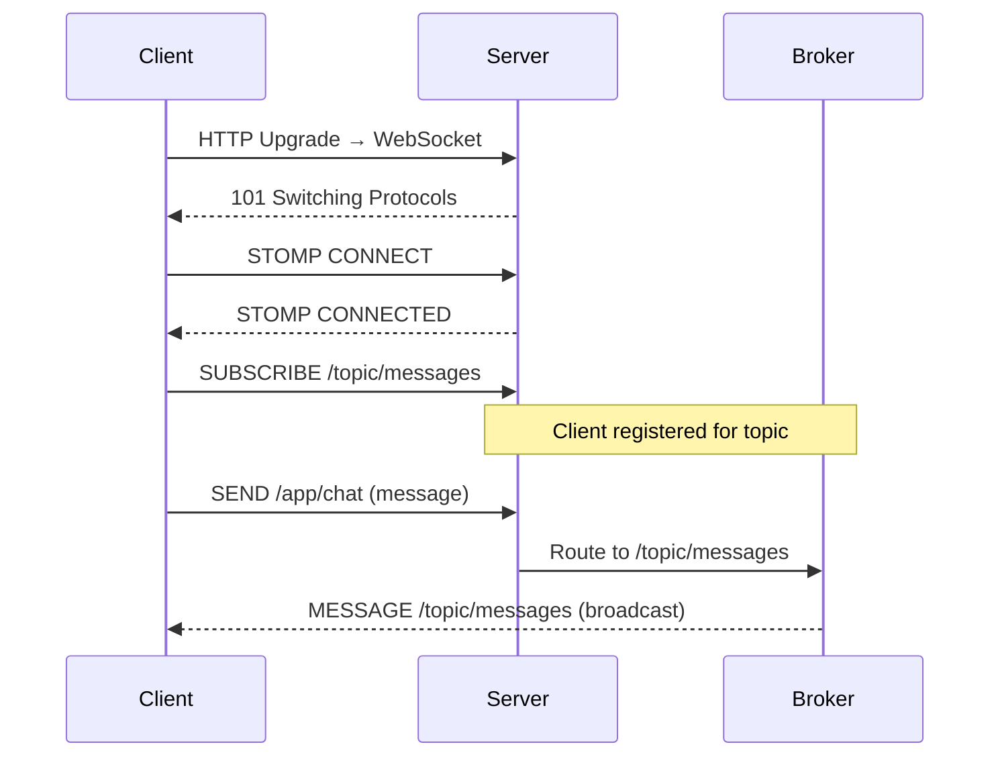

## The Problem

Traditional HTTP is request-response. The client asks, the server answers. But what about:
- Chat messages that appear instantly
- Notifications pushed from the server
- Live dashboards with real-time data
- Collaborative editing

You have three options:

| Approach | Direction | Latency | Connection | Use Case |
|----------|-----------|---------|------------|----------|
| Polling | Client → Server | High (interval) | New connection each time | Simple, low-frequency updates |
| SSE (Server-Sent Events) | Server → Client | Low | Persistent, one-way | Notifications, feeds |
| WebSocket | Bidirectional | Very low | Persistent, full-duplex | Chat, gaming, collaboration |

WebSocket wins when you need **bidirectional**, **low-latency**, **persistent** communication.

---

## What is WebSocket + STOMP?

**WebSocket** provides a persistent TCP connection with full-duplex communication. But raw WebSocket is just bytes — no routing, no pub/sub, no message format.

**STOMP** (Simple Text Oriented Messaging Protocol) adds structure on top of WebSocket:
- Message routing (destinations like `/topic/messages`)
- Pub/sub semantics (subscribe to topics)
- Headers and body format
- Works with message brokers (RabbitMQ, ActiveMQ)



---

## Setup

Add the WebSocket starter to your `pom.xml`:

```xml
<dependency>
    <groupId>org.springframework.boot</groupId>
    <artifactId>spring-boot-starter-websocket</artifactId>
</dependency>
<dependency>
    <groupId>org.springframework.boot</groupId>
    <artifactId>spring-boot-starter-web</artifactId>
</dependency>
```

---

## WebSocket Configuration

```java
@Configuration
@EnableWebSocketMessageBroker
public class WebSocketConfig implements WebSocketMessageBrokerConfigurer {

    @Override
    public void configureMessageBroker(MessageBrokerRegistry config) {
        // Messages FROM server TO client go to /topic/*
        config.enableSimpleBroker("/topic");
        // Messages FROM client TO server are prefixed with /app
        config.setApplicationDestinationPrefixes("/app");
    }

    @Override
    public void registerStompEndpoints(StompEndpointRegistry registry) {
        // The WebSocket handshake endpoint
        registry.addEndpoint("/ws")
                .setAllowedOriginPatterns("*")
                .withSockJS(); // fallback for older browsers
    }
}
```

Key decisions:
- `/topic` — prefix for broadcast destinations (pub/sub)
- `/app` — prefix for messages routed to `@MessageMapping` controllers
- `/ws` — the initial HTTP endpoint that upgrades to WebSocket
- `withSockJS()` — enables fallback transports (XHR streaming, long-polling) for browsers without WebSocket support

You can also add `/queue` for point-to-point messaging:

```java
config.enableSimpleBroker("/topic", "/queue");
config.setUserDestinationPrefix("/user"); // for user-specific messages
```

---

## Chat Controller — @MessageMapping

`@MessageMapping` is the WebSocket equivalent of `@RequestMapping`:

```java
@Controller
public class ChatController {

    @MessageMapping("/chat")
    @SendTo("/topic/messages")
    public ChatMessage sendMessage(ChatMessage message) {
        return new ChatMessage(
                message.sender(),
                message.content(),
                Instant.now(),
                message.type()
        );
    }

    @MessageMapping("/chat.join")
    @SendTo("/topic/messages")
    public ChatMessage join(ChatMessage message) {
        return ChatMessage.join(message.sender());
    }

    @MessageMapping("/chat.leave")
    @SendTo("/topic/messages")
    public ChatMessage leave(ChatMessage message) {
        return ChatMessage.leave(message.sender());
    }
}
```

The message model:

```java
public record ChatMessage(
        String sender,
        String content,
        Instant timestamp,
        MessageType type
) {
    public enum MessageType { CHAT, JOIN, LEAVE }

    public static ChatMessage join(String sender) {
        return new ChatMessage(sender, sender + " joined the chat", Instant.now(), MessageType.JOIN);
    }

    public static ChatMessage leave(String sender) {
        return new ChatMessage(sender, sender + " left the chat", Instant.now(), MessageType.LEAVE);
    }
}
```

Flow:
1. Client sends to `/app/chat` (app prefix + mapping)
2. Spring routes to `sendMessage()` method
3. Return value is sent to `/topic/messages` (via `@SendTo`)
4. All subscribers of `/topic/messages` receive the message

---

## Server-Push Notifications — SimpMessagingTemplate

Not all messages originate from WebSocket clients. Sometimes you need to push from a REST endpoint, a scheduled task, or an event listener:

```java
@RestController
@RequestMapping("/api/notifications")
public class NotificationController {

    private final SimpMessagingTemplate messagingTemplate;

    public NotificationController(SimpMessagingTemplate messagingTemplate) {
        this.messagingTemplate = messagingTemplate;
    }

    @PostMapping
    public Map<String, String> sendNotification(@RequestBody Map<String, String> payload) {
        String message = payload.getOrDefault("message", "No message");

        Map<String, Object> notification = Map.of(
                "message", message,
                "timestamp", Instant.now().toString(),
                "type", "SERVER_NOTIFICATION"
        );

        // Push to all subscribers of /topic/notifications
        messagingTemplate.convertAndSend("/topic/notifications", notification);

        return Map.of("status", "sent", "message", message);
    }
}
```

Use `SimpMessagingTemplate` anywhere you need to push messages:
- `convertAndSend("/topic/...")` — broadcast to all subscribers
- `convertAndSendToUser(username, "/queue/...", payload)` — send to a specific user

Test it:
```bash
curl -X POST http://localhost:8080/api/notifications \
  -H "Content-Type: application/json" \
  -d '{"message": "Deployment complete!"}'
```

---

## Frontend — Minimal HTML/JS

A working chat client using SockJS and STOMP.js:

```html
<script src="https://cdn.jsdelivr.net/npm/sockjs-client@1/dist/sockjs.min.js"></script>
<script src="https://cdn.jsdelivr.net/npm/stompjs@2.3.3/lib/stomp.min.js"></script>
<script>
    let stompClient = null;

    function connect(username) {
        const socket = new SockJS('/ws');
        stompClient = Stomp.over(socket);

        stompClient.connect({}, function () {
            // Subscribe to chat messages
            stompClient.subscribe('/topic/messages', function (msg) {
                const message = JSON.parse(msg.body);
                displayMessage(message);
            });

            // Subscribe to notifications
            stompClient.subscribe('/topic/notifications', function (msg) {
                const notification = JSON.parse(msg.body);
                displayNotification(notification);
            });

            // Announce joining
            stompClient.send('/app/chat.join', {}, JSON.stringify({
                sender: username,
                type: 'JOIN'
            }));
        });
    }

    function sendMessage(sender, content) {
        stompClient.send('/app/chat', {}, JSON.stringify({
            sender: sender,
            content: content,
            type: 'CHAT'
        }));
    }

    function disconnect(username) {
        stompClient.send('/app/chat.leave', {}, JSON.stringify({
            sender: username,
            type: 'LEAVE'
        }));
        stompClient.disconnect();
    }
</script>
```

The full HTML with styling is in the project's `src/main/resources/static/index.html`.

---

## Authentication with WebSocket

In production, you need to authenticate WebSocket connections. Spring Security integrates naturally:

```java
@Configuration
@EnableWebSocketMessageBroker
public class WebSocketSecurityConfig implements WebSocketMessageBrokerConfigurer {

    @Override
    public void configureClientInboundChannel(ChannelRegistration registration) {
        registration.interceptors(new ChannelInterceptor() {
            @Override
            public Message<?> preSend(Message<?> message, MessageChannel channel) {
                StompHeaderAccessor accessor = StompHeaderAccessor.wrap(message);

                if (StompCommand.CONNECT.equals(accessor.getCommand())) {
                    String token = accessor.getFirstNativeHeader("Authorization");
                    // Validate token and set authentication
                    Authentication auth = validateToken(token);
                    accessor.setUser(auth);
                }
                return message;
            }
        });
    }
}
```

For user-specific messages:

```java
// Send to a specific user
messagingTemplate.convertAndSendToUser(
        "john",                    // username
        "/queue/notifications",    // destination
        notification               // payload
);
```

The client subscribes to `/user/queue/notifications` — Spring resolves the user prefix automatically.

---

## Scaling WebSocket — External Broker

The in-memory `SimpleBroker` works for single instances. For multiple server instances behind a load balancer, use an external broker:

```java
@Override
public void configureMessageBroker(MessageBrokerRegistry config) {
    config.enableStompBrokerRelay("/topic", "/queue")
            .setRelayHost("rabbitmq-host")
            .setRelayPort(61613)
            .setClientLogin("guest")
            .setClientPasscode("guest");
    config.setApplicationDestinationPrefixes("/app");
}
```

This routes messages through RabbitMQ/ActiveMQ, so all server instances share the same message bus.

---

## Common Problems

| Problem | Cause | Solution |
|---------|-------|----------|
| Connection refused | SockJS endpoint not registered | Verify `registerStompEndpoints` matches client URL |
| CORS error | Origin not allowed | Add `.setAllowedOriginPatterns("*")` or specific origins |
| Messages not received | Wrong topic prefix | Client subscribes to `/topic/...`, not `/app/...` |
| 404 on /ws | Missing `withSockJS()` or wrong URL | Client must use `new SockJS('/ws')`, not raw WebSocket |
| Lost messages on reconnect | No message persistence | Use external broker with durable subscriptions |
| Memory leak | Connections never closed | Implement heartbeat and session cleanup |
| `@SendTo` not working | Method returns void | Return the message object to broadcast |
| User messages not delivered | Missing user destination prefix | Configure `setUserDestinationPrefix("/user")` |

---

## Full Working Example

The complete project with chat UI, server notifications, and all configuration is on GitHub:

👉 [spring-boot-websocket](https://github.com/anupamsinha/spring-boot-websocket)

To run:
```bash
./mvnw spring-boot:run
# Open http://localhost:8080 in multiple browser tabs
```

---

## References

- [Spring WebSocket Documentation](https://docs.spring.io/spring-framework/reference/web/websocket.html)
- [STOMP Protocol Specification](https://stomp.github.io/stomp-specification-1.2.html)
- [Spring Boot WebSocket Guide](https://spring.io/guides/gs/messaging-stomp-websocket/)
- [SockJS Client](https://github.com/sockjs/sockjs-client)
- [WebSocket Security](https://docs.spring.io/spring-security/reference/servlet/integrations/websocket.html)
