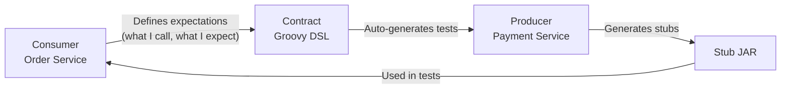
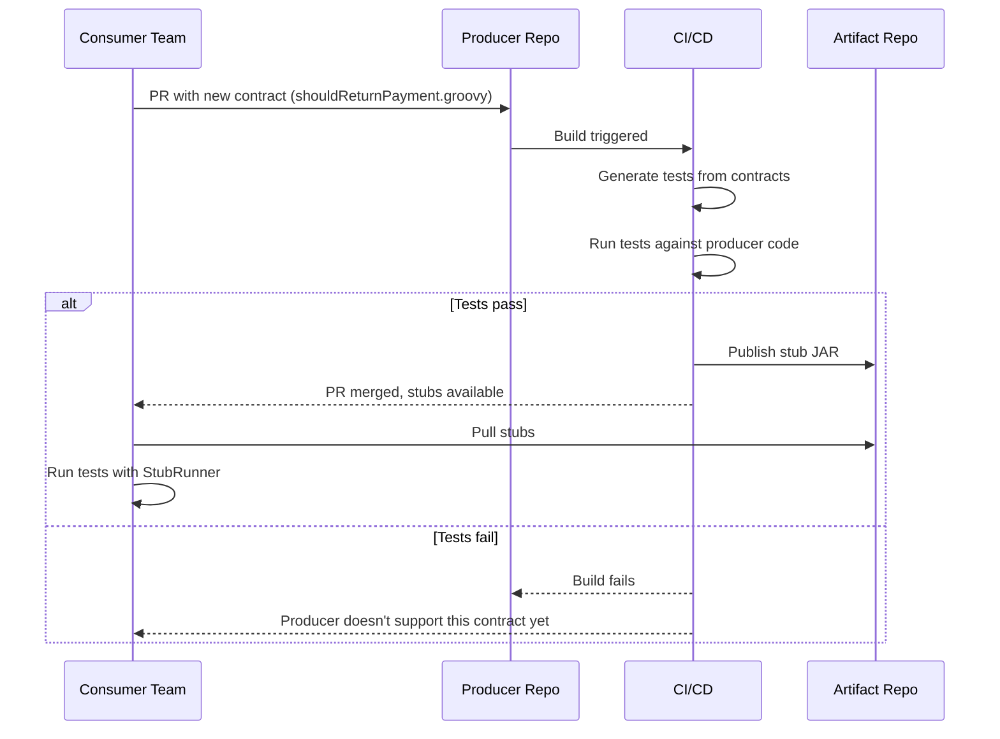

## The Problem — Integration Testing Across Services

You have two microservices. The Order Service calls the Payment Service. One day, the Payment team renames a field from `amount` to `totalAmount`. Their tests pass. They deploy. Your Order Service breaks in production.

This happens because:
- Unit tests don't catch it (they mock the HTTP call)
- Integration tests are slow and flaky (they need both services running)
- E2E tests catch it too late (after deployment)

Contract testing solves this: **the consumer defines what it expects, the producer verifies it can deliver**.

---

## What Are Contracts

A contract is a formal agreement between two services about the shape of their HTTP interaction.




The contract lives in the producer's repository but represents the consumer's expectations. If the producer breaks the contract, their build fails — before deployment.

---

## Setup

### Parent POM (Spring Cloud BOM)

```xml
<properties>
    <spring-cloud.version>2024.0.0</spring-cloud.version>
</properties>

<dependencyManagement>
    <dependencies>
        <dependency>
            <groupId>org.springframework.cloud</groupId>
            <artifactId>spring-cloud-dependencies</artifactId>
            <version>${spring-cloud.version}</version>
            <type>pom</type>
            <scope>import</scope>
        </dependency>
    </dependencies>
</dependencyManagement>
```

### Producer Dependencies

```xml
<dependency>
    <groupId>org.springframework.cloud</groupId>
    <artifactId>spring-cloud-starter-contract-verifier</artifactId>
    <scope>test</scope>
</dependency>
```

### Consumer Dependencies

```xml
<dependency>
    <groupId>org.springframework.cloud</groupId>
    <artifactId>spring-cloud-starter-contract-stub-runner</artifactId>
    <scope>test</scope>
</dependency>
```

---

## Writing a Contract — Groovy DSL

Contracts are written in Groovy and placed in `src/test/resources/contracts/`:

```groovy
import org.springframework.cloud.contract.spec.Contract

Contract.make {
    name "should return payment by id"
    description "When GET /api/payments/1 is called, return payment details"

    request {
        method GET()
        url "/api/payments/1"
        headers {
            contentType(applicationJson())
        }
    }

    response {
        status OK()
        headers {
            contentType(applicationJson())
        }
        body(
            id: 1,
            orderId: "ORD-2024-001",
            amount: 99.99,
            currency: "USD",
            status: "COMPLETED"
        )
        bodyMatchers {
            jsonPath('$.id', byType())
            jsonPath('$.orderId', byRegex('[A-Z]{3}-\\d{4}-\\d{3}'))
            jsonPath('$.amount', byType())
            jsonPath('$.currency', byRegex('[A-Z]{3}'))
            jsonPath('$.status', byRegex('COMPLETED|PENDING|FAILED'))
        }
    }
}
```

Key elements:
- `body(...)` — the concrete example used for stubs
- `bodyMatchers` — flexible matchers for the generated tests (types, regexes)

---

## Producer Side — Auto-Generated Tests

When you run `mvn clean test` on the producer, Spring Cloud Contract:

1. Reads contracts from `src/test/resources/contracts/`
2. Generates JUnit 5 test classes
3. Runs them against your controller using a base test class

The **base test class** sets up MockMvc:

```java
@SpringBootTest
public abstract class BaseContractTest {

    @Autowired
    private PaymentController paymentController;

    @BeforeEach
    void setup() {
        StandaloneMockMvcBuilder standaloneMockMvcBuilder =
                MockMvcBuilders.standaloneSetup(paymentController);
        RestAssuredMockMvc.standaloneSetup(standaloneMockMvcBuilder);
    }
}
```

Configure the plugin to use this base class:

```xml
<plugin>
    <groupId>org.springframework.cloud</groupId>
    <artifactId>spring-cloud-contract-maven-plugin</artifactId>
    <extensions>true</extensions>
    <configuration>
        <testFramework>JUNIT5</testFramework>
        <baseClassForTests>
            com.anupam.contract.producer.BaseContractTest
        </baseClassForTests>
    </configuration>
</plugin>
```

If the producer changes the response shape (renames a field, changes a status code), the auto-generated test fails.

---

## Consumer Side — StubRunner

The consumer doesn't call the real producer. Instead, it uses **stubs** generated from the contracts:

```java
@SpringBootTest
@AutoConfigureStubRunner(
        ids = "com.anupam:contract-testing-producer:+:stubs:8090",
        stubsMode = StubRunnerProperties.StubsMode.LOCAL
)
class PaymentClientContractTest {

    @Test
    void shouldGetPaymentFromProducerStub() {
        PaymentClient paymentClient = new PaymentClient("http://localhost:8090");

        PaymentClient.PaymentResponse payment = paymentClient.getPayment(1L);

        assertThat(payment).isNotNull();
        assertThat(payment.id()).isEqualTo(1L);
        assertThat(payment.orderId()).matches("[A-Z]{3}-\\d{4}-\\d{3}");
        assertThat(payment.amount()).isGreaterThan(BigDecimal.ZERO);
        assertThat(payment.currency()).matches("[A-Z]{3}");
        assertThat(payment.status()).isIn("COMPLETED", "PENDING", "FAILED");
    }
}
```

`@AutoConfigureStubRunner` starts a WireMock server on port 8090 loaded with the producer's stubs. The consumer's HTTP client calls this stub server exactly like it would call the real producer.

---

## The Workflow




This workflow ensures:
- **Breaking changes are caught before deployment**
- **Consumer and producer can develop independently**
- **Stubs are always in sync with the producer's actual behavior**

---

## Contract Testing vs Integration vs E2E

| Aspect | Contract Tests | Integration Tests | E2E Tests |
|--------|---------------|-------------------|-----------|
| Speed | Fast (ms) | Slow (seconds) | Very slow (minutes) |
| Infrastructure | None (stubs) | All services running | Full environment |
| Flakiness | Low | Medium | High |
| Catches API breaks | Yes | Yes | Yes |
| Catches logic bugs | No | Yes | Yes |
| Catches UI bugs | No | No | Yes |
| Maintenance cost | Low | Medium | High |
| Feedback speed | Immediate (in CI) | After deployment | After full deploy |
| Runs where | Unit test phase | Separate phase | Staging environment |

Contract tests fill the gap between unit tests and integration tests. They verify that services can talk to each other without requiring all services to be running.

---

## Common Problems

| Problem | Cause | Solution |
|---------|-------|----------|
| "No base class found" | Plugin misconfigured | Set `baseClassForTests` in `spring-cloud-contract-maven-plugin` |
| Stub not found | Producer not installed locally | Run `mvn install` on producer first |
| Port conflict | StubRunner port in use | Change port in `@AutoConfigureStubRunner(ids = "...:stubs:9090")` |
| Contract body mismatch | Controller returns different structure | Fix controller or update contract |
| "No matching stub" | Request doesn't match contract | Check URL, method, and headers in contract |
| Groovy compilation error | Syntax error in contract | Validate Groovy DSL (watch for missing commas) |
| Spring Cloud version mismatch | BOM not imported | Add `spring-cloud-dependencies` BOM to `dependencyManagement` |

---

## When to Use Contracts

Contract testing works best for:
- **Microservices owned by different teams** — the contract is the handshake
- **APIs that evolve frequently** — catch breaking changes immediately
- **Services with many consumers** — one contract per consumer, all verified

Skip contracts when:
- You own both services and deploy them together (just write integration tests)
- The API is truly public with unknown consumers (use OpenAPI + semantic versioning)
- The interaction is fire-and-forget messaging with no response (use schema registries instead)

---

## Full Working Example

Complete producer and consumer projects:

[https://github.com/AnupamSinha/spring-boot-examples/tree/main/31-contract-testing](https://github.com/AnupamSinha/spring-boot-examples/tree/main/31-contract-testing)

```bash
# Build producer (generates stubs)
cd 31-contract-testing/producer
mvn clean install

# Run consumer tests (uses stubs)
cd ../consumer
mvn clean test
```

---

## References

- [Spring Cloud Contract Documentation](https://docs.spring.io/spring-cloud-contract/reference/)
- [Spring Cloud Contract Samples](https://github.com/spring-cloud-samples/spring-cloud-contract-samples)
- [Consumer-Driven Contracts (Martin Fowler)](https://martinfowler.com/articles/consumerDrivenContracts.html)
- [Pact vs Spring Cloud Contract](https://pactflow.io/blog/pact-vs-spring-cloud-contract/)
- [Source Code — 31-contract-testing](https://github.com/AnupamSinha/spring-boot-examples/tree/main/31-contract-testing)
