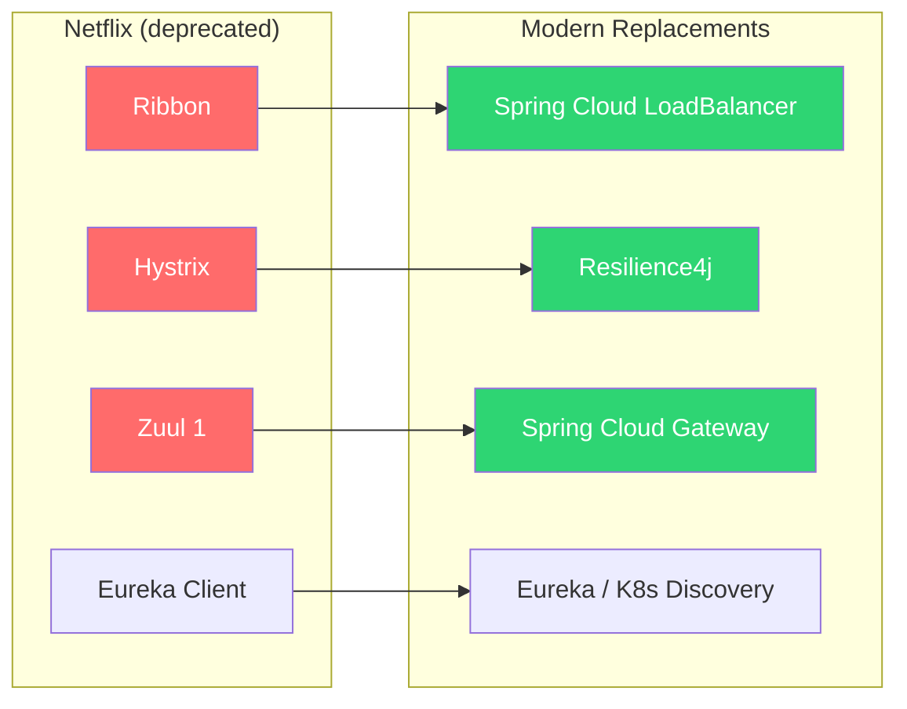
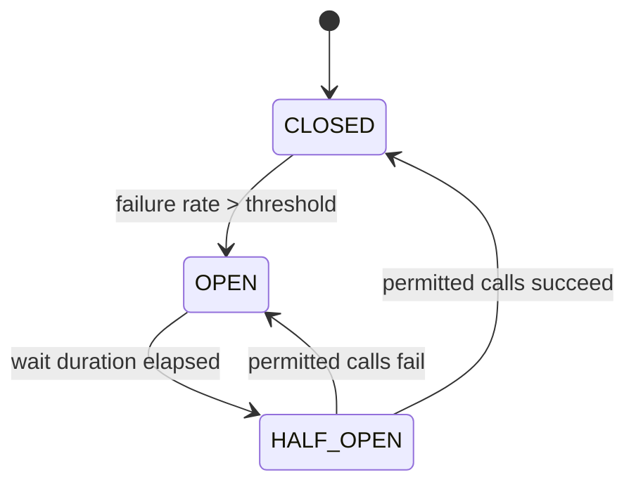
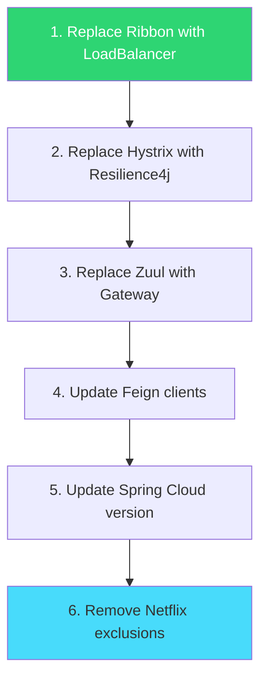

## The Problem

Your microservices run on Spring Cloud Netflix — Ribbon for load balancing, Hystrix for circuit breaking, Zuul for API gateway. These served the community well but are now:

- **Ribbon** — maintenance mode since 2018, removed from Spring Cloud 2022+
- **Hystrix** — archived by Netflix in 2018, removed from Spring Cloud 2022+
- **Zuul 1** — replaced by Spring Cloud Gateway years ago
- **Eureka** — still maintained but many teams are moving to Kubernetes service discovery

If you're on Spring Boot 3.x / Spring Cloud 2023+, the Netflix dependencies don't compile anymore. You **must** migrate.

---

## Migration Map



| Old (Netflix) | New (Spring Cloud 2024) | Migration Difficulty |
|---------------|------------------------|:---:|
| Ribbon | Spring Cloud LoadBalancer | Easy |
| Hystrix | Resilience4j | Medium |
| Zuul 1 | Spring Cloud Gateway | Medium |
| Eureka | Eureka (still works) or K8s | None / Optional |
| Feign + Ribbon | OpenFeign + LoadBalancer | Easy |

---

## Migration 1: Ribbon → Spring Cloud LoadBalancer

### Before (Ribbon)

```xml
<!-- Old dependency -->
<dependency>
    <groupId>org.springframework.cloud</groupId>
    <artifactId>spring-cloud-starter-netflix-ribbon</artifactId>
</dependency>
```

```yaml
# Old config
payment-service:
  ribbon:
    listOfServers: localhost:8081,localhost:8082
    NFLoadBalancerRuleClassName: com.netflix.loadbalancer.RoundRobinRule
```

```java
@Bean
@LoadBalanced
public RestTemplate restTemplate() {
    return new RestTemplate();
}

// Usage
restTemplate.getForObject("http://payment-service/api/payments", List.class);
```

### After (Spring Cloud LoadBalancer)

```xml
<!-- New dependency -->
<dependency>
    <groupId>org.springframework.cloud</groupId>
    <artifactId>spring-cloud-starter-loadbalancer</artifactId>
</dependency>
```

```yaml
# New config (with static instances, or use service discovery)
spring:
  cloud:
    loadbalancer:
      configurations: default
    discovery:
      client:
        simple:
          instances:
            payment-service:
              - uri: http://localhost:8081
              - uri: http://localhost:8082
```

```java
@Bean
@LoadBalanced
public RestTemplate restTemplate() {
    return new RestTemplate();  // Same usage!
}

// Usage — identical, zero code change
restTemplate.getForObject("http://payment-service/api/payments", List.class);
```

**What changed:** the dependency. The `@LoadBalanced` RestTemplate pattern works exactly the same. The load balancer implementation is now Spring's own, not Netflix Ribbon.

### Custom Load Balancer Strategy

```java
// Ribbon way (old)
@RibbonClient(name = "payment-service", configuration = RibbonConfig.class)

// Spring Cloud LoadBalancer way (new)
@LoadBalancerClient(name = "payment-service", configuration = LoadBalancerConfig.class)
```

```java
public class LoadBalancerConfig {

    @Bean
    public ServiceInstanceListSupplier serviceInstanceListSupplier(
            ConfigurableApplicationContext context) {
        return ServiceInstanceListSupplier.builder()
                .withDiscoveryClient()
                .withHealthChecks()
                .withRetry()
                .build(context);
    }
}
```

---

## Migration 2: Hystrix → Resilience4j

### Before (Hystrix)

```xml
<dependency>
    <groupId>org.springframework.cloud</groupId>
    <artifactId>spring-cloud-starter-netflix-hystrix</artifactId>
</dependency>
```

```java
@HystrixCommand(
    fallbackMethod = "getPaymentFallback",
    commandProperties = {
        @HystrixProperty(name = "circuitBreaker.requestVolumeThreshold", value = "10"),
        @HystrixProperty(name = "circuitBreaker.sleepWindowInMilliseconds", value = "5000"),
        @HystrixProperty(name = "execution.isolation.thread.timeoutInMilliseconds", value = "3000")
    }
)
public Payment getPayment(String id) {
    return restTemplate.getForObject("http://payment-service/api/payments/" + id, Payment.class);
}

public Payment getPaymentFallback(String id) {
    return Payment.unknown(id);
}
```

### After (Resilience4j)

```xml
<dependency>
    <groupId>org.springframework.cloud</groupId>
    <artifactId>spring-cloud-starter-circuitbreaker-resilience4j</artifactId>
</dependency>
```

```yaml
resilience4j:
  circuitbreaker:
    instances:
      paymentService:
        sliding-window-size: 10
        failure-rate-threshold: 50
        wait-duration-in-open-state: 5s
        permitted-number-of-calls-in-half-open-state: 3
  timelimiter:
    instances:
      paymentService:
        timeout-duration: 3s
  retry:
    instances:
      paymentService:
        max-attempts: 3
        wait-duration: 1s
```

```java
@CircuitBreaker(name = "paymentService", fallbackMethod = "getPaymentFallback")
@TimeLimiter(name = "paymentService")
@Retry(name = "paymentService")
public Payment getPayment(String id) {
    return restTemplate.getForObject("http://payment-service/api/payments/" + id, Payment.class);
}

public Payment getPaymentFallback(String id, Exception ex) {
    log.warn("Circuit breaker fallback for payment {}: {}", id, ex.getMessage());
    return Payment.unknown(id);
}
```

**Key differences:**
- Hystrix used a thread pool model; Resilience4j uses semaphore-based (lighter)
- Configuration moves from annotations to YAML (cleaner, centralized)
- Resilience4j gives you circuit breaker + retry + rate limiter + bulkhead as separate composable concerns
- Fallback methods receive the exception (useful for logging)

### Resilience4j State Machine



---

## Migration 3: Zuul → Spring Cloud Gateway

### Before (Zuul 1)

```xml
<dependency>
    <groupId>org.springframework.cloud</groupId>
    <artifactId>spring-cloud-starter-netflix-zuul</artifactId>
</dependency>
```

```yaml
zuul:
  routes:
    payment-service:
      path: /api/payments/**
      serviceId: payment-service
    order-service:
      path: /api/orders/**
      serviceId: order-service
  host:
    connect-timeout-millis: 5000
    socket-timeout-millis: 10000
```

```java
@SpringBootApplication
@EnableZuulProxy
public class GatewayApplication { }
```

### After (Spring Cloud Gateway)

```xml
<dependency>
    <groupId>org.springframework.cloud</groupId>
    <artifactId>spring-cloud-starter-gateway</artifactId>
</dependency>
```

```yaml
spring:
  cloud:
    gateway:
      routes:
        - id: payment-service
          uri: lb://payment-service
          predicates:
            - Path=/api/payments/**
          filters:
            - CircuitBreaker=name=paymentCB,fallbackUri=forward:/fallback/payments
            - Retry=3

        - id: order-service
          uri: lb://order-service
          predicates:
            - Path=/api/orders/**
          filters:
            - AddRequestHeader=X-Request-Source, gateway
```

```java
@SpringBootApplication
public class GatewayApplication {
    public static void main(String[] args) {
        SpringApplication.run(GatewayApplication.class, args);
    }
}
```

**Key differences:**
- Zuul 1 is servlet-based (blocking); Gateway is reactive (non-blocking, based on WebFlux)
- Gateway has built-in circuit breaker, retry, rate limiting filters
- Route predicates are more powerful (path, header, cookie, time-based)
- No `@Enable*` annotation needed

### Zuul Filter → Gateway Filter

```java
// Zuul (old)
public class AuthFilter extends ZuulFilter {
    @Override public String filterType() { return "pre"; }
    @Override public int filterOrder() { return 1; }
    @Override public boolean shouldFilter() { return true; }
    @Override public Object run() {
        RequestContext ctx = RequestContext.getCurrentContext();
        // Add auth header
        ctx.addZuulRequestHeader("X-Auth-User", getUser());
        return null;
    }
}
```

```java
// Gateway (new)
@Component
public class AuthGatewayFilter implements GlobalFilter, Ordered {

    @Override
    public Mono<Void> filter(ServerWebExchange exchange, GatewayFilterChain chain) {
        String user = extractUser(exchange.getRequest());
        ServerHttpRequest modified = exchange.getRequest().mutate()
                .header("X-Auth-User", user)
                .build();
        return chain.filter(exchange.mutate().request(modified).build());
    }

    @Override
    public int getOrder() { return 1; }
}
```

---

## Migration 4: Feign + Ribbon → OpenFeign + LoadBalancer

### Before

```xml
<dependency>
    <groupId>org.springframework.cloud</groupId>
    <artifactId>spring-cloud-starter-openfeign</artifactId>
</dependency>
<!-- Ribbon was pulled in transitively -->
```

### After

```xml
<dependency>
    <groupId>org.springframework.cloud</groupId>
    <artifactId>spring-cloud-starter-openfeign</artifactId>
</dependency>
<dependency>
    <groupId>org.springframework.cloud</groupId>
    <artifactId>spring-cloud-starter-loadbalancer</artifactId>
</dependency>
```

```java
// Same Feign interface — zero changes
@FeignClient(name = "payment-service")
public interface PaymentClient {

    @GetMapping("/api/payments/{id}")
    Payment getPayment(@PathVariable String id);
}
```

OpenFeign now uses Spring Cloud LoadBalancer instead of Ribbon automatically. Your Feign interfaces don't change at all.

---

## Migration Strategy

### Recommended Order



### Step-by-Step

1. **Start with LoadBalancer** — least disruptive, drop-in replacement
2. **Migrate Hystrix** — audit all `@HystrixCommand` methods, convert to Resilience4j
3. **Migrate Zuul** — biggest change (servlet → reactive), may need separate deployment
4. **Update Feign** — just add LoadBalancer dependency, remove Ribbon
5. **Bump Spring Cloud BOM** — to 2023.x or 2024.x
6. **Remove Netflix artifacts** — clean up any remaining exclusions or deprecated configs

### Parallel Running

During migration, you can run old and new side by side:

```xml
<!-- Exclude Ribbon from OpenFeign temporarily -->
<dependency>
    <groupId>org.springframework.cloud</groupId>
    <artifactId>spring-cloud-starter-openfeign</artifactId>
    <exclusions>
        <exclusion>
            <groupId>org.springframework.cloud</groupId>
            <artifactId>spring-cloud-netflix-ribbon</artifactId>
        </exclusion>
    </exclusions>
</dependency>
```

---

## Configuration Comparison

| Setting | Ribbon/Hystrix | LoadBalancer/Resilience4j |
|---------|---------------|--------------------------|
| Load balancer strategy | `ribbon.NFLoadBalancerRuleClassName` | `ServiceInstanceListSupplier` bean |
| Circuit breaker threshold | `@HystrixProperty` annotation | `resilience4j.circuitbreaker.instances.*.failure-rate-threshold` |
| Timeout | `hystrix.command.*.execution.isolation.thread.timeoutInMilliseconds` | `resilience4j.timelimiter.instances.*.timeout-duration` |
| Retry | Custom Ribbon retry config | `resilience4j.retry.instances.*` |
| Fallback | `fallbackMethod` in `@HystrixCommand` | `fallbackMethod` in `@CircuitBreaker` |
| Health indicator | `/hystrix.stream` | `/actuator/health` (auto-configured) |

---

## Monitoring After Migration

### Resilience4j Actuator Endpoints

```yaml
management:
  endpoints:
    web:
      exposure:
        include: health,circuitbreakers,retries
  health:
    circuitbreakers:
      enabled: true
```

```bash
# Check circuit breaker state
curl http://localhost:8080/actuator/circuitbreakers

# Response
{
  "circuitBreakers": {
    "paymentService": {
      "state": "CLOSED",
      "failureRate": "0.0%",
      "numberOfSuccessfulCalls": 45,
      "numberOfFailedCalls": 0
    }
  }
}
```

No more Hystrix Dashboard. Use Grafana + Prometheus with Resilience4j's built-in Micrometer metrics instead.

---

## Common Migration Problems

| Symptom | Cause | Fix |
|---------|-------|-----|
| `NoClassDefFoundError: ribbon` | Spring Cloud 2023+ removed Ribbon | Add `spring-cloud-starter-loadbalancer` |
| `@HystrixCommand` not recognized | Hystrix removed | Replace with Resilience4j `@CircuitBreaker` |
| Feign calls fail after removing Ribbon | No LoadBalancer on classpath | Add `spring-cloud-starter-loadbalancer` |
| Gateway returns 404 | Route predicates wrong | Check path matching (Gateway uses ant patterns) |
| Zuul filters don't work in Gateway | Different filter API | Rewrite as `GlobalFilter` or `GatewayFilter` |
| Thread pool isolation gone | Resilience4j uses semaphore by default | Use `resilience4j.bulkhead` for isolation |
| Hystrix stream endpoint missing | Removed with Hystrix | Use `/actuator/circuitbreakers` instead |

---

## Version Compatibility

| Spring Boot | Spring Cloud | Netflix Support |
|-------------|-------------|:-:|
| 2.7.x | 2021.x | Last version with Netflix |
| 3.0.x | 2022.x | Netflix removed |
| 3.2.x | 2023.x | Fully modern stack |
| 3.5.x | 2024.x | Current recommended |

If you're still on Spring Boot 2.7 — migrate to Boot 3.x first, then handle the Netflix removal as part of the same effort.

---

## Checklist

- [ ] Replace `spring-cloud-starter-netflix-ribbon` with `spring-cloud-starter-loadbalancer`
- [ ] Replace `@HystrixCommand` with `@CircuitBreaker` + `@Retry` + `@TimeLimiter`
- [ ] Move Hystrix config from annotations to `resilience4j.*` YAML
- [ ] Replace Zuul dependency with `spring-cloud-starter-gateway`
- [ ] Rewrite Zuul filters as `GlobalFilter` / `GatewayFilter`
- [ ] Convert Zuul route config to Gateway route predicates
- [ ] Add `spring-cloud-starter-loadbalancer` alongside OpenFeign
- [ ] Remove Netflix BOM/dependency exclusions
- [ ] Update Actuator health endpoint monitoring (Hystrix stream → CircuitBreaker actuator)
- [ ] Update CI/CD dashboards (Hystrix metrics → Resilience4j Micrometer metrics)
- [ ] Run integration tests against the new stack
- [ ] Remove deprecated Netflix imports from all source files

---

## References

- [Spring Cloud LoadBalancer Documentation](https://docs.spring.io/spring-cloud-commons/reference/spring-cloud-commons/loadbalancer.html)
- [Resilience4j Spring Boot Integration](https://resilience4j.readme.io/docs/getting-started-3)
- [Spring Cloud Gateway Documentation](https://docs.spring.io/spring-cloud-gateway/reference/)
- [Spring Cloud 2024 Release Notes](https://spring.io/projects/spring-cloud)
- [Resilience4j CircuitBreaker](https://resilience4j.readme.io/docs/circuitbreaker)
- [Migration from Hystrix (Resilience4j Guide)](https://resilience4j.readme.io/docs/comparison-to-netflix-hystrix)
