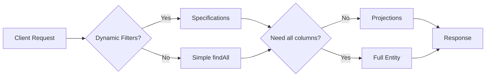
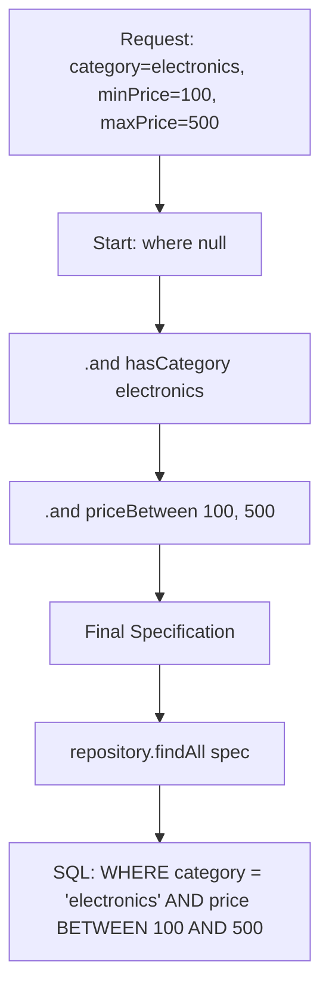
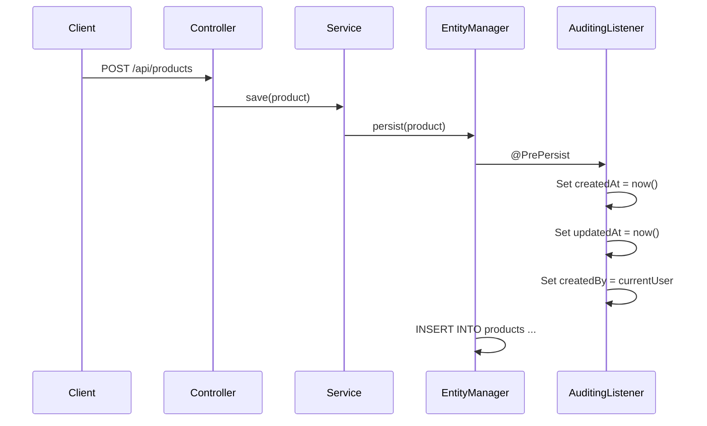

## The Problem

Every Spring Data JPA tutorial starts the same way: define an entity, extend `JpaRepository`, and call `findById()`. That's fine for a weekend project — but production code hits three walls fast:

**1. Dynamic queries become messy**

Your product search endpoint accepts optional filters: category, price range, name keyword. Suddenly you're writing 8 different repository methods or string-concatenating JPQL — both are fragile and hard to test.

**2. Returning full entities wastes bandwidth**

Your listing page only needs `id`, `name`, and `price` — but you're fetching 15 columns including large text fields and audit metadata. That's wasted I/O at the database, network, and serialization layers.

**3. No audit trail**

"Who created this record? When was it last updated?" Without auditing, you're manually setting timestamps in every service method — inconsistent and easy to forget.



This post tackles all three problems with **Specifications**, **Projections**, and **Auditing** — using a real PostgreSQL-backed Spring Boot 3.5 application.

---

## Setup

We'll work with a `Product` entity stored in PostgreSQL 16. The full project uses:

| Layer       | Technology               |
|-------------|--------------------------|
| Language    | Java 21                  |
| Framework   | Spring Boot 3.5.0        |
| Persistence | Spring Data JPA          |
| Database    | PostgreSQL 16            |
| Testing     | Testcontainers + JUnit 5 |

### Entity

```java
@Entity
@Table(name = "products")
@EntityListeners(AuditingEntityListener.class)
public class Product {

    @Id
    @GeneratedValue(strategy = GenerationType.IDENTITY)
    private Long id;

    @Column(nullable = false)
    private String name;

    @Column(nullable = false)
    private String category;

    @Column(nullable = false, precision = 10, scale = 2)
    private BigDecimal price;

    @CreatedDate
    @Column(nullable = false, updatable = false)
    private Instant createdAt;

    @LastModifiedDate
    @Column(nullable = false)
    private Instant updatedAt;

    // constructors, getters, setters
}
```

### Repository

```java
public interface ProductRepository
        extends JpaRepository<Product, Long>, JpaSpecificationExecutor<Product> {

    List<Product> findByCategory(String category);

    @Query("SELECT p FROM Product p WHERE p.price > :threshold ORDER BY p.price DESC")
    List<Product> findHighValueProducts(@Param("threshold") BigDecimal threshold);
}
```

Note that we extend both `JpaRepository` (standard CRUD + paging) **and** `JpaSpecificationExecutor` (dynamic queries via the Criteria API).

---

## Specifications: Dynamic Type-Safe Queries

### The Problem with Derived Queries

Derived query methods are great for simple lookups:

```java
List<Product> findByCategoryAndPriceBetween(String category, BigDecimal min, BigDecimal max);
```

But what happens when every parameter is optional? You'd need:

- `findByCategory`
- `findByPriceBetween`
- `findByCategoryAndPriceBetween`
- `findByNameContaining`
- `findByCategoryAndNameContaining`
- ... and every permutation

This combinatorial explosion is unsustainable.

### Building Composable Specifications

A `Specification<T>` is a single predicate that can be composed with `and()`, `or()`, and `not()`:

```java
public final class ProductSpecifications {

    private ProductSpecifications() {}

    public static Specification<Product> hasCategory(String category) {
        return (root, query, cb) -> cb.equal(root.get("category"), category);
    }

    public static Specification<Product> priceBetween(BigDecimal min, BigDecimal max) {
        return (root, query, cb) -> cb.between(root.get("price"), min, max);
    }

    public static Specification<Product> nameContains(String keyword) {
        return (root, query, cb) ->
                cb.like(cb.lower(root.get("name")), "%" + keyword.toLowerCase() + "%");
    }
}
```

### Composing at Runtime

In the service layer, we build the query dynamically — only non-null parameters contribute a predicate:

```java
@Service
public class ProductService {

    private final ProductRepository productRepository;

    public ProductService(ProductRepository productRepository) {
        this.productRepository = productRepository;
    }

    public List<Product> findProducts(String category, BigDecimal minPrice,
                                       BigDecimal maxPrice, String name) {
        Specification<Product> spec = Specification.where(null);

        if (category != null && !category.isBlank()) {
            spec = spec.and(ProductSpecifications.hasCategory(category));
        }
        if (minPrice != null && maxPrice != null) {
            spec = spec.and(ProductSpecifications.priceBetween(minPrice, maxPrice));
        }
        if (name != null && !name.isBlank()) {
            spec = spec.and(ProductSpecifications.nameContains(name));
        }

        return productRepository.findAll(spec);
    }
}
```



### Advantages Over JPQL Concatenation

| Approach         | Type-safe | Composable | Testable | Readable |
|------------------|-----------|------------|----------|----------|
| Derived queries  | Yes       | No         | Yes      | Yes (simple) |
| JPQL strings     | No        | Manual     | Hard     | Degrades |
| Criteria API raw | Yes       | Yes        | Yes      | Poor     |
| Specifications   | Yes       | Yes        | Yes      | Good     |

---

## Projections: Return Only What You Need

### The Performance Cost of Full Entities

When a listing endpoint only needs three columns but your entity has fifteen, you're paying for:

1. **Database I/O** — reading unnecessary columns from disk
2. **Network transfer** — shipping extra bytes from DB to app
3. **Heap allocation** — hydrating unused fields into objects
4. **Serialization** — converting unused fields to JSON

### Interface-Based Projections

The simplest approach — define an interface with getter methods for the columns you want:

```java
public interface ProductProjection {
    Long getId();
    String getName();
    BigDecimal getPrice();
}
```

Then declare a query method that returns this projection:

```java
public interface ProductRepository extends JpaRepository<Product, Long> {
    List<ProductProjection> findAllProjectedBy();
}
```

Spring Data generates a `SELECT id, name, price FROM products` — only the columns matching your getters.

### Class-Based Projections (DTOs)

For more control (computed fields, custom constructors), use a record:

```java
public record ProductSummary(Long id, String name, BigDecimal price) {}
```

With a JPQL constructor expression:

```java
@Query("SELECT new com.anupam.jpa.dto.ProductSummary(p.id, p.name, p.price) FROM Product p")
List<ProductSummary> findAllSummaries();
```

### Dynamic Projections

Return different shapes from the same query method:

```java
<T> List<T> findByCategory(String category, Class<T> type);
```

Call with different projection types:

```java
// Full entity
List<Product> full = repo.findByCategory("electronics", Product.class);

// Lightweight projection
List<ProductProjection> light = repo.findByCategory("electronics", ProductProjection.class);
```

### When to Use Each

| Type             | Use Case                                   | SQL Impact                |
|------------------|--------------------------------------------|---------------------------|
| Interface-based  | Read-only listings, API responses          | Only declared columns     |
| Class-based (DTO)| Computed fields, immutable transport       | Only constructor params   |
| Dynamic          | Same query, multiple consumers             | Varies by projection type |

---

## Auditing: Automatic Timestamps and User Tracking

### Enable JPA Auditing

```java
@Configuration
@EnableJpaAuditing
public class JpaAuditConfig {
}
```

### Annotate Your Entity

```java
@EntityListeners(AuditingEntityListener.class)
public class Product {

    @CreatedDate
    @Column(nullable = false, updatable = false)
    private Instant createdAt;

    @LastModifiedDate
    @Column(nullable = false)
    private Instant updatedAt;
}
```

Now `createdAt` is set automatically on `persist()` and `updatedAt` on every `merge()` — no manual code needed.

### Adding User Tracking with @CreatedBy

For multi-user systems, implement `AuditorAware`:

```java
@Component
public class SpringSecurityAuditorAware implements AuditorAware<String> {

    @Override
    public Optional<String> getCurrentAuditor() {
        return Optional.ofNullable(SecurityContextHolder.getContext().getAuthentication())
                .filter(Authentication::isAuthenticated)
                .map(Authentication::getName);
    }
}
```

Then annotate:

```java
@CreatedBy
@Column(updatable = false)
private String createdBy;

@LastModifiedBy
private String updatedBy;
```

Update the config to reference the auditor:

```java
@Configuration
@EnableJpaAuditing(auditorAwareRef = "springSecurityAuditorAware")
public class JpaAuditConfig {
}
```



---

## Pagination and Sorting

### Pageable

Spring Data makes pagination trivial. Your repository already supports it via `JpaRepository`:

```java
Page<Product> findAll(Specification<Product> spec, Pageable pageable);
```

Call from the controller:

```java
@GetMapping
public Page<Product> getProducts(
        @RequestParam(defaultValue = "0") int page,
        @RequestParam(defaultValue = "20") int size,
        @RequestParam(defaultValue = "createdAt") String sortBy,
        @RequestParam(defaultValue = "desc") String direction) {

    Sort sort = Sort.by(Sort.Direction.fromString(direction), sortBy);
    Pageable pageable = PageRequest.of(page, size, sort);
    return productService.findProducts(category, minPrice, maxPrice, name, pageable);
}
```

### Page vs Slice

| Feature     | `Page<T>`                         | `Slice<T>`                    |
|-------------|-----------------------------------|-------------------------------|
| Total count | Yes (`SELECT COUNT(*)`)           | No                            |
| Performance | Extra query for total             | Faster (no count)             |
| Use case    | UI with "Page 3 of 12"           | Infinite scroll, "Load more"  |

Use `Slice` when you don't need the total element count — it saves one database round-trip.

### Sort with Multiple Properties

```java
Sort sort = Sort.by(
    Sort.Order.desc("price"),
    Sort.Order.asc("name")
);
```

---

## Common Problems

| Problem | Cause | Fix |
|---------|-------|-----|
| `InvalidDataAccessApiUsageException` when using Specification | Repository doesn't extend `JpaSpecificationExecutor` | Add `JpaSpecificationExecutor<Product>` to your interface |
| Projection returns `null` for all fields | Getter names don't match entity property names | Ensure `getId()` matches `private Long id` |
| `@CreatedDate` is always `null` | Missing `@EnableJpaAuditing` or `@EntityListeners` | Add both: config annotation + entity listener |
| N+1 queries with projections | Using open projections with `@Value` SpEL | Switch to closed projections or use `@EntityGraph` |
| `LazyInitializationException` | Accessing lazy associations outside transaction | Use `@EntityGraph`, JOIN FETCH, or a DTO projection |
| Specification ignores null check | Building spec with nullable params without guarding | Always check `if (param != null)` before `.and()` |
| Pagination count query is slow | Complex joins in the count query | Provide a custom `countQuery` in `@Query` |
| Audit fields not populated in tests | Test doesn't bootstrap Spring context with auditing | Use `@DataJpaTest` which auto-enables auditing config |

---

## Full Working Example

The complete source code is available on GitHub:

> [**github.com/AnupamSinha/spring-data-jpa-advanced**](https://github.com/AnupamSinha/spring-data-jpa-advanced)

### Running Locally

```bash
# Start PostgreSQL via Docker
docker compose up -d

# Run the application
./mvnw spring-boot:run

# Test dynamic filtering
curl "http://localhost:8080/api/products?category=electronics&minPrice=100&maxPrice=500"

# All products (no filters)
curl "http://localhost:8080/api/products"

# Filter by name keyword
curl "http://localhost:8080/api/products?name=laptop"
```

### Running Tests with Testcontainers

```bash
./mvnw test
```

Tests spin up a real PostgreSQL container via Testcontainers — no mocks, no H2 compatibility issues.

---

## Key Takeaways

1. **Specifications** eliminate query method explosion — compose predicates at runtime based on which parameters are present.
2. **Projections** reduce I/O and memory — fetch only the columns your consumer actually needs.
3. **Auditing** removes boilerplate — let the framework handle `createdAt`, `updatedAt`, `createdBy` via entity listeners.
4. **Pagination** is built in — use `Pageable` and choose between `Page` (with count) and `Slice` (without).

These features work together. You can combine Specifications with Projections with Pagination in a single query:

```java
Page<ProductProjection> results = productRepository.findBy(
    spec,
    q -> q.as(ProductProjection.class).page(pageable)
);
```

---

## References

- [Spring Data JPA Reference — Specifications](https://docs.spring.io/spring-data/jpa/reference/jpa/specifications.html)
- [Spring Data JPA Reference — Projections](https://docs.spring.io/spring-data/jpa/reference/repositories/projections.html)
- [Spring Data JPA Reference — Auditing](https://docs.spring.io/spring-data/jpa/reference/auditing.html)
- [Testcontainers — PostgreSQL Module](https://java.testcontainers.org/modules/databases/postgres/)
- [Hibernate ORM 6.x User Guide](https://docs.jboss.org/hibernate/orm/6.6/userguide/html_single/Hibernate_User_Guide.html)
- [Spring Boot 3.5 Release Notes](https://github.com/spring-projects/spring-boot/wiki/Spring-Boot-3.5-Release-Notes)
