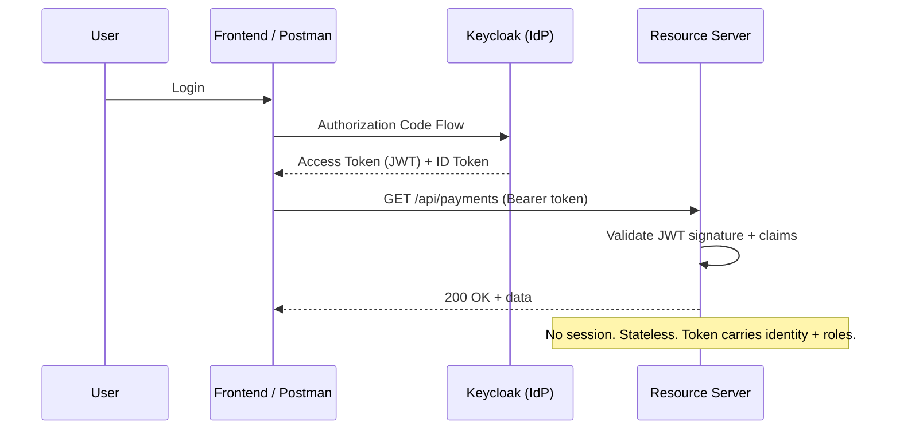

## The Problem

Your "Beat the Basics" knowledge covers form login and basic auth. But production applications need:

- **Single Sign-On (SSO)** across multiple services
- **Token-based auth** for APIs (no sessions)
- **Role-based access** from a centralized identity provider
- **Standard protocols** that work with any OAuth2/OIDC provider (Keycloak, Auth0, Okta, Azure AD)

Spring Security 6 makes this straightforward — but the terminology (authorization code flow, resource server, ID token vs access token) trips up most developers on first encounter.

---

## What We Are Building

Two Spring Boot applications:

| Component | Role |
|-----------|------|
| **Resource Server** | REST API secured with JWT tokens |
| **Keycloak** | Identity Provider (issues tokens, manages users/roles) |



---

## Prerequisites

| Component | Version |
|-----------|---------|
| Java | 21+ |
| Spring Boot | 3.5+ |
| Docker | Latest (for Keycloak) |
| Maven | 3.9+ |

---

## Step 1: Start Keycloak

```yaml
# docker-compose.yml
services:
  keycloak:
    image: quay.io/keycloak/keycloak:25.0
    container_name: keycloak
    environment:
      KEYCLOAK_ADMIN: admin
      KEYCLOAK_ADMIN_PASSWORD: admin
    ports:
      - "8180:8080"
    command: start-dev
```

```bash
docker compose up -d
```

Access the admin console at `http://localhost:8180` (admin/admin).

### Configure Keycloak

1. **Create a realm**: `payment-realm`
2. **Create a client**: `payment-api`
   - Client authentication: ON
   - Authorization: ON
   - Valid redirect URIs: `http://localhost:8080/*`
   - Web origins: `*`
3. **Create roles**: `ADMIN`, `USER`
4. **Create users**:
   - `alice` → role `ADMIN`
   - `bob` → role `USER`

---

## Step 2: Resource Server Dependencies

```xml
<dependencies>
    <dependency>
        <groupId>org.springframework.boot</groupId>
        <artifactId>spring-boot-starter-web</artifactId>
    </dependency>
    <dependency>
        <groupId>org.springframework.boot</groupId>
        <artifactId>spring-boot-starter-oauth2-resource-server</artifactId>
    </dependency>
    <dependency>
        <groupId>org.springframework.boot</groupId>
        <artifactId>spring-boot-starter-security</artifactId>
    </dependency>
</dependencies>
```

---

## Step 3: Application Configuration

```yaml
spring:
  security:
    oauth2:
      resourceserver:
        jwt:
          issuer-uri: http://localhost:8180/realms/payment-realm

server:
  port: 8080
```

Spring Security fetches the OIDC discovery document from `issuer-uri/.well-known/openid-configuration` at startup. It gets the JWKS endpoint, downloads public keys, and validates tokens automatically.

---

## Step 4: Security Configuration

```java
@Configuration
@EnableWebSecurity
public class SecurityConfig {

    @Bean
    public SecurityFilterChain securityFilterChain(HttpSecurity http) throws Exception {
        http
            .authorizeHttpRequests(auth -> auth
                .requestMatchers("/api/public/**").permitAll()
                .requestMatchers("/api/admin/**").hasRole("ADMIN")
                .requestMatchers("/api/payments/**").hasAnyRole("USER", "ADMIN")
                .anyRequest().authenticated()
            )
            .oauth2ResourceServer(oauth2 -> oauth2
                .jwt(jwt -> jwt
                    .jwtAuthenticationConverter(jwtAuthenticationConverter())
                )
            );

        return http.build();
    }

    @Bean
    public JwtAuthenticationConverter jwtAuthenticationConverter() {
        JwtGrantedAuthoritiesConverter grantedAuthorities = new JwtGrantedAuthoritiesConverter();
        grantedAuthorities.setAuthoritiesClaimName("realm_access.roles");
        grantedAuthorities.setAuthorityPrefix("ROLE_");

        JwtAuthenticationConverter converter = new JwtAuthenticationConverter();
        converter.setJwtGrantedAuthoritiesConverter(jwt -> {
            // Extract roles from Keycloak's token structure
            Map<String, Object> realmAccess = jwt.getClaimAsMap("realm_access");
            if (realmAccess == null) return List.of();

            @SuppressWarnings("unchecked")
            List<String> roles = (List<String>) realmAccess.get("roles");
            if (roles == null) return List.of();

            return roles.stream()
                    .map(role -> new SimpleGrantedAuthority("ROLE_" + role))
                    .collect(Collectors.toList());
        });

        return converter;
    }
}
```

**Key points:**
- `.oauth2ResourceServer(jwt(...))` tells Spring Security this is a stateless API that validates JWT tokens
- The `JwtAuthenticationConverter` maps Keycloak's `realm_access.roles` claim to Spring Security authorities
- No sessions, no CSRF (API is stateless)

---

## Step 5: Secured Controller

```java
@RestController
@RequestMapping("/api")
public class PaymentController {

    @GetMapping("/public/health")
    public Map<String, String> health() {
        return Map.of("status", "UP");
    }

    @GetMapping("/payments")
    public List<Payment> getPayments(@AuthenticationPrincipal Jwt jwt) {
        String username = jwt.getClaimAsString("preferred_username");
        String email = jwt.getClaimAsString("email");
        // Use token claims for business logic
        return paymentService.getPaymentsForUser(username);
    }

    @GetMapping("/admin/users")
    @PreAuthorize("hasRole('ADMIN')")
    public List<UserInfo> getAllUsers() {
        return userService.getAllUsers();
    }

    @GetMapping("/me")
    public Map<String, Object> currentUser(@AuthenticationPrincipal Jwt jwt) {
        return Map.of(
                "username", jwt.getClaimAsString("preferred_username"),
                "email", jwt.getClaimAsString("email"),
                "roles", jwt.getClaimAsMap("realm_access")
        );
    }
}
```

`@AuthenticationPrincipal Jwt jwt` gives you direct access to all token claims — username, email, roles, custom attributes.

---

## Step 6: Testing

### Get a token from Keycloak

```bash
TOKEN=$(curl -s -X POST http://localhost:8180/realms/payment-realm/protocol/openid-connect/token \
  -d "client_id=payment-api" \
  -d "client_secret=YOUR_CLIENT_SECRET" \
  -d "username=alice" \
  -d "password=alice123" \
  -d "grant_type=password" | jq -r '.access_token')
```

### Call the secured API

```bash
# Authenticated request (works)
curl -H "Authorization: Bearer $TOKEN" http://localhost:8080/api/payments

# Admin endpoint (works for alice, fails for bob)
curl -H "Authorization: Bearer $TOKEN" http://localhost:8080/api/admin/users

# No token (401 Unauthorized)
curl http://localhost:8080/api/payments

# Public endpoint (always works)
curl http://localhost:8080/api/public/health
```

---

## Understanding the Token

A decoded Keycloak JWT looks like:

```json
{
  "sub": "a1b2c3d4-...",
  "preferred_username": "alice",
  "email": "alice@example.com",
  "realm_access": {
    "roles": ["ADMIN", "USER"]
  },
  "resource_access": {
    "payment-api": {
      "roles": ["manage-payments"]
    }
  },
  "iss": "http://localhost:8180/realms/payment-realm",
  "exp": 1724400000,
  "iat": 1724396400
}
```

| Claim | Purpose |
|-------|---------|
| `sub` | Unique user identifier |
| `preferred_username` | Human-readable username |
| `realm_access.roles` | Global roles (ADMIN, USER) |
| `resource_access` | Client-specific roles |
| `iss` | Token issuer (validates against config) |
| `exp` | Expiration timestamp |

---

## Testing Secured Endpoints in JUnit

```java
@SpringBootTest
@AutoConfigureMockMvc
class PaymentControllerSecurityTest {

    @Autowired
    private MockMvc mockMvc;

    @Test
    void shouldRejectUnauthenticatedRequest() throws Exception {
        mockMvc.perform(get("/api/payments"))
                .andExpect(status().isUnauthorized());
    }

    @Test
    @WithMockUser(roles = "USER")
    void shouldAllowUserToAccessPayments() throws Exception {
        mockMvc.perform(get("/api/payments"))
                .andExpect(status().isOk());
    }

    @Test
    @WithMockUser(roles = "USER")
    void shouldDenyUserFromAdminEndpoint() throws Exception {
        mockMvc.perform(get("/api/admin/users"))
                .andExpect(status().isForbidden());
    }

    @Test
    void shouldAllowPublicEndpointWithoutAuth() throws Exception {
        mockMvc.perform(get("/api/public/health"))
                .andExpect(status().isOk());
    }
}
```

For JWT-specific testing with custom claims:

```java
@Test
void shouldExtractUsernameFromJwt() throws Exception {
    Jwt jwt = Jwt.withTokenValue("mock-token")
            .header("alg", "RS256")
            .claim("preferred_username", "alice")
            .claim("realm_access", Map.of("roles", List.of("USER")))
            .build();

    mockMvc.perform(get("/api/me")
            .with(SecurityMockMvcRequestPostProcessors.jwt().jwt(jwt)))
            .andExpect(status().isOk())
            .andExpect(jsonPath("$.username").value("alice"));
}
```

---

## Switching Providers

The beauty of OAuth2/OIDC is portability. To switch from Keycloak to Auth0:

```yaml
# Just change the issuer URI
spring:
  security:
    oauth2:
      resourceserver:
        jwt:
          issuer-uri: https://your-tenant.auth0.com/
```

Adjust the role-extraction logic in `JwtAuthenticationConverter` (Auth0 uses a different claim structure), and you're done. Zero application logic changes.

---

## Common Problems

| Symptom | Cause | Fix |
|---------|-------|-----|
| 401 on every request | Wrong `issuer-uri` or Keycloak not reachable | Verify URL, check Docker is running |
| Roles not mapped | Keycloak nests roles in `realm_access.roles` | Use custom `JwtAuthenticationConverter` |
| Token expired instantly | Clock skew between app and Keycloak | Add `spring.security.oauth2.resourceserver.jwt.clock-skew=30s` |
| 403 even with correct role | Missing `ROLE_` prefix | Ensure converter adds `ROLE_` prefix |
| CORS errors from frontend | No CORS config | Add `CorsConfigurationSource` bean |
| `JwtDecoder` bean not found | Missing `oauth2-resource-server` dependency | Add `spring-boot-starter-oauth2-resource-server` |

---

## Full Working Example

The complete project with Keycloak docker-compose, resource server, and test suite is at [github.com/AnupamSinha/spring-security-oauth2-demo](https://github.com/AnupamSinha/spring-security-oauth2-demo).

```bash
git clone https://github.com/AnupamSinha/spring-security-oauth2-demo.git
cd spring-security-oauth2-demo
docker compose up -d   # Starts Keycloak
./mvnw spring-boot:run
```

---

## References

- [Spring Security OAuth2 Resource Server](https://docs.spring.io/spring-security/reference/servlet/oauth2/resource-server/index.html)
- [Spring Security — JWT](https://docs.spring.io/spring-security/reference/servlet/oauth2/resource-server/jwt.html)
- [Keycloak Documentation](https://www.keycloak.org/documentation)
- [OAuth 2.0 Simplified](https://www.oauth.com/)
- [Spring Security Testing](https://docs.spring.io/spring-security/reference/servlet/test/index.html)
