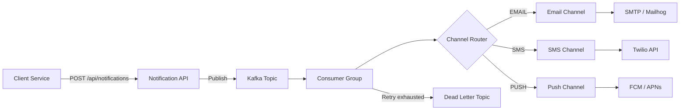
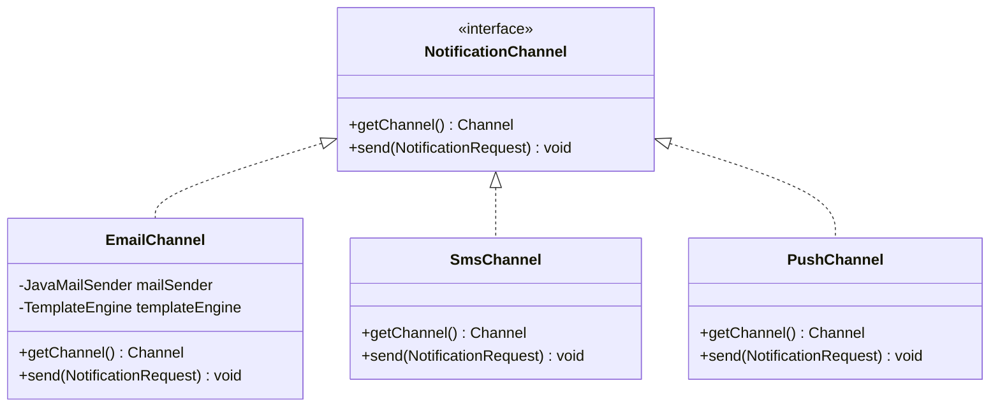
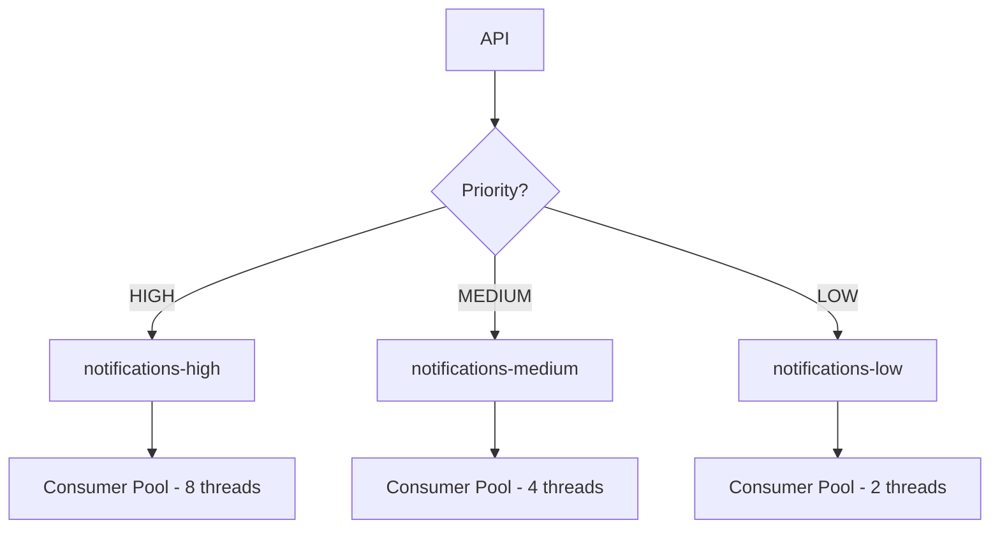
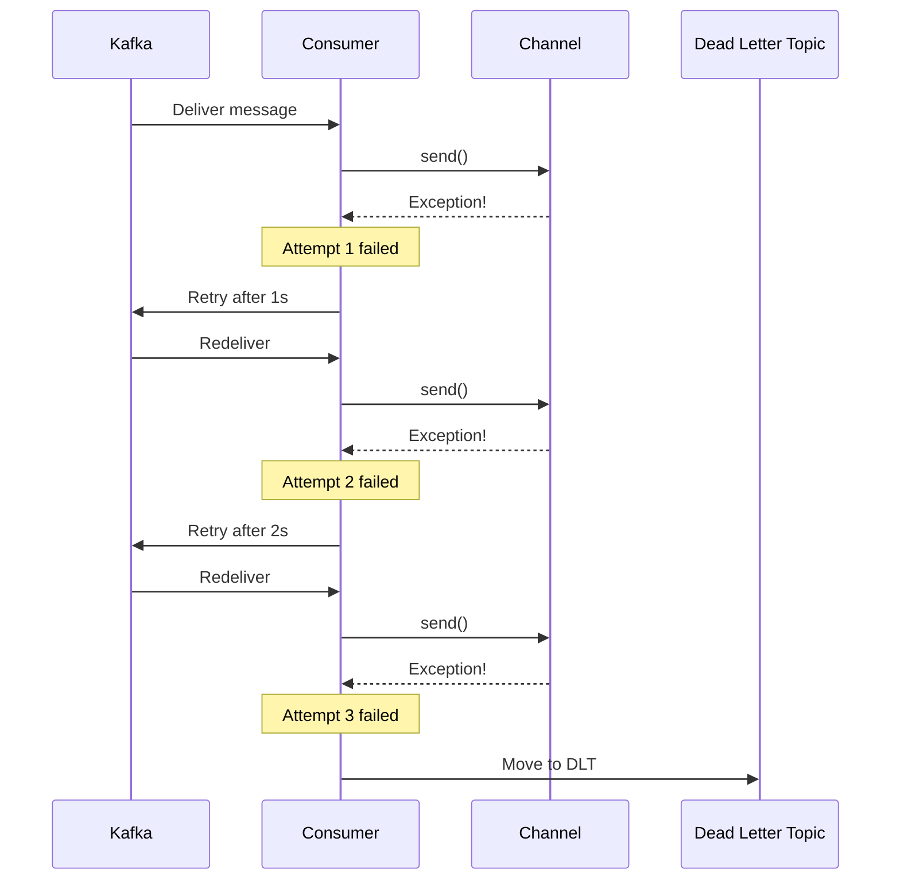
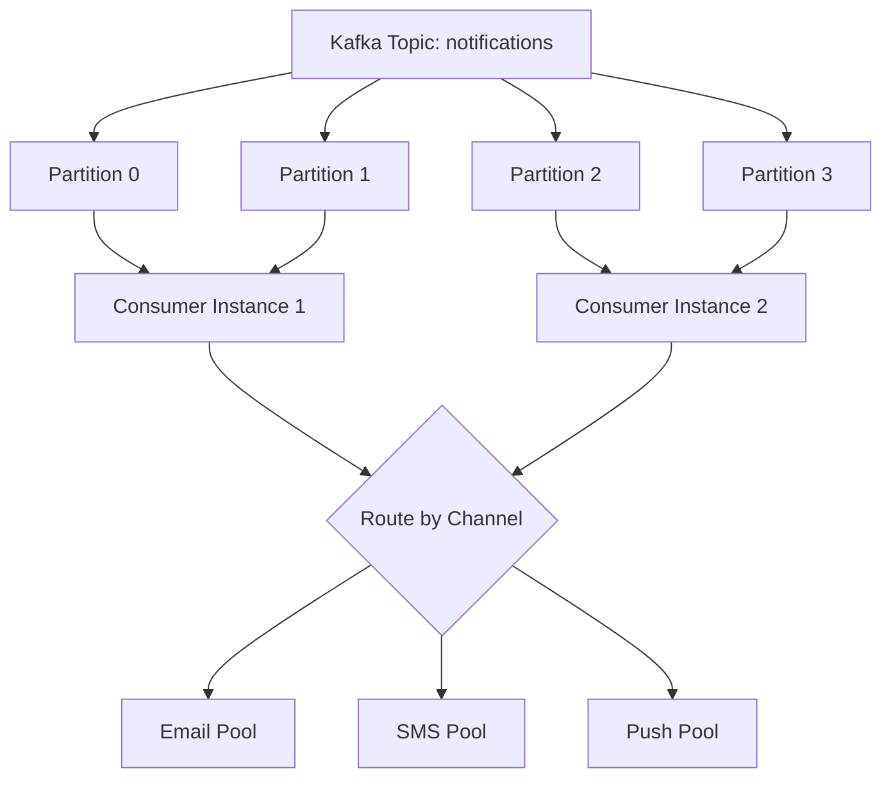

## The Problem

Almost every production system needs notifications. Users expect emails on sign-up, SMS for OTPs, push notifications for real-time updates. But building a notification service that handles multiple channels, templates, priorities, retries, and scale is far from trivial.

This is also a classic system design interview question — and one that reveals whether you understand event-driven architecture, the strategy pattern, and failure handling in distributed systems.

In this post, we'll design and implement a multi-channel notification service using Spring Boot 3.5, Apache Kafka, and JavaMail with Thymeleaf templates.

---

## Requirements

### Functional Requirements

| # | Requirement |
|---|-------------|
| 1 | Send notifications through Email, SMS, and Push channels |
| 2 | Support templates with variable substitution |
| 3 | Priority-based processing (HIGH before LOW) |
| 4 | Retry failed notifications with exponential backoff |
| 5 | Dead letter queue for permanently failed notifications |
| 6 | Unified API — single endpoint, channel specified in payload |

### Non-Functional Requirements

| # | Requirement |
|---|-------------|
| 1 | Asynchronous processing — API returns immediately |
| 2 | At-least-once delivery guarantee |
| 3 | Horizontally scalable consumers per channel |
| 4 | Rate limiting per channel (email providers throttle) |
| 5 | Observability — log every send attempt and outcome |

---

## High-Level Architecture



The architecture decouples the API from delivery. The producer returns `202 Accepted` immediately, and Kafka handles reliable delivery to the appropriate channel consumer.

---

## Channel Abstraction — Strategy Pattern

The Strategy pattern is perfect here. Each channel implements the same interface, and the consumer routes to the correct implementation at runtime.



### The Interface

```java
public interface NotificationChannel {

    NotificationRequest.Channel getChannel();

    void send(NotificationRequest request);
}
```

### Channel Router in Consumer

```java
@Component
public class NotificationConsumer {

    private final Map<Channel, NotificationChannel> channelHandlers;

    public NotificationConsumer(List<NotificationChannel> channels) {
        this.channelHandlers = channels.stream()
            .collect(Collectors.toMap(
                NotificationChannel::getChannel,
                Function.identity()
            ));
    }

    @KafkaListener(topics = "${app.kafka.topic}")
    public void consume(NotificationRequest request) {
        NotificationChannel handler = channelHandlers.get(request.channel());
        handler.send(request);
    }
}
```

Spring autowires all `NotificationChannel` implementations as a `List`, and we build a lookup map. Adding a new channel is just implementing the interface — zero changes to existing code (Open/Closed Principle).

---

## Email with Thymeleaf Templates

Email is the most complex channel because of HTML rendering. We use Thymeleaf as a server-side template engine to produce rich HTML emails.

### Template (`welcome.html`)

```html
<div class="content">
    <p>Hi <span th:text="${name}">User</span>,</p>
    <p>Welcome to our platform!</p>
    <a th:href="${activationLink}" class="button">Activate Account</a>
</div>
```

### Email Channel Implementation

```java
@Component
public class EmailChannel implements NotificationChannel {

    private final JavaMailSender mailSender;
    private final TemplateEngine templateEngine;

    @Override
    public void send(NotificationRequest request) {
        String htmlContent = renderTemplate(request.templateName(), request.variables());

        MimeMessage message = mailSender.createMimeMessage();
        MimeMessageHelper helper = new MimeMessageHelper(message, true, "UTF-8");
        helper.setTo(request.recipient());
        helper.setSubject(resolveSubject(request.templateName()));
        helper.setText(htmlContent, true);

        mailSender.send(message);
    }

    private String renderTemplate(String templateName, Map<String, String> variables) {
        Context context = new Context();
        if (variables != null) {
            variables.forEach(context::setVariable);
        }
        return templateEngine.process(templateName, context);
    }
}
```

For local testing, we use Mailhog (port 1025 for SMTP, port 8025 for web UI).

---

## SMS — Twilio Integration Shape

In production, you'd integrate with Twilio or AWS SNS. The implementation shape:

```java
@Component
public class SmsChannel implements NotificationChannel {

    @Override
    public void send(NotificationRequest request) {
        // Production: Twilio API call
        // TwilioRestClient.create(accountSid, authToken)
        //     .messages()
        //     .create(new PhoneNumber(request.recipient()),
        //             new PhoneNumber(fromNumber),
        //             buildMessageBody(request));

        log.info("[SMS] Sending to {}: {}", request.recipient(), buildMessageBody(request));
    }
}
```

We simulate the SMS channel with logging. The contract is the same — swap in the real Twilio client for production.

---

## Push — FCM Integration Shape

Similarly, push notifications would integrate with Firebase Cloud Messaging:

```java
@Component
public class PushChannel implements NotificationChannel {

    @Override
    public void send(NotificationRequest request) {
        // Production: FCM call
        // FirebaseMessaging.getInstance().send(
        //     Message.builder()
        //         .setToken(request.recipient())
        //         .setNotification(Notification.builder()
        //             .setTitle(resolveTitle(request))
        //             .setBody(resolveBody(request))
        //             .build())
        //         .build());

        log.info("[PUSH] Sending to device: {}", request.recipient());
    }
}
```

---

## Priority Queues with Kafka

Different notifications have different urgency levels. An OTP should arrive within seconds. A marketing email can wait.

### Approach: Separate Topics by Priority



| Priority | Topic | Consumer Threads | Max Latency |
|----------|-------|------------------|-------------|
| HIGH | notifications-high | 8 | < 5 seconds |
| MEDIUM | notifications-medium | 4 | < 30 seconds |
| LOW | notifications-low | 2 | < 5 minutes |

By allocating more consumer threads to high-priority topics, we ensure OTPs and security alerts are processed before marketing emails.

---

## Retry Strategy with Dead Letter Topics

Notifications fail. SMTP servers go down, Twilio rate-limits, FCM tokens expire. We need retry with backoff.

Spring Kafka's `@RetryableTopic` handles this elegantly:

```java
@RetryableTopic(
    attempts = "3",
    backoff = @Backoff(delay = 1000, multiplier = 2.0)
)
@KafkaListener(topics = "${app.kafka.topic}")
public void consume(NotificationRequest request) {
    channelHandlers.get(request.channel()).send(request);
}

@DltHandler
public void handleDlt(NotificationRequest request) {
    log.error("Notification permanently failed: {}", request);
    // Alert ops, persist to dead letter table
}
```

### Retry Flow



---

## Template Engine

The template system uses a convention: template name maps to a file in `src/main/resources/templates/`.

| Template Name | File | Use Case |
|---------------|------|----------|
| welcome | welcome.html | New user registration |
| otp | otp.html | Verification codes |
| password-reset | password-reset.html | Password recovery |
| order-confirmation | order-confirmation.html | E-commerce orders |

Variables are passed as a `Map<String, String>` and rendered at send time:

```json
{
  "recipient": "user@example.com",
  "channel": "EMAIL",
  "templateName": "welcome",
  "variables": {
    "name": "Anupam",
    "activationLink": "https://example.com/activate?token=abc123"
  },
  "priority": "HIGH"
}
```

---

## Rate Limiting per Channel

Email providers (SES, SendGrid) enforce rate limits. Twilio has per-second SMS limits. We need per-channel rate limiting.

| Channel | Typical Rate Limit | Strategy |
|---------|-------------------|----------|
| Email (SES) | 14/second | Token bucket |
| SMS (Twilio) | 1/second per number | Queue with delay |
| Push (FCM) | 500/second | Batch sends |

Implementation approach with Resilience4j:

```java
@RateLimiter(name = "email-sender", fallbackMethod = "rateLimited")
public void send(NotificationRequest request) {
    // send email
}

private void rateLimited(NotificationRequest request, Exception ex) {
    throw new RateLimitExceededException("Email rate limit exceeded, will retry");
}
```

---

## Scaling — Consumer Groups per Channel



Scaling strategies:

1. **Horizontal scaling** — Add more consumer instances (Kafka rebalances partitions)
2. **Channel isolation** — Separate topics per channel so email failures don't block SMS
3. **Partition by priority** — Use message key = priority + channel for even distribution
4. **Batch processing** — FCM supports sending to 500 devices in one API call

---

## Common Problems

| Problem | Cause | Solution |
|---------|-------|----------|
| Duplicate notifications | At-least-once delivery | Idempotency key per notification |
| Email in spam folder | Missing SPF/DKIM/DMARC | Configure DNS records properly |
| Consumer lag | Slow channel (SMTP timeout) | Increase partitions and consumers |
| Template not found | Typo in template name | Validate template exists at publish time |
| Rate limit exceeded | Too many sends per second | Per-channel rate limiting |
| Retry storm | All retries hit at same time | Add jitter to backoff |
| Lost notifications | Consumer crash before commit | Use manual offset commit after send |
| Memory pressure | Large email attachments | Stream attachments, limit payload size |

---

## Full Working Example

The complete source code is available on GitHub:

> [spring-boot-notification-service](https://github.com/anupamsinha/spring-boot-notification-service)

To run locally:

```bash
# Start Kafka + Mailhog
docker compose up -d

# Run the application
./mvnw spring-boot:run

# Send an email notification
curl -X POST http://localhost:8080/api/notifications \
  -H "Content-Type: application/json" \
  -d '{
    "recipient": "user@example.com",
    "channel": "EMAIL",
    "templateName": "welcome",
    "variables": {"name": "Anupam", "activationLink": "https://example.com/activate"},
    "priority": "HIGH"
  }'

# Check Mailhog UI for the email
open http://localhost:8025
```

---

## References

- [Apache Kafka Documentation](https://kafka.apache.org/documentation/)
- [Spring Kafka Reference](https://docs.spring.io/spring-kafka/reference/)
- [Thymeleaf Documentation](https://www.thymeleaf.org/documentation.html)
- [Designing Notifications — System Design Primer](https://github.com/donnemartin/system-design-primer)
- [Strategy Pattern — Refactoring Guru](https://refactoring.guru/design-patterns/strategy)
