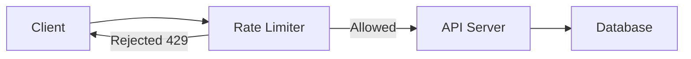
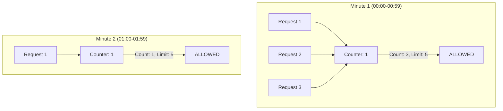
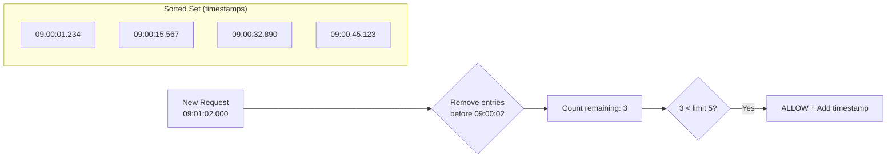
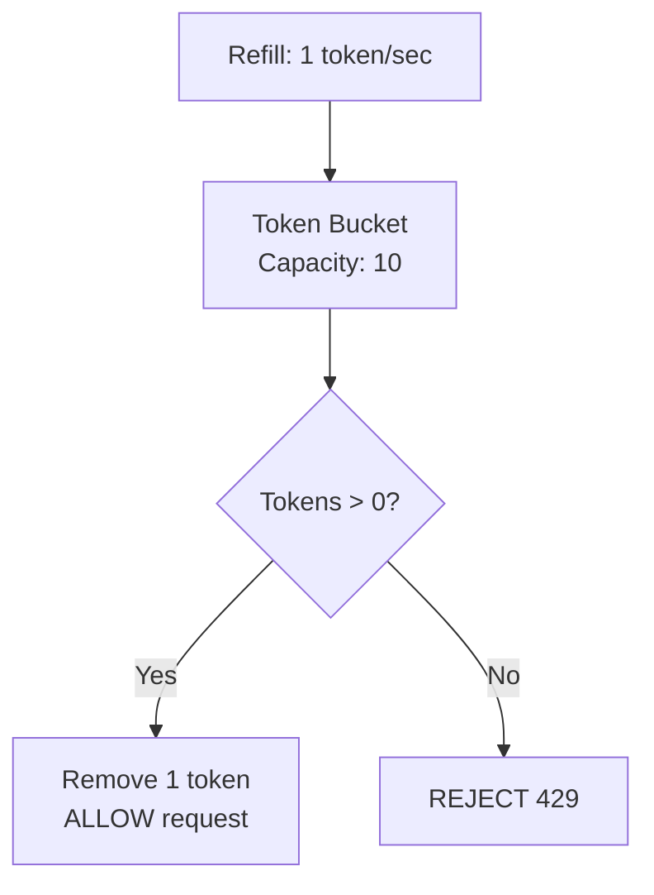
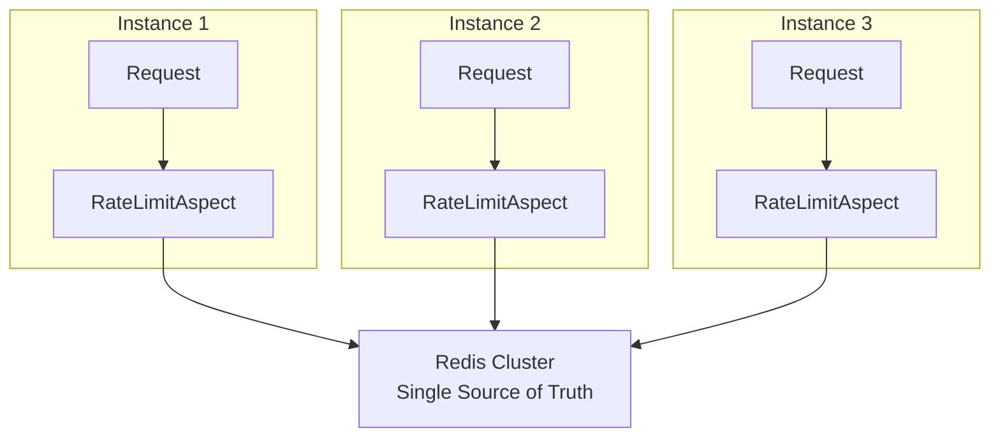

## The Problem

Every public API faces these threats:
- **DDoS attacks** — overwhelming the server with requests
- **Resource abuse** — one client consuming all capacity
- **Cost explosion** — runaway automation driving up cloud bills
- **Unfairness** — noisy neighbors starving other users

A rate limiter acts as a gatekeeper — it tracks how many requests a client has made in a time window and rejects excess requests with HTTP 429 (Too Many Requests).



---

## Rate Limiting Algorithms

### 1. Fixed Window

Divide time into fixed intervals (e.g., 1-minute buckets). Count requests in each bucket.



**Problem:** Burst at window boundary. If limit is 10/minute, a client can send 10 requests at 00:59 and 10 more at 01:00 — effectively 20 requests in 2 seconds.

### 2. Sliding Window Log

Store the timestamp of every request. Count requests within the sliding window.



**This is what we implement.** It's precise, no boundary issues, and Redis sorted sets make it efficient.

### 3. Sliding Window Counter

Approximation: weight the previous window's count by overlap percentage.

```
current_window_count + (previous_window_count × overlap_percentage)
```

More memory-efficient than the log approach but less precise.

### 4. Token Bucket

A bucket fills with tokens at a fixed rate. Each request consumes one token. If the bucket is empty, reject.



**Good for:** allowing bursts up to bucket capacity while maintaining a steady rate.

---

## Algorithm Comparison

| Algorithm | Precision | Memory | Burst Handling | Complexity |
|-----------|-----------|--------|----------------|------------|
| Fixed Window | Low (boundary issue) | O(1) per key | Poor at edges | Simple |
| Sliding Window Log | High | O(n) per key | Excellent | Medium |
| Sliding Window Counter | Medium | O(1) per key | Good | Medium |
| Token Bucket | High | O(1) per key | Configurable | Medium |
| Leaky Bucket | High | O(1) per key | Smooths output | Medium |

For our implementation, we choose **Sliding Window Log** because:
- Precise — no boundary issues
- Simple to implement with Redis sorted sets
- Efficient cleanup with `ZREMRANGEBYSCORE`
- Works across distributed instances (Redis is the single source of truth)

---

## What We're Building

```mermaid
flowchart TD
    A[HTTP Request] --> B[Spring MVC]
    B --> C[AOP Interceptor]
    C --> D{@RateLimit annotation?}
    D -->|No| E[Execute Method]
    D -->|Yes| F[Extract Client IP]
    F --> G[RateLimiterService]
    G --> H[Redis ZREMRANGEBYSCORE<br>Remove expired]
    H --> I[Redis ZCARD<br>Count current]
    I --> J{Count < Limit?}
    J -->|Yes| K[Redis ZADD<br>Record request]
    K --> E
    J -->|No| L[Throw RateLimitExceededException]
    L --> M[GlobalExceptionHandler]
    M --> N[HTTP 429 + Headers]
```

---

## Custom @RateLimit Annotation

```java
@Target(ElementType.METHOD)
@Retention(RetentionPolicy.RUNTIME)
public @interface RateLimit {

    /**
     * Maximum number of requests allowed within the time window.
     */
    int requests();

    /**
     * Time window in seconds.
     */
    int seconds();
}
```

Usage is clean and declarative:

```java
@GetMapping("/api/search")
@RateLimit(requests = 10, seconds = 60)
public SearchResults search(@RequestParam String query) {
    // 10 requests per minute per client
}
```

---

## AOP Aspect

The aspect intercepts any method annotated with `@RateLimit`:

```java
@Aspect
@Component
public class RateLimitAspect {

    private final RateLimiterService rateLimiterService;

    public RateLimitAspect(RateLimiterService rateLimiterService) {
        this.rateLimiterService = rateLimiterService;
    }

    @Around("@annotation(com.anupam.ratelimiter.annotation.RateLimit)")
    public Object enforce(ProceedingJoinPoint joinPoint) throws Throwable {
        MethodSignature signature = (MethodSignature) joinPoint.getSignature();
        RateLimit rateLimit = signature.getMethod().getAnnotation(RateLimit.class);

        String clientId = extractClientIp();
        String endpoint = signature.getDeclaringType().getSimpleName() + "." + signature.getName();
        String key = "rate_limit:" + endpoint + ":" + clientId;

        boolean allowed = rateLimiterService.isAllowed(key, rateLimit.requests(), rateLimit.seconds());

        if (!allowed) {
            long retryAfter = rateLimiterService.getRetryAfterSeconds(key, rateLimit.seconds());
            throw new RateLimitExceededException(rateLimit.requests(), rateLimit.seconds(), retryAfter);
        }

        return joinPoint.proceed();
    }

    private String extractClientIp() {
        ServletRequestAttributes attributes =
                (ServletRequestAttributes) RequestContextHolder.getRequestAttributes();
        if (attributes == null) return "unknown";

        HttpServletRequest request = attributes.getRequest();

        // Check proxy headers first
        String xForwardedFor = request.getHeader("X-Forwarded-For");
        if (xForwardedFor != null && !xForwardedFor.isBlank()) {
            return xForwardedFor.split(",")[0].trim();
        }

        String xRealIp = request.getHeader("X-Real-IP");
        if (xRealIp != null && !xRealIp.isBlank()) {
            return xRealIp;
        }

        return request.getRemoteAddr();
    }
}
```

---

## Redis Sliding Window — ZADD + ZREMRANGEBYSCORE + ZCARD

The core algorithm uses three Redis commands on a sorted set:

```java
@Service
public class RateLimiterService {

    private final ZSetOperations<String, String> zSetOps;
    private final StringRedisTemplate redisTemplate;

    public RateLimiterService(StringRedisTemplate redisTemplate) {
        this.redisTemplate = redisTemplate;
        this.zSetOps = redisTemplate.opsForZSet();
    }

    public boolean isAllowed(String key, int maxRequests, int windowSeconds) {
        long now = Instant.now().toEpochMilli();
        long windowStart = now - (windowSeconds * 1000L);

        // Step 1: Remove entries older than the window
        zSetOps.removeRangeByScore(key, 0, windowStart);

        // Step 2: Count remaining entries
        Long currentCount = zSetOps.zCard(key);

        if (currentCount != null && currentCount >= maxRequests) {
            return false; // Rate limit exceeded
        }

        // Step 3: Add current request
        String member = now + ":" + UUID.randomUUID().toString().substring(0, 8);
        zSetOps.add(key, member, now);

        // Step 4: Set TTL for auto-cleanup
        redisTemplate.expire(key, Duration.ofSeconds(windowSeconds + 10));

        return true;
    }
}
```

### How It Works in Redis

```
# Key: rate_limit:ApiController.search:192.168.1.100
# Each member is a unique request ID, score is the timestamp

ZADD rate_limit:ApiController.search:192.168.1.100 1724300001234 "1724300001234:a1b2c3d4"
ZADD rate_limit:ApiController.search:192.168.1.100 1724300015567 "1724300015567:e5f6g7h8"
ZADD rate_limit:ApiController.search:192.168.1.100 1724300032890 "1724300032890:i9j0k1l2"

# Remove entries older than 60 seconds ago
ZREMRANGEBYSCORE rate_limit:ApiController.search:192.168.1.100 0 1723699940000

# Count remaining
ZCARD rate_limit:ApiController.search:192.168.1.100
# Returns: 3
```

---

## Identifying Clients

| Strategy | Pros | Cons | Best For |
|----------|------|------|----------|
| IP Address | Simple, no auth needed | Shared IPs (NAT, offices) | Public APIs |
| API Key | Per-client identity | Requires key management | B2B APIs |
| User ID | Precise per-user | Requires authentication | Authenticated APIs |
| IP + Path | Granular per-endpoint | More Redis keys | Mixed APIs |

Our implementation uses IP by default. To switch to API key or user ID, modify `extractClientId()` in the aspect:

```java
private String extractClientId(HttpServletRequest request) {
    // Strategy 1: API Key
    String apiKey = request.getHeader("X-API-Key");
    if (apiKey != null) return "apikey:" + apiKey;

    // Strategy 2: Authenticated user
    Authentication auth = SecurityContextHolder.getContext().getAuthentication();
    if (auth != null && auth.isAuthenticated()) {
        return "user:" + auth.getName();
    }

    // Strategy 3: IP (fallback)
    return "ip:" + extractClientIp(request);
}
```

---

## Response Headers

A well-behaved rate limiter communicates its state through headers:

| Header | Description | Example |
|--------|-------------|---------|
| `X-RateLimit-Limit` | Max requests in the window | `10` |
| `X-RateLimit-Remaining` | Requests left in current window | `7` |
| `X-RateLimit-Window` | Window size | `60s` |
| `Retry-After` | Seconds until the client can retry | `23` |

```java
@ExceptionHandler(RateLimitExceededException.class)
public ResponseEntity<Map<String, Object>> handleRateLimitExceeded(
        RateLimitExceededException ex) {

    HttpHeaders headers = new HttpHeaders();
    headers.set("X-RateLimit-Limit", String.valueOf(ex.getMaxRequests()));
    headers.set("X-RateLimit-Remaining", "0");
    headers.set("X-RateLimit-Window", ex.getWindowSeconds() + "s");
    headers.set("Retry-After", String.valueOf(ex.getRetryAfterSeconds()));

    Map<String, Object> body = Map.of(
            "status", 429,
            "error", "Too Many Requests",
            "message", ex.getMessage(),
            "retryAfter", ex.getRetryAfterSeconds(),
            "timestamp", Instant.now().toString()
    );

    return ResponseEntity.status(HttpStatus.TOO_MANY_REQUESTS)
            .headers(headers)
            .body(body);
}
```

---

## Distributed Considerations



Because Redis is the single source of truth, our implementation is **distributed by default**. Multiple application instances share the same rate limit counters through Redis.

### Considerations for production:

| Concern | Solution |
|---------|----------|
| Redis failure | Fail-open (allow requests) or fail-closed (reject all) |
| Clock skew | Use Redis server time (`TIME` command) instead of local time |
| Redis latency | Pipeline commands, use connection pooling |
| Hot keys | Use Redis Cluster with hash tags for distribution |
| Memory usage | Set TTL on all keys, monitor with `INFO memory` |

### Fail-Open Pattern

```java
public boolean isAllowed(String key, int maxRequests, int windowSeconds) {
    try {
        // ... Redis operations ...
    } catch (RedisConnectionFailureException e) {
        log.warn("Redis unavailable — failing open for key: {}", key);
        return true; // Allow request if Redis is down
    }
}
```

---

## Common Problems

| Problem | Cause | Solution |
|---------|-------|----------|
| Rate limit not working | AOP proxy bypass (self-invocation) | Call from another bean, not `this.method()` |
| Inconsistent counts | Clock skew between instances | Use `System.currentTimeMillis()` or Redis `TIME` |
| Memory growing | No TTL on keys | Always set `EXPIRE` after `ZADD` |
| Shared IP blocking | Multiple users behind NAT | Use API key or user ID instead of IP |
| Redis connection pool exhaustion | Too many concurrent checks | Increase pool size, use pipelining |
| Annotation not detected | Method not public, or not in Spring bean | Ensure class is `@Component` and method is public |
| Tests failing | Redis not available in tests | Use embedded Redis or Testcontainers |

---

## Full Working Example

The complete implementation is available as a runnable Spring Boot project:

**Repository:** [spring-boot-rate-limiter](https://github.com/anupamsinha/spring-boot-rate-limiter)

### Quick Test

```bash
# Start Redis
docker compose up -d

# Run the app
./mvnw spring-boot:run

# Test public endpoint (no limit)
curl http://localhost:8080/api/public

# Test limited endpoint (10/minute)
for i in {1..12}; do
  echo "Request $i:"
  curl -s -o /dev/null -w "%{http_code}" http://localhost:8080/api/limited
  echo ""
done
# Requests 1-10: 200, Requests 11-12: 429

# Test strict endpoint (3/10s)
for i in {1..5}; do
  echo "Request $i:"
  curl -s http://localhost:8080/api/strict | jq .
done
```

---

## References

- [Redis Sorted Sets — Commands](https://redis.io/docs/data-types/sorted-sets/)
- [Rate Limiting — Stripe Engineering](https://stripe.com/blog/rate-limiters)
- [System Design Interview — Alex Xu, Chapter 4](https://www.amazon.com/System-Design-Interview-insiders-Second/dp/B08CMF2CQF)
- [Spring AOP Documentation](https://docs.spring.io/spring-framework/reference/core/aop.html)
- [IETF RFC 6585 — HTTP 429](https://datatracker.ietf.org/doc/html/rfc6585#section-4)
- [Cloudflare — How Rate Limiting Works](https://blog.cloudflare.com/counting-things-a-lot-of-different-things/)
