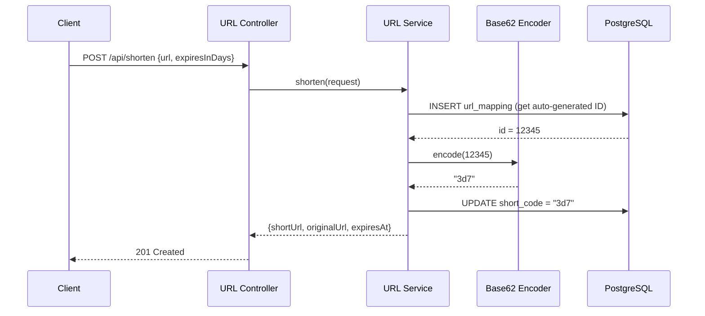
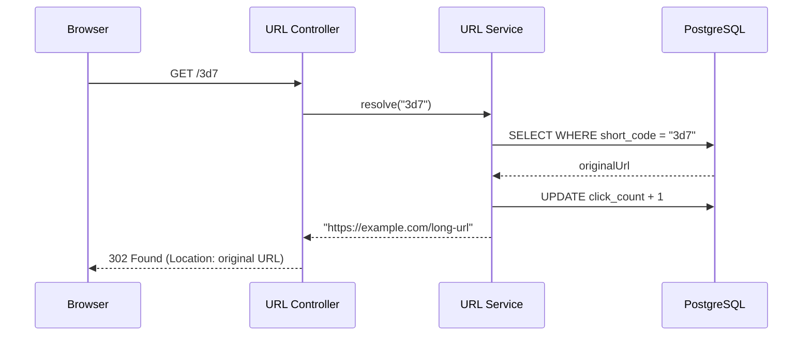
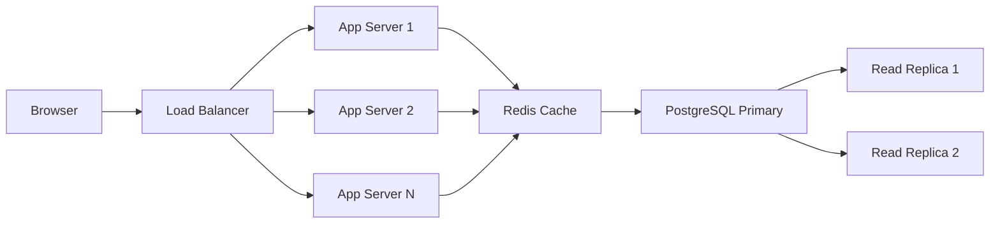

## The Problem

Every system design interview has a few classics — and URL shortening is right at the top. It sounds simple on the surface: take a long URL, give back a short one, redirect when someone visits it. But once you start thinking about scale, collisions, analytics, and expiration, the depth reveals itself quickly.

In this post, we'll design and implement a URL shortener from scratch using Spring Boot 3.5 and Java 21. We won't stop at a toy demo — we'll cover the encoding strategy, database schema, redirect semantics, click tracking, expiration logic, and how you'd scale this for millions of URLs.

---

## Requirements

### Functional Requirements

| # | Requirement |
|---|-------------|
| 1 | Given a long URL, generate a unique short URL |
| 2 | Redirect short URL to the original URL |
| 3 | Optional expiration time for URLs |
| 4 | Click analytics (count per short URL) |
| 5 | Short URLs should be as short as possible |

### Non-Functional Requirements

| # | Requirement |
|---|-------------|
| 1 | Low latency redirects (< 10ms for cache hit) |
| 2 | High availability — redirects must always work |
| 3 | Read-heavy traffic (100:1 read/write ratio) |
| 4 | Short codes must be unique — no collisions |
| 5 | URLs are not guessable (sequential IDs are acceptable for internal use) |

---

## High-Level Design

### Shorten Flow



### Redirect Flow



---

## Encoding Strategy — Base62 from Auto-Increment ID

The encoding strategy is the heart of any URL shortener. Here are the common options:

| Strategy | Pros | Cons |
|----------|------|------|
| Random hash (MD5/SHA) | Not guessable | Collisions possible, need retry logic |
| UUID | Globally unique | Too long (36 chars) |
| Counter + Base62 | Short, no collisions | Sequential/predictable |
| Nano ID | Short, random | Collision possible at scale |

We chose **Base62 encoding from auto-increment ID** because:

1. **Zero collisions** — each ID is unique by database guarantee
2. **Short output** — 6 characters can encode 56 billion URLs (62^6)
3. **Deterministic** — same ID always maps to same code
4. **Simple** — no retry logic, no distributed coordination

### Base62 Alphabet

```
0123456789ABCDEFGHIJKLMNOPQRSTUVWXYZabcdefghijklmnopqrstuvwxyz
```

### Length vs Capacity

| Characters | Possible URLs |
|------------|---------------|
| 1 | 62 |
| 2 | 3,844 |
| 3 | 238,328 |
| 4 | 14.7 million |
| 5 | 916 million |
| 6 | 56.8 billion |
| 7 | 3.5 trillion |

---

## Database Schema

```sql
CREATE TABLE url_mappings (
    id          BIGSERIAL PRIMARY KEY,
    short_code  VARCHAR(10) NOT NULL UNIQUE,
    original_url VARCHAR(2048) NOT NULL,
    created_at  TIMESTAMP NOT NULL DEFAULT NOW(),
    expires_at  TIMESTAMP,
    click_count BIGINT NOT NULL DEFAULT 0
);

CREATE UNIQUE INDEX idx_short_code ON url_mappings(short_code);
```

The unique index on `short_code` is critical — every redirect performs a lookup by this column, so it must be indexed.

---

## Implementation

### Base62 Encoder

```java
@Component
public class Base62Encoder {

    private static final String ALPHABET =
        "0123456789ABCDEFGHIJKLMNOPQRSTUVWXYZabcdefghijklmnopqrstuvwxyz";
    private static final int BASE = ALPHABET.length();

    public String encode(long value) {
        if (value == 0) {
            return String.valueOf(ALPHABET.charAt(0));
        }
        StringBuilder sb = new StringBuilder();
        while (value > 0) {
            sb.append(ALPHABET.charAt((int) (value % BASE)));
            value /= BASE;
        }
        return sb.reverse().toString();
    }

    public long decode(String encoded) {
        long result = 0;
        for (char c : encoded.toCharArray()) {
            result = result * BASE + ALPHABET.indexOf(c);
        }
        return result;
    }
}
```

The algorithm is straightforward: repeatedly divide by 62 and map the remainder to our alphabet. Reversing at the end gives us the most significant digit first.

### URL Service

```java
@Service
public class UrlService {

    private final UrlRepository urlRepository;
    private final Base62Encoder base62Encoder;
    private final String baseUrl;

    @Transactional
    public ShortenResponse shorten(ShortenRequest request) {
        UrlMapping mapping = new UrlMapping();
        mapping.setOriginalUrl(request.url());
        mapping.setShortCode("temp");

        if (request.expiresInDays() != null && request.expiresInDays() > 0) {
            mapping.setExpiresAt(LocalDateTime.now().plusDays(request.expiresInDays()));
        }

        // Save to get auto-generated ID
        mapping = urlRepository.save(mapping);

        // Encode ID to Base62
        String shortCode = base62Encoder.encode(mapping.getId());
        mapping.setShortCode(shortCode);
        mapping = urlRepository.save(mapping);

        return new ShortenResponse(
            baseUrl + "/" + shortCode,
            mapping.getOriginalUrl(),
            mapping.getExpiresAt()
        );
    }

    @Transactional
    public String resolve(String shortCode) {
        UrlMapping mapping = urlRepository.findByShortCode(shortCode)
            .orElseThrow(() -> new UrlNotFoundException("Short URL not found: " + shortCode));

        if (mapping.getExpiresAt() != null
                && mapping.getExpiresAt().isBefore(LocalDateTime.now())) {
            throw new UrlNotFoundException("Short URL has expired: " + shortCode);
        }

        urlRepository.incrementClickCount(shortCode);
        return mapping.getOriginalUrl();
    }
}
```

Key design decision: we save twice — first to get the auto-generated ID, then to update with the encoded short code. This guarantees uniqueness without any retry logic.

### Controller

```java
@RestController
public class UrlController {

    private final UrlService urlService;

    @PostMapping("/api/shorten")
    public ResponseEntity<ShortenResponse> shorten(@Valid @RequestBody ShortenRequest request) {
        ShortenResponse response = urlService.shorten(request);
        return ResponseEntity.status(HttpStatus.CREATED).body(response);
    }

    @GetMapping("/{code}")
    public ResponseEntity<Void> redirect(@PathVariable String code) {
        String originalUrl = urlService.resolve(code);
        return ResponseEntity.status(HttpStatus.FOUND)
                .location(URI.create(originalUrl))
                .build();
    }

    @GetMapping("/api/stats/{code}")
    public ResponseEntity<UrlMapping> stats(@PathVariable String code) {
        UrlMapping mapping = urlService.getStats(code);
        return ResponseEntity.ok(mapping);
    }
}
```

---

## Redirect: 302 vs 301

This is a subtle but critical design decision:

| Status Code | Meaning | Browser Caches? | Analytics Impact |
|-------------|---------|------------------|------------------|
| 301 | Moved Permanently | Yes — browser won't ask again | Lose click tracking |
| 302 | Found (Temporary) | No — browser asks every time | Every click is tracked |

We use **302 Found** because:

1. **Click analytics** — every request hits our server, so we can count clicks
2. **Expiration** — if a URL expires, a 301 would still redirect from browser cache
3. **Flexibility** — we can change where a short code points without users clearing cache

Use 301 only if you don't need analytics and want to reduce server load.

---

## Click Analytics

Click tracking is implemented with an atomic UPDATE query:

```java
@Modifying
@Query("UPDATE UrlMapping u SET u.clickCount = u.clickCount + 1 WHERE u.shortCode = :shortCode")
void incrementClickCount(@Param("shortCode") String shortCode);
```

This is a single atomic operation — no race conditions even under concurrent access. For higher throughput at scale, you could batch click updates using a write-behind cache or event stream.

---

## URL Expiration

Expiration is checked at read time rather than using a background cleanup job:

```java
if (mapping.getExpiresAt() != null && mapping.getExpiresAt().isBefore(LocalDateTime.now())) {
    throw new UrlNotFoundException("Short URL has expired: " + shortCode);
}
```

This is simple and effective. For cleanup of expired records (to reclaim storage), you can add a scheduled job:

```java
@Scheduled(cron = "0 0 2 * * ?") // 2 AM daily
public void purgeExpiredUrls() {
    urlRepository.deleteByExpiresAtBefore(LocalDateTime.now());
}
```

---

## Scaling Considerations

### Read-Heavy Workload

URL shorteners are massively read-heavy. For every URL created, it might be accessed thousands of times. This calls for aggressive caching.



### Caching Strategy with Redis

```java
@Cacheable(value = "urls", key = "#shortCode")
public String resolve(String shortCode) {
    // DB lookup only on cache miss
}
```

Cache hit ratio for URL shorteners is typically > 95% since popular links are accessed repeatedly.

### Sharding by Short Code

For billions of URLs, a single database won't suffice. Shard by the first character of the short code:

| Shard | Short Codes Starting With |
|-------|--------------------------|
| 0 | 0-9 |
| 1 | A-M |
| 2 | N-Z |
| 3 | a-m |
| 4 | n-z |

This gives roughly even distribution with Base62 encoding.

---

## Collision Handling

With our Base62-from-ID approach, **collisions are impossible** by design. Each database row gets a unique auto-increment ID, and the encoding is deterministic.

If you chose a random generation approach instead, you'd need:

```java
String shortCode;
do {
    shortCode = generateRandom(7);
} while (urlRepository.existsByShortCode(shortCode));
```

The probability of collision with 7-character random strings:
- After 1 million URLs: ~0.00003%
- After 100 million URLs: ~0.3%
- After 1 billion URLs: ~28%

This is why we prefer the ID-based approach — zero collisions, zero retries.

---

## Common Problems

| Problem | Cause | Solution |
|---------|-------|----------|
| Short code collision | Random generation at scale | Use ID-based Base62 encoding |
| Lost click counts | 301 redirect caching | Use 302 redirect |
| Expired URL still redirects | Browser cached 301 | Use 302 + check expiry on every request |
| Slow redirects | No caching, DB lookup every time | Add Redis cache layer |
| Sequential codes guessable | Base62 from sequential ID | Accept trade-off or add offset/salt |
| Hot partitions | Uneven access patterns | Cache popular URLs in memory |
| Database growth | Never cleaning expired URLs | Scheduled purge job |

---

## Full Working Example

The complete source code is available on GitHub:

> [spring-boot-url-shortener](https://github.com/anupamsinha/spring-boot-url-shortener)

To run locally:

```bash
# Start PostgreSQL
docker compose up -d

# Run the application
./mvnw spring-boot:run

# Shorten a URL
curl -X POST http://localhost:8080/api/shorten \
  -H "Content-Type: application/json" \
  -d '{"url": "https://example.com/very-long-article-url", "expiresInDays": 30}'

# Response:
# {
#   "shortUrl": "http://localhost:8080/1",
#   "originalUrl": "https://example.com/very-long-article-url",
#   "expiresAt": "2026-09-21T10:30:00"
# }

# Redirect
curl -v http://localhost:8080/1
# < HTTP/1.1 302 Found
# < Location: https://example.com/very-long-article-url

# Check stats
curl http://localhost:8080/api/stats/1
# {
#   "id": 1,
#   "shortCode": "1",
#   "originalUrl": "https://example.com/very-long-article-url",
#   "clickCount": 1,
#   "createdAt": "2026-08-22T10:30:00",
#   "expiresAt": "2026-09-21T10:30:00"
# }
```

---

## Interview Tips

When discussing this in a system design interview, emphasize:

1. **Start with requirements** — clarify read/write ratio, scale, features
2. **Justify your encoding choice** — explain trade-offs between random vs ID-based
3. **Mention 302 vs 301** — shows you understand HTTP semantics and their implications
4. **Discuss scaling** — caching, sharding, read replicas
5. **Think about edge cases** — expiration, hot URLs, analytics accuracy

---

## References

- [Base62 Encoding on Wikipedia](https://en.wikipedia.org/wiki/Base62)
- [Spring Boot Reference Documentation](https://docs.spring.io/spring-boot/docs/current/reference/html/)
- [System Design Primer — URL Shortener](https://github.com/donnemartin/system-design-primer)
- [HTTP 301 vs 302 — MDN](https://developer.mozilla.org/en-US/docs/Web/HTTP/Status/302)
